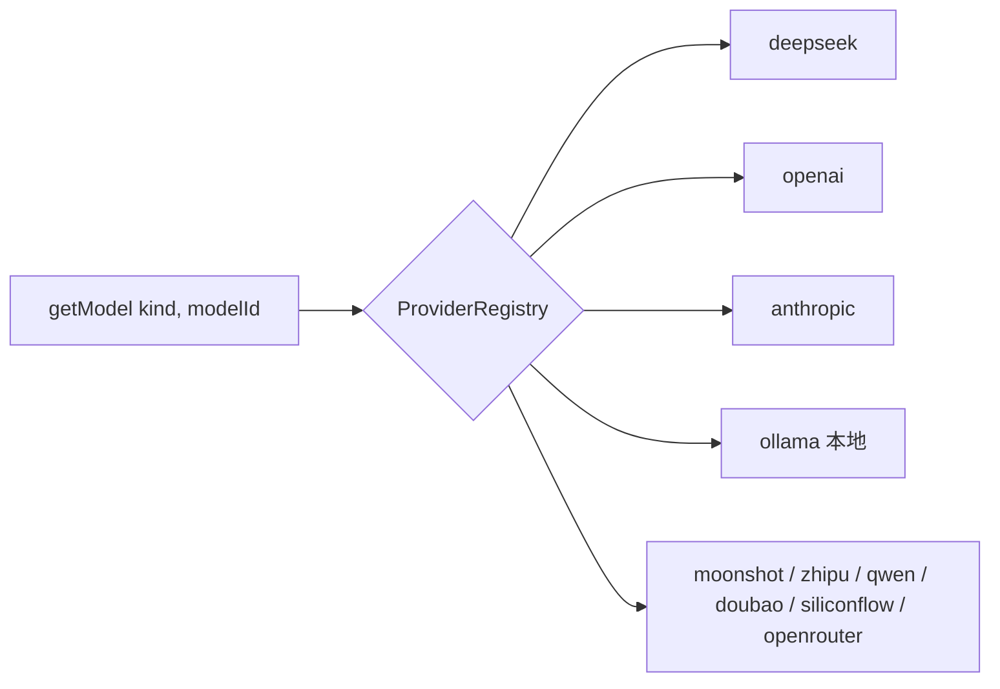
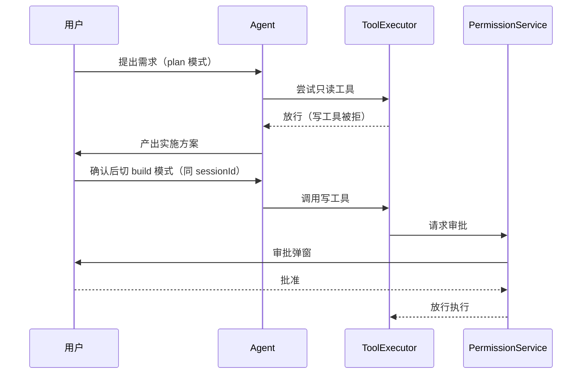

# Code Agent Desktop

**在桌面端跑一个真正能干活的编码 Agent。**

多轮工具调用 · 权限审批流 · 10 家模型供应商 · 代码智能 · 终端与 Git 集成 · 会话持久化 · 本地优先

[](https://github.com/zlh12331/superagent/releases)
[](https://github.com/zlh12331/superagent/actions/workflows/ci.yml)
[](./LICENSE)


---

## 这是什么

一个**跨平台桌面应用**形式的编码 Agent（Windows / macOS / Linux）。
它不是聊天框套壳，而是一个完整的 Agent 运行时：模型可以读写文件、执行命令、跑测试、
用 Git、查代码符号，而你保留每一步写操作的审批权。

核心理念是**plan / build 分离**：先让模型只读探索、产出方案，你确认后再放它执行。

## 下载安装

从 [Releases](https://github.com/zlh12331/superagent/releases/latest) 获取最新版：

| 平台 | 下载 |
|---|---|
| **Windows** (x64) | [`Code-Agent-Desktop-Windows-x64.exe`](https://github.com/zlh12331/superagent/releases/latest/download/Code-Agent-Desktop-Windows-x64.exe) — NSIS 安装器 |
| **macOS** (Apple Silicon) | [`Code-Agent-Desktop-macOS-arm64.dmg`](https://github.com/zlh12331/superagent/releases/latest/download/Code-Agent-Desktop-macOS-arm64.dmg) |
| **macOS** (Intel) | [`Code-Agent-Desktop-macOS-x64.dmg`](https://github.com/zlh12331/superagent/releases/latest/download/Code-Agent-Desktop-macOS-x64.dmg) |
| **Linux** (x64) | [`Code-Agent-Desktop-Linux-x86_64.AppImage`](https://github.com/zlh12331/superagent/releases/latest/download/Code-Agent-Desktop-Linux-x86_64.AppImage) · [`Code-Agent-Desktop-Linux-amd64.deb`](https://github.com/zlh12331/superagent/releases/latest/download/Code-Agent-Desktop-Linux-amd64.deb) |

### ⚠️ 当前版本尚未代码签名

首次启动时系统会发出安全警告（macOS：*"无法验证开发者"*；Windows：SmartScreen），
这是**签名证书尚未配置**所致，并非应用有问题。

- **macOS**：右键点击 App → 选择「打开」→ 在弹窗中再次点击「打开」；或
  `xattr -dr com.apple.quarantine /Applications/Code\ Agent\ Desktop.app`
- **Windows**：点击「更多信息」→「仍要运行」

应用内置自动更新（基于 GitHub Releases），后续版本可自动升级。

## 核心特性

### 🤖 Agent 能力

- **32 个内置工具**：文件读写/编辑、glob/grep、终端命令、Git 操作（add/commit/push）、
  LSP（跳转定义/悬停/引用）、代码符号检索、Web 抓取、任务管理、定时任务
- **子代理编排**：`run_subagent`（任务委派）/ `run_team`（并行委派并汇总）/
  `run_workflow`（串行多步编排）
- **多轮工具调用循环**：基于 Vercel AI SDK v7（`streamText` + `tools` + `stopWhen`）
- **技能系统**：可按需加载的技能包（`load_skill`）
- **持久记忆**：跨会话记忆捕获与检索（`save_memory` / `recall_memory`），
  中英文均可检索；默认开启且**可在「设置 → 规则与记忆」随时关闭**（关闭后不捕获
  也不召回），支持按会话或一次性清除全部记忆

### 🛡️ 安全与可控

- **plan / build 双模式**：plan 模式在 ToolExecutor 层直接拒绝所有写工具，零副作用
- **权限审批流**：写操作经 PermissionService → 渲染层弹窗 → 用户批准才执行
- **命令守卫**：危险命令识别与拦截；路径守卫（realpath 对称比较）防越权与符号链接逃逸
- **密钥加密**：API Key 经 Electron `safeStorage` 存储（Windows DPAPI / macOS Keychain / Linux libsecret）
- **本地优先**：会话数据存本地 SQLite，不上传

### 🧠 模型与代码智能

- **10 家供应商**：DeepSeek · OpenAI · Anthropic · Ollama · Moonshot · 智谱 · 通义千问 · 豆包 · 硅基流动 · OpenRouter
- **本地模型**：通过 Ollama 走 OpenAI 兼容协议
- **MCP 支持**：SSE / streamable-http 传输，可管理远端 MCP 服务器
- **代码智能**：tree-sitter 代码符号 + LSP 语言服务 + 代码库索引（codegraph）

### 💻 编辑与终端

- **文件树 + 代码查看器**（shiki 语法高亮）
- **集成终端**：基于 xterm.js + node-pty 的真实 PTY
- **Git 面板**：diff 查看、状态、提交
- **内置浏览器面板**（严格沙箱）
- **vim 模式**输入、快捷键体系、目标栏（goal bar）

### 🔗 桌面集成

- **深度链接**：`code-agent://` 协议唤起
- **系统托盘** + **回合通知**
- **系统主题联动**、**关窗协商**（运行中回合会先确认）
- **企业 IM 接入**：Telegram / 钉钉 / 企业微信 / 飞书 / QQ / 微信
  （群聊默认拒绝，需显式白名单登记）
- **远程控制**：局域网设备发现 + 手机扫码配对开启控制页

### 📊 可观测性

- **OpenTelemetry** 遥测（可选，自配 OTLP 端点；默认不上报）+ 本地结构化日志
- 错误本地优先：崩溃/异常写入本地日志（随诊断包导出），报障走 GitHub Issue
- 模型调用统一观测（`wrapLanguageModel` 中间件 + 模型级 span）
- 用量统计、诊断导出

## 从源码构建

### 环境要求

| 工具 | 版本 |
|---|---|
| Node.js | ≥ 24.13.0（见 `.nvmrc`） |
| pnpm | ≥ 11.0.0 |

### 步骤

```bash
git clone https://github.com/zlh12331/superagent.git
cd superagent
pnpm install
cp .env.example .env   # 可选：配置供应商 baseURL / OTLP 端点
pnpm dev               # 启动 dev server + Electron 窗口
```

浏览器模式（无需 Electron，用 mock 的 `window.api`）：

```bash
pnpm dev:web
```

### 构建安装包

```bash
pnpm build:win     # Windows NSIS
pnpm build:mac     # macOS dmg + zip（需在 macOS 上构建）
pnpm build:linux   # Linux AppImage + deb
```

### 质量门禁

提交前需全部通过（CI 会完整跑一遍）：

```bash
pnpm typecheck     # tsc --build
pnpm lint          # biome check .
pnpm check:static  # 静态审计 10 项（tokens/i18n/注释/文件大小/函数体等棘轮）
pnpm test          # 全量单测（业务逻辑不 mock）
pnpm knip          # 死代码/死依赖检测
```

E2E：

```bash
pnpm test:e2e             # 浏览器模式（journey + a11y + perf 基准）
pnpm test:e2e:electron    # 真实 Electron 窗口
pnpm test:smoke           # 生产构建产物冒烟
```

## 架构

### 三进程模型

```
┌─────────────────────────────────────────────────────────┐
│  Renderer (React 19)                                    │
│  组件 / stores / hooks ── window.api.* ──────────────┐  │
└──────────────────────────────────────────────────────┼──┘
                       │ IPC（类型安全契约）              │
┌──────────────────────▼──────────────────────────────────┐
│  Preload（CJS，contextBridge 白名单）                    │
└──────────────────────┬──────────────────────────────────┘
                       │
┌──────────────────────▼──────────────────────────────────┐
│  Main（Node.js，sandbox: true）                          │
│  ServiceContainer → 19 个 lazy accessor                 │
│  File / Search / ToolRegistry / Permission / ToolExecutor│
│  MCP / Prompt / MemoryPort / MemoryHub / LSP / Goal / IM │
│  RemoteControl / Terminal / Git / Codebase / Session     │
│  Update / Agent                                         │
└─────────────────────────────────────────────────────────┘
```

- **类型契约单一来源**：`packages/shared` 定义 `IpcApi` + 通道常量 + zod schema，
  preload 用 `satisfies IpcApi` 做编译期校验
- **IPC 命名**：`{domain}:{action}` / `{domain}:stream:{event}` / `{domain}:event:{name}`
- **主进程**：Service Container 模式，延迟初始化 + 按反向依赖统一 dispose

### AI Provider 路由



新增供应商：在 `src/main/infra/ai/providers/` 注册一条定义 + 一个工厂。

### Agent 工作流



## 技术栈

| 层 | 选型 |
|---|---|
| 桌面框架 | Electron 44 + electron-vite 6 |
| 前端 | React 19 + React Router 8 + Vite 8（**React Compiler 已启用**） |
| UI | Radix UI + Tailwind CSS 4 + Lucide + shiki |
| 状态 | Zustand（客户端）+ TanStack Query（服务端） |
| AI | Vercel AI SDK v7 |
| 数据库 | SQLite（better-sqlite3）+ Drizzle ORM |
| 终端 | xterm.js + node-pty |
| 搜索 | @vscode/ripgrep |
| 代码智能 | tree-sitter + codegraph + LSP |
| 测试 | Vitest + Playwright（E2E / Electron / Smoke 三套配置） |
| 遥测 | OpenTelemetry（可选，自配 OTLP） |

## 目录结构

```
src/main/           主进程（Service Container + 服务 + IPC handlers）
  infra/ai/         Chat / Agent / Provider 路由 / 工具系统 / MCP / Prompt
  infra/storage/    SQLite + Drizzle
  infra/file/       文件读写 + chokidar 监听
  infra/search/     ripgrep 搜索
  infra/terminal/   node-pty 终端池
  infra/git/        Git CLI 封装
  infra/codebase/   代码库索引查询
src/preload/        contextBridge 桥接（CJS）
src/renderer/       React 渲染层
packages/shared/    IPC 类型契约 + zod schema（单一真源）
e2e/                Playwright 三套配置
docs/design/        设计文档（架构 / 安全 / IPC / 数据层等 25+ 篇）
```

## 扩展指南

### 新增 IPC 方法（定义表驱动，全链路自动生成）

只需三处改动，通道常量 / preload API / 类型推导 / 统一注册全部自动完成：

1. `packages/shared/src/ipc/meta.ts` — 加一行纯字符串元数据
2. `packages/shared/src/ipc/definitions.ts` — 加一行 zod schema
3. `src/main/ipc/` 对应 handler 加一个方法（缺失会编译期报错）

或直接脚手架生成：`pnpm scaffold:ipc --domain <name> --method <m>`

### 新增工具

在 `src/main/infra/ai/tools/` 新建 `*.tool.ts`，实现 `Tool` 接口
（name / description / inputSchema / permission / execute），在 `tools/index.ts` 注册。
参考现有 32 个工具；也可用 `pnpm scaffold:tool --name <snake_case>`。

### 新增模型供应商

1. `packages/shared/src/schemas/settings.ts` 的 `ApiKeyProviderSchema` 追加枚举
2. `src/main/infra/ai/providers/types.ts` 的 `PROVIDER_KINDS` 追加
3. `src/main/infra/ai/providers/registry.ts` 追加定义与工厂

## 参与贡献

欢迎提交 Issue 与 PR。动手前请先读 [CONTRIBUTING.md](./CONTRIBUTING.md) ——
本项目有一些与常见 React/Electron 项目不同的约定（IPC 定义表驱动、React Compiler、
不 mock 业务逻辑等），了解后能少走弯路。

- 🐛 报告 Bug：[Issue](https://github.com/zlh12331/superagent/issues/new?template=bug_report.yml)（请附版本/系统/复现步骤）
- 💡 功能建议：[Issue](https://github.com/zlh12331/superagent/issues/new?template=feature_request.yml)
- 💬 使用讨论：[Discussions](https://github.com/zlh12331/superagent/discussions)
- 🔒 安全漏洞：**请勿公开提交**，走 [私密披露](./SECURITY.md)

## 已知事项

- `electron-vite` 使用 `6.0.0-beta.1`（Vite 8 的官方配套预发布版；`5.0.0` 稳定版 peer 依赖 Vite ≤7），待 `6.0.0` 稳定后升级
- **代码签名与公证尚未配置** —— 见上方「下载安装」的说明
- dev 环境 userData 重定向至 `.electron-user-data/`，远程调试端口 9222（生产环境不暴露）

## 许可证

[MIT](./LICENSE) © 2026 zlh12331

第三方组件许可见各依赖自身声明；`third_party/motionvault` 为 MIT 许可的 vendored 只读参考源。
