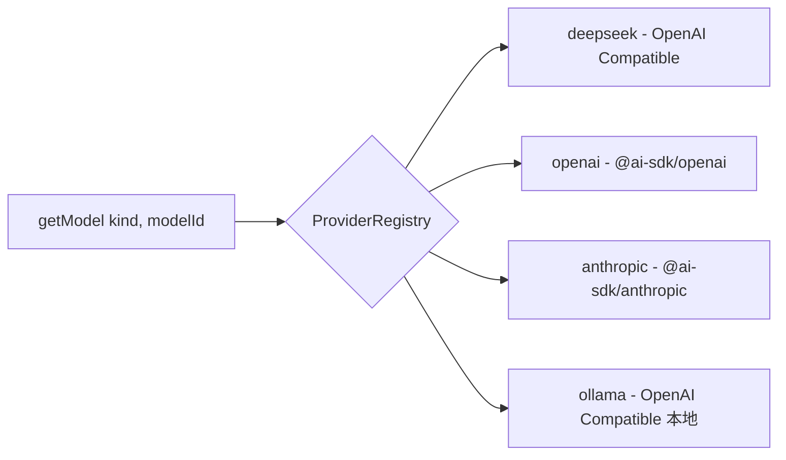

# Code Agent Desktop

生产级 **Electron Code Agent 桌面应用**（Windows/macOS/Linux 桌面端），开箱即用：多轮工具调用、权限审批流、多模型供应商路由、代码智能、终端与 Git 集成、会话持久化、Sentry + OpenTelemetry 双遥测。

## 技术栈

| 层 | 选型 |
|---|---|
| 桌面框架 | Electron 43 + electron-vite 6 |
| 前端 | React 19 + React Router 8 + Vite 8（React Compiler 已启用） |
| UI | Radix UI + Tailwind CSS 4 + Lucide + shiki |
| 状态 | Zustand + TanStack Query |
| AI | Vercel AI SDK v7（streamText + tools + stopWhen 多轮循环） |
| 供应商 | DeepSeek / OpenAI / Anthropic / Ollama（可插拔路由） |
| 数据库 | SQLite（better-sqlite3）+ Drizzle ORM |
| 终端 | xterm.js + node-pty |
| 搜索 | @vscode/ripgrep |
| 遥测 | Sentry（自托管）+ OpenTelemetry |
| 测试 | Vitest（无 mock）+ Playwright（E2E / Electron / Smoke 三套） |

## 快速开始

```bash
pnpm install        # 安装依赖（含原生模块编译）
cp .env.example .env # 可选：配置 Sentry / 供应商 baseURL
pnpm dev            # 启动 dev server + Electron 窗口
```

质量门禁（按顺序）：

```bash
pnpm typecheck      # tsc --build（必须，不要用 --noEmit）
pnpm lint           # biome check .
pnpm test           # shared → main → renderer 全部单元测试
```

其他命令：

```bash
pnpm test:e2e               # 浏览器模式 E2E
pnpm test:e2e:electron      # Electron 真实窗口 E2E
pnpm test:smoke             # 生产构建 smoke
pnpm build:win              # 构建 + NSIS 安装包
pnpm test:coverage          # 覆盖率（80% 门禁）
```

## 架构

### 进程模型

```
┌─────────────────────────────────────────────────────────┐
│  Renderer (React)                                       │
│  组件 / stores / hooks ── window.api.* ───────────────┐ │
└─────────────────────────────────────────────────────────┘
                           │ IPC（类型安全契约）
┌─────────────────────────────────────────────────────────┐
│  Preload（CJS，contextBridge 白名单）                    │
└─────────────────────────────────────────────────────────┘
                           │
┌─────────────────────────────────────────────────────────┐
│  Main（Node.js，sandbox）                               │
│  ServiceContainer → 18 服务（2026-08-17 实测）          │
│  Chat / Agent / File / Search / Terminal / Git          │
│  Codebase / Session / Tool / MCP / Permission / Prompt  │
└─────────────────────────────────────────────────────────┘
```

- **类型契约单一来源**：`packages/shared` 定义 `IpcApi` 接口 + IPC 通道常量 + zod schema，preload 用 `satisfies IpcApi` 编译期校验
- **IPC 命名**：`{domain}:{action}`（请求-响应）/ `{domain}:stream:{event}`（流式）/ `{domain}:event:{name}`（状态事件）
- **主进程**：Service Container 模式，延迟初始化 + 按反向依赖统一 dispose

### AI Provider 路由



- 新增供应商：在 `src/main/infra/ai/providers/registry.ts` 注册一条定义 + 一个工厂即可
- API Key 按供应商独立存储在 keychain（safeStorage 加密）
- baseURL 可经 `.env` 覆盖（`DEEPSEEK_API_BASE` / `OPENAI_API_BASE` / `ANTHROPIC_API_BASE` / `OLLAMA_API_BASE`）

### Agent 工作流（plan / build 分离）

- **plan 模式**：只读探索。`agent:run` 传 `mode: 'plan'`，写工具（permission='ask'）被 ToolExecutor 直接拒绝并返回 `TOOL_PERMISSION_DENIED`，零副作用生成实施方案
- **build 模式**：写操作走审批流（PermissionService → 渲染层 ApprovalModal → 用户批准/拒绝）
- 会话恢复：先 plan 出方案，再以 build 模式续传同一 `sessionId` 执行

## 目录结构

```
src/main/           主进程（Service Container + 服务 + IPC handlers）
  infra/ai/         Chat / Agent / Provider 路由 / 工具系统 / MCP / Prompt
  infra/storage/    SQLite + Drizzle（sessions / messages / prompts）
  infra/file/       文件读写 + chokidar 监听
  infra/search/     ripgrep 搜索
  infra/terminal/   node-pty 终端池
  infra/git/        Git CLI 封装
  infra/codebase/   codegraph 代码智能查询
src/preload/        contextBridge 桥接（CJS）
src/renderer/       React 渲染层（routes / components / stores / hooks）
packages/shared/    IPC 类型契约 + zod schema（单一真源）
packages/tsconfig/  三档 tsconfig（base / node / web）
e2e/                Playwright 三套配置
```

## 扩展指南

### 新增模型供应商

1. `packages/shared/src/schemas/settings.ts` 的 `ApiKeyProviderSchema` 追加枚举值
2. `src/main/infra/ai/providers/types.ts` 的 `PROVIDER_KINDS` 追加
3. `src/main/infra/ai/providers/registry.ts` 的 `BUILTIN_DEFINITIONS` / `BUILTIN_FACTORIES` 追加定义与工厂

### 新增工具

在 `src/main/infra/ai/tools/` 新建 `*.tool.ts`，实现 `Tool` 接口（name / description / inputSchema / permission / execute），在 `tools/index.ts` 的 `registerBuiltinTools` 注册。内置 31 个工具可作参考；编排类新能力优先复用模块级单例模式（如 WorkflowService + run_workflow）。

### 新增 IPC 方法（定义表驱动，全链路自动生成）

只需三处改动，其余（通道常量 / preload API / 类型推导 / 统一注册）全部自动：

1. `packages/shared/src/ipc/meta.ts`：加一行纯字符串元数据
2. `packages/shared/src/ipc/definitions.ts`：加一行 zod schema + 类型标记
3. `src/main/ipc/` 对应 handler 加一个方法（缺失编译期报错）

也可用脚手架生成骨架：`pnpm scaffold:ipc --domain <name> --method <m>`

## 已知事项

- `electron-vite` 使用 `6.0.0-beta.1`（Vite 8 的官方配套预发布版本；`5.0.0` 稳定版 peer 依赖 Vite ≤7）。`6.0.0` 稳定版发布后应升级
- 发布安装包：Windows NSIS x64 / macOS dmg+zip（x64+arm64）/ Linux AppImage+deb x64（release.yml 三平台矩阵；macOS 公证与代码签名需配置证书后启用）
- dev 环境 userData 重定向到 `.electron-user-data/`，远程调试端口 9222（生产环境不暴露）
