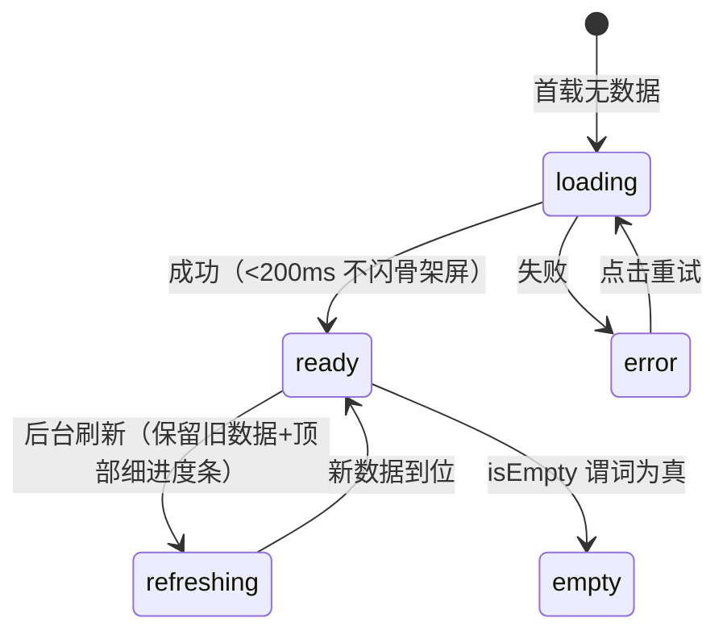
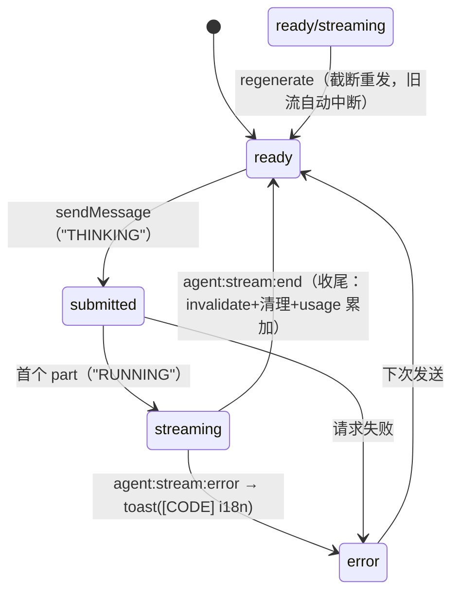
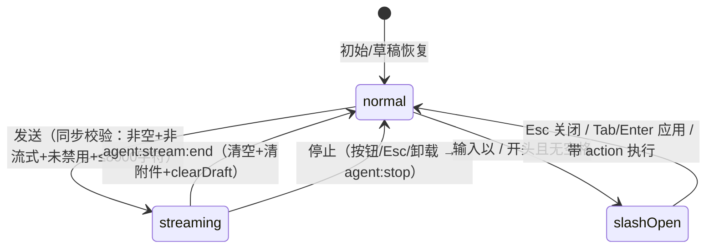
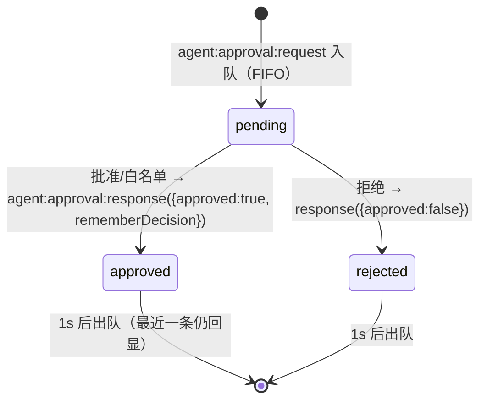
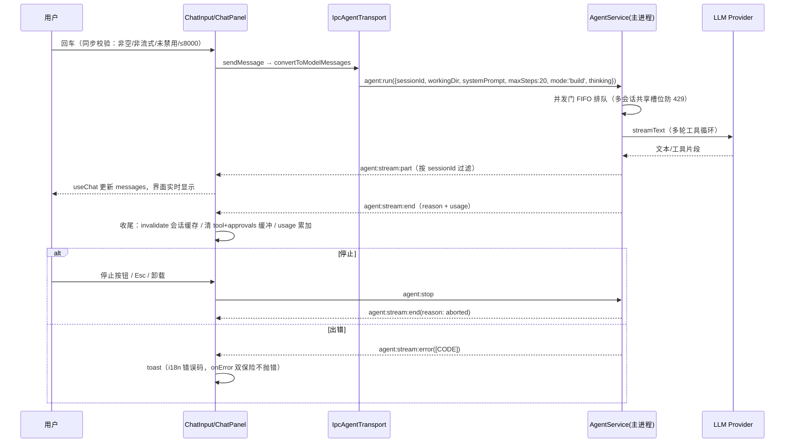

# 前端交互与数据链路规格说明（09）

> 面向开发人员的前端全面规格说明书：页面布局、组件状态与事件、交互流程、数据链路、逐文件核对，一个不漏。
> 所有条目均对应 `src/renderer/` 实际代码与 `packages/shared/src/ipc/meta.ts`（25 域）通道定义；不存在的功能标注"占位 / 部分实现 / 不适用"，不编造。
> 整理时间：2026-08-10。

## 0. 文档定位说明

### 0.1 这份文档和现有设计文档的分工

04 号"接口设计文档"讲 IPC 接口契约（有哪些通道、参数长什么样）；05 号"功能设计文档"讲需求与设计意图；03 号"目录结构"讲代码放哪。这份 09 号文档讲的是"实际是怎么跑的"：从渲染层代码出发，完整描述每个页面的布局、每个组件的状态与事件、每个功能的交互流程、每类数据的链路。凡与 05 冲突之处，以本文（即代码）为准并显式标注。

### 0.2 候选文件名

当前文件名 `09-ux-interaction-spec.md`；备选 `09-frontend-interaction-dataflow.md`、`09-frontend-system-manual.md`，最终由你确认。旧 `08-ux-guidelines.md` 未处理，去留待确认。

### 0.3 阅读约定（状态分层与通道命名）

状态组织四层：L1 组件内 useState；L2 Zustand 全局仓库（persistent/ 存 localStorage 重启保留：settings、sessions（仅 activeSessionId）、sidebar-pref、draft；transient/ 仅本次运行：ui、welcome、file-tree、file-viewer、tool、approvals、agent-ask、rate-limit、reasoning-collapse、terminal、usage）；L3 TanStack Query 管理请求-响应数据（缓存、失效、重试）；L4 主进程推送 → 订阅 → 直写 L2 仓库。

跨进程数据走 preload 暴露的 window.api，落到 IPC 通道，命名规则"域:动作"（请求-响应）、"域:stream:事件"（流式推送）、"域:event:名称"（状态事件）。主进程服务由 `src/main/service-container.ts` 统一持有，退出按依赖反序清理。所有 IPC 返回统一"成功带数据 / 失败带 [错误码] 消息"二选一结构。

表达语言约定：布局用 CSS（grid 轨道、clamp 尺寸、class 切换、CSS 变量）；组件行为用状态机（状态 / 事件 / 转换 / 副作用）；流程用步骤 + 时序图；链路用数据流（来源 → 通道 → 服务 → 存储）。

## 一、页面布局（完整）

### 1.1 整体框架（AppShell）

```
┌──────────────── topbar（--topbar-h: 52px，玻璃质感）────────────────┐
├─────────┬───┬───────────────────────┬───┬─────────────────────────┤
│ sidebar │ R │  main（.thread-bg）   │ R │   right-panel           │
│         │6px│                       │6px│                         │
└─────────┴───┴───────────────────────┴───┴─────────────────────────┘
   R = .resizer（宽 --resizer-w: 6px，可拖拽，tabIndex=0 + aria-valuenow）
```

**两行栅格**：`.app` 是 `display: grid`，`grid-template-rows: var(--topbar-h) 1fr`——顶部栏固定 52px，主体占满剩余高度。顶部栏半透明玻璃（`backdrop-filter: blur(16px) saturate(1.4)`），底部一条双 accent 渐变发光细线。

**五列栅格**：`.view-chat` 的 `grid-template-columns: var(--aurora-sidebar-w) var(--resizer-w) 1fr var(--resizer-w) var(--aurora-right-panel-w)`——侧栏、左分隔线、主区（1fr 弹性）、右分隔线、右面板。两个宽度变量是布局的动态入口：初始值在 `:root` 用 `clamp()` 定义（`--sidebar-w: clamp(200px, 17vw, 280px)`、`--right-panel-w: clamp(260px, 22vw, 360px)`）；用户拖拽后 JS 通过 `root.style.setProperty('--aurora-sidebar-w', ...)` 覆盖。分工原则：CSS 管默认、JS 管覆盖。拖拽钳位来自 `layout-utils.ts` 常量：侧栏 [200, 400]px、右面板 [260, 360]px；拖拽期间 body 加 `.resizing`（禁文本选中、显示拖拽光标），被拖的分隔线加 `.dragging`。

**轨道稳定性**：主区容器 `.thread-bg` 显式 `grid-column: 3`，强制占据第 3 列轨道。历史教训：侧栏和分隔线折叠时是 `display: none`，不占 grid 轨道，若 main 依赖 auto 放置会被挤到第 1 列，双折叠态（800×600）下主区宽度塌成 0px；显式指定列号后修复。

**折叠态**：折叠不删元素，加 class——`.sb-collapsed` / `.crp-collapsed` 时 AppShell 的 effect 把对应宽度变量置 `0px`，列塌缩为 0；分隔线元素条件渲染消失。class 由 React 状态（sidebarCollapsed / rightPanelCollapsed）驱动，按钮在 Topbar 与右面板竖条 `crp-collapse-btn`。

**断点联动**：`useLayoutBreakpoint` 用 `matchMedia('(max-width: 1200px)')` / `(max-width: 900px)` 两档，结果进 React 状态再触发折叠 class；用户手动操作过（manualRef 置位）后断点不再覆盖。

**滚动区域**：主内容区、侧栏列表、右面板各自独立滚动；主内容区带 `#main-content` 锚点配合"跳过导航"链接（WCAG 2.4.1）。

**z-index 档位**：`--z-dropdown: 50 → --z-context-menu: 100 → --z-modal-backdrop: 1000 → --z-drawer: 1500 → --z-modal: 2000 → --z-toast: 10000 → --z-overlay: 15000（命令面板/设置 Sheet）→ --z-toast-stack: 20000 → --z-boundary: 30000`。新增浮层必须复用档位。

**窗口控件避让**：设置全屏页头部右侧 `.app-region-drag` 宽 140px 透明拖拽区。

### 1.2 欢迎页

```
┌ 主区（welcome-mode 下右面板列隐藏，主区 flex 居中）┐
│  .welcome-view：品牌 ⟨/⟩ Code with TRAE            │
│  .composer（max-width: 720px）                     │
│    ├ .composer-box：输入框+拖拽手柄+工具栏          │
│    └ .composer-project-bar：项目下拉+模型选择器     │
│  .welcome-quick-actions：4 个快捷 pill（flex 横排） │
└────────────────────────────────────────────────────┘
```

路由 `/`，懒加载。布局核心是 class 切换：`.view-chat.welcome-mode` 时 CSS 重排——右面板列和右分隔线隐藏（变量置 0），主区变为单列居中 flex 容器；欢迎页三块（品牌、输入舱、快捷动作）垂直排列，输入舱 `max-width: 720px` 居中；非欢迎模式（聊天页）下三块默认 `display: none`。进入欢迎模式由 welcome-store 的 isWelcomeMode 驱动。

结构细节：品牌区 `welcome-logo`（`⟨/⟩` 图标 + "Code with TRAE"）；输入舱复用 ChatInput（受控模式，支持快捷 pill 预填）；项目选择条 `.cpb-folder-group` 内是 `.cpb-select` 下拉按钮（文件夹图标 + 项目名 basename + 箭头），弹出 `.folder-dropdown-menu`（绝对定位浮层）：从上到下"未选择项目"选项、历史项目列表（`session:listRecentDirs` 最多 10 条，每条文件夹图标 + 名称 + 相对使用时间）、分隔线、"浏览其他目录…"（`dialog:pickDirectory` 原生选择器，取消保持菜单打开）；无历史目录显示 `.fdm-empty`"暂无最近目录"。模型选择器在项目条右侧。快捷 pill 点击预填输入框并聚焦，不自动发送。发送时未选项目 → toast"请选择项目" + 自动展开项目下拉（不弹原生对话框）。

### 1.3 聊天主页面

```
┌ .thread-status-bar：项目名(flex-1 truncate) · [🔍] · 状态点+状态字 · token ┐
├ 横条区（限流横幅 / 中断条 / 审批卡，条件渲染）                              ├
├ .conversation-search-bar（打开时渲染）                                      ├
├ .messages（flex-1 min-h-0 + overflow-y-auto）                               ├
├ footer.composer → .composer-box（悬浮卡片，focus 上浮发光）                 ├
├ .composer-project-bar：项目名(只读)+模型选择器                              ├
└ .composer-stats-bar：状态 · 消息数 · Token                                  ┘
```

路由 `/chat/:sessionId`。主容器 flex 纵向四段：状态条（固定高）、横条区（条件渲染）、消息区（`flex-1 min-h-0` 占满 + `overflow-y-auto`，`min-h-0` 是 flex 子项滚动的关键）、输入舱（`footer.composer` 顶部渐变 + padding，内部 `.composer-box` 是悬浮卡片——`position: relative`，聚焦时 `transform: translateY` 上浮 + 青色 box-shadow 发光）。字号由设置驱动：容器 `style={{ fontSize }}`，内部相对单位跟随。

状态条细节：左侧项目名 basename（`flex-1 truncate`，完整路径悬停可见）；搜索按钮（打开会话内搜索）；状态指示 `role="status"`——`size-1.5 rounded-full bg-current` 圆点 + READY/RUNNING/THINKING/ERROR/IDLE 文字（流式时 accent 色 + `animate-pulse-soft` 脉冲，错误时 destructive 色）；token 用量（≥1000 显示 x.xk，悬停显示 input/output/total 明细）。

消息列表细节：`.scroll-to-bottom` 是 `position: absolute` 按钮定位在滚动容器右下角，距底 >80px 时显示（`.visible`），新消息到达且不在底部时 `.has-new` 红点，点击平滑滚底；`.msg-nav-rail` 右侧纵向点列（≥4 条消息渲染，`data-role` 区分角色，点击居中滚动）；搜索高亮 `.search-highlight` 是消息行背景 class。

路由守卫：sessionId 缺失 → 重定向 `/`；useSessionDetail loading → 居中"加载中"；会话不存在 → 重定向 `/`；workingDir 为空 → "会话加载异常"错误态；进入时强制退出欢迎模式（`setWelcomeMode(false)`，防止 URL 直访布局错乱）。

### 1.4 设置全屏页

```
┌ Sheet 全屏（w-full h-full max-w-none）：头部 flex（返回/标题/140px 拖拽区）┐
├ 主体 grid：grid-template-columns: 160px 1fr                               ┤
│   左导航（tablist + ↑↓ 循环）：5 组 15 项                                  │
│   右内容（overflow-y-auto）：每 pane 独立 SectionErrorBoundary             │
└───────────────────────────────────────────────────────────────────────────┘
```

设置页不是路由，是 shadcn Sheet 全屏形态，开关由 ui-store.settingsOpen 控制（Topbar 按钮 / Ctrl+, / 命令面板 / 错误恢复动作共用）。头部：左上"← 返回"按钮（关闭）、设置图标 + 标题 + 说明（等宽小字）、右侧 `.app-region-drag` 140px 避让区。主体两列 grid：左导航固定 160px（`overflow-y-auto`），分组标签（uppercase 小字）+ 条目按钮（`w-full flex`）；激活态纯 CSS：基础 `border-l-2 border-l-transparent` 占位防跳动，激活 `border-l-[color:var(--accent)]`（2px 青色竖条）+ `text-foreground font-medium`；方向键循环由 JS 在 tablist 容器上处理。打开时重置到"模型服务"分区。

导航 5 组 15 项：账户与通用（账号占位、用量、通用、移动端占位+IM）/ 能力（模型服务、MCP、技能、插件占位、hooks占位、浏览器说明页、工作树）/ 智能与行为（命令占位、规则与记忆）/ 实验（实验）/ 关于（关于）。

### 1.5 右面板

```
┌ 标题栏：TabsList（w-full，各 TabsTrigger flex-1 均分，text-2xs，truncate）┐
├ 内容区（min-h-0 flex-1）：6 tab 条件渲染                                  ┤
│   浏览器/终端：React.lazy + Suspense（fallback 居中"加载中…"）            │
│   开发者 tab：子视图按钮行（flex）+ 内容                                   │
└───────────────────────────────────────────────────────────────────────────┘
```

右面板 `flex flex-col border-l`。TabsList 用 `w-full` 覆盖 shadcn 默认 `w-fit`，每 TabsTrigger `flex-1` 均分 + `truncate`——面板拖窄时标签文字收缩不换行。6 个 tab：会话详情（info）、文件变更（diff）、文件（files）、浏览器（browser）、终端（terminal）、开发者（dev）。内容区 `min-h-0 flex-1`。浏览器和终端懒加载（xterm ~200KB），Suspense fallback 居中"加载中…"。开发者 tab 内部再一行子视图按钮（Git/日志/指标/检查器，`flex` + 小号按钮组）+ 内容区。面板折叠由全局 crp-collapsed 管，DevPanel 内不放折叠按钮。

各 tab 内容：会话详情——目标列表（goal:list，每项清除按钮 goal:clear）、计划待办（task:list）、引用文件（tool-store 中 read_file 调用去重，点击开查看器）；文件变更——本轮 edit_file/write_file 记录（默认折叠，展开双栏 diff）；文件——最近修改文件列表；浏览器——iframe 预览（地址栏 + 后退/前进/刷新 + 设备预设 responsive/desktop/tablet/mobile）；终端——xterm + PTY（见 3.7）；开发者——Git 只读、日志、指标、检查器。

### 1.6 文件树面板

```
┌ .sft-head：flex（返回按钮 / 标题 flex-1 / 刷新按钮）┐
├ .ft-toolbar：flex（新建文件 / 新建目录，tabIndex=-1）├
├ .file-tree（role="tree"，min-h-0 flex-1 滚动）      │
│   .ft-node：flex 行，padding-left 按 depth 缩进      │
│   └ 内联编辑：输入框替换名称行（w-full）             │
└ 空态：.ft-empty-state（flex 居中列）                 ┘
```

文件树是侧栏视图（sidebarView === 'fileTree'，会话项文件夹按钮 / 命令面板切换）。`flex flex-col h-full`：头部（返回 → threads、标题、刷新）、工具栏（根目录新建文件/目录，`tabIndex=-1` 避免干扰树导航）、树区（`role="tree"`）。节点 `.ft-node` flex 行，缩进 `padding-left: depth × 单位`；目录行展开箭头 + 图标 + 名称，首次展开才 `file:list` 拉子目录；文件行点击打开查看器。hover 显示"更多"按钮（`.ft-node` position:relative 承载，菜单：新建文件/新建目录/重命名/删除/复制路径）。内联新建/重命名 = 输入框替换名称行。排序约定：目录在前、文件在后、名称不区分大小写升序。空态：无激活会话 → "未选择项目"（图标+标题+描述）；rootPath 未就绪 → "加载中"。查看器内另有轻量只读导航 FileTreeNavigator（react-arborist，受控 data + onToggle 懒加载）。

### 1.7 文件查看器对话框

```
┌ Dialog（--z-modal 档）：头部 flex（面包屑 flex-1 / 行数 / 复制 / 编辑 / 关闭）┐
├ 主体：双层绝对定位叠加                                                        ┤
│   .shiki-highlight（position: absolute 下层）                                │
│   textarea（position: relative 上层：背景透明、文字透明、caret 不透明）        │
└ 可选：左侧 FileTreeNavigator 只读导航                                         ┘
```

shadcn Dialog（居中模态）。默认只读模式：shiki 语法高亮（双主题跟随），语言按扩展名推断。编辑模式核心技巧=双层叠加：绝对定位高亮层垫底 + 相对定位 textarea 盖上层（文字透明、光标不透明），视觉上是高亮的可编辑文本，零新依赖。头部：路径面包屑（flex-1 truncate）、行数、复制按钮。脏数据关闭先确认。读取失败 → error 态可重试。

### 1.8 命令面板

```
┌ .palette-overlay（fixed inset-0，z-overlay 档；点击遮罩自身关闭）┐
│   .palette 居中卡片（flex 纵向）                                   │
│     .palette-input-wrap（flex：放大镜 + 输入框）                   │
│     .palette-results（CommandList，分组 heading，max-height 滚动） │
│     .palette-foot（flex，kbd 提示）                                │
└───────────────────────────────────────────────────────────────────┘
```

cmdk 渲染。覆盖层 `fixed inset-0`（z-overlay），点击 `e.target === e.currentTarget` 关闭；内部卡片居中。结果分组：操作（4 个固定命令）、文件（来自文件树，≤50）、会话（最近 20 条）；CommandEmpty 显示"无匹配结果"；底部 kbd 提示（↑↓ 导航 / ⏎ 选择 / esc 关闭）。打开受控于 ui-store.paletteOpen（Ctrl+P / 顶栏胶囊 / Shift+/ / 错误动作多入口集中）。

### 1.9 快捷键帮助对话框

Dialog + `grid grid-cols-2 gap-x-6 gap-y-1` 双列，每行 kbd + 描述，11 条：Ctrl+P 命令面板、Ctrl+, 设置、? 快捷键帮助、Ctrl+N 新建会话、Ctrl+Shift+T 切换主题、Ctrl+Shift+F 搜索文件、Ctrl+B 折叠侧栏、Ctrl+J 折叠右面板、Enter 发送、Shift+Enter 换行、Esc 关闭对话框。其中 Ctrl+B/Ctrl+J 未实际绑定（见第六章）。`?` 固定触发（shift+Slash）。

### 1.10 Agent 提问对话框

Dialog（z-modal）：问题文本 + 预置选项（单选/多选）+ 自由文本输入 + 确认/取消。由 agent-ask-store 控制（agent:event:ask 推送打开）；取消回传空回答；浏览器模式打开即关。

### 1.11 内联审批卡片

```
┌ 圆角卡片（mx-3 mt-2，border-l-4 色条）┐
│  pending=amber-500 / approved=emerald-500 / rejected=red-500 │
│  头部：图标 + 类型名(flex-1 truncate) + 状态徽章              │
│  描述（pre-wrap）+ 结构化预览（mono 暗底）                    │
│  pending：三按钮 flex（拒绝 / 白名单 / 批准 ml-auto）          │
└──────────────────────────────────────────────────────────────┘
```

渲染在消息列表上方（ChatPanel 内），`role="alert"`。状态由 4px 色条 class 表达。危险工具（delete_file/run_command/install_package）批准按钮红色实底（`bg-red-500`），普通绿色（`bg-emerald-600`）。结构化预览按工具类型渲染（命令/路径/diff）。

### 1.12 全局浮层汇总

SettingsDialog（z-overlay）、CommandPalette（z-overlay）、FileViewerDialog（z-modal）、AskDialog（z-modal）、ShortcutHelpDialog（z-modal）挂载在 AppShell 根部；UpdateNotice 不渲染 DOM 只弹 Toast；Toaster 容器在 Provider 最内层。

## 二、组件状态与事件（逐个枚举）

格式：文件 / 状态（含事件 → 转换与副作用）/ 关键链路 / 边界。核心状态机附图。

### 2.1 全局异步五态（AsyncBoundary + use-async-view）



loading：首载，>200ms 才显示骨架屏（防闪烁）；refreshing：保留旧数据绝不闪屏；error：`[CODE]` 本地化 + 重试按钮，错误码命中 AI_API_KEY_MISSING / AI_API_KEY_INVALID 时额外"去配置"按钮（打开设置页）；empty：EmptyState（侧栏空态无 CTA，头部已有新建入口）；ready：正常渲染。错误格式约定"[错误码] 描述"，解析失败回退原始消息。discriminated union 保证 TS 穷尽性。

### 2.2 应用外壳 AppShell

状态与事件：sidebarWidth / rightPanelWidth（数值）——分隔线 mousedown → 全局 mousemove 实时更新 + body.resizing → mouseup 解除，钳位 [200,400] / [260,360]；sidebarCollapsed / rightPanelCollapsed——按钮点击取反 + manualRef 置位（此后断点不覆盖）；断点变化（matchMedia <1200px / <900px）→ 仅未手动过的面板自动折叠；draggingSide（left/right/null）——拖拽中对应分隔线加 .dragging；isWelcomeMode（welcome-store）——enterWelcomeMode/exitWelcomeMode → class 切换。

挂载期副作用（一次）：useApprovalBridge（审批请求入队 approvals-store）；useAgentAskBridge（提问入 agent-ask-store）；useToolBridge（工具调用/结果入 tool-store，特殊工具副作用如 terminal 工具创建终端）；useAgentBridge（回合结束：invalidate `['sessions']` + `['session',id]`、tool/approvals clearBySession、usage 累加）；useTerminalBridge（终端输出/退出写 terminal-store）；useProtocolCheck（app:getStatus 对比协议版本，不一致 toast 提示重启）；useKeyboardShortcuts（6 个配置快捷键 + shift+Slash 帮助）。边界：卸载清理拖拽监听；全局订阅随卸载取消。

### 2.3 顶部栏 Topbar

按钮与事件：折叠侧栏（aria-expanded，点击取反）；返回（仅聊天页渲染，navigate('/')，Alt+←）；命令面板胶囊（Search 图标 + "命令面板" + Ctrl+P kbd，唯一入口）；右面板开关（aria-expanded）；设置（openSettings）；主题（resolvedTheme 两态切换 light↔dark）。品牌区 `Code Agent<span>desktop</span>` + 遥测带 `v0.1.0 · main`。已知不一致：快捷键切主题是三态循环（light→dark→system）。平台适配：macOS 显示 ⌘，Windows/Linux 显示 Ctrl（navigator.platform 判断）。

### 2.4 侧栏系（Sidebar / FolderLabel / ThreadItem）

Sidebar 状态与事件：activeTab（recent/archived，点击切换；archived 恒空——占位）；searchKeyword（输入但不过滤——占位）；sidebarView（threads/fileTree，命令面板与会话项文件夹按钮切换）；列表五态（useSessionsQuery，`['sessions']` stale 30s limit 50）。新建会话按钮：clearActiveSession + enterWelcomeMode（复用最近 workingDir：激活会话 → 列表第一个 → null）+ navigate('/')。

FolderLabel：collapsed（persistent，点击箭头取反）；hover 显示组内新建 +（handleCreateInFolder：取该文件夹任一会话的 workingDir → 同新建流程）。分组：按 workingDir basename，getFolderName 纯函数。

ThreadItem 状态与事件：active（当前会话高亮 + aria-current）；renaming（双击标题或菜单进入；事件：Enter/blur 提交 → session:rename 乐观更新（本地改标题，失败回滚，onSettled 重拉），Esc 取消，提交前去首尾空格、空值/未变化直接退出）；isDeleting（删除中禁用菜单与文件树按钮）；isPinned（菜单置顶/取消置顶 → session:pin → invalidate 排序）；拖拽排序（ti-dot 圆点，dnd-kit PointerSensor 4px 激活，dragEnd 同文件夹 arrayMove → orderOverrides persistent）。菜单：置顶/重命名/删除（删除项 destructive 色）。hover 文件夹树按钮（onOpenFiles：先切换激活会话再开文件树视图）。元信息：相对时间 + 最后消息预览（>20 字截断）。边界：删除激活会话 → clearActiveSession + navigate('/')；isDeleting 禁用操作。

### 2.5 文件树（FileTreePanel / FileTreeNode / hooks）

状态与事件：expanded（点击箭头取反，首次展开触发 file:list 拉子目录）；loading（子目录请求中占位）；pendingOps 含路径（操作中禁用，防重复）；creatingEntry / renamingPath（内联输入框：Enter 确认 → IPC，Esc 取消，blur 提交，空值忽略）；selected（当前查看文件高亮）。

数据链路（useFileTree）：挂载 → file:list 列根 + file:watch:start；file:watch:event 推送 → store 增量 upsert/remove/rename（新建/删除/重命名操作成功后不手动刷新，依赖 watch 同步，避免双份数据）；卸载 → file:watch:stop；手动刷新 → file:list 重拉根目录（watch 失效兜底）。写操作（useFileTreeOps）：file:create / file:createDir / file:delete / file:rename，请求前后 setPendingOp 置位/清除，失败 toast（createFileFailed/createDirFailed/deleteFailed 等）。watch 失效 → toast"文件监听已失效"提示刷新。

### 2.6 聊天面板 ChatPanel

对话状态机：



其他状态：interruptedDismissed（崩溃恢复提示条关闭，会话内不再显示）；search（useConversationSearch：visible/query/currentMatch，联动滚动+高亮）；usage（usage-store per-session，回合结束累加，状态条展示 x.xk，悬停明细）；editorFontSize（设置字号 → 容器 fontSize，消息区真实消费）。statusText 映射：streaming→RUNNING、submitted→THINKING、ready→READY、error→ERROR、其他→IDLE。错误处理双保险：解析 `[CODE]` → getErrorMessage i18n；失败回退原始消息；onError 内 try/catch 绝不抛错（防界面卡死 THINKING）。斜杠命令分发（onSlashCommand）：new → navigate('/')；clear → setMessages([])；models/compact/help → toast 引导（部分实现）。

### 2.7 输入框 ChatInput



事件明细：输入 → autoResize（height auto → min(scrollHeight, 240px)，1-8 行封顶）；受控/非受控双模式（value/onValueChange，欢迎页受控预填）；chatId 变化 → 恢复新会话草稿（draft-store 文本+附件，附件仅恢复仍存在的路径）；字符计数（trim 后，>2000 警告色 + aria-live）；拖拽手柄 `.composer-drag-handle`（hr + separator 语义，tabIndex=0）：pointerdown 拖拽（向上拉高，钳位 [40,460]，下限 = min(内容自然高度, 160)，超限时 maxHeight 设 160px），双击重置自动高度，键盘 ↑↓ 20px 步进；附件：@ 按钮 → dialog:pickFiles 多选去重 → chip（可移除，去重）→ 发送时逐个 file:read 拼接（≤4000 字符截断，失败仅标注"[附件: 名]（内容读取失败）"不阻断）；斜杠建议：SLASH_SUGGESTIONS 5 条（/help /new /clear /compact /models），输入 `/` 开头且无空格时显示 `role="listbox"` 下拉，Tab/Enter 应用第一个匹配，Esc 清空斜杠输入关闭；带 action 的命令点击直接执行不填充文本；草稿写入（非受控 + chatId 存在时，发送成功 clearDraft）；流式期间不禁用输入框（允许预输入）+ window 级 Esc 监听兜底（disabled 元素收不到键盘事件的补充通道）；8000 字符上限拦截（toast"消息过长"）；canSend = 非空 && !isStreaming && !disabled。

### 2.8 消息列表 ChatMessageList

状态：isAtBottom（滚动回调计算，距底 ≤80px 视为在底部）→ 流式新内容自动跟随（smooth scroll）；翻上时 showScrollBtn 出现，新消息到达且不在底部 hasNew 红点 → 点击平滑滚底；searchActiveIndex ≥0 → scrollIntoView(block:'center') + .search-highlight；messages 空 → EmptyState（"开始新对话"）；流式中 → StreamingFooter（三 accent 点弹跳 + "…"）。事件：滚动（onScroll 更新底部判定）；消息变化（useEffect 监听 messages.length / isStreaming：在底部跟随，不在底部标 hasNew）。导航轨：≥4 条消息渲染 `.msg-nav-rail`（nav-dot 按钮，data-role 角色色，点击 scrollToIndex 居中）。性能：MessageItem memo 化（仅变化消息重渲染）；普通滚动渲染（已移除 react-virtuoso——React 19 下 data 空→非空更新时序 bug，消息渲染正确性优先）。

### 2.9 消息条目与各类卡片（MessageItem / PartView / ToolCallView / ReasoningBlock / FileChangeCard）

MessageItem 角色态：user（右侧玻璃渐变气泡 `.msg-content`，仅文本保留换行）；assistant（左侧：`.msg-avatar` "C" 头像 + `.msg-role` "助手 · 当前模型名" + parts 序列 + hover 操作栏）；system（居中淡灰等宽斜体）。入场动画：motion `opacity 0→1, y 6→0`（smoothEaseOut）。

MsgActions（assistant hover 显示）：复制（extractText → clipboard）；重新生成（disableActions=流式中禁用）→ regenerate({messageId})。PartView 按 part 类型分发（AI SDK 官方类型守卫 isTextUIPart 等）：text → Markdown（GFM + shiki 双主题高亮）；reasoning → ReasoningBlock（折叠式：`.reasoning-block` accent 左光条 + 等宽斜体；折叠态=用户 override 优先（reasoning-collapse-store 按 messageId），未覆盖时跟随 experimental.reasoningCollapsed 设置；点击 head 切换 + aria-expanded）；tool-* / dynamic-tool → ToolCallView（默认折叠 `.card.tool-card`：头部 🔧 图标 + 标题（优先 tool-store 人类可读标题，回退工具名）+ 状态徽章 + ▸；点开显示 input/output/error 三个 CodeBlock，JSON 格式化 ≤200 字符；状态映射：output-error→error、output-available→success、input-streaming/input-accepted→running、其他→pending）；tool-edit_file / tool-write_file → FileChangeCard（默认折叠，路径 + 类型徽章 created(写)/modified(编辑) + 行级 diff 行，context/add/del 色）；file → 📎 附件卡（mediaType 徽章）；step-start → 分隔线 + "下一步"；未知 → 灰字 part.type。

### 2.10 审批（InlineApprovalCard + useApprovalBridge + approvals-store）



事件：批准 → store.approve + window.api.agent.approvalResponse（浏览器模式仅本地态）；拒绝 → store.reject + response(false)；白名单 → approve + rememberDecision:true（主进程写 whitelist-pref，同类型后续自动放行）。approvals-store：pending FIFO 队列（单会话可多个）、resolved 1s 出队；卡片取"当前会话 pending 最新一条，无则最近已决一条"。审批模式（ask/auto-approve/deny）：useApprovalMode → settings:getApprovalMode/setApprovalMode → approval-pref.json（启动同步 PermissionService），切换失败回滚 + toast；非 ask 模式主进程直接处理，前端收不到请求。危险工具批准按钮红色。approval-preview：按 ApprovalType 结构化渲染（命令/路径/diff 预览），危险操作描述区 pre-wrap。

### 2.11 AskDialog

open（agent-ask-store，agent:event:ask 推送）/ closed。确认 → 选项 + 文本经 agent:ask:respond 回传 → 关闭；取消 → 回传空回答 → 关闭；浏览器模式打开即关。

### 2.12 会话内搜索（use-conversation-search + ConversationSearchBar）

visible/query/totalMatches/currentMatch；输入 → search() 即时匹配（消息级纯函数 findMessageMatches，可单测）；↑↓/Enter/Shift+Enter → navigate() 循环；关闭 → close() 清高亮。状态在 ChatPanel 持有（受控），匹配消息滚动居中 + 高亮。纯前端无 IPC。

### 2.13 限流横幅（rate-limit-banner.tsx）

visible（触发即显示）/ hidden。回合失败且错误码 429 → rate-limit-store 记录 triggeredAt → 横幅显示（warn pill：图标+文案+关闭）；5 分钟过期自动隐藏（isRateLimitExpired）；手动 × 关闭。

### 2.14 模型选择器（ModelSelector.tsx）

query（models:list，L3 `['models','list']`）+ 选择值。提供商下拉仅显示已配 API Key 的提供商（实事求是，避免选中不可用）；模型下拉选默认模型 → updateAi(defaultModel)；provider 变更 → updateAi(defaultProvider)。disabled 状态（欢迎页创建中）。浏览器模式空列表不崩溃。

### 2.15 命令面板（CommandPalette.tsx）

open（ui-store.paletteOpen）/ closed + query。cmdk 键盘导航（内置 data-selected）；fuse 模糊搜索（threshold 0.4，keys title+section，ignoreLocation）；动作：新建会话（clearActiveSession + enterWelcomeMode(null) + navigate('/')）、切换主题、打开设置、切换侧栏视图、打开文件（≤50，来自文件树 rootPath 相对路径）、切换会话（≤20，updatedAt 倒序，无标题显示"未命名会话"）；执行后关闭；Esc/遮罩关闭。

### 2.16 设置页 sections（20 个分区）

模型服务（models-section，聚合四块）：ProviderRow——状态 expanded（整行点击取反 + aria-expanded）/ showPlain（密码显示切换）/ isConfigured（绿色对勾徽章 vs 灰字未配置）/ isSaving / isDeleting；事件：保存 → settings:setApiKey（空值校验 toast）→ invalidate `['api-key',provider]` → 收起；删除 → settings:deleteApiKey。运行时模型：adding / removingId；添加 → settings:addRuntimeModel（modelId 非空校验，apiKey 透传 undefined，baseUrl 可空）→ 重拉列表；删除 → settings:removeRuntimeModel → 重拉。模型参数（model-params-section）：defaultModel 文本输入（直接写 settings-store）、temperature SegControl 0.3/0.7/1.0、thinking SegControl off/low/medium/high（对 reasoning 模型生效，发消息透传 agent:run 覆盖模型级默认）。审批权限（approval-mode-section）：审批模式单选 + 白名单管理（whitelist:list/add/remove，按工具名 run_command 等 + 模式，tool:list 下拉选工具）。

通用（general-section，聚合六块）：语言行（SUPPORTED_LANGUAGES zh-CN/en，点击 changeLanguage 立即生效 + Check 标记，持久化 code-agent:lang）；编辑器（editor-section：字号 SegControl 12/14/16 真实消费于消息区；vim 开关仅存储——部分实现）；快捷键（shortcuts-section + ShortcutPicker：6 项可录制——commandPalette/saveFile/searchFile/toggleTheme/openSettings/newSession，点击录制捕获按键 → updateShortcuts 持久化，v3 迁移 Windows Meta→Ctrl）；系统提示词（prompt-section：编辑/保存按钮，打开时重置草稿，保存 → settings-store.ai.systemPrompt，空串回退主进程内置默认）；数据管理（data-section：导出 → session:exportAll（主进程 showSaveDialog，取消返回 saved:false）；打开数据目录 → app:openDataDir）；遥测（telemetry-section：useTelemetryLevelQuery / useSetTelemetryLevel → settings:get/setTelemetryLevel → telemetry-pref.json，保存后提示"重启应用后生效"）。

MCP（mcp-section）：server 列表（名称/状态徽章/工具数/错误）+ 添加表单（名称/命令/参数）+ 启动/停止（mcp:list/start/stop，L3 query，启停 mutation 后 invalidate）。技能（skills-section）：全部技能（skill:list）+ 已学技能（skill:listLearned）+ 学习表单（skill:learn，LLM 按描述生成结构化技能）+ 移除（skill:removeLearned）。规则与记忆（rules-memory-section）：AGENTS.md 说明 + 记忆列表（memory:list 按激活会话，loading/clearing 状态）+ 清空（memory:clear）。用量（usage-section）：session:getUsageSummary（L3 `['usage','summary']`）→ 四卡（今日/近30天近似/累计/总调用次数）+ 90 天热力图（react-activity-calendar，色档 5 级按当日最大值分位，hover 显示日期+token）+ 模型占比条形图（百分比 + accent 占比条）+ 回合记录（turns-section：session:getRecentTurns limit 10，终止原因 + token）。工作树（workspace-section）：file-tree-store 只读展示根目录 + 展开数。关于（about-section）：app:getInfo（版本 + Electron/Node/Chromium）+ 打开数据目录。浏览器（browser-section）：说明页（🚧 配置项规划中）。占位（placeholders）：账号/移动端（含 IM 渠道真功能 im-channels-section：im:list/start/stop，渠道列表 + 启停）/插件/hooks/命令——"🚧 规划中"。

### 2.17 文件查看器（FileViewerDialog）

状态：open/filePath/editMode/isDirty/originalContent/editedContent（file-viewer-store，编辑内容卸载不丢；关闭时 open=false 但 filePath 保留防退出动画闪烁）。事件：打开 → useFileContent（file:read，`['file',path]` stale 30s / gcTime 5min，enabled=open，路径变化自动重查）；点编辑 → enterEditMode；输入 → isDirty；Ctrl+S / 保存按钮（isSaving 禁用）→ file:write → 成功 markSaved + invalidate `['file',path]`；失败 toast + 保留编辑内容；关闭 → isDirty 先确认（确认丢弃/取消）；只读模式复制按钮。读取失败 → error 态可重试。

### 2.18 右面板各页

DevPanel：activeTab（6 tab）/ devSubTab（git/logs/metrics/inspector），本地 useState；懒加载 Suspense 占位"加载中…"。

GitPanel：status query（git:status `['git','status',path]` stale 10s）+ selectedFilePath + diff query（git:diff，enabled=选中，不缓存）→ parseUnifiedDiff → UnifiedDiffView 双栏；事件：刷新 refetch；文件行点击 → 查 diff。边界：非 git 仓库 → ErrorHint；干净 → CleanHint；纯只读（不提供 commit/push）。

TerminalPanel：状态无实例（"创建终端"按钮）/ 运行中 / exited（输出保留 + "已结束"标识）。事件：创建 → terminal:create（store 记元数据）；输出 → terminal:event:output 直写 xterm（不经 store 中转，性能最优）；输入 → onData → terminal:input；resize（ResizeObserver 100ms 防抖）→ terminal:resize；关闭 → terminal:kill + store.closeTerminal；exit 推送 → store.markExited。每会话一个 PTY 实例，切换会话自动切换；store 仅存元数据 + 环形截断缓冲（卸载重挂恢复可见内容）；xterm 实例组件 ref 持有（不进 store，避免非序列化对象）。

LogsPanel：useLogsReadQuery（logs:read，stale 0 不缓存）+ 级别过滤（all/info/warn/error/debug）+ 行数（100/200/500）+ 手动刷新 + 截断提示；行级着色（error 红/warn 琥珀/info 默认/debug 灰）。

MetricsPanel：useSystemStatusQuery（system:getStatus，stale 5s / refetchInterval 10s / enabled=面板可见，折叠不查询）→ 指标卡片 2 列网格（内存/CPU/uptime/版本），人类可读单位。

InspectorPanel：停靠模式（detach/right/bottom）→ devtools:open → toast 成功/失败反馈（3s 自动清除）；React DevTools 安装说明。

BrowserPane：地址栏 + 后退/前进/刷新（iframe 真实加载）+ 设备预设（responsive/desktop/tablet/mobile 缩放预览）；空状态：未输入 URL 时提示输入地址。

### 2.19 错误边界三层

AppErrorBoundary（react-error-boundary）：捕获任意未捕获错误 → 全屏（朱砂红圆图标 + 错误消息，仅依赖原生 DOM 无 Provider 依赖）→ "重新加载"（location.reload）/ "发送报告"（Sentry.captureMessage 显式补报）；onError 自动 Sentry.captureException + componentStack + tag boundary=AppErrorBoundary。RootErrorBoundary（react-router useRouteError）：路由错误 → 状态码/消息 + 重新加载按钮；isRouteErrorResponse 分支。SectionErrorBoundary：区块级（侧栏/主内容/右面板/设置 pane）→ 内联错误 + 重试，局部降级不拖垮全局，错误上报 Sentry tag 区分层级。

### 2.20 UpdateNotice

update:event:status 推送 → toast 按阶段：available（发现新版本）/ downloaded（带"重启安装"按钮 → update:install）/ not-updated（已是最新）/ error。lastPhase ref 防抖（同阶段不重复弹）；downloading 阶段不弹（频率过高）；纯事件消费组件不渲染 DOM。开发模式（未打包）check 返回明确错误。

## 三、交互流程与逻辑（完整）

格式：入口 → 步骤（用户操作 → 前端状态 → 通道 → 主进程 → 回推 → UI）→ 边界。

### 3.1 新建会话

入口四处：侧栏"新建会话"按钮、文件夹标签 hover 加号、Ctrl+N、命令面板"新建会话"。点击 → clearActiveSession + enterWelcomeMode（自动带最近 workingDir：激活会话 → 列表第一个 → null）+ navigate('/')。欢迎页可选项目（历史目录/浏览其他目录）→ 输入首条消息回车。发送时未选项目 → toast + 自动展开项目下拉，不发消息。已选 → session:create({workingDir}) → setActiveSession + exitWelcomeMode + navigate(/chat/:id) → 首条消息经 sessionStorage（`welcome:pending-message:{sessionId}`）暂存 → ChatPanel 挂载后自动读出发送。边界：创建中 isPending 禁用发送与 pill（防重复提交）；创建失败 toast + 留在欢迎页可重试；URL 直访不存在会话 → 重定向 `/`；首载无历史目录时 pendingWorkingDir 兜底取最近目录（仅当用户未主动选择时）。

### 3.2 发送消息、流式输出、停止、重新生成



细节：transport 为模块级单例（无状态共享安全），configure 在 workingDir/systemPrompt/maxSteps/thinking 变化时调用；useChat status 经 submitted→streaming 流转；流 cancel（组件卸载）也触发 agent:stop；重新生成：MsgActions → regenerate({messageId}) → 截断该消息及后续 → 重新 agent:run（主进程自动中断旧流）；消息落库由主进程流式推送过程中完成（渲染层无 onFinish 回调）。

### 3.3 工具调用与审批

Agent 回合执行工具 → ToolExecutor 权限检查：模式 ask 且非白名单 → agent:approval:request 推送 → useApprovalBridge 入队 → InlineApprovalCard 就地展示（不弹窗打断），回合停在 waitingApproval。用户批准/白名单/拒绝 → store 更新 + agent:approval:response（approved + rememberDecision）→ PermissionService resolve → 工具继续/中止 → agent:tool:result（或 TOOL_ABORTED）配对更新。执行前推 agent:tool:call（入参/权限级别）写 tool-store（右面板文件变更/引用文件数据源）。边界：单会话多审批 FIFO；危险工具批准按钮红色；auto-approve/deny 模式主进程直接处理；plan 模式写工具被直接拒绝（只读探索）；工具结果保证配对推送。

### 3.4 会话管理

切换：点击项 → setActiveSession + navigate(/chat/:id) → ChatPage useSessionDetail（session:get，enabled=id≠null）。重命名：双击/菜单 → 内联输入 → Enter/blur 提交 → session:rename（乐观更新本地标题 + 失败回滚 + onSettled invalidate）。置顶：菜单 → session:pin({pinned}) → invalidate（置顶排序在前）。删除：菜单 → session:delete（乐观移除 + 失败回滚 + invalidate）；删激活会话 → clearActiveSession + navigate('/')。拖拽：ti-dot → dragEnd → 同文件夹 arrayMove → orderOverrides（localStorage）。边界：isDeleting 禁用；空列表 EmptyState（无 CTA）；列表 50 条分页；重命名空值/未变化不提交。

### 3.5 文件树操作

加载链路：挂载 → file:list 列根 + file:watch:start；展开目录 → 按需 file:list；file:watch:event 推送 → store 增量（upsert/remove/rename）；卸载 → file:watch:stop。写操作链路：内联输入 Enter → pendingOps 置位（防重复）→ file:create / file:createDir / file:rename / file:delete → 取消内联编辑态 + pendingOps 清除 → watch 事件自动同步（不手动刷新，避免双份数据）。边界：失败 toast；Esc 不落盘；watch 失效 toast"文件监听已失效"提示刷新；刷新按钮 = file:list 重拉根目录兜底；新建后自动展开父目录。

### 3.6 文件查看器编辑与保存

打开：文件树点击 → openFile → useFileContent（file:read，缓存 30s/5min）。编辑：点"编辑" → editMode，输入 → isDirty。保存：Ctrl+S / 按钮（isSaving 禁用）→ file:write → 成功 markSaved + invalidate `['file',path]`；失败 toast + 保留编辑内容。关闭：isDirty 先确认（丢弃/取消）。边界：读取失败 error 态可重试；路径变化自动重查；编辑内容 store 缓存卸载不丢。

### 3.7 终端生命周期

终端 tab → 无实例显示"创建终端" → terminal:create → node-pty spawn PowerShell → 返回元数据 → xterm 初始化。之后：terminal:event:output 实时直写 xterm（不经 store 中转）；terminal:event:exit → markExited（输出保留 + "已结束"）；输入 onData → terminal:input；尺寸变化（ResizeObserver 100ms 防抖）→ terminal:resize；关闭 → terminal:kill + store.closeTerminal。边界：每会话一实例，切会话自动切换；卸载重挂从 store 环形缓冲恢复可见内容；应用退出统一 kill 全部 PTY。

### 3.8 Git 查看

GitPanel 挂载 → git:status（stale 10s）→ 分支/ahead-behind/文件列表 → 文件行点击 → git:diff（enabled=选中，不缓存）→ parseUnifiedDiff → 双栏渲染 → 刷新 refetch。边界：非 git 仓库 ErrorHint；干净 CleanHint；纯只读。

### 3.9 命令面板执行

打开（Ctrl+P / 胶囊 / Shift+/）→ ui-store.paletteOpen → cmdk → 输入过滤（fuse threshold 0.4）→ 选择执行（新建会话/切主题/开设置/切侧栏视图/开文件/切会话）→ 关闭。文件 ≤50、会话 ≤20。

### 3.10 会话内搜索

状态条 🔍 → 搜索条显示 → 输入即时匹配 → ↑↓/Enter 循环 → 目标消息居中 + 高亮 → 关闭清高亮。纯前端无 IPC。

### 3.11 设置修改

各写入链路与失败处理：API Key → settings:setApiKey → keychain（DPAPI）→ invalidate（失败 toast 保留输入）；审批模式 → settings:setApprovalMode → approval-pref.json → PermissionService 同步（失败回滚原值）；白名单 → whitelist:add/remove → whitelist-pref.json；运行时模型 → settings:addRuntimeModel/removeRuntimeModel → SQLite runtime_models（启动 loadAll 注册 ModelRegistry，模型选择器即见）；遥测 → settings:setTelemetryLevel → telemetry-pref.json（提示重启生效）；语言/快捷键/主题/提示词 → 前端本地持久化；MCP → mcp:start/stop（失败错误显示在 server 行）；技能 → skill:learn 异步生成（进行中状态）；记忆 → memory:clear（按会话）。

### 3.12 边界情况总表

空态：各场景 EmptyState（侧栏空态无 CTA，头部已有新建入口）。请求失败：五态 error（本地化 + 重试 + 恢复动作）。加载中：首载 200ms 防闪烁，刷新保留旧数据。防重复提交：创建会话/保存/API Key 保存/文件操作进行中禁用。长度限制：消息 8000 拦截、附件 4000 截断、工具 JSON 200 截断、重命名空值忽略。脏数据保护：查看器关闭确认。Esc 统一：中断生成（textarea 内 + window 级兜底）/关斜杠建议/关 dropdown/关浮层。浏览器模式守卫：window.api 未定义 → 空数据/静默跳过/打开即关，界面不崩溃。协议版本错配：toast 提示重启。崩溃恢复：启动 crash-marker → markAllInterrupted → 聊天页中断提示条（可关闭）。限流：429 → 横幅 5 分钟有效。列表防膨胀：命令面板 50/20，侧栏 50 分页，工具 JSON 截断。

## 四、数据链路（完整）

### 4.1 链路总览

前端数据两来源：主动请求（组件 → TanStack Query → window.api → IPC 通道 → 主进程 handler（wrap：traceId 贯穿 / sender 校验 / zod 入参+响应校验 / 错误分类 / Sentry）→ Service → 存储/外部进程/LLM → 原路返回）与被动推送（Service → webContents.send → IPC 事件 → 前端订阅 → 桥接 hook → L2 store → UI）。

主进程存储四类：SQLite（sessions / messages / token_usage / turns / runtime_models / goals / memories / tasks / skills / cron_tasks 等 11 张表）；keychain 系统加密（API Key，Windows DPAPI）；JSON 偏好文件（telemetry-pref / approval-pref / whitelist-pref）；外部进程与网络（PTY / git / ripgrep / codegraph / MCP 子进程 / LLM）。

### 4.2 IPC 通道速查表（25 域）

| 域 | 通道（meta.ts） | 前端消费方 | 主进程 | 存储/来源 |
|---|---|---|---|---|
| session | list / get / create / delete / rename / pin / listRecentDirs / exportAll / getUsageSummary / getRecentTurns | use-sessions、Sidebar、HomePage、Usage/TurnsSection | SessionService | SQLite sessions/messages/token_usage/turns |
| agent | run / stop / approvalResponse / respondAsk + 推送：stream:part/end/error、tool:call/result、approval:request、event:ask、turn:event | useAgentWithIpc（IpcAgentTransport）、bridge hooks、审批卡、AskDialog | AgentService + ToolExecutor + PermissionService | LLM Provider + SQLite（消息落库） |
| chat | send / stop + 推送 stream:* | 无 UI 调用方（Agent 域替代，通道保留） | ChatService | LLM Provider |
| file | read / write / list / create / createDir / delete / rename / watch:start/stop + 推送 watch:event | useFileTree、useFileTreeOps、useFileContent、useFileWrite、FileViewer | FileService（chokidar） | 文件系统 |
| terminal | create / input / resize / kill + 推送 event:created/output/exit | TerminalPanel、useTerminalBridge | TerminalService（node-pty） | PTY 子进程 |
| git | status / diff / add / commit / push | GitPanel（仅 status/diff） | GitService（spawn git） | git CLI；add/commit/push 零调用（不适用） |
| settings | getApiKey / setApiKey / deleteApiKey / getTelemetryLevel / setTelemetryLevel / getApprovalMode / setApprovalMode / addRuntimeModel / removeRuntimeModel / listRuntimeModels | use-api-key、use-telemetry、use-approval-mode、ModelsSection | keychain / 偏好文件 / SQLite | DPAPI、telemetry-pref.json、approval-pref.json、runtime_models 表 |
| whitelist | list / add / remove | ApprovalModeSection | PermissionService | whitelist-pref.json |
| models | list | ModelSelector | ModelRegistry + runtimeModelStore | 已配 Key 过滤 |
| mcp | list / start / stop | McpSection | MCPService | MCP 子进程 |
| skill | list / listLearned / learn / removeLearned | SkillsSection | learn-skill-agent | SQLite skills 表 |
| memory | list / clear | RulesMemorySection | MemoryService | SQLite memories 表 |
| goal | list / clear / create | InfoPane（list/clear） | GoalService（挂回合监听） | SQLite goals 表 |
| task | list | InfoPane | TaskService | SQLite tasks 表 |
| app | getStatus / getInfo / openExternal / openDataDir | useProtocolCheck、AboutSection、DataSection | app + 数据目录 | getStatus 含协议版本 |
| system | getStatus | MetricsPanel（use-system） | 主进程运行时 | 10s 轮询 |
| logs | read | LogsPanel | electron-log | main.log 尾部 |
| devtools | open | InspectorPanel | webContents.openDevTools | 三种停靠 |
| dialog | pickDirectory / pickFiles | HomePage、ChatInput | Electron dialog | 原生对话框 |
| update | check / install + 推送 event:status | useUpdate、UpdateNotice | UpdateService（electron-updater） | 打包版可用 |
| im | list / start / stop | ImChannelsSection | ImService + 渠道适配器 | 企微/钉钉/飞书等 |
| search | grep / glob | 无 UI 调用方（工具内部） | SearchService（ripgrep） | 不适用 |
| codebase | query / explore / node / callers / callees / impact | 无 UI 调用方（工具内部） | CodebaseService（codegraph） | 不适用 |
| audio | start / append / stop | 无 UI 调用方 | AudioService | 不适用 |
| tool | list | ApprovalModeSection 工具下拉 | ToolRegistry | — |

### 4.3 会话数据链路

会话列表：Sidebar → useSessionsQuery（`['sessions']` stale 30s limit 50）→ session:list → SessionService → SQLite sessions 表；渲染层仅持 activeSessionId（L2 persistent），列表不落 localStorage（避免双份一致性问题）。会话详情：ChatPage → useSessionDetail（`['session',id]` enabled=id≠null）→ session:get → sessions + messages 表（完整历史）。写操作：create/delete/rename/pin 各自通道，delete/rename 乐观更新（本地先变、失败回滚、onSettled 重拉），create 成功额外 invalidate 最近目录。最近目录：HomePage → session:listRecentDirs（limit 10，去重 + lastUsed 倒序）。用量：UsageSection → session:getUsageSummary（token_usage 聚合，前端按日聚合："近 30 天"取近 90 天数据前 30 项近似；热力图按当日最大值 5 档分位）。回合记录：TurnsSection → session:getRecentTurns（limit 10，跨会话倒序）。导出：DataSection → session:exportAll → 主进程 showSaveDialog（默认 documents/sessions-export-时间戳.json）+ 聚合写文件，取消返回 saved:false。

### 4.4 AI 对话数据链路（核心）

发送：ChatInput → useAgentWithIpc（useChat + IpcAgentTransport 单例；configure 注入 workingDir/systemPrompt/maxSteps/thinking）→ convertToModelMessages → agent:run（sessionId=chatId、maxSteps 默认 20、mode 默认 build、thinking 覆盖模型默认）→ AgentService.startAgent → 并发门 FIFO → llmClient → streamText 多轮工具循环。推送：agent:stream:part（transport 按 sessionId 过滤 enqueue → useChat messages 更新）；agent:stream:end（reason：completed/aborted/error + usage → 收尾三件事）；agent:stream:error（[CODE] → transport error → onError → toast）。中断：agent:stop（按钮/Esc/卸载/流 cancel 四路径）。工具：agent:tool:call / agent:tool:result → useToolBridge → tool-store（toolCallId 配对）→ 消息卡片 + 右面板 diff/files/info。审批：agent:approval:request → approvals-store → 内联卡；agent:approval:response 回传。提问：agent:event:ask / agent:ask:respond。回合状态机：agent:turn:event（订阅预留）。消息落库：主进程流式推送过程中写 sessions/messages 表（渲染层无 onFinish 回调）。模型级重试/超时、压缩预算由主进程 llmClient 管理（渲染层不可见）。

### 4.5 文件数据链路

文件树：useFileTree（直接 IPC 入 store，不走 Query——与 watch 合并避免双份一致性问题）→ file:list + file:watch:start/stop + file:watch:event（增量 upsert/remove/rename；create/rename 事件对应操作成功路径）。文件内容：useFileContent（`['file',path]` stale 30s / gcTime 5min，路径变化重查）。写入：useFileWrite（mutation，成功 invalidate `['file',path]`）。增删改：useFileTreeOps（file:create/createDir/delete/rename，pendingOps 防重，结果靠 watch 同步）。watch 失效：toast 提示 + 手动刷新兜底。

### 4.6 终端数据链路

terminal:create（无实例时）→ TerminalService（node-pty）→ event:created/output（直写 xterm，不经 store 中转保证性能）→ event:exit（markExited）→ terminal:input / terminal:resize（100ms 防抖）/ terminal:kill。store 仅元数据（会话↔终端映射、pid、退出态）+ 环形截断缓冲（卸载重挂恢复）；xterm 实例组件 ref 持有。

### 4.7 Git 数据链路

git:status（`['git','status',path]` stale 10s）→ GitService（spawn git CLI，请求结束子进程退出）；git:diff（enabled=选中文件，不缓存——参数组合多、文本大）。git:add/commit/push 定义表存在但渲染层零调用（不适用标注）。

### 4.8 设置数据链路

API Key：settings:getApiKey/setApiKey/deleteApiKey → keychain（safeStorage DPAPI；查询 stale Infinity，显式变更才失效——密钥几乎不变）。遥测：settings:getTelemetryLevel/setTelemetryLevel → telemetry-pref.json（Sentry 启动时初始化，改后重启生效）。审批模式：settings:getApprovalMode/setApprovalMode → approval-pref.json（启动 readApprovalModeSync 同步 PermissionService）。运行时模型：settings:addRuntimeModel/removeRuntimeModel/listRuntimeModels → SQLite runtime_models（启动 runtimeModelStore.loadAll 注册 ModelRegistry；模型选择器数据 = 注册表 + 已配 Key 过滤）。白名单：whitelist:list/add/remove → whitelist-pref.json。本地持久化（localStorage，createPersistentStore `code-agent:` 前缀 + 版本迁移 + 失败降级内存）：settings（主题/AI/编辑器/快捷键/实验，v3 迁移 Windows Meta→Ctrl）、sessions（仅 activeSessionId）、sidebar-pref（折叠文件夹/拖拽顺序）、draft（各会话草稿文本+附件路径）、lang（i18n 语言）。

### 4.9 缓存、失效、重试策略

全局（lib/query/query-client.ts）：staleTime 30s / gcTime 5min / refetchOnWindowFocus off（Electron 无焦点切换）/ retry 1 / mutation retry 0（避免重复写入）。覆盖：git status stale 10s；system status stale 5s + refetchInterval 10s + enabled（面板可见才查）；logs stale 0（手动刷新）；api-key stale Infinity；file 内容 stale 30s / gcTime 5min；session 详情 stale 30s。失效规则：delete/rename/pin → invalidate `['sessions']`；create → 额外 invalidate `['session','recent-dirs']`；file:write → invalidate `['file',path]`；apiKey → invalidate `['api-key',provider]`；mcp 启停 → invalidate mcp:list；回合结束 → invalidate sessions + 详情。乐观更新：delete（本地移除）、rename（本地改标题）——失败回滚 + onSettled 重拉校验。

### 4.10 回合结束清理与崩溃恢复

回合结束（agent:stream:end）→ useAgentBridge 统一处理：invalidate `['sessions']` + `['session',id]`；tool-store / approvals-store clearBySession（防长会话内存累积）；usage-store addUsage（per-session Map）。崩溃恢复：启动 hasCrashMarker → SessionService.markAllInterrupted（残留 running 会话标记 interrupted）→ 聊天页中断提示条 → clearCrashMarker。应用退出 dispose 顺序（反向依赖）：LspManager.disposeAll → ChatService（中断 + 等流真正结束，3s 超时兜底，防 IPC send 丢失）→ AgentService → MCPService.stopAll → PermissionService（reject 全部 pending，防 ToolExecutor 访问已释放 Map）→ FileService（关 watcher 释放句柄）→ SearchService（杀 ripgrep）→ TerminalService（kill PTY）→ Git/Codebase/Session（no-op）→ PromptService/UpdateService → resetAIProvider → closeDb（WAL checkpoint）。

## 五、完整性与可信度（逐文件核对）

入口与路由六：main.tsx（挂载根 + StrictMode + index.css）；App.tsx（AppErrorBoundary → AppProviders → RouterProvider 组装）；router.tsx（RR8 Data Mode，首页/聊天页 lazy + RootHydrateFallback 占位，root 不 lazy 防白屏）；routes/root.tsx（根布局 + Outlet + 路由错误边界：isRouteErrorResponse 分支 / reload 按钮）；routes/home.tsx（欢迎页，数据：session:listRecentDirs、dialog:pickDirectory）；routes/chat.tsx（聊天页守卫：sessionId 缺失/不存在 → Navigate replace；loading → 居中；workingDir 空 → chatLoadFailed；进入 setWelcomeMode(false)）。全部已实现。

布局六 + 工具：AppShell.tsx（栅格/拖拽/折叠/断点/全局订阅/快捷键/协议校验/浮层挂载点）；Topbar.tsx；Sidebar.tsx；folder-label.tsx；thread-item.tsx（dnd-kit + 内联重命名 + 菜单）；DevPanel.tsx；layout-utils.ts（SIDEBAR_WIDTH_MIN/MAX 200-400、RIGHT_PANEL_WIDTH_MIN/MAX 260-360、初始宽度计算）；sidebar-utils.ts（getFolderName）。全部已实现。

聊天域十一：ChatPanel.tsx；ChatInput.tsx（最复杂）；ChatMessageList.tsx；message-item.tsx（memo + parts 分发）；message-actions.tsx（复制/重新生成）；message-utils.ts（extractText/formatJson）；streaming-footer.tsx（typing-indicator）；Markdown.tsx（shiki 双主题，getHighlighter 复用给查看器）；file-change-card.tsx（created/modified + 行级 diff）；conversation-search-bar.tsx；rate-limit-banner.tsx。全部已实现。

审批域四：inline-approval-card.tsx；ask-dialog.tsx；approval-preview.tsx（按类型结构化预览）；approval-utils.ts（getIconForType/getLabelKeyForType/isDangerousType）。全部已实现。

通用域九：AppErrorBoundary.tsx；SectionErrorBoundary.tsx；AsyncBoundary.tsx（五态 + skeletonDelay 200 + errorHint）；CommandPalette.tsx（cmdk + fuse）；EmptyState.tsx（图标圆 + 衬线标题 + 可选 CTA）；ModelSelector.tsx（models:list 已配 Key 过滤）；ShortcutHelpDialog.tsx（11 条静态清单）；UnifiedDiffView.tsx（parseUnifiedDiff + react-diff-viewer-continued 双栏 + useDarkTheme）；UpdateNotice.tsx（纯事件消费）。全部已实现。

文件域八：FileTreePanel.tsx；FileTreeNode.tsx（递归 + 自包含 store 状态）；FileTreeNavigator.tsx（react-arborist 只读）；inline-create-input.tsx；inline-rename-input.tsx；node-menu.tsx（Radix 菜单，onSelect setTimeout 延迟聚焦）；FileViewerDialog.tsx（双层叠加编辑）；file-viewer-utils.ts（basename/detectLangFromPath）。全部已实现。

Git 域五：GitPanel.tsx；file-list.tsx（FileList/FileListSkeleton）；file-diff-view.tsx（FileDiffView/DiffText）；git-panel-parts.tsx（BranchInfo/CleanHint/ErrorHint）；git-status-utils.ts（状态→图标/颜色/文案）。只读已实现。

开发者域四：browser-pane.tsx（iframe + 设备预设）；InspectorPanel.tsx；LogsPanel.tsx；MetricsPanel.tsx。全部已实现。

终端域：TerminalPanel.tsx（xterm + FitAddon + ResizeObserver 防抖）；loading-ui/terminal.tsx（加载动画，别名导入避免与 xterm Terminal 类名冲突）。

设置域二十三：SettingsDialog.tsx（导航分组/分区分发/打开重置）；shortcut-picker.tsx；settings-controls.tsx（SectionTitle/SegControl/SettingField/SettingRow）；sections 二十个（about/approval-mode/browser/data/editor/experimental/general/im-channels/mcp/model-params/models/placeholders/prompt/rules-memory/shortcuts/skills/telemetry/turns/usage/workspace）。已实现或如实占位。

hooks 二十二：use-agent（transport 注入 + configure 同步）；use-sessions（7 个：list/get/create/delete/rename/pin/recentDirs）；use-git；use-file-tree（watch 生命周期）；use-file-tree-ops（pendingOps）；use-file-content；use-file-write；use-api-key（stale Infinity）；use-telemetry（重启生效提示）；use-update；use-system（getStatus/logs，enabled/refetchInterval）；use-protocol-check；use-layout-breakpoint（两档）；use-async-view（五态 discriminated union）；use-keyboard-shortcuts（react-hotkeys-hook，配置驱动，表单内不触发，shift+Slash 固定）；use-conversation-search（findMessageMatches 纯函数）；use-agent-bridge（回合收尾）；use-agent-ask-bridge；use-approval-bridge（toolName→ApprovalType 映射集中）；use-approval-mode（失败回滚）；use-tool-bridge（配对 + 特殊工具副作用）；use-terminal-bridge。全部已实现。

stores 十六：persistent 五（create-persistent-store 工厂、settings、sessions、sidebar-pref、draft）+ transient 十一（ui、welcome、file-tree、file-viewer、tool、approvals、agent-ask、rate-limit、reasoning-collapse、terminal、usage）。全部已实现。

providers 三：I18nProvider；ThemeProvider（settings.theme → html.dark class + matchMedia prefers-color-scheme 监听 system 模式）；QueryProvider。lib：ipc.ts（unwrap）；error-actions.ts（错误码→恢复动作注册表）；constants.ts（TOPBAR_HEIGHT/RESIZER_WIDTH/DEFAULT_GIT_REPO_PATH/DRAFT_SESSION_ID/ROUTES）；format-time.ts；utils.ts（cn）；theme-init.ts（防闪烁）；agent/ipc-agent-transport.ts（核心流式桥接：订阅过滤/abortSignal/convertToModelMessages/configure 单例）；query/query-client.ts；motion/（smoothEaseOut 等）；diff/（parseUnifiedDiff/diff-stats）。i18n：config.ts（zh-CN 默认 + en，common+errors 命名空间，LanguageDetector localStorage code-agent:lang）；use-translation；locales。ui 原子组件十三：button/dialog/dropdown-menu/input/label/scroll-area/sheet/skeleton/sonner/switch/tabs/textarea/tooltip。types/ 与 lib/chat/ 目录为空。test：jsdom 基建 + window.api mock + msw 处理器 + ResizeObserver/IntersectionObserver/matchMedia polyfill。

## 六、占位 / 不适用 / 已知不一致

**占位（界面在、功能没做完）**：侧栏搜索框（仅 UI 不过滤）；归档标签（恒空，计数 0）；设置页账号/移动端（仅 IM 渠道真功能）/插件/hooks/命令分区（"🚧 规划中"）；斜杠命令 /models /compact /help（toast 引导，完整链路后续增强）；vim 模式开关（只存设置无行为，标注"后续支持"）；浏览器设置分区（说明页，配置项规划中）。

**不适用（诚实不提供）**：退出登录/云端账户（无登录后端，诚实不渲染）；Git 写操作 UI（git:add/commit/push 通道存在但渲染层零调用，面板纯只读防误操作主仓库）；search/codebase/audio 域无渲染层 UI（工具内部使用）；独立审批对话框（已移除，审批改内联卡，避免双 UI 重复呈现）；chat:send 系列通道无 UI 调用方（Agent 域替代）。

**已知不一致**：顶栏主题按钮两态（light↔dark）vs 快捷键三态循环（light→dark→system）；快捷键帮助表 Ctrl+B/Ctrl+J 未实际绑定（静态清单未同步绑定实现）；DEFAULT_GIT_REPO_PATH 硬编码 `f:\TraeProjects\1`（配置化后续增强）；默认终端工作目录硬编码项目路径。

以上即当前前端全部行为。如需针对某条流程补时序细节或某条链路补完整代码路径，可定点展开。
