# 前端开发实现指南（09）

> 给开发人员看的完整实现指南：用图表讲清楚 架构 → 设计体系 → 布局 → 组件 → 交互 → 数据流。
> 所有内容均对应实际代码；不存在的功能标注"占位 / 部分实现 / 不适用"。整理时间：2026-08-10。

## 0. 这是什么

一份"照着就能把前端做出来"的说明书。与 04 号（IPC 接口契约）、05 号（功能需求）的分工：本文讲**实现**。阅读方式：先看架构图，再逐层往下——设计体系 → 布局 → 原子组件 → 业务组件 → 交互流程 → 数据流。图表是主体，文字是注释。

## 一、全局架构

### 1.1 系统分层总览

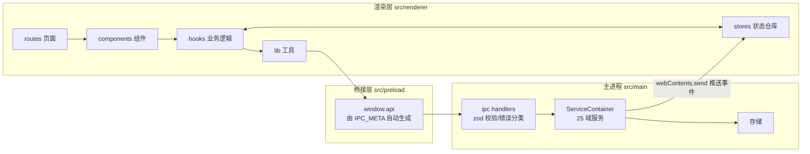

### 1.2 状态四层（L1-L4）

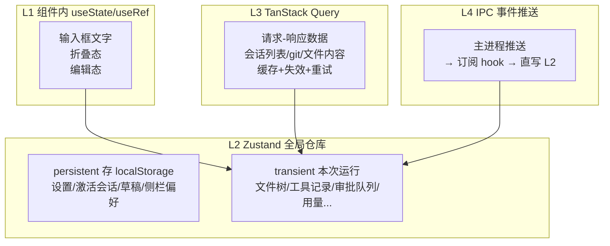

判断标准一句话：**IPC 问一次拿结果 → L3；IPC 持续推送 → L4 写 L2；界面交互态 → L2；组件独享 → L1。**

### 1.3 数据怎么跨进程

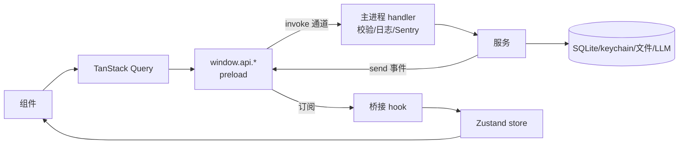

- 通道命名：`域:动作`（请求）、`域:stream:事件`（流式）、`域:event:名称`（状态事件）；全表见第七章。
- 错误约定：返回 `{data} | {error:{code,message}}`，消息带 `[CODE]` 前缀 → 前端查 i18n。

## 二、UI 设计体系（Aurora 2.0）

唯一真源：[globals.css](../../src/renderer/styles/globals.css)（4496 行）。原则：**所有颜色/尺寸走 CSS 变量（令牌），禁止硬编码**。

### 2.1 颜色总览（亮 / 暗两套）

| 用途 | 亮色 | 暗色 |
|---|---|---|
| 背景 L0 页面基底 | `--bg #f7f8fa` | `#080b10` |
| L1 侧栏/顶栏/卡片 | `--bg-elev #ffffff` | `#0e1319` |
| L2 悬浮/卡片头/悬停 | `--bg-elev-2 #eef0f4` | `#141a23` |
| L3 激活/强调容器 | `--bg-elev-3 #e0e4ec` | `#1a2130` |
| 主文字 | `--text #1a2130` | `#e8edf4` |
| 次要文字 | `--text-dim #5a6478` | `#8a95a6` |
| 辅助/占位文字 | `--text-faint #5d6779`（5.39:1 AA） | `#7a8699`（6.5:1） |
| 主 accent 青绿 | `--accent #00b89e` | `#00e5c7` |
| 辅 accent 蓝 | `--accent-2 #2b7fff` | `#4a9eff` |
| 边框 | `--border #e1e4eb` / strong `#cbd0db` | `#1c2330` / `#2d3848` |
| 成功 | `--success #00d9c0` | 同左 |
| 警告 | `--warning = --amber #e89038`（glow rgba(232,144,56,.15)） | 同左 |
| 错误 | `--error #c53030`（bg rgba(197,48,48,.08)） | 同左 |
| accent 上文字 | `--on-accent #001814`（7.6:1） | 同左 |
| 用户气泡 | `--msg-bubble-user #e8edf5` | 暗色另值 |

映射：`--primary=accent`、`--muted-foreground=text-dim`、`--muted=bg-elev-2`、`--ring=accent`、`--input=border`；图表五色 = accent/accent-2/amber/success/error。`@theme inline` 把这些变量暴露成 Tailwind 类（`bg-background`/`text-muted-foreground`…）。

### 2.2 字号 / 间距 / 圆角 / 阴影 / 缓动 / 图标

```
字号 6 级：10 / 11 / 12 / 13 / 14 / 16 px（--font-size-2xs…lg，UI 默认 13）
间距 7 级：4 → 48 px（--sp-1…7，4px 步进）
圆角：--radius 0.625rem（10px），lg +2px，xl +4px
阴影 5 档：--shadow-elev（抬升）/ --shadow-modal（模态，accent 描边）/ --shadow-dropdown（下拉）/ --shadow-card / --shadow-card-hover
发光 3 档：--glow-sm/md/lg（青）、--glow-2-sm/md（蓝）
缓动 3 个：--ease-soft 标准 / --ease-paper 纸张 / --ease-out 出场
图标 5 档：10/12/14/16/20 px（lucide-react，strokeWidth 1.5-2）
字体：--font-sans（UI）/ --font-serif（文学风标题）/ --font-mono（代码/状态/日志）
```

### 2.3 z-index 档位

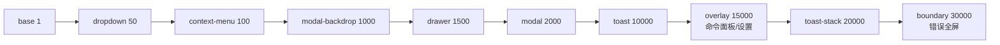

### 2.4 主题机制

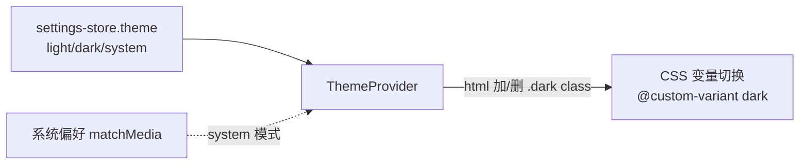

### 2.5 页面氛围与动效

- `body::before`：双 accent 渐变光晕 + 技术网格 + 扫描线；`body::after`：SVG 噪点（mix-blend-mode）。
- 主区 `.thread-bg paper-texture`：多层光晕 + 纸张噪点；顶栏 `backdrop-filter: blur(16px) saturate(1.4)` + 底部发光刻度线。
- 动画统一 tw-animate-css + 自定义关键帧（pulse-soft 状态点 / typingBounce 打字点 / msgEnter 消息入场 / shimmer 骨架 / refreshing-slide 刷新条 / reasoningReveal 推理块 / modalin 模态入场等，定义在 globals.css）。
- 对比度硬标准：正文 ≥16:1、次要 ≥5.39:1、accent 上文字 7.6:1（历史坑：硬编码 stone-* 曾低至 1.23:1，勿回退）。

## 三、页面布局（每个界面一张图）

### 3.1 整体框架 AppShell

```
┌──────────────────────── topbar 52px 玻璃顶栏 ────────────────────────┐
├──────────┬──┬────────────────────────────┬──┬──────────────────────┤
│ sidebar  │R │         main               │R │      right-panel     │
│ 200-400px│6 │   .thread-bg grid-column:3 │6 │      260-360px       │
│ (17vw)   │px│   欢迎页 / 聊天页           │px│  info|diff|files|    │
│          │  │   （欢迎模式：居中 flex）    │  │  browser|term|dev   │
└──────────┴──┴────────────────────────────┴──┴──────────────────────┘
```

- 栅格：`.app` 两行（52px + 1fr）；`.view-chat` 五列，列宽来自 CSS 变量。
- 宽度动态：默认 `clamp(200px,17vw,280px)` / `clamp(260px,22vw,360px)`；拖拽后 JS 写变量覆盖（钳位 200-400 / 260-360）。
- 折叠：`.sb-collapsed/.crp-collapsed` class → 变量置 0 → 列塌缩；断点 <1200px 折右面板、<900px 折侧栏（手动操作过不覆盖）。
- 关键坑：`.thread-bg` 必须 `grid-column: 3`——折叠元素 display:none 不占轨道，否则双折叠时 main 被挤到第 1 列宽度塌成 0。
- 浮层 z-index 用 2.3 的档位表；设置页右上 140px `.app-region-drag` 避让窗口控件。

### 3.2 欢迎页 `/`

```
┌──────────── 主区（welcome-mode：右面板隐藏，居中）────────────┐
│  ⟨/⟩ Code with TRAE                    ← .welcome-view 品牌   │
│  ┌──────── 输入舱 max-width 720px ────────┐                   │
│  │  [消息输入框]                          │                   │
│  │  [📁 项目名 ▾]  [模型选择器]           │ ← composer-project-bar │
│  └───────────────────────────────────────┘                   │
│  应用开发 | 项目理解 | 创意点子 | 工具知识   ← 4 个快捷 pill   │
└───────────────────────────────────────────────────────────────┘
```

要点：欢迎模式由 welcome-store 驱动 class；项目下拉 = 历史目录（≤10 条）+ 未选择项目 + 浏览其他目录（原生选择器）；发送时未选项目 → toast + 自动展开下拉；快捷 pill 点击只预填不发送。

### 3.3 聊天页 `/chat/:id`

```
┌ 状态条：项目名 · [🔍] · ● RUNNING · 12.3k tok ┐
├ 限流横幅 / 中断提示条 / 审批卡片（按需出现）    ├
├ 会话内搜索栏（可选）                           ├
├───────────────────────────────────────────────┤
│  消息列表（滚动区）                            │
│   ••  ← 右侧导航轨（≥4 条消息出现）            │
│                    [回到最新▼] ← 距底>80px 出现│
├───────────────────────────────────────────────┤
│ ┌ 输入舱：拖拽手柄 ────────────┐               │
│ │ 输入框（自动增高 1-8 行）    │               │
│ │ @  /   ⏎发送·⇧⏎换行  计数  发送│            │
│ └──────────────────────────────┘               │
│ 项目名(只读) · 模型选择器                       │
│ 状态 · 消息数 · Token                           │
└───────────────────────────────────────────────┘
```

要点：flex 纵向四段（状态条/横条区/消息区 flex-1 滚动/输入舱）；字号跟随设置（容器 fontSize）；路由守卫：加载中→"加载中"、会话不存在→回首页、目录空→错误态。

### 3.4 设置全屏页

```
┌ [← 返回]  ⚙ 设置 · 说明        （140px 拖拽避让区）┐
├──────────┬───────────────────────────────────────────┤
│ 账户与通用 │  内容区（滚动，每分区独立错误边界）      │
│  账号(占位)│                                          │
│  用量      │                                          │
│  通用      │                                          │
│  移动端(占位)│                                        │
│ 能力      │                                          │
│  模型服务  │← 打开时默认停在「模型服务」              │
│  ...      │                                          │
├──────────┴───────────────────────────────────────────┤
│ 导航：160px 固定列；激活项 = 青色 2px 竖条 + 加粗      │
└──────────────────────────────────────────────────────┘
```

### 3.5 右面板（6 个标签）

```
┌ 会话详情 | 文件变更 | 文件 | 浏览器 | 终端 | 开发者 ┐（均分，收缩截断）
├────────────────────────────────────────────────────┤
│ 会话详情：目标列表(可清除) / 待办 / 引用文件        │
│ 文件变更：本轮编辑记录 → 双栏 diff                  │
│ 文件：最近修改 → 点击开查看器                       │
│ 浏览器：地址栏 + 后退/前进/刷新 + 设备预设          │
│ 终端：xterm（懒加载）                               │
│ 开发者：Git | 日志 | 指标 | 检查器                  │
└────────────────────────────────────────────────────┘
```

### 3.6 文件树面板（侧栏视图）

```
┌ [← 返回] 文件树  [🔄] ┐
├ [新建文件] [新建目录] ┐
├ ▸ src                 │  目录：箭头展开/折叠
│   ├▸ components       │  （首次展开才加载子目录）
│   └ 📄 App.tsx         │  文件：点击开查看器
└── hover 节点 → [⋯ 菜单]┘
```

### 3.7 文件查看器

```
┌ 面包屑路径 · 行数 · [复制] [编辑/保存] [关闭] ┐
├──────────────────────────────────────────────┤
│  shiki 高亮层（绝对定位下层）                 │
│  textarea（上层：文字透明、光标不透明）        │ ← 编辑模式双层叠加
└──────────────────────────────────────────────┘
```

### 3.8 命令面板 / 3.9 快捷键帮助 / 3.10 提问框 / 3.11 审批卡

```
命令面板（z-overlay 全屏遮罩）        快捷键帮助（Dialog 双列网格 11 条）
┌ [🔍 输入] ┐                        ┌ [Ctrl+P] 命令面板     ┐
│ 操作/文件/会话 分组结果             │ [Ctrl+,] 设置         │
│ 无匹配 → "无匹配结果"              │ ...共 11 条           │
└ ↑↓ ⏎ esc ┘                        └───────────────────────┘

提问框（Dialog）：问题 + 选项(单选/多选) + 文本 + 确认/取消

审批卡（消息列表上方）：
┌🛡 写文件（等待审批）────────────────┐  ← 左色条：琥珀=待审
│ 描述文本                            │    绿=已批准 红=已拒绝
│ [命令预览/diff 预览]                │
│ [拒绝] [白名单]          [批准]     │  ← 危险工具批准=红色
└────────────────────────────────────┘
```

### 3.12 全局浮层挂载

Settings / CommandPalette / FileViewer / AskDialog / ShortcutHelp / UpdateNotice 全部挂在 AppShell 根部；Toast 在最内层 Provider。

## 四、原子组件库（components/ui 13 个）

### 4.1 组件家族

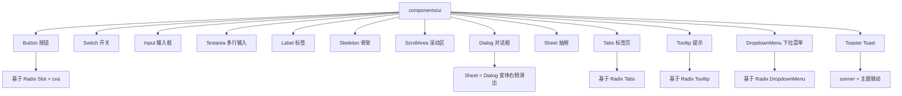

### 4.2 逐个说明（变体/状态/样式）

**Button**：cva 变体——variant 6 种（default 青色实底 / destructive 红 / outline 描边 / secondary 灰 / ghost 透明 / link 文字链）+ size 4 档（default h-9 / sm h-8 / lg h-10 / icon 方形）；状态 hover/active/focus-visible(ring)/disabled(50% 透明)；asChild 可把 `<a>` 变按钮；导出的 buttonVariants 可单独复用。

**Switch**：自研零依赖（button + role=switch）；受控 checked/onCheckedChange 必填；轨道 h-5 w-9（选中 bg-primary / 未选 bg-input）+ 圆点 translate-x 滑动；disabled 半透明。

**Input**：原生 input 包装；h-9 圆角边框，placeholder 用 muted 色，selection 用 primary；aria-invalid 时红边；透传全部原生 props。

**Textarea**：field-sizing-content 自适应高，min-h-16；focus 边框+ring；aria-invalid 红边。

**Label**：Radix Label；flex 文字加粗；peer-disabled 联动降级。

**Skeleton**：bg-accent animate-pulse rounded-md；尺寸由 className 决定。

**ScrollArea**：Radix ScrollArea（Root/Viewport/ScrollBar 自定义滑块）。

**Dialog**：Radix Dialog 全套（Root/Trigger/Portal/Overlay/Content/Header/Footer/Title/Description），open 受控或 defaultOpen；用于查看器/快捷键帮助/提问框。

**Sheet**：Dialog 变体，右侧滑出（slide-in-from-right）；设置页用全屏形态（w-full h-full）。

**Tabs**：Radix Tabs（Root/List/Trigger/Content）；右面板标签、侧栏 tabs。

**Tooltip**：Radix Tooltip（Provider/Root/Trigger/Content）；TooltipProvider 全局延迟，包在 AppProviders 内。

**DropdownMenu**：Radix DropdownMenu 全套（Trigger/Portal/Content/Item/Separator/Label/Sub…）；会话菜单/节点菜单/账户菜单。

**Toaster**：sonner 包装 + useTheme 联动，CSS 变量让 toast 配色跟随主题；全局渲染一次，任意处 toast()/success()/error()/info()。

## 五、业务组件（状态图为主）

### 5.1 全局异步五态（AsyncBoundary）——所有列表/面板通用

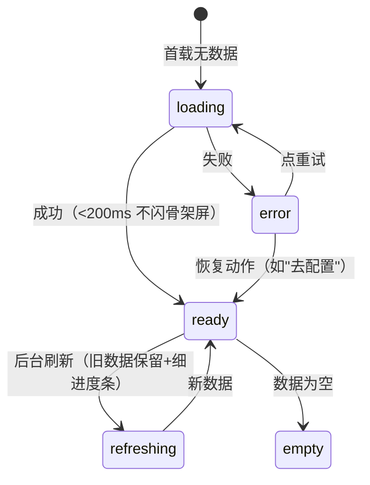

### 5.2 应用外壳 AppShell——布局状态

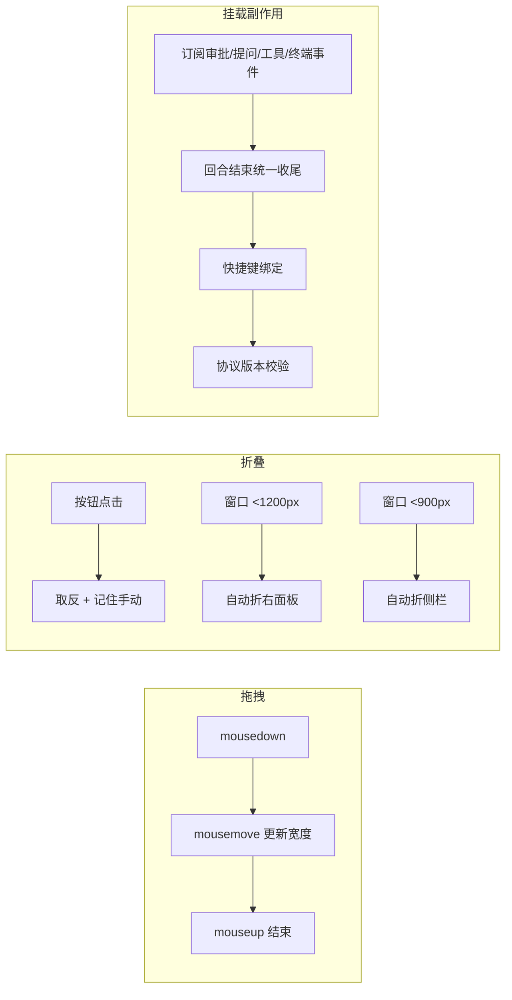

### 5.3 顶部栏 / 侧栏系

顶部栏：6 个按钮（折叠侧栏 / 返回·仅聊天页 / 命令面板胶囊 / 右面板开关 / 设置 / 主题）。主题按钮两态（light↔dark）；**快捷键切主题是三态循环（light→dark→system），现状不一致**。

侧栏会话列表：

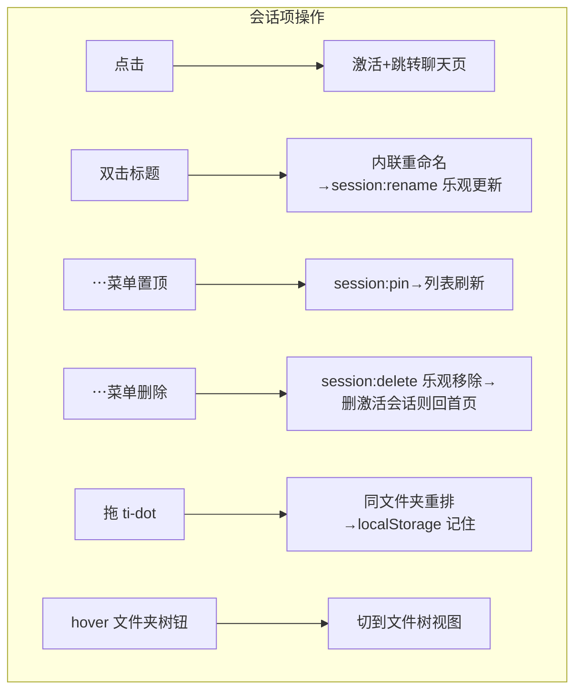

文件夹标签：点击折叠/展开（记住）；hover 显示 + 组内新建。列表状态：加载骨架 / 错误重试 / 空态（无 CTA）/ 就绪。搜索框仅 UI 不过滤（占位）；归档标签恒空（占位）。

### 5.4 聊天对话状态机（ChatPanel + 输入框）

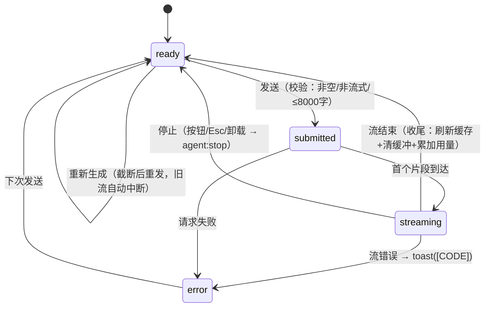

输入框附加状态：

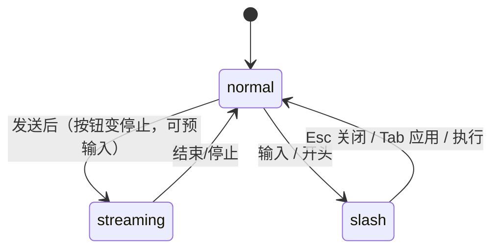

事件细节：自动增高 1-8 行；拖拽手柄向上拉高 [40,460]（双击重置、键盘↑↓ 20px）；>2000 字计数警告、>8000 拦截；附件 @ 多选 → chip → 发送时读文件拼入（≤4000 字）；草稿按会话保存/发送清空；流式中 Esc 窗口级兜底。

### 5.5 审批状态机

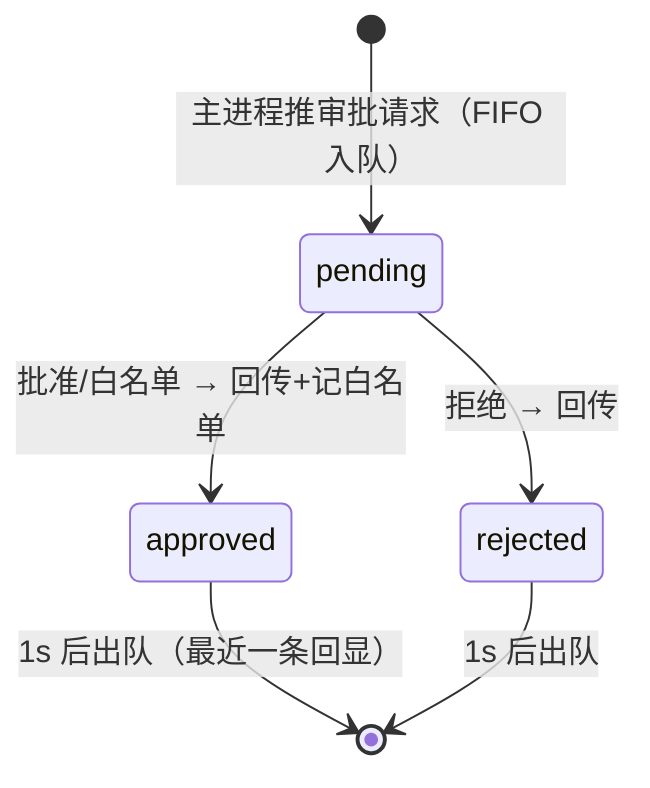

审批模式（询问/自动批准/拒绝）在设置页切换（失败回滚）；自动/拒绝模式下主进程直接处理，界面收不到请求。危险工具（删文件/跑命令/装包）批准按钮红色。

### 5.6 文件树 / 文件查看器

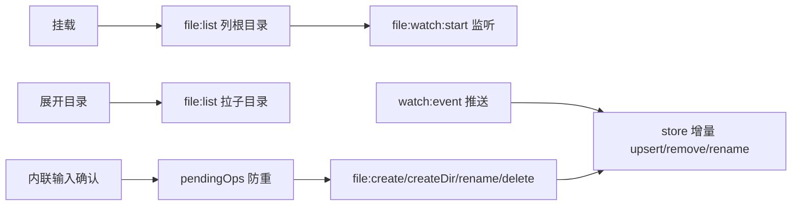

查看器：打开 → file:read（缓存 30s）→ 编辑 → 脏标记 → Ctrl+S → file:write → 刷新缓存；关闭时脏 → 确认；编辑内容存 store 卸载不丢。

### 5.7 终端 / Git / 日志 / 指标 / 检查器

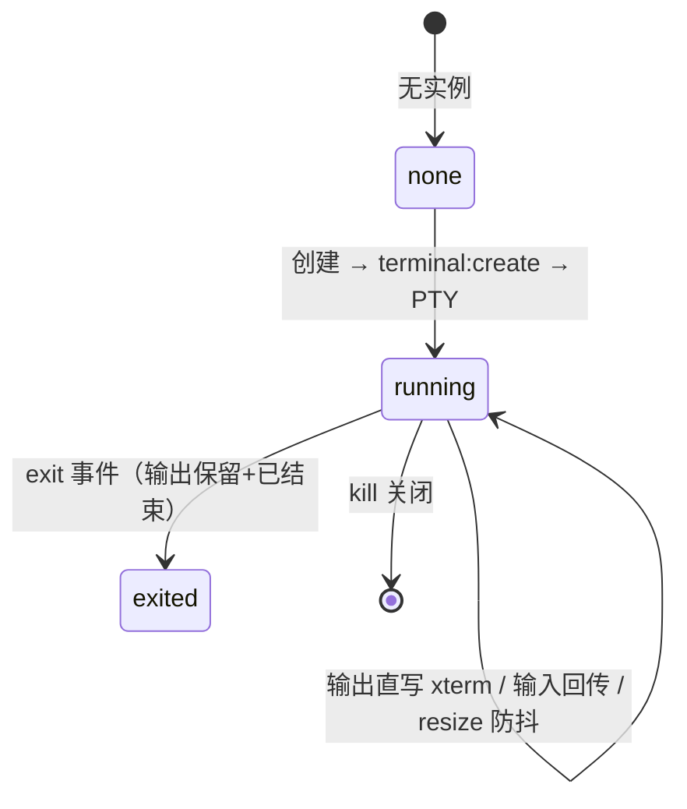

Git：status（10s 缓存）→ 点文件 → diff（不缓存）→ 双栏渲染；只读。日志：级别过滤 + 行数 + 手动刷新。指标：10s 轮询（面板不可见不查）。检查器：一键开 DevTools（三种停靠）。

### 5.8 错误边界三层

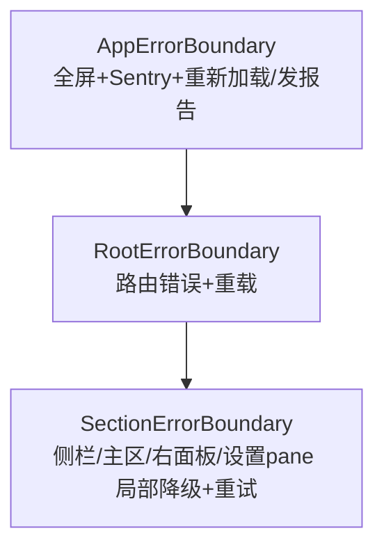

### 5.9 其余组件一句话

命令面板：cmdk + 模糊搜索，操作/文件(≤50)/会话(≤20) 三组，Esc/遮罩关闭。会话内搜索：纯前端匹配、↑↓ 循环、居中高亮。限流横幅：429 触发、5 分钟有效、可关闭。模型选择器：只显示已配 Key 的提供商。提问框：agent:event:ask 打开、确认回传/取消回空。更新提示：事件驱动 toast（可用/下载完成可重启安装/已最新/错误）。

## 六、交互流程（时序图）

### 6.1 新建会话

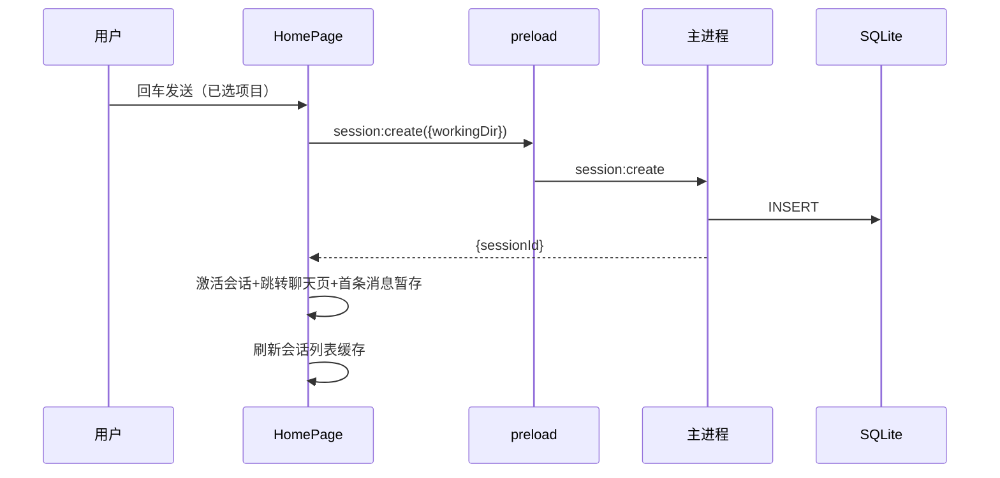

边界：未选项目 → toast+展开下拉；创建中禁用按钮防重复；失败留在欢迎页；URL 直访不存在会话 → 回首页。

### 6.2 发消息 → 流式 → 停止（核心链路）

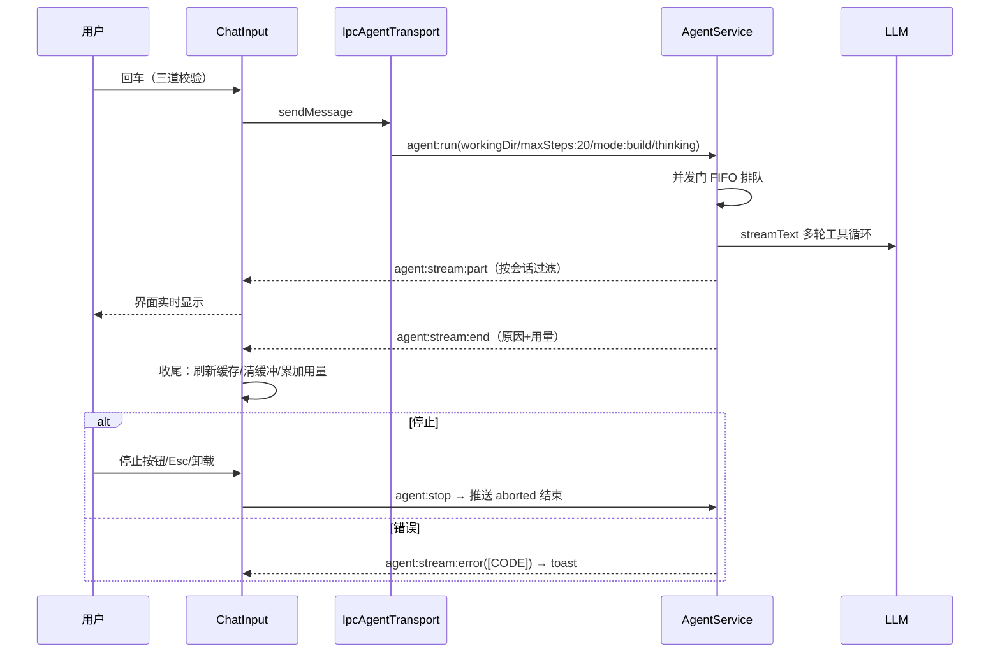

### 6.3 工具调用与审批

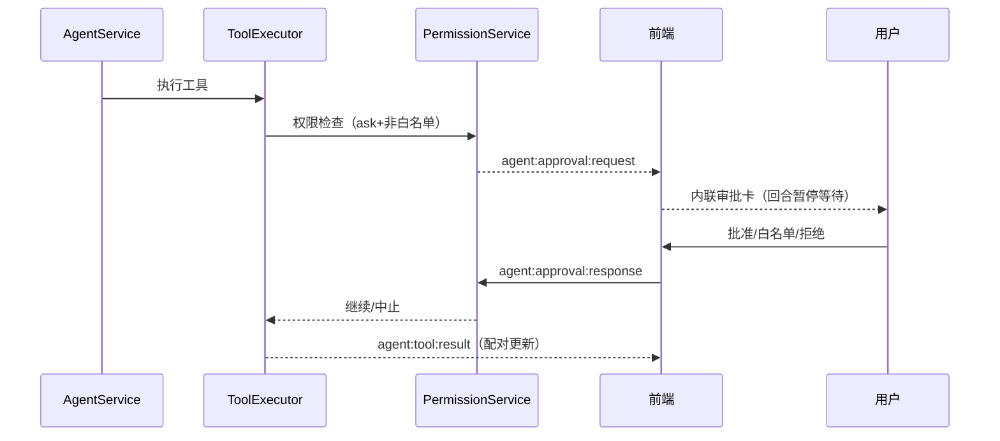

### 6.4 其余流程（简图）

会话管理：点击切换（session:get）/ 重命名（乐观更新）/ 置顶（刷新排序）/ 删除（乐观移除，删激活回首页）/ 拖拽排序（同文件夹重排记住）。

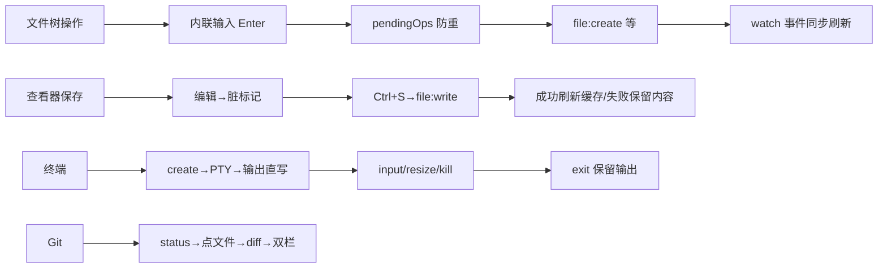

### 6.5 边界情况总表

| 场景 | 处理 |
|---|---|
| 数据为空 | 各场景空态（侧栏无 CTA） |
| 请求失败 | 五态 error：本地化+重试+恢复动作 |
| 加载中 | 首载 >200ms 才闪骨架；刷新保留旧数据 |
| 防重复提交 | 创建/保存/API Key/文件操作进行中禁用 |
| 长度限制 | 消息 8000 拦截、附件 4000 截断、工具 JSON 200 截断 |
| 脏数据 | 查看器关闭先确认 |
| Esc | 统一：中断生成/关建议/关浮层 |
| 浏览器模式 | window.api 缺失 → 空数据/静默跳过不崩溃 |
| 版本错配 | toast 提示重启 |
| 崩溃恢复 | 残留会话标记已中断 → 聊天页提示条 |
| 限流 | 429 → 横幅 5 分钟 |
| 列表防膨胀 | 命令面板 50/20、侧栏 50 分页 |

## 七、数据流

### 7.1 总链路

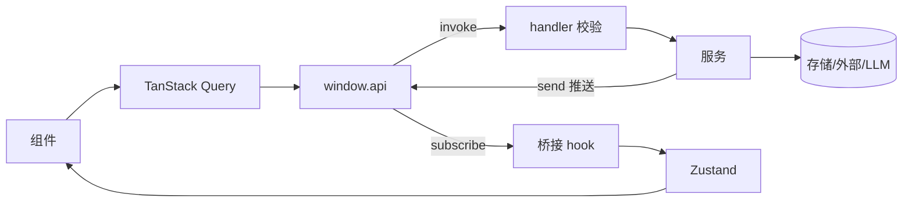

存储四类：SQLite（会话/消息/用量/回合/运行时模型/目标/记忆/任务/技能 11 张表）、keychain（API Key，DPAPI 加密）、JSON 偏好文件（遥测/审批模式/白名单）、外部进程（PTY/git/ripgrep/codegraph/MCP/LLM）。

### 7.2 核心链路图（Agent 对话）

```mermaid
flowchart LR
  IN[输入框] -->|sendMessage| UC[useChat]
  UC -->|transport.sendMessages| TR[IpcAgentTransport 单例]
  TR -->|convertToModelMessages| RUN[agent:run]
  RUN --> GATE[并发门 FIFO] --> LLM[大模型流式生成]
  LLM -->|part| PUSH[agent:stream:part] --> UC --> UI[界面]
  LLM -->|end| END[agent:stream:end] --> FIN[收尾：刷新会话缓存+清工具/审批缓冲+用量累加]
  TOOL[工具执行] -->|tool:call/result| TSTORE[tool-store] --> CARDS[消息卡片+右面板]
  TOOL -->|approval:request| AP[审批队列] --> ICARD[内联审批卡] -->|response| TOOL
```

### 7.3 25 域通道速查表

| 域 | 通道 | 前端消费方 | 存储/来源 |
|---|---|---|---|
| session | list/get/create/delete/rename/pin/listRecentDirs/exportAll/getUsageSummary/getRecentTurns | 侧栏/首页/用量页 | SQLite |
| agent | run/stop/approvalResponse/respondAsk + 推送 stream:part/end/error、tool:call/result、approval:request、event:ask、turn:event | 对话/审批/提问 | LLM + SQLite |
| chat | send/stop + stream:* | 无 UI（Agent 替代） | LLM |
| file | read/write/list/create/createDir/delete/rename/watch:start/stop + watch:event | 文件树/查看器 | 文件系统 |
| terminal | create/input/resize/kill + event:created/output/exit | 终端面板 | PTY |
| git | status/diff/add/commit/push | Git 面板（仅前两个） | git CLI |
| settings | getApiKey/setApiKey/deleteApiKey/getTelemetryLevel/setTelemetryLevel/getApprovalMode/setApprovalMode/addRuntimeModel/removeRuntimeModel/listRuntimeModels | 设置页 | keychain/JSON/SQLite |
| whitelist | list/add/remove | 审批设置 | whitelist-pref.json |
| models | list | 模型选择器 | 模型注册表 |
| mcp | list/start/stop | MCP 设置 | MCP 子进程 |
| skill | list/listLearned/learn/removeLearned | 技能设置 | SQLite |
| memory | list/clear | 规则记忆设置 | SQLite |
| goal | list/clear/create | 右面板会话详情 | SQLite |
| task | list | 右面板会话详情 | SQLite |
| app | getStatus/getInfo/openExternal/openDataDir | 协议校验/关于/数据 | 主进程 |
| system | getStatus | 指标面板 | 主进程 |
| logs | read | 日志面板 | main.log |
| devtools | open | 检查器 | DevTools |
| dialog | pickDirectory/pickFiles | 欢迎页/输入框 | 原生对话框 |
| update | check/install + event:status | 更新提示 | electron-updater |
| im | list/start/stop | IM 渠道设置 | 渠道适配器 |
| search/codebase/audio | grep/glob、query/explore…、start/append/stop | 无 UI（工具内部） | 不适用 |
| tool | list | 白名单设置 | 工具注册表 |

### 7.4 缓存策略

全局（query-client.ts）：缓存 30s / 回收 5min / 失败重试 1 次 / 写操作不重试。覆盖：git 10s；系统指标 5s+10s 轮询；日志不缓存；API Key 永不过期；文件内容 30s。失效：会话增删改 → 刷新列表；写文件 → 刷文件缓存；API Key 变更 → 刷对应项；MCP 启停 → 刷列表；回合结束 → 刷会话列表+详情。乐观更新：删除/重命名先本地变、失败回滚、最后重拉。

### 7.5 回合收尾与崩溃恢复

回合结束 → 刷新会话缓存 + 清本会话工具/审批缓冲 + 用量累加。崩溃恢复：启动检测崩溃标记 → 残留会话标"已中断" → 界面提示条。退出清理顺序（反向依赖）：中断对话流 → 停 MCP/审批 → 关文件监听 → 杀搜索/终端进程 → 关数据库。

## 八、完整性与文件索引

入口路由 6（main/App/router/root/home/chat）；布局 6+2（AppShell/Topbar/Sidebar/folder-label/thread-item/DevPanel + layout-utils/sidebar-utils）；聊天 11；审批 4；通用 9；文件 8；Git 5；开发者 4；终端 1；设置 23；hooks 22；stores 16；providers 3；lib 若干；i18n 双语言；ui 原子 13（见第四章）。全部已实现（或如实标注）。types/ 与 lib/chat/ 为空目录。

## 九、占位 / 不适用 / 已知不一致

**占位**：侧栏搜索框（仅 UI）；归档标签（恒空）；设置页账号/移动端（仅 IM 真功能）/插件/hooks/命令分区（规划中）；斜杠命令 /models /compact /help（toast 引导）；vim 开关（只存无行为）；浏览器设置（说明页）。

**不适用**：退出登录/云端账户（无登录后端）；Git 写操作（通道存在零调用）；search/codebase/audio 域无 UI；独立审批对话框（已内联化）。

**已知不一致**：主题按钮两态 vs 快捷键三态；快捷键帮助表 Ctrl+B/Ctrl+J 未绑定；Git 路径与终端工作目录硬编码项目路径。
