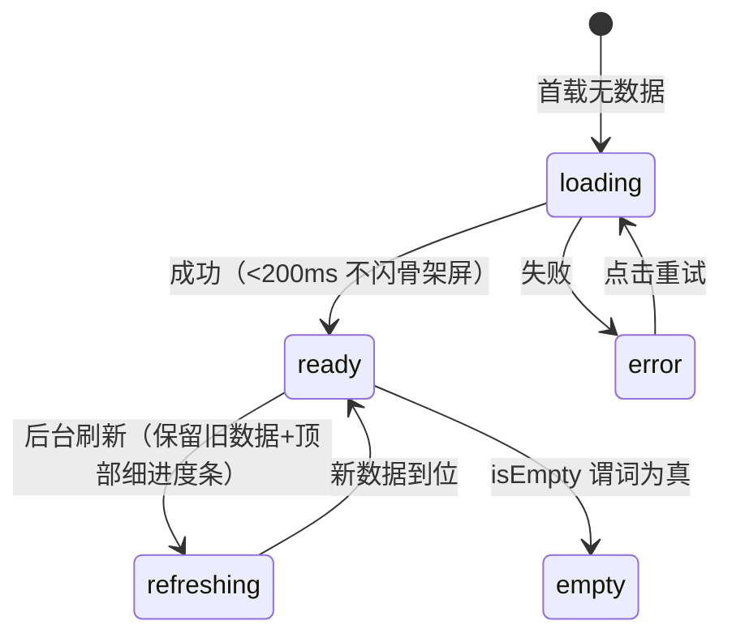
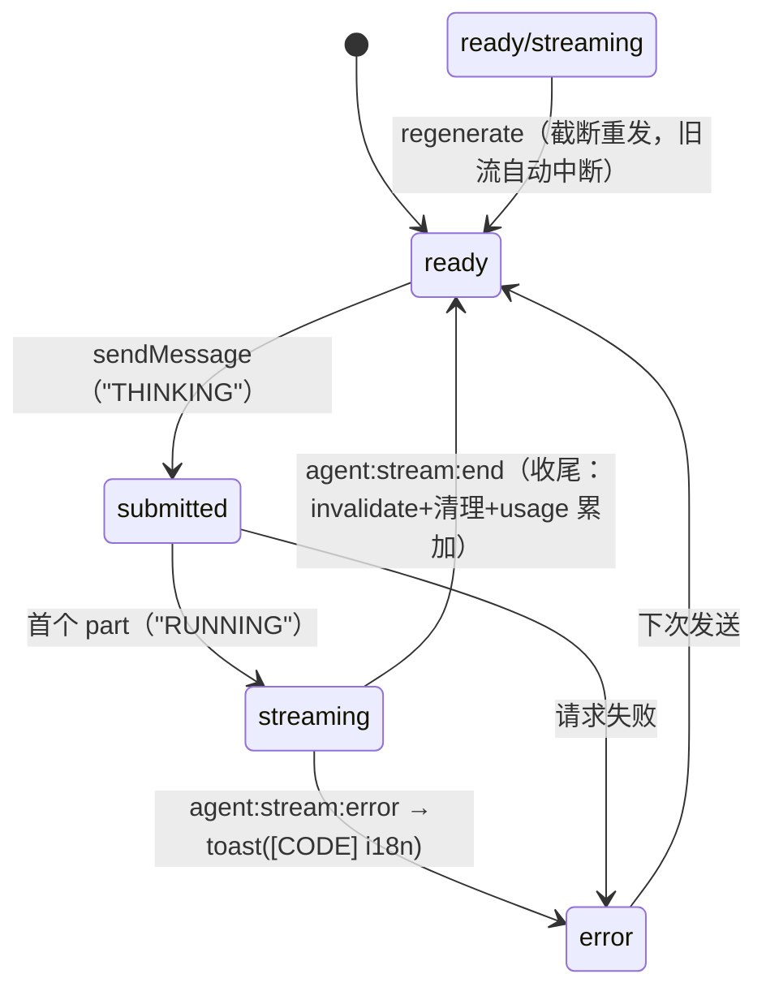
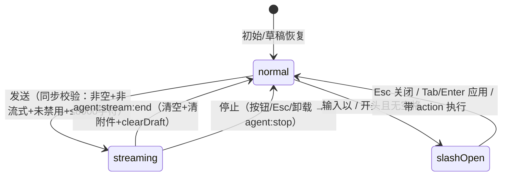
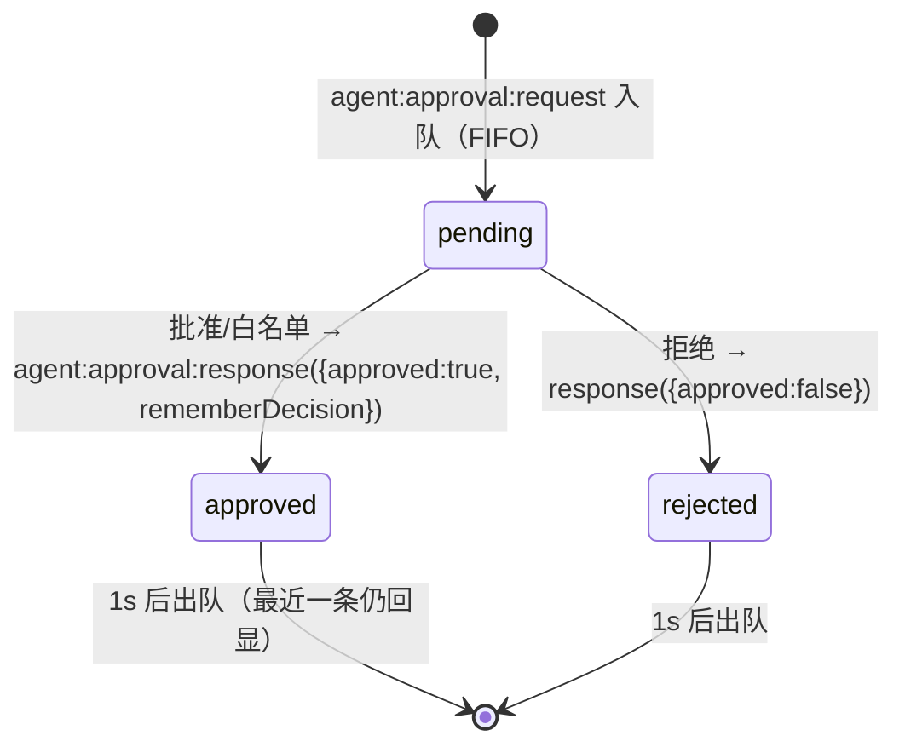
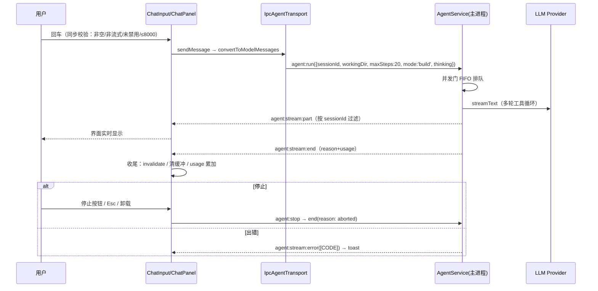

# 前端开发实现指南（09）

> 目标读者：要照着这份文档开发本前端（或复刻本前端）的开发人员。
> 覆盖：UI 设计体系（全部设计令牌）→ 页面布局（每个界面）→ 原子组件库（13 个逐个）→ 业务组件（状态/事件/交互）→ 完整交互流程 → 全部数据流。
> 所有条目均对应 `src/renderer/` 实际代码与 `packages/shared/src/ipc/meta.ts`（25 域）通道定义；不存在的功能标注"占位 / 部分实现 / 不适用"，不编造。整理时间：2026-08-10。

## 0. 文档定位与阅读说明

### 0.1 与现有文档的分工

04 号"接口设计文档"讲 IPC 契约（通道/参数）；05 号"功能设计文档"讲需求意图；03 号"目录结构"讲代码布局。本指南是把"前端实际实现"完整讲清楚：设计令牌、布局、组件、交互、数据流，开发人员照此即可实现前端。与 05 冲突处，以本指南（即代码）为准。

### 0.2 候选文件名

当前 `09-ux-interaction-spec.md`；备选 `09-frontend-interaction-dataflow.md`、`09-frontend-system-manual.md`。旧 `08-ux-guidelines.md` 未处理，去留待确认。

### 0.3 技术栈与全局约定

技术栈：React 19（React Compiler 启用）+ TypeScript（strict + exactOptionalPropertyTypes）+ Vite（electron-vite）+ Tailwind CSS v4（`@tailwindcss/vite`）+ shadcn/ui（new-york 风格，基于 Radix UI 原语）+ Zustand 5 + TanStack Query 5 + Vercel AI SDK v7（useChat + 自定义 ChatTransport）+ lucide-react 图标 + tw-animate-css 动画 + cmdk（命令面板）+ fuse.js（模糊搜索）+ dnd-kit（拖拽）+ xterm.js（终端）+ shiki（代码高亮）。

代码风格：Biome 强制；kebab-case 文件名、PascalCase 组件名；Props 用 interface + readonly；禁止 default export（例外：renderer *.tsx、config）；禁止 console；禁止硬编码颜色/像素（必须用设计令牌）；所有 window.api 调用点必须做浏览器模式守卫（`window.api === undefined` 时返回空数据/静默跳过，保证 dev 浏览器预览不崩溃）。

### 0.4 状态分层（L1-L4）

L1 组件内 useState/useRef（输入、折叠、编辑态）；L2 Zustand 全局仓库——persistent/ 存 localStorage 重启保留（settings、sessions 仅 activeSessionId、sidebar-pref、draft），transient/ 仅本次运行（ui、welcome、file-tree、file-viewer、tool、approvals、agent-ask、rate-limit、reasoning-collapse、terminal、usage）；L3 TanStack Query 管理 IPC 请求-响应数据（缓存/失效/重试）；L4 主进程推送事件 → 订阅 hook → 直写 L2 仓库。判断标准：IPC invoke → L3；IPC on → L4 写 L2；UI 交互态 → L2 transient；组件独享 → L1。

### 0.5 IPC 与错误约定

跨进程走 preload 暴露的 window.api（由 IPC_META 自动生成）。通道命名："域:动作"（请求-响应）、"域:stream:事件"（流式）、"域:event:名称"（状态事件）。主进程服务由 service-container 统一持有。IPC 返回统一 `{ data } | { error: { code, message } }`；错误消息约定 `[CODE] 描述`，前端解析错误码查 i18n（errors 命名空间），解析失败回退原始消息。

## 一、UI 设计体系（Aurora 2.0）

实现：[styles/globals.css](../../src/renderer/styles/globals.css)（4496 行，设计令牌唯一真源）+ [index.css](../../src/renderer/index.css)（入口，引入 Tailwind + tw-animate-css + globals）+ [components.json](../../src/renderer/components.json)（shadcn 配置：new-york、lucide、cssVariables）。

### 1.1 令牌分层

主题无关层（:root 顶层）：布局尺寸（`--sidebar-w: clamp(200px,17vw,280px)`、`--right-panel-w: clamp(260px,22vw,360px)`、`--resizer-w: 6px`、`--topbar-h: 52px`）、z-index 档位、字号阶梯、字体族（--font-sans/serif/mono）、间距（--sp-1~7）、圆角（--radius: 0.625rem）、阴影、缓动、图标尺寸。亮色/暗色两套完整令牌集分别在 `:root` 与 `.dark` 块中。`@theme inline` 把 CSS 变量映射为 Tailwind 工具类（`bg-background`/`text-muted-foreground`/`rounded-md` 等）——组件中只允许用工具类，禁止直接写 CSS 变量名或颜色字面量。

### 1.2 颜色令牌（亮/暗两套）

**背景深度 L0-L3**：亮色 `--bg #f7f8fa`（页面基底）/ `--bg-elev #ffffff`（L1 侧栏/顶栏/卡片）/ `--bg-elev-2 #eef0f4`（L2 悬浮输入/卡片头/悬停态）/ `--bg-elev-3 #e0e4ec`（L3 激活态/强调容器）；暗色 `#080b10 / #0e1319 / #141a23 / #1a2130`。旧 `--bg-elev-4` 废弃别名指向 L3。

**文字三级明度**：亮色 `--text #1a2130`（主）/ `--text-dim #5a6478`（次）/ `--text-faint #5d6779`（辅助/占位，在 --bg 上 5.39:1 通过 WCAG AA）；暗色 `#e8edf4 / #8a95a6 / #7a8699`（faint 在 --bg 上约 6.5:1）。

**双 accent**：主 accent 青绿——亮色 `--accent #00b89e`、`--accent-dim #009a82`；暗色 `--accent #00e5c7`、`--accent-dim #00b89e`。辅 accent 蓝色 `--accent-2 #2b7fff`（亮）/ `#4a9eff`（暗），`--accent-2-dim #2563eb`。accent 上的前景 `--on-accent #001814`（7.6:1 AA）。

**shadcn 标准映射**：`--background/--foreground`、`--card/--card-foreground`、`--popover/--popover-foreground`、`--primary = accent`、`--primary-foreground = on-accent`、`--secondary = bg-elev-2`、`--muted = bg-elev-2`、`--muted-foreground = text-dim`、`--accent-foreground = muted-foreground`、`--border #e1e4eb`（暗 `#1c2330`）、`--border-strong #cbd0db`（暗 `#2d3848`）、`--input = border`、`--ring = accent`。

**语义色**：`--success #00d9c0`、`--warning = --amber #e89038`、`--amber-dim #d07828`、`--amber-glow rgba(232,144,56,0.15)`、`--error #c53030`、`--destructive = error`、`--destructive-foreground #ffffff`、`--error-bg rgba(197,48,48,0.08)`。

**图表色**：`--chart-1 = accent`、`--chart-2 = accent-2`、`--chart-3 = amber`、`--chart-4 = success`、`--chart-5 = error`。

**氛围色**：`--accent-glow rgba(0,184,158,0.15)`、`--accent-soft rgba(0,184,158,0.08)`、`--accent-2-glow rgba(43,127,255,0.12)`、`--accent-2-soft rgba(43,127,255,0.06)`、`--info-blue rgba(43,127,255,0.1)`、`--info-amber rgba(232,144,56,0.12)`、`--error-bg`。

**消息气泡**：`--msg-bubble-user #e8edf5`（亮，暗色在 .dark 块内另有值）、`--msg-bubble-assistant transparent`；旧 `--user-bubble` 别名指向。

**遮罩/滚动条/侧栏**：`--overlay-bg rgba(0,0,0,0.3)` + `--overlay-blur 8px`；`--scrollbar-thumb rgba(0,0,0,0.15)`、hover `0.25`；`--sidebar = bg-elev`、`--sidebar-foreground = text`、`--sidebar-primary = accent`、`--sidebar-accent = bg-elev-2`、`--sidebar-border = border`、`--sidebar-ring = accent`。

### 1.3 字号、间距、圆角、阴影、动效、图标

**字号 6 级**：`--font-size-2xs 10px / xs 11px / sm 12px / base 13px / md 14px / lg 16px`（旧 --fs-* 别名兼容保留，禁止新增）。**间距 7 级**：`--sp-1 4px ~ --sp-7 48px`（4px 步进）。**圆角**：`--radius 0.625rem`、lg = +2px、xl = +4px。

**阴影 5 档**：`--shadow-elev 0 4px 16px rgba(0,0,0,0.08), 0 0 0 1px rgba(0,0,0,0.04)`（抬升）；`--shadow-modal 0 16px 48px rgba(0,0,0,0.12), 0 0 0 1px var(--accent-glow)`（模态）；`--shadow-dropdown 0 8px 24px rgba(0,0,0,0.1)`（下拉，--shadow-pop 别名）；`--shadow-card 0 2px 10px rgba(0,0,0,0.08)`；`--shadow-card-hover 0 12px 32px rgba(0,0,0,0.14), 0 0 0 1px rgba(0,0,0,0.04)`。发光三档：`--glow-sm/md/lg`（accent 青色系）、`--glow-2-sm/md`（蓝色系）。

**缓动 3 个**：`--ease-soft cubic-bezier(0.4,0,0.2,1)`（标准）、`--ease-paper cubic-bezier(0.25,0.46,0.45,0.94)`（纸张）、`--ease-out cubic-bezier(0.2,0.8,0.2,1)`（出场）。

**图标尺寸 5 档**：`--icon-xs 10px / sm 12px / md 14px / lg 16px / xl 20px`；图标库统一 lucide-react，strokeWidth 常用 1.5-2。

**关键帧清单**（globals.css 定义，供自定义动画复用）：pulse-soft（状态点脉冲）、brand-pulse（品牌呼吸）、boot-reveal（启动揭示）、file-viewer-spin/pulse、msgEnter（消息入场）、blink（光标）、typingBounce（打字点）、shimmer（骨架）、pulseDot、refreshing-slide（刷新进度条）、toolSpin、toolExpand、reasoningReveal（推理块）、pulse-check、runningBar。

### 1.4 z-index 档位

`--z-base 1 → raised 2 → elevated 5 → dropdown 50 → context-menu 100 → modal-backdrop 1000 → sticky 1100 → fixed 1200 → drawer 1500 → modal 2000 → toast 10000 → overlay 15000（命令面板/设置）→ toast-stack 20000 → boundary 30000`。新增浮层必须复用档位。

### 1.5 主题机制

三值主题 light/dark/system（settings-store.theme 默认 dark，persistent）。ThemeProvider：订阅 settings.theme → `document.documentElement.classList.toggle('dark')`；system 模式监听 `matchMedia('(prefers-color-scheme: dark)')` 变化。`@custom-variant dark (&:is(.dark *))` 使 dark: 前缀生效。index.css 里 `@theme inline` 完成变量→工具类映射。主题切换只允许走 settings-store.setTheme()，禁止组件直接改 DOM class。已知不一致：顶栏按钮两态切换、快捷键三态循环（见第八章）。

### 1.6 页面氛围层

`body::before`：双 accent 渐变光晕 + 精细技术网格 + 扫描线（CSS 渐变背景）；`body::after`：SVG 噪点纹理，`mix-blend-mode` 混合。主区 `.thread-bg`：多层光晕 + 纸张噪点（paper-texture）。顶栏：`backdrop-filter: blur(16px) saturate(1.4)` + 底部双 accent 渐变发光刻度线。实验开关 `experimental.scanlines` 控制扫描线叠加。

### 1.7 对比度标准（实测，勿回退）

正文/激活导航 `text-foreground` ≥16:1；`text-muted-foreground` 浅色 5.39:1、深色约 6.5:1；`--on-accent` 在 accent 上 7.6:1。历史教训：硬编码 `text-stone-*` 曾致审批卡标题深色 1.23:1、浅色导航青色文字 2.51:1，均已 token 化修复；装饰性竖条用 `border-l` 而非 shadow（防被背景覆盖）。

### 1.8 字体

`--font-sans`（默认 UI）、`--font-serif`（文学风标题：侧栏/设置标题/空态标题）、`--font-mono`（代码/状态/元信息/日志）。旧别名 `--mono/--sans/--serif` 兼容。

## 二、页面布局（每个界面）

### 2.1 整体框架（AppShell）

```
┌──────────────── topbar（--topbar-h: 52px，玻璃）────────────────┐
├─────────┬───┬───────────────────────┬───┬─────────────────────┤
│ sidebar │ R │  main（.thread-bg）   │ R │  right-panel        │
│         │6px│                       │6px│                     │
└─────────┴───┴───────────────────────┴───┴─────────────────────┘
```

`.app` 两行 grid（`grid-template-rows: var(--topbar-h) 1fr`）；`.view-chat` 五列 grid（`var(--aurora-sidebar-w) var(--resizer-w) 1fr var(--resizer-w) var(--aurora-right-panel-w)`）。列宽动态：初始 `:root` 的 clamp() 默认值，拖拽后 JS 写 CSS 变量 `--aurora-sidebar-w/--aurora-right-panel-w` 覆盖；钳位 layout-utils.ts（侧栏 [200,400]、右面板 [260,360]）。**关键**：`.thread-bg` 显式 `grid-column: 3`（双折叠态时折叠元素 display:none 不占轨道，auto 放置会把 main 挤到第 1 列致宽度塌 0px——已修复的 P0）。折叠：`.sb-collapsed/.crp-collapsed` class → JS 置变量 0px → 列塌缩。断点：matchMedia <1200px 折叠右面板、<900px 折叠侧栏，用户手动操作后不覆盖。拖拽：mousedown 全局监听，body.resizing + 分隔线 .dragging，分隔线 tabIndex=0 + aria-valuenow/min/max。滚动：三区独立 overflow；`#main-content` 锚点 + 跳过导航链接。

### 2.2 欢迎页（/，home.tsx）

`.view-chat.welcome-mode` 时 CSS 重排：右面板列隐藏、主区单列 flex 居中。结构：`.welcome-view`（品牌 ⟨/⟩ Code with TRAE）+ `.composer`（max-width 720px，welcome-mode 透明背景；内含 ChatInput 受控实例 + `.composer-project-bar`：`.cpb-folder-group` 项目下拉 + ModelSelector）+ `.welcome-quick-actions`（4 个快捷 pill：应用开发/项目理解/创意点子/工具知识，点击预填不发送）。项目下拉 `.folder-dropdown-menu` 绝对定位：未选择项目项 / 历史目录列表（session:listRecentDirs ≤10 条，名称 + formatRelativeTime）/ 分隔线 / 浏览其他目录（dialog:pickDirectory，取消保持打开）；无历史目录 `.fdm-empty`。发送时未选项目 → toast + 自动展开下拉。非 welcome-mode 下三块 display:none。

### 2.3 聊天主页面（/chat/:id，ChatPanel）

flex 纵向四段：`.thread-status-bar`（项目名 basename flex-1 truncate + 搜索按钮 + 状态点/状态字 + token 用量，role=status，流式脉冲动画）→ 横条区（RateLimitBanner / 中断提示条 amber / InlineApprovalCard，条件渲染）→ `.conversation-search-bar`（可选）→ `.messages`（flex-1 min-h-0 + overflow-y-auto；`.scroll-to-bottom` absolute 右下，`.has-new` 红点；`.msg-nav-rail` 右侧点列 ≥4 条渲染）→ `footer.composer`（`.composer-box` 悬浮卡片：focus transform 上浮 + accent glow；`.composer-drag-handle` 顶部 hr 拖拽手柄）→ `.composer-project-bar`（项目只读 + 模型）→ `.composer-stats-bar`（状态 · 消息数 · Token）。容器 `style={{fontSize}}` 跟随设置字号。路由守卫：加载中 → "加载中"；会话不存在 → 重定向 /；workingDir 空 → "会话加载异常"；进入强制退出欢迎模式。

### 2.4 设置全屏页（SettingsDialog）

Sheet 全屏（w-full h-full max-w-none，z-overlay）。头部 flex：← 返回 / ⚙ 标题 / 说明 / 右侧 `.app-region-drag` 140px 透明拖拽避让。主体 `grid-template-columns: 160px 1fr`：左导航（role=tablist，5 组 15 项，方向键循环；激活态 `border-l-2 border-l-[color:var(--accent)]` + text-foreground font-medium）+ 右内容滚动（每 pane SectionErrorBoundary）。打开时重置到"模型服务"分区。

### 2.5 右面板（DevPanel）

flex flex-col border-l。TabsList `w-full`（覆盖 w-fit）+ TabsTrigger flex-1 均分 + truncate。6 tab：info（goal/task/引用文件）、diff（edit_file/write_file 记录双栏 diff）、files（最近修改文件）、browser（iframe：地址栏/后退前进刷新/设备预设 responsive/desktop/tablet/mobile）、terminal（xterm 懒加载）、dev（子视图按钮行：git/logs/metrics/inspector）。懒加载 Suspense fallback 居中"加载中…"。

### 2.6 文件树面板（侧栏视图）

flex flex-col：`.sft-head`（返回/标题/刷新）+ `.ft-toolbar`（新建文件/目录，tabIndex=-1）+ `.file-tree`（role=tree，min-h-0 flex-1）。节点 `.ft-node` flex 行，缩进 padding-left 按 depth；目录展开箭头、文件点击开查看器；hover 显示"更多"菜单（position:relative 承载）；内联新建/重命名输入框替换名称行。排序：目录前文件后，名称不区分大小写。空态：无激活会话 "未选择项目"；未就绪 "加载中"。查看器内 FileTreeNavigator（react-arborist 只读）。

### 2.7 文件查看器（FileViewerDialog）

Dialog（z-modal）。头部面包屑 flex-1 truncate + 行数 + 复制 + 编辑/保存 + 关闭。主体双层叠加：绝对定位 shiki 高亮层 + 相对定位 textarea（文字透明、caret 不透明）。脏数据关闭确认。可选左侧 FileTreeNavigator。

### 2.8 命令面板（CommandPalette）

`.palette-overlay` fixed inset-0（z-overlay，点击自身关闭）+ 居中 `.palette`：输入行（放大镜 + CommandInput）/ CommandList 分组（操作/文件≤50/会话≤20）/ CommandEmpty / `.palette-foot` kbd 提示。

### 2.9 快捷键帮助对话框

Dialog + `grid grid-cols-2 gap-x-6 gap-y-1` 双列，11 条 kbd+描述（含未绑定项，见第八章）。

### 2.10 提问对话框（AskDialog）

Dialog（z-modal）：问题 + 预置选项（单选/多选）+ 自由文本 + 确认/取消。agent-ask-store 控制。

### 2.11 内联审批卡片

圆角卡片 mx-3 mt-2，`border-l-4` 色条（pending amber-500 / approved emerald-500 / rejected red-500）；头部图标 + 类型名 flex-1 truncate + 状态徽章；描述 pre-wrap + 结构化预览（mono 暗底）；pending 三按钮（拒绝/白名单/批准 ml-auto；危险工具批准红色）。role=alert。

### 2.12 全局浮层挂载

SettingsDialog / CommandPalette / FileViewerDialog / AskDialog / ShortcutHelpDialog / UpdateNotice 均挂 AppShell 根部；Toaster 在 Provider 最内层。

## 三、原子组件库（components/ui，13 个）

统一约定：全部带 `data-slot` 属性便于穿透与测试；类名用 cn()（clsx + tailwind-merge）合并；props 透传原生属性。

### 3.1 Button（button.tsx）

cva 变体：variant 六种——default（bg-primary text-primary-foreground shadow hover:bg-primary/90）、destructive（bg-destructive text-destructive-foreground）、outline（border border-input bg-background hover:bg-accent hover:text-accent-foreground）、secondary（bg-secondary hover:bg-secondary/80）、ghost（hover:bg-accent）、link（text-primary underline-offset-4 hover:underline）；size 四种——default（h-9 px-4 py-2）、sm（h-8 px-3 text-xs）、lg（h-10 px-8）、icon（h-9 w-9）。基础类：inline-flex items-center justify-center gap-2 whitespace-nowrap rounded-md text-sm font-medium transition-colors focus-visible:ring-1 ring-ring disabled:opacity-50 disabled:pointer-events-none，子 svg size-4。props：variant/size/asChild（Radix Slot，可把 a 变按钮）。状态：hover/active/focus-visible/disabled。导出 `buttonVariants` cva 函数可单独复用（如给 `<a>` 链接套按钮外观）。

### 3.2 Switch（switch.tsx，自研零依赖）

button + role="switch" + aria-checked。受控：checked/onCheckedChange 必填；disabled、aria-label、className。视觉：h-5 w-9 rounded-full 轨道（checked bg-primary / 未选 bg-input），内部 h-4 w-4 圆点 translate-x-0/4 滑动。键盘：原生 Space/Enter。

### 3.3 Input（input.tsx）

原生 input 包装。类：h-9 w-full min-w-0 rounded-md border border-input bg-transparent px-3 py-1 text-base shadow-sm outline-none transition-[color,box-shadow] placeholder:text-muted-foreground selection:bg-primary disabled:opacity-50 md:text-sm；aria-invalid 时 border-destructive + ring。透传全部原生 props（type/placeholder/disabled 等）。

### 3.4 Textarea（textarea.tsx）

原生 textarea 包装。类：field-sizing-content min-h-16 w-full rounded-md border border-input bg-transparent px-3 py-2 text-base shadow-sm focus-visible:border-ring focus-visible:ring-[3px] ring-ring/50 aria-invalid:border-destructive disabled:opacity-50 md:text-sm。

### 3.5 Label（label.tsx）

Radix Label 包装。类：flex items-center gap-2 text-sm leading-none font-medium select-none，支持 peer-disabled / group-data-[disabled] 降级。

### 3.6 Skeleton（skeleton.tsx）

div 包装。类：bg-accent animate-pulse rounded-md；尺寸由调用方 className 控制（如 h-4 w-32）。

### 3.7 ScrollArea（scroll-area.tsx）

Radix ScrollArea：Root（relative overflow-hidden）+ Viewport（size-full rounded-[inherit] focus-visible:ring）+ ScrollBar（自定义滑块）。用于 Git 面板等。

### 3.8 Dialog（dialog.tsx，160 行）

Radix Dialog 全套：Dialog（Root，open/onOpenChange 受控或 defaultOpen）、DialogTrigger、DialogPortal、DialogOverlay、DialogContent（含 close 按钮）、DialogHeader/Footer、DialogTitle、DialogDescription。用于查看器、快捷键帮助、提问框等。

### 3.9 Sheet（sheet.tsx，85 行）

基于 Radix Dialog 的右侧滑出抽屉：Sheet（Root）+ SheetOverlay（半透明遮罩，点击关闭）+ SheetContent（slide-in-from-right 动画，宽度调用方控制）。用于设置全屏页（w-full h-full max-w-none）。

### 3.10 Tabs（tabs.tsx，88 行）

Radix Tabs：Tabs（Root，value/defaultValue 受控/非受控，flex flex-col gap-2）+ TabsList（flex）+ TabsTrigger（激活态 Radix data-state 驱动）+ TabsContent。用于右面板标签、侧栏 tabs 语义。

### 3.11 Tooltip（tooltip.tsx，57 行）

Radix Tooltip：TooltipProvider（全局，控制延迟）+ Tooltip（Root）+ TooltipTrigger + TooltipContent（弹出气泡，主题跟随）。用于图标按钮的 title 增强。

### 3.12 DropdownMenu（dropdown-menu.tsx，276 行）

Radix DropdownMenu 全套：Root（open/defaultOpen）、Trigger、Portal、Content、Item、CheckboxItem、RadioItem、Label、Separator、Shortcut、Sub 等。用于会话项更多菜单、节点菜单、账户菜单。

### 3.13 Toaster（sonner.tsx，36 行）

sonner Toaster 包装：通过 useTheme 联动主题，CSS 变量（--popover/--popover-foreground/--border）让 toast 与应用主题一致；全局渲染一次，任意位置 `toast()`/`toast.success()/error()/info()` 调用。z-toast-stack 最高档。

## 四、业务组件（状态/事件/交互全量）

格式：文件 / 职责 / 状态与事件（含转换与副作用）/ 关键链路 / 边界。核心状态机附图。

### 4.1 全局异步五态（AsyncBoundary + use-async-view）

所有 L3 查询渲染统一走五态机（discriminated union，TS 穷尽性检查强制全分支处理）。



loading：首载，>200ms 才显示骨架屏（防闪烁）；refreshing：保留旧数据绝不闪屏；error：`[CODE]` 本地化 + 重试按钮，错误码 AI_API_KEY_MISSING / AI_API_KEY_INVALID 时额外"去配置"按钮（error-actions.ts 注册表）；empty：EmptyState（侧栏空态无 CTA）；ready：正常渲染。

### 4.2 应用外壳 AppShell（layout/AppShell.tsx）

职责：布局（栅格/拖拽/折叠/断点）+ 全局副作用挂载点。状态与事件：sidebarWidth/rightPanelWidth（分隔线 mousedown→mousemove→mouseup，钳位 [200,400]/[260,360]，body.resizing）；sidebarCollapsed/rightPanelCollapsed（按钮取反 + manualRef；断点自动折叠仅限未手动项）；draggingSide（拖拽中分隔线 .dragging）；isWelcomeMode（welcome-store → class 切换）。挂载期副作用：useApprovalBridge / useAgentAskBridge / useToolBridge / useAgentBridge（回合结束：invalidate sessions+详情、clearBySession tool+approvals、usage 累加）/ useTerminalBridge / useProtocolCheck（协议版本错配 toast 提示重启）/ useKeyboardShortcuts（6 配置快捷键 + shift+Slash 帮助）。浮层挂载：SettingsDialog / CommandPalette / FileViewerDialog / AskDialog / ShortcutHelpDialog / UpdateNotice。边界：卸载清理拖拽监听；订阅随卸载取消。

### 4.3 顶部栏 Topbar（layout/Topbar.tsx）

职责：52px 玻璃顶栏。按钮与事件：折叠侧栏（aria-expanded，取反）；返回（仅聊天页，navigate('/')，Alt+←）；命令面板胶囊（Search+文字+Ctrl+P kbd，唯一入口 → openPalette）；右面板开关（aria-expanded）；设置（openSettings）；主题（resolvedTheme 两态切换 light↔dark；**注意**：快捷键 Ctrl+Shift+T 是三态循环 light→dark→system，现状不一致）。品牌区 `Code Agent<span>desktop</span>` + 遥测带 v0.1.0 · main。平台适配：macOS ⌘ / Windows Ctrl（navigator.platform）。

### 4.4 侧栏系（Sidebar / FolderLabel / ThreadItem）

Sidebar（layout/Sidebar.tsx）：职责——会话列表（按 workingDir basename 分组）+ 文件树视图 + 底部账户菜单。状态与事件：activeTab（recent/archived，archived 恒空——占位）；searchKeyword（仅 UI 不过滤——占位）；sidebarView（threads/fileTree）；列表五态（useSessionsQuery `['sessions']` stale 30s limit 50）。新建会话：clearActiveSession + enterWelcomeMode(复用最近 workingDir) + navigate('/')。

FolderLabel（layout/folder-label.tsx）：collapsed（persistent，点击箭头取反）；hover 显示组内新建 +（handleCreateInFolder 复用该文件夹 workingDir）。

ThreadItem（layout/thread-item.tsx）：active（aria-current）；renaming（双击/菜单进入；Enter/blur 提交 → session:rename 乐观更新，Esc 取消，空值/未变化退出）；isDeleting（禁用操作）；isPinned（菜单置顶 → session:pin → invalidate）；拖拽（ti-dot，dnd-kit PointerSensor 4px 激活 → 同文件夹 arrayMove → orderOverrides persistent）。菜单：置顶/重命名/删除。hover 文件夹树按钮（先切激活会话再开文件树）。边界：删除激活会话 → clearActiveSession + navigate('/')；元信息 = 相对时间 + 最后消息预览 >20 字截断。

### 4.5 文件树（FileTreePanel / FileTreeNode / use-file-tree / use-file-tree-ops）

状态与事件：expanded（点击箭头，首次展开 file:list 拉子目录）；loading（子目录请求中）；pendingOps 含路径（操作中禁用防重复）；creatingEntry/renamingPath（内联输入：Enter → IPC，Esc 取消，blur 提交，空值忽略）；selected（当前查看文件高亮）。数据链路：useFileTree——挂载 file:list + file:watch:start；file:watch:event 推送 → store 增量 upsert/remove/rename（操作成功后不手动刷新，依赖 watch 同步避免双份数据）；卸载 file:watch:stop；手动刷新 = file:list 重拉根目录（watch 失效兜底）。写操作：file:create / file:createDir / file:delete / file:rename，pendingOps 置位/清除，失败 toast。watch 失效 → toast"文件监听已失效"。

### 4.6 聊天面板 ChatPanel（chat/ChatPanel.tsx）

对话状态机：



其他状态：interruptedDismissed（中断提示条关闭，会话内不重复）；search（useConversationSearch 联动滚动+高亮）；usage（usage-store per-session，回合结束累加，状态条展示，悬停明细）；editorFontSize（设置字号 → 容器 fontSize）。statusText：streaming→RUNNING、submitted→THINKING、ready→READY、error→ERROR、其他→IDLE。错误处理双保险：解析 `[CODE]` → i18n；失败回退原始消息；onError 绝不抛错（防卡死 THINKING）。斜杠命令分发：new → navigate('/')；clear → setMessages([])；models/compact/help → toast 引导（部分实现）。

### 4.7 输入框 ChatInput（chat/ChatInput.tsx，交互最密集）



事件明细：输入 → autoResize（1-8 行，240px 封顶）；chatId 变化 → 恢复新会话草稿（draft-store 文本+附件，附件仅恢复存在路径）；>2000 字符计数警告（aria-live）；拖拽手柄（hr+separator 语义 tabIndex=0：向上拉高钳位 [40,460]，下限 = min(内容自然高,160)，双击重置，键盘 ↑↓ 20px 步进）；附件（@ → dialog:pickFiles 多选去重 → chip 可移除 → 发送时 file:read 拼接 ≤4000 字符，失败仅标注文件名不阻断）；流式期间不禁用（可预输入）+ window 级 Esc 兜底；斜杠建议（5 条 role=listbox，Tab/Enter 应用，Esc 清空斜杠输入关闭）；草稿写入（发送成功 clearDraft）；8000 字符拦截（toast）；canSend 派生。欢迎页为受控模式（value/onValueChange 支持快捷 pill 预填）。

### 4.8 消息列表与消息项（ChatMessageList / MessageItem / 各卡片）

ChatMessageList：isAtBottom（距底 ≤80px）→ 流式自动跟随；翻上 → scroll-to-bottom 出现，新消息 hasNew 红点；searchActiveIndex → scrollIntoView 居中 + .search-highlight；空 → EmptyState；流式尾部 StreamingFooter（三 accent 点弹跳）。性能：MessageItem memo（仅变化消息重渲染）；普通滚动渲染（已移除 Virtuoso——React 19 空→非空更新 bug）。

MessageItem 角色：user（右侧玻璃气泡，仅文本）；assistant（C 头像 + 角色行"助手 · 模型名" + parts + hover 操作栏 MsgActions：复制/重新生成，流式中禁用）；system（居中淡灰）。parts 分发：text → Markdown（GFM + shiki 双主题）；reasoning → ReasoningBlock（折叠态：experimental.reasoningCollapsed 默认 + 用户 override 按 messageId 优先，点击头切换）；tool → ToolCallView（默认折叠；标题优先 tool-store 人类可读标题；徽章 pending/running/success/error 映射 AI SDK state；input/output/error ≤200 字符）；edit_file/write_file → FileChangeCard（折叠，created/modified 徽章 + 行级 diff）；file → 📎 附件卡；step-start → 分隔线；未知 → 灰字。

### 4.9 审批（InlineApprovalCard + useApprovalBridge + approvals-store）



审批模式（ask/auto-approve/deny）：useApprovalMode → settings:get/setApprovalMode → approval-pref.json（启动同步 PermissionService），切换失败回滚；非 ask 模式主进程直接处理。危险工具（delete_file/run_command/install_package）批准按钮红色。工具链路：agent:tool:call（入参/权限级别）→ 执行 → agent:tool:result（toolCallId 配对）；plan 模式写工具直接拒绝。approval-preview 按类型结构化预览（命令/路径/diff）。

### 4.10 AskDialog（agent/ask-dialog.tsx）

open（agent-ask-store，agent:event:ask 推送）/ closed。确认 → 选项+文本经 agent:ask:respond 回传 → 关闭；取消 → 空回答 → 关闭；浏览器模式打开即关。

### 4.11 会话内搜索（use-conversation-search + ConversationSearchBar）

visible/query/totalMatches/currentMatch；输入即时匹配（消息级纯函数 findMessageMatches）；↑↓/Enter/Shift+Enter 循环；关闭清高亮。纯前端无 IPC。

### 4.12 限流横幅（rate-limit-banner.tsx）

回合失败且错误码 429 → rate-limit-store 记录 triggeredAt → 横幅显示（warn pill）；5 分钟自动消失（isRateLimitExpired）；手动 × 关闭。

### 4.13 模型选择器（ModelSelector.tsx）

models:list（L3 `['models','list']`）→ 提供商下拉仅显示已配 API Key 的（实事求是）；模型下拉 → updateAi(defaultModel)；provider → updateAi(defaultProvider)；disabled（欢迎页创建中）；浏览器模式空列表。

### 4.14 命令面板（CommandPalette.tsx）

open（ui-store.paletteOpen 多入口：Ctrl+P/顶栏胶囊/Shift+/）/ closed + query。cmdk 键盘导航；fuse 模糊（threshold 0.4，keys title+section，ignoreLocation）；动作：新建会话（clearActiveSession + enterWelcomeMode(null) + navigate('/')）、切主题、开设置、切侧栏视图、开文件（≤50，rootPath 相对路径）、切会话（≤20，updatedAt 倒序，无标题显示"未命名会话"）；执行后关闭；Esc/遮罩关闭；CommandEmpty 空结果。

### 4.15 设置页 sections（20 个分区）

模型服务（models-section 聚合四块）：ProviderRow——expanded（整行点击取反）/ showPlain（密码显示切换）/ isConfigured（绿勾 vs 灰字徽章）/ isSaving / isDeleting；保存 → settings:setApiKey（空值校验）→ invalidate `['api-key',provider]`；删除 → settings:deleteApiKey。运行时模型：adding/removingId；添加 → settings:addRuntimeModel（id 非空校验）→ 重拉；删除 → settings:removeRuntimeModel → 重拉。模型参数（model-params-section）：defaultModel 文本、temperature SegControl 0.3/0.7/1.0、thinking SegControl off/low/medium/high（透传 agent:run 覆盖模型默认）。审批权限（approval-mode-section）：审批模式单选 + 白名单管理（whitelist:list/add/remove，tool:list 选工具）。

通用（general-section 聚合六块）：语言（zh-CN/en 点击 changeLanguage 立即生效 + Check，持久化 code-agent:lang）；编辑器（editor-section：字号 12/14/16 真实消费；vim 仅存储——部分实现）；快捷键（shortcuts-section + ShortcutPicker：6 项录制，v3 迁移 Windows Meta→Ctrl）；系统提示词（prompt-section：编辑/保存，空串回退内置）；数据（data-section：session:exportAll 主进程弹保存框；app:openDataDir）；遥测（telemetry-section：setTelemetryLevel → telemetry-pref.json，提示重启生效）。

MCP（mcp-section）：mcp:list/start/stop，启停 invalidate，失败错误显示 server 行。技能（skills-section）：skill:list / listLearned / learn（异步生成）/ removeLearned。规则记忆（rules-memory-section）：memory:list（按激活会话）/ memory:clear。用量（usage-section）：session:getUsageSummary → 四卡 + 90 天热力图（5 级色档按日最大值分位，hover 日期+token）+ 模型占比条 + 回合记录（turns-section：session:getRecentTurns limit 10）。工作树（workspace-section）：file-tree-store 只读。关于（about-section）：app:getInfo + openDataDir。浏览器（browser-section）：说明页。占位（placeholders）：账号/移动端（含 IM 渠道真功能 im:list/start/stop）/插件/hooks/命令。

### 4.16 文件查看器（FileViewerDialog.tsx）

open/filePath/editMode/isDirty/originalContent/editedContent（file-viewer-store，编辑内容卸载不丢）。打开 → useFileContent（file:read，`['file',path]` stale 30s / gcTime 5min，enabled=open，路径变化自动重查）；编辑 → isDirty；Ctrl+S → file:write（成功 markSaved + invalidate `['file',path]`；失败保留编辑内容）；关闭脏 → 确认。读取失败 → error 态可重试。

### 4.17 右面板各页（DevPanel 系）

DevPanel：activeTab/devSubTab（本地状态）；懒加载 Suspense。GitPanel：git:status（stale 10s）+ 文件行点击 → git:diff（enabled=选中，不缓存）→ parseUnifiedDiff → 双栏；刷新 refetch；非 git 仓库 ErrorHint；干净 CleanHint；纯只读。TerminalPanel：无实例（创建按钮）/运行中/已退出（输出保留+"已结束"）；terminal:create → event:output 直写 xterm（不经 store）；terminal:input；resize（ResizeObserver 100ms 防抖）；kill；exit → markExited；每会话一实例。LogsPanel：级别过滤 + 行数 100/200/500 + 手动刷新（logs:read 不缓存）；行级着色。MetricsPanel：system:getStatus，10s refetch，enabled=面板可见。InspectorPanel：devtools:open（detach/right/bottom）+ toast 反馈 3s 清除。BrowserPane：地址 + 设备预设 + 后退前进刷新。

### 4.18 错误边界三层

AppErrorBoundary（全屏 + Sentry 自动上报 + 重新加载/发送报告）；RootErrorBoundary（路由错误 + 重新加载）；SectionErrorBoundary（侧栏/主区/右面板/设置 pane 局部降级 + 重试）。

### 4.19 UpdateNotice

update:event:status → toast（available / downloaded+重启安装→update:install / not-updated / error）；同阶段防抖；下载进度不弹；开发模式 check 返回明确错误。

## 五、交互流程（完整）

### 5.1 新建会话

入口：侧栏按钮 / 文件夹加号 / Ctrl+N / 命令面板。点击 → clearActiveSession + enterWelcomeMode（自动带最近 workingDir：激活会话 → 列表第一个 → null）+ navigate('/')。欢迎页可选项目 → 回车发送：未选项目 → toast + 自动展开下拉不发请求；已选 → session:create({workingDir}) → setActiveSession + exitWelcomeMode + navigate(/chat/:id) → 首条消息经 sessionStorage 暂存 → ChatPanel 挂载后自动发送。边界：创建中 isPending 禁用（防重复提交）；失败 toast 留在欢迎页；URL 直访不存在会话 → 重定向 /。

### 5.2 发送/流式/停止/重新生成（核心）



细节：transport 模块级单例（configure 注入 workingDir/systemPrompt/maxSteps/thinking）；流 cancel 也触发 agent:stop；重新生成 = regenerate({messageId}) 截断后重发（主进程自动中断旧流）；消息落库由主进程流式推送过程中完成。

### 5.3 工具调用与审批

Agent 回合执行工具 → ToolExecutor 权限检查：ask 且非白名单 → agent:approval:request → 内联卡（回合停 waitingApproval）→ 用户批准/白名单/拒绝 → agent:approval:response → PermissionService resolve → 工具继续/中止 → agent:tool:result 配对更新。边界：单会话多审批 FIFO；危险工具红色批准；auto-approve/deny 直接处理；plan 模式拒绝写工具。

### 5.4 会话管理

切换：点击 → setActiveSession + navigate → useSessionDetail（session:get）。重命名：双击/菜单 → 内联 → session:rename（乐观更新+回滚+invalidate）。置顶：session:pin → invalidate。删除：session:delete（乐观移除+回滚+invalidate）；删激活会话 → 回首页。拖拽：ti-dot → 同文件夹 arrayMove → orderOverrides。边界：isDeleting 禁用；空列表 EmptyState；50 条分页。

### 5.5 文件树操作

加载：file:list + file:watch:start → watch:event 增量。写操作：内联 Enter → pendingOps 置位 → file:create/createDir/rename/delete → 取消编辑态 + watch 同步（不手动刷新）。边界：失败 toast；Esc 不落盘；watch 失效提示刷新；新建后自动展开父目录。

### 5.6 查看器编辑保存

打开 → file:read（缓存）→ 编辑 → isDirty → Ctrl+S → file:write → markSaved + invalidate；失败保留编辑内容；关闭脏 → 确认。

### 5.7 终端生命周期

创建 → terminal:create → PTY → event:output 直写 xterm → terminal:input → resize（100ms 防抖）→ exit → markExited → kill。每会话一实例；卸载重挂从 store 环形缓冲恢复。

### 5.8 Git 查看 / 5.9 命令面板执行 / 5.10 会话内搜索 / 5.11 设置修改

Git：git:status（stale 10s）→ 文件行点击 → git:diff（enabled=选中，不缓存）→ 双栏渲染 → refetch；只读。命令面板：打开 → 过滤 → 执行动作 → 关闭（文件≤50/会话≤20）。搜索：🔍 → 输入即时匹配 → ↑↓ 循环 → 居中高亮 → 关闭清高亮（纯前端）。设置修改：API Key → settings:setApiKey → keychain（失败保留输入）；审批模式 → setApprovalMode（失败回滚）；白名单 → whitelist:add/remove；运行时模型 → addRuntimeModel → SQLite runtime_models（启动注册 ModelRegistry）；遥测 → setTelemetryLevel（重启生效）；语言/快捷键/主题/提示词 → 本地持久化；MCP → mcp:start/stop（失败显示 server 行）；技能 → skill:learn 异步；记忆 → memory:clear。

### 5.12 边界情况总表

空态（各场景 EmptyState，侧栏无 CTA）；请求失败（五态 error + 重试 + 恢复动作）；首载 200ms 防闪烁、刷新保留旧数据；防重复提交（创建/保存/API Key/文件操作进行中禁用）；长度限制（消息 8000 拦截、附件 4000 截断、工具 JSON 200 截断、重命名空值忽略）；脏数据保护（查看器关闭确认）；Esc 统一（中断生成/关建议/关浮层）；浏览器模式守卫（window.api 未定义 → 空数据/静默跳过）；协议版本错配（toast 提示重启）；崩溃恢复（启动 markAllInterrupted → 聊天页中断提示条）；限流（429 → 横幅 5 分钟）；列表防膨胀（命令面板 50/20、侧栏 50 分页）。

## 六、数据流（全部链路）

### 6.1 链路总览

前端两来源：主动请求（组件 → TanStack Query → window.api → IPC 通道 → 主进程 handler（wrap：traceId/sender 校验/zod 入参+响应校验/错误分类/Sentry）→ Service → 存储/外部进程/LLM）与被动推送（Service → webContents.send → 前端订阅 → 桥接 hook → L2 store → UI）。存储四类：SQLite（sessions/messages/token_usage/turns/runtime_models/goals/memories/tasks/skills/cron_tasks 11 张表）、keychain（API Key DPAPI）、JSON 偏好文件（telemetry-pref/approval-pref/whitelist-pref）、外部进程（PTY/git/ripgrep/codegraph/MCP/LLM）。

### 6.2 IPC 通道速查表（25 域）

| 域 | 通道 | 前端消费方 | 主进程 | 存储/来源 |
|---|---|---|---|---|
| session | list/get/create/delete/rename/pin/listRecentDirs/exportAll/getUsageSummary/getRecentTurns | use-sessions、Sidebar、HomePage、Usage/TurnsSection | SessionService | SQLite |
| agent | run/stop/approvalResponse/respondAsk + 推送 stream:part/end/error、tool:call/result、approval:request、event:ask、turn:event | useAgentWithIpc、bridge hooks、审批卡、AskDialog | AgentService+ToolExecutor+PermissionService | LLM + SQLite 落库 |
| chat | send/stop + 推送 stream:* | 无 UI 调用方（Agent 替代） | ChatService | LLM |
| file | read/write/list/create/createDir/delete/rename/watch:start/stop + 推送 watch:event | useFileTree、useFileTreeOps、useFileContent、useFileWrite、FileViewer | FileService（chokidar） | 文件系统 |
| terminal | create/input/resize/kill + 推送 event:created/output/exit | TerminalPanel、useTerminalBridge | TerminalService（node-pty） | PTY 子进程 |
| git | status/diff/add/commit/push | GitPanel（仅 status/diff） | GitService（spawn git） | git CLI；add/commit/push 零调用 |
| settings | getApiKey/setApiKey/deleteApiKey/getTelemetryLevel/setTelemetryLevel/getApprovalMode/setApprovalMode/addRuntimeModel/removeRuntimeModel/listRuntimeModels | use-api-key、use-telemetry、use-approval-mode、ModelsSection | keychain/偏好文件/SQLite | DPAPI、3 个 JSON、runtime_models |
| whitelist | list/add/remove | ApprovalModeSection | PermissionService | whitelist-pref.json |
| models | list | ModelSelector | ModelRegistry+runtimeModelStore | 已配 Key 过滤 |
| mcp | list/start/stop | McpSection | MCPService | MCP 子进程 |
| skill | list/listLearned/learn/removeLearned | SkillsSection | learn-skill-agent | SQLite skills |
| memory | list/clear | RulesMemorySection | MemoryService | SQLite memories |
| goal | list/clear/create | InfoPane（list/clear） | GoalService | SQLite goals |
| task | list | InfoPane | TaskService | SQLite tasks |
| app | getStatus/getInfo/openExternal/openDataDir | useProtocolCheck、About/DataSection | app | getStatus 含协议版本 |
| system | getStatus | MetricsPanel | 主进程运行时 | 10s 轮询 |
| logs | read | LogsPanel | electron-log | main.log 尾部 |
| devtools | open | InspectorPanel | openDevTools | 三停靠 |
| dialog | pickDirectory/pickFiles | HomePage、ChatInput | Electron dialog | 原生对话框 |
| update | check/install + 推送 event:status | useUpdate、UpdateNotice | UpdateService | 打包版可用 |
| im | list/start/stop | ImChannelsSection | ImService+适配器 | 企微/钉钉/飞书等 |
| search | grep/glob | 无 UI（工具内部） | SearchService | 不适用 |
| codebase | query/explore/node/callers/callees/impact | 无 UI（工具内部） | CodebaseService | 不适用 |
| audio | start/append/stop | 无 UI | AudioService | 不适用 |
| tool | list | ApprovalModeSection 下拉 | ToolRegistry | — |

### 6.3 缓存/失效/重试

全局（query-client.ts）：staleTime 30s / gcTime 5min / refetchOnWindowFocus off / retry 1 / mutation retry 0。覆盖：git status 10s；system 5s + refetch 10s + enabled；logs 0；api-key Infinity（显式变更才失效）；file 30s/5min；session 详情 30s。失效：delete/rename/pin → `['sessions']`；create → +`['session','recent-dirs']`；write → `['file',path]`；apiKey → `['api-key',provider]`；mcp → mcp:list；回合结束 → sessions+详情。乐观更新：delete/rename（失败回滚 + onSettled 重拉）。

### 6.4 回合结束清理与崩溃恢复

回合结束 → useAgentBridge：invalidate sessions+详情；tool/approvals clearBySession；usage addUsage。崩溃恢复：crash-marker → markAllInterrupted → 中断提示条 → 清标记。退出 dispose 反向依赖：LSP → ChatService（等流结束 3s 超时）→ AgentService → MCP stopAll → PermissionService（reject pending）→ FileService watcher → SearchService → TerminalService（kill PTY）→ closeDb。

## 七、完整性与文件索引

入口路由 6：main.tsx / App.tsx（AppErrorBoundary→AppProviders→RouterProvider）/ router.tsx（lazy）/ routes/root.tsx（根布局+路由错误边界）/ home.tsx（欢迎页）/ chat.tsx（聊天页守卫）。布局 6+2：AppShell / Topbar / Sidebar / folder-label / thread-item / DevPanel + layout-utils / sidebar-utils。聊天 11：ChatPanel / ChatInput / ChatMessageList / message-item / message-actions / message-utils / streaming-footer / Markdown / file-change-card / conversation-search-bar / rate-limit-banner。审批 4：inline-approval-card / ask-dialog / approval-preview / approval-utils。通用 9：AppErrorBoundary / SectionErrorBoundary / AsyncBoundary / CommandPalette / EmptyState / ModelSelector / ShortcutHelpDialog / UnifiedDiffView / UpdateNotice。文件 8：FileTreePanel / FileTreeNode / FileTreeNavigator / inline-create-input / inline-rename-input / node-menu / FileViewerDialog / file-viewer-utils。Git 5：GitPanel / file-list / file-diff-view / git-panel-parts / git-status-utils。开发者 4：browser-pane / InspectorPanel / LogsPanel / MetricsPanel。终端：TerminalPanel + loading-ui。设置 23：SettingsDialog / shortcut-picker / settings-controls / sections×20。hooks 22（use-agent / use-sessions / use-git / use-file-tree / use-file-tree-ops / use-file-content / use-file-write / use-api-key / use-telemetry / use-update / use-system / use-protocol-check / use-layout-breakpoint / use-async-view / use-keyboard-shortcuts / use-conversation-search / use-agent-bridge / use-agent-ask-bridge / use-approval-bridge / use-approval-mode / use-tool-bridge / use-terminal-bridge）。stores 16（persistent 5 + transient 11）。providers 3（I18n / Theme / Query）。lib（ipc / error-actions / constants / format-time / utils / theme-init / agent/ipc-agent-transport / query-client / motion / diff）。i18n（zh-CN+en，common+errors，code-agent:lang）。ui 原子 13（见第三章）。types/ 与 lib/chat/ 为空。全部已实现（或如实标注）。

## 八、占位 / 不适用 / 已知不一致

**占位（界面在、功能没做完）**：侧栏搜索框（仅 UI 不过滤）；归档标签（恒空）；设置页账号/移动端（仅 IM 渠道真功能）/插件/hooks/命令分区（🚧 规划中）；斜杠命令 /models /compact /help（toast 引导）；vim 模式（只存无行为）；浏览器设置分区（说明页）。

**不适用（诚实不提供）**：退出登录/云端账户（无登录后端）；Git 写操作 UI（git:add/commit/push 零调用，面板只读）；search/codebase/audio 域无渲染层 UI；独立审批对话框（已移除，改内联卡）；chat:send 系列无 UI 调用方。

**已知不一致**：顶栏主题两态 vs 快捷键三态循环；快捷键帮助表 Ctrl+B/Ctrl+J 未绑定；DEFAULT_GIT_REPO_PATH 与终端默认工作目录硬编码项目路径（配置化后续增强）。
