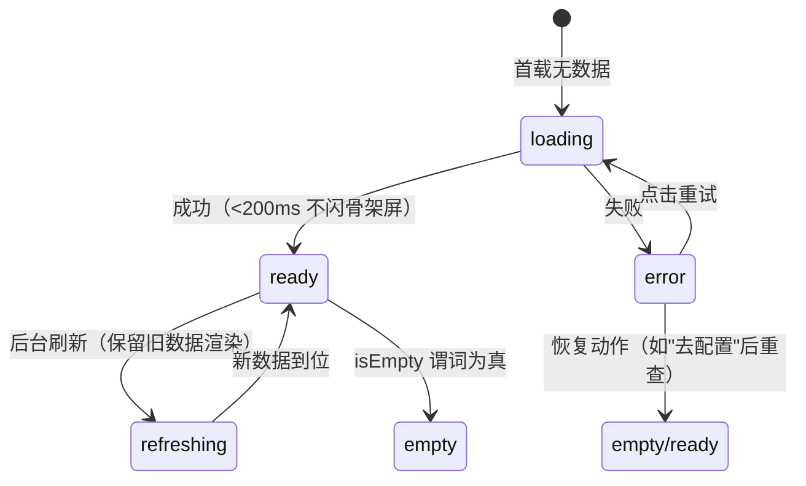
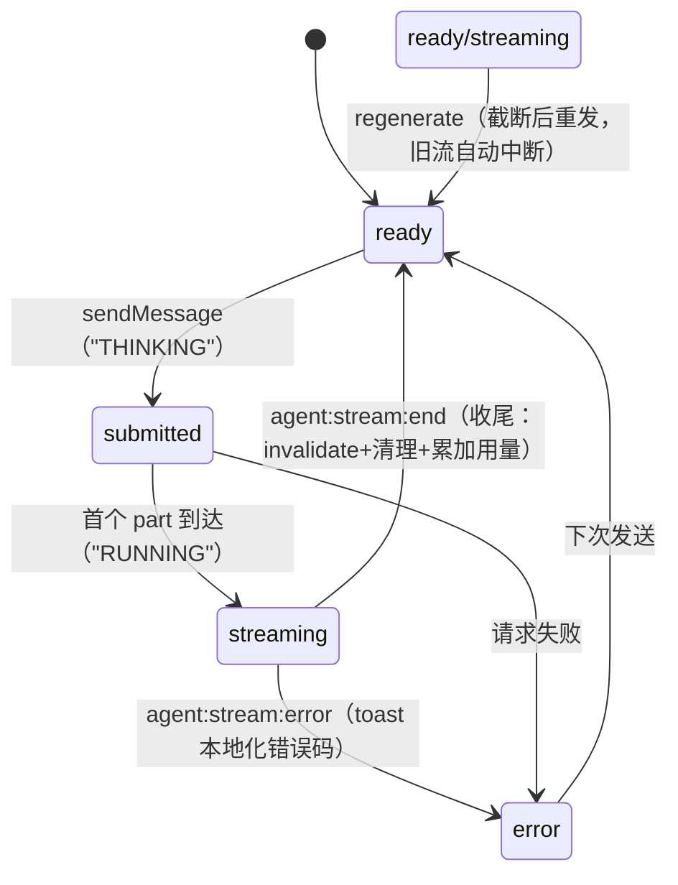
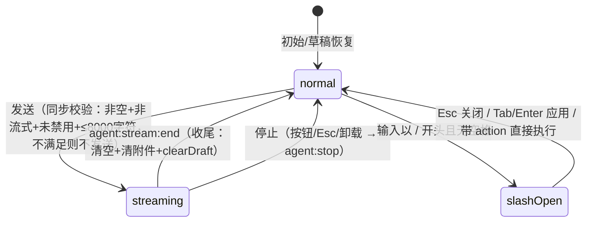
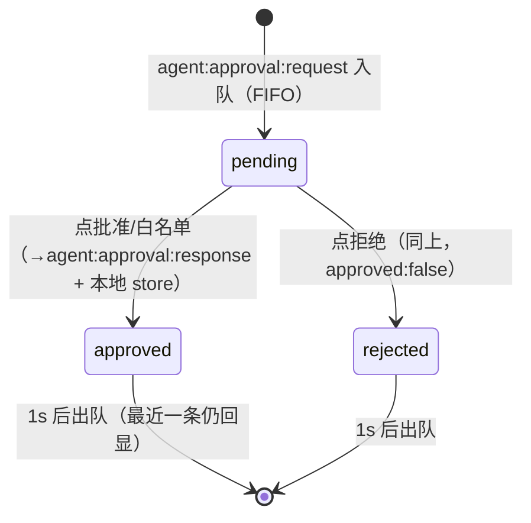
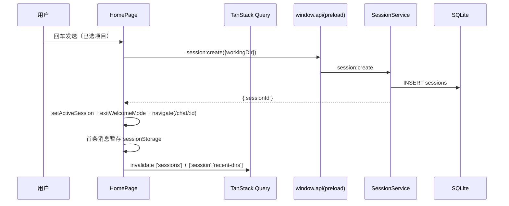
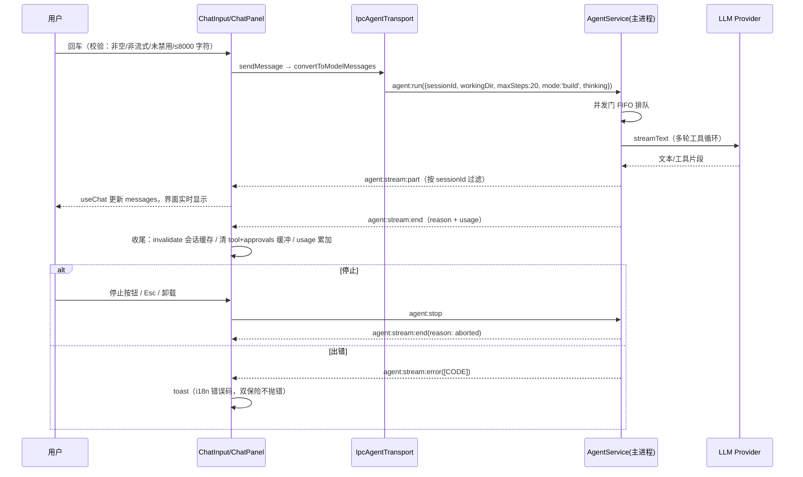
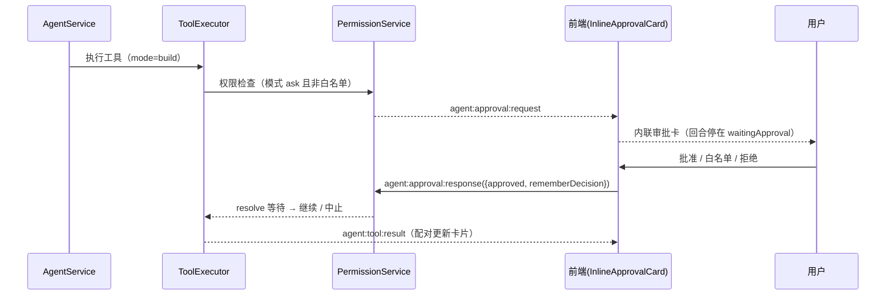
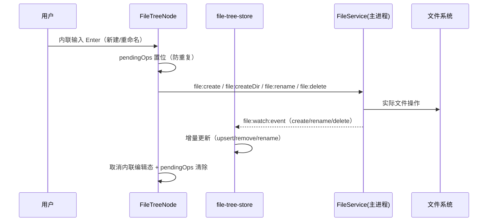
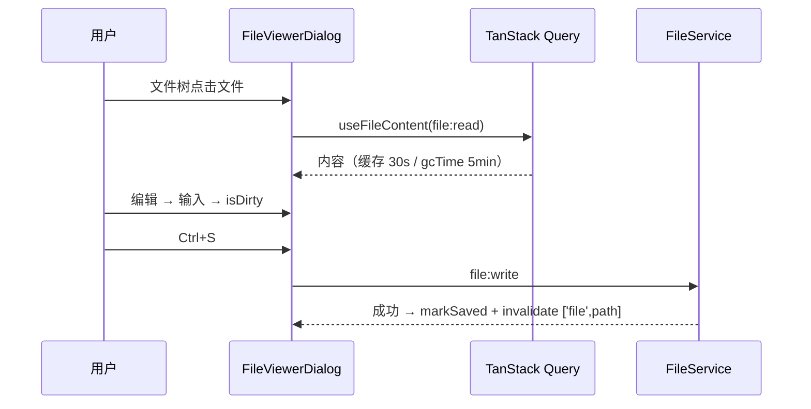
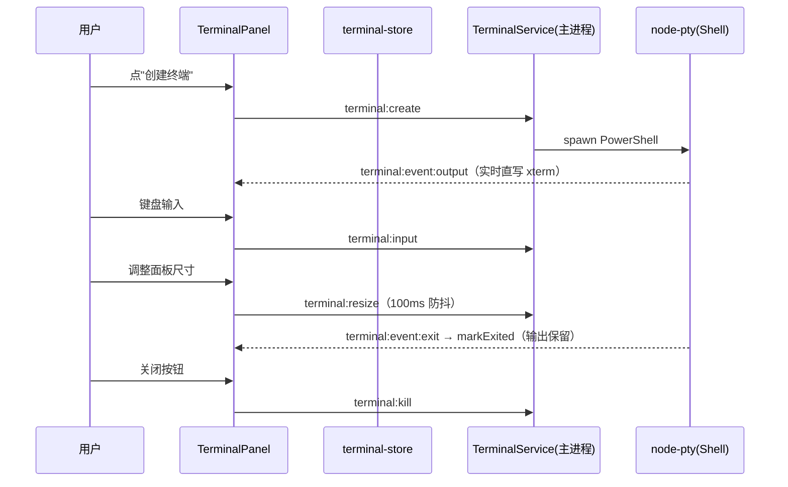

# 前端交互与数据链路规格说明（09）

> 依据 `src/renderer/` 全部代码、`src/main/ipc/` 的处理器、`packages/shared/src/ipc/meta.ts` 的通道定义逐文件核实整理。
> 整理时间：2026-08-10。
> 表达语言约定：页面布局用 **CSS** 的语言（grid 轨道、flex 方向、clamp 尺寸、class 切换、CSS 变量）；组件行为用**状态机**的语言（状态 / 事件 / 转换 / 副作用）；交互流程用**时序图**（Mermaid sequenceDiagram）；数据链路用**数据流**（来源 → 通道 → 服务 → 存储）。所有条目均对应实际代码；不存在的功能标注"占位 / 部分实现 / 不适用"，不编造。

## 0. 文档定位说明

### 0.1 这份文档和现有设计文档的分工

04 号"接口设计文档"讲 IPC 接口契约（有哪些通道、参数长什么样）；05 号"功能设计文档"讲需求与设计意图（每个功能想做什么）；03 号"目录结构"讲代码放哪。这份 09 号文档讲的是"实际是怎么跑的"：从渲染层代码出发，用 CSS 描述每个页面的空间结构，用状态机描述每个组件的时序行为，用时序图描述每个功能的完整调用链，用数据流描述每类数据的来路与去处。凡与 05 号文档冲突之处，以本文（即代码）为准并显式标注。

### 0.2 候选文件名

当前文件名 `09-ux-interaction-spec.md`；备选 `09-frontend-interaction-dataflow.md`、`09-frontend-system-manual.md`，最终由你确认。旧 `08-ux-guidelines.md` 未处理，去留待你确认。

### 0.3 阅读前需要知道的几个约定

状态组织分四层：L1 组件内 useState；L2 Zustand 全局仓库（persistent/ 存 localStorage 重启保留：设置、草稿、激活会话、侧栏偏好；transient/ 仅本次运行：文件树、工具记录、审批队列、终端元数据、用量等）；L3 TanStack Query 管理"请求一次拿结果"的数据（缓存、失效、重试）；L4 主进程推送事件 → 订阅 → 直写 L2 仓库。

跨进程数据走 preload 暴露的 window.api，落到 IPC 通道上，通道名在 `packages/shared/src/ipc/meta.ts` 定义，共 25 域，命名规则"域:动作"（请求-响应）、"域:stream:事件"（流式推送）、"域:event:名称"（状态事件）。主进程服务由 `src/main/service-container.ts` 统一持有，退出按依赖反序清理。所有 IPC 返回统一"成功带数据 / 失败带 [错误码] 消息"二选一结构。

## 一、页面布局（用 CSS 的语言）

这一章用 CSS 的术语描述每个界面的空间结构：栅格怎么定义、列宽来自哪个变量、折叠靠哪个 class、断点怎么触发、浮层在第几档。

### 1.1 整体框架（AppShell）

```
┌──────────────── topbar（--topbar-h: 52px）──────────────────┐
├─────────┬───┬───────────────────────┬───┬─────────────────┤
│ sidebar │ R │  main（.thread-bg）   │ R │  right-panel    │
│         │6px│                       │6px│                 │
└─────────┴───┴───────────────────────┴───┴─────────────────┘
   R = .resizer（宽 --resizer-w: 6px，可拖拽，tabIndex=0）
```

**两行栅格**：`.app` 是 `display: grid`，两行由 `grid-template-rows: var(--topbar-h) 1fr` 构成，顶部栏固定 52px，主体占满剩余高度。

**五列栅格**：`.view-chat` 是 `grid-template-columns: var(--aurora-sidebar-w) var(--resizer-w) 1fr var(--resizer-w) var(--aurora-right-panel-w)`——侧栏、左分隔线、主区（1fr 弹性占满）、右分隔线、右面板。其中两个宽度变量是布局的动态入口：

- 初始值在 `globals.css` 的 `:root` 里用 `clamp()` 定义：`--sidebar-w: clamp(200px, 17vw, 280px)`、`--right-panel-w: clamp(260px, 22vw, 360px)`，即默认随窗口比例浮动、带上下限；
- 用户拖拽分隔线后，AppShell 的 JS 把拖拽结果通过 `root.style.setProperty('--aurora-sidebar-w', ...)` 直接覆盖这两个变量，栅格列宽立即跟随；拖拽钳位范围来自 `layout-utils.ts` 的常量（侧栏 200-400px、右面板 260-360px）。所以"CSS 管默认、JS 管覆盖"。

**轨道稳定性关键**：主区容器 `.thread-bg` 显式声明了 `grid-column: 3`，强制它永远占据第 3 列轨道。这是历史教训——侧栏和分隔线折叠时是 `display: none`，不占 grid 轨道，如果 main 依赖自动放置会被挤到第 1 列导致主区宽度塌成 0px（800×600 双折叠态实测崩溃点），显式指定列号后双折叠态主区宽度恢复正常。

**折叠态**：折叠不删元素，而是加 class。`.sb-collapsed` / `.crp-collapsed` 时对应宽度变量被 JS 置为 `0px`（AppShell 的 effect 里随折叠状态重写变量），列塌缩为 0，同时分隔线元素条件渲染消失。class 的切换由 React 状态（sidebarCollapsed / rightPanelCollapsed）驱动。

**断点联动**：`useLayoutBreakpoint` 用 `matchMedia('(max-width: 1200px)')` 和 `(max-width: 900px)` 两档监听，结果进入 React 状态再触发上述折叠 class；用户手动操作过某面板后（manualRef 置位），断点不再覆盖。

**拖拽样式**：拖拽期间 body 加 `.resizing` 类（CSS 里禁用文本选中、显示拖拽光标）；被拖的分隔线加 `.dragging` 类高亮。分隔线本身 `tabIndex=0` 可聚焦，带 `aria-valuenow/min/max` 滑块语义。

**玻璃与层级**：顶部栏 `.topbar` 用 `backdrop-filter: blur(16px) saturate(1.4)` 玻璃模糊，底部一条双 accent 渐变发光细线。浮层 z-index 全部走变量档位，从低到高：`--z-dropdown: 50`、`--z-context-menu: 100`、`--z-modal-backdrop: 1000`、`--z-drawer: 1500`、`--z-modal: 2000`、`--z-toast: 10000`、`--z-overlay: 15000`（命令面板、设置 Sheet）、`--z-toast-stack: 20000`、`--z-boundary: 30000`（错误边界全屏）。新浮层必须复用档位。

**窗口控件避让**：设置全屏页头部右侧有一段 `width: 140px` 的 `.app-region-drag` 透明区（`-webkit-app-region: drag`），让开系统关闭/最小化按钮。

### 1.2 欢迎页

```
┌ 主区（welcome-mode 下 .view-chat 重排：右面板列隐藏，主区 flex 居中）┐
│  .welcome-view：品牌 ⟨/⟩ Code with TRAE                             │
│  .composer（max-width: 720px，welcome-mode 下透明背景）              │
│    ├ .composer-box：输入框 + 拖拽手柄 + 工具栏                        │
│    └ .composer-project-bar：项目下拉 + 模型选择器                     │
│  .welcome-quick-actions：4 个快捷 pill（flex 横排）                   │
└──────────────────────────────────────────────────────────────────────┘
```

布局的核心是 class 切换：`.view-chat.welcome-mode` 时 CSS 重排——右面板列和右分隔线隐藏（对应变量置 0），主区从五列 grid 变为单列居中容器（flex + 居中），欢迎页三块内容（品牌、输入舱、快捷动作）垂直排列，输入舱 `max-width: 720px` 水平居中。进入欢迎模式由 welcome-store 的 isWelcomeMode 驱动，AppShell 据此切换 class。非欢迎模式（聊天页）下这三块默认 `display: none`。项目下拉 `.folder-dropdown-menu` 是绝对定位浮层（`position: absolute`，挂在 `.cpb-folder-group` 下，bottom 展开），无历史目录时显示 `.fdm-empty` 空态文本。

### 1.3 聊天主页面

```
┌ .thread-status-bar：flex 横排（项目名 flex-1 截断 / 搜索钮 / 状态点 / token）┐
├ 横条区（限流横幅 / 中断条 / 审批卡，条件渲染）                              ├
├ .conversation-search-bar（打开时渲染，flex 横排）                           ├
├ .messages（flex: 1 纵向占满，overflow-y: auto，独立滚动）                   ├
├ .composer（footer，顶部渐变 + padding）                                     ├
│   └ .composer-box（悬浮卡片：focus 时上浮 + 发光，transform/box-shadow）     │
├ .composer-project-bar：项目名(只读) + 模型选择器                             ├
└ .composer-stats-bar：状态 · 消息数 · Token                                   ┘
```

主容器是 flex 纵向布局（`flex flex-col h-full`），四个区块从上到下：状态条（固定高）、横条区（条件渲染）、消息区（`flex-1 min-h-0` 占满剩余、`overflow-y-auto` 滚动，`min-h-0` 是 flex 子项滚动的关键）、输入舱（`footer.composer`，其内部 `.composer-box` 是悬浮卡片——`position: relative`，聚焦时靠 `transform: translateY` 上浮 + 青色 `box-shadow` 发光）。字号由设置驱动：容器 `style={{ fontSize }}` 用行内样式设置根字号，内部全部用相对单位跟随。状态条内项目名 `flex-1 truncate`（超出省略），状态点用 `size-1.5 rounded-full bg-current` 圆点，流式时加 `animate-pulse-soft` 脉冲。消息列表内的"回到最新"按钮是 `position: absolute` 定位在滚动容器右下角，`.has-new` class 时显示红点；消息导航轨 `.msg-nav-rail` 是右侧 `position: fixed/absolute` 纵向点列，4 条以上消息才渲染。搜索高亮 `.search-highlight` 是消息行背景 class。输入框多行自动增高由 JS 改 `style.height`（CSS 决定渲染），拖拽手柄 `.composer-drag-handle` 是输入框顶部的 `hr`（`cursor: ns-resize`，hover 显示）。

### 1.4 设置全屏页

```
┌ Sheet 全屏（w-full h-full max-w-none）：头部 flex（返回/标题/140px 拖拽区）┐
├ 主体 grid：grid-template-columns: 160px 1fr（左导航 / 右内容）            ┤
│   左导航：分组标签（uppercase 小字）+ 条目按钮（w-full flex）              │
│   右内容：overflow-y-auto 滚动，每 pane 独立 SectionErrorBoundary         │
└───────────────────────────────────────────────────────────────────────────┘
```

设置页是 shadcn Sheet 的全屏形态（`w-full h-full max-w-none`），打开/关闭由 ui-store 的 settingsOpen 控制。主体是两列 grid：左导航固定 160px（`overflow-y-auto`，条目是 `w-full flex items-center gap` 按钮），右内容 `1fr` 滚动。导航激活态是纯 CSS 表达：条目按钮基础样式带 `border-l-2 border-l-transparent`（占位防跳动），激活时切到 `border-l-[color:var(--accent)]`（2px 青色竖条）+ `text-foreground font-medium`；导航容器 `role="tablist"`，方向键循环由 JS 处理。窗口控件避让：头部右侧 `.app-region-drag` 宽 140px。

### 1.5 右面板

```
┌ 标题栏：TabsList（w-full，各 TabsTrigger flex-1 均分，text-2xs，truncate）┐
├ 内容区（min-h-0 flex-1）：6 个 tab 条件渲染                               ┤
│   浏览器/终端：React.lazy + Suspense（fallback 居中"加载中…"）            │
│   开发者 tab 内再套一行子视图按钮（flex）+ 内容                            │
└───────────────────────────────────────────────────────────────────────────┘
```

右面板容器是 `flex flex-col border-l`，标题栏 TabsList 用 `w-full` 覆盖 shadcn 默认 `w-fit`，每个 TabsTrigger `flex-1` 均分宽度、`truncate` 防溢出——面板被拖窄时标签文字收缩不换行。内容区 `min-h-0 flex-1`，六个 tab 各自渲染；浏览器和终端是懒加载（xterm 约 200KB 只在切到时加载），Suspense fallback 是居中"加载中…"。开发者 tab 内部再一层 flex 横排子视图按钮（Git/日志/指标/检查器）+ 内容区。面板整体折叠由全局机制管（AppShell 的 crp-collapsed），DevPanel 内部不再放折叠按钮，只在右面板竖条上有一个 `crp-collapse-btn`。

### 1.6 文件树面板

```
┌ .sft-head：flex（返回按钮 / 标题 flex-1 / 刷新按钮）┐
├ .ft-toolbar：flex（新建文件 / 新建目录，tabIndex=-1）├
├ .file-tree（role="tree"，min-h-0 flex-1 overflow）   │
│   .ft-node：flex 行，depth 决定 padding-left 缩进     │
│   └ 内联编辑：输入框替换名称行（w-full）              │
└ 空态：.ft-empty-state（flex 居中列）                  ┘
```

文件树面板是侧栏视图（sidebarView === 'fileTree' 时替换会话列表），自身 `flex flex-col h-full`：头部（返回/标题/刷新）、工具栏（新建文件/新建目录按钮，`tabIndex=-1` 避免 Tab 干扰树导航）、树区（`role="tree"`，`min-h-0 flex-1` 滚动）。树节点 `.ft-node` 是 flex 行，缩进层级靠 `padding-left: depth * 缩进单位` 实现（depth 由 JS 传入）；目录行有展开箭头（CSS 旋转切换），文件行点击打开查看器。节点 hover 时"更多"按钮绝对定位显示（`.ft-node` 是 `position: relative` 承载）。内联新建/重命名是输入框直接替换名称行的布局（`w-full`），无弹层。空态（无激活会话）是 flex 居中列（图标 + 标题 + 描述），rootPath 未就绪时显示"加载中"。查看器内还有一个轻量只读导航 FileTreeNavigator（react-arborist 渲染），只做浏览。

### 1.7 文件查看器对话框

```
┌ Dialog（--z-modal 档）：头部 flex（面包屑 flex-1 / 行数 / 复制 / 编辑 / 关闭）┐
├ 主体：高亮层与输入层绝对定位叠加                                            ┤
│   .shiki-highlight（position: absolute，下层）                              │
│   textarea（position: relative，背景透明、文字透明、caret 不透明，上层）     │
└ 可选：左侧 FileTreeNavigator 只读导航                                        ┘
```

查看器是标准 shadcn Dialog（居中模态，z-modal 档）。核心布局技巧是编辑模式的"双层叠加"：一个绝对定位的 shiki 高亮层垫底，一个相对定位的 textarea 盖在上面——textarea 文字透明（`color: transparent`）但光标不透明，下层高亮透出，视觉上是高亮的可编辑文本，零新增重型编辑器依赖。头部面包屑 `flex-1 truncate`。关闭保护（脏数据）用 Dialog 的确认流程。

### 1.8 命令面板

```
┌ .palette-overlay（position: fixed; inset: 0; z-overlay 档；点击自身关闭）┐
│   .palette（居中卡片，flex 纵向）                                          │
│     .palette-input-wrap（flex：放大镜 + 输入框）                           │
│     .palette-results（CommandList，max-height 滚动，分组 heading）         │
│     .palette-foot（flex，kbd 提示）                                        │
└───────────────────────────────────────────────────────────────────────────┘
```

命令面板用 cmdk 渲染，覆盖层 `.palette-overlay` 是 `position: fixed` 全屏遮罩（z-overlay 档），点击遮罩自身（`e.target === e.currentTarget`）关闭；内部 `.palette` 是居中卡片。结果列表分组展示（操作/文件/会话），`CommandEmpty` 显示"无匹配结果"，底部 `.palette-foot` 一行 kbd 提示（↑↓ 导航 / ⏎ 选择 / esc 关闭）。命令数据上限：文件 50 条、会话 20 条。

### 1.9 快捷键帮助对话框

shadcn Dialog + 双列网格（`grid grid-cols-2 gap-x-6 gap-y-1`），每行是 kbd（等宽小按钮）+ 描述文字，共 11 条静态清单。注意其中 Ctrl+B / Ctrl+J 未实际绑定（见第六章）。

### 1.10 Agent 提问对话框

shadcn Dialog（z-modal 档）：问题文本 + 预置选项（单选/多选）+ 自由文本输入 + 确认/取消按钮。由 agent-ask-store 的提问状态控制开关；浏览器模式（无 window.api）下打开即关闭。

### 1.11 内联审批卡片

```
┌ .card（圆角卡片，mx-3 mt-2，border-l-4 色条）┐
│  色条：pending=amber-500 / approved=emerald-500 / rejected=red-500 │
│  头部：图标 + 类型名（flex-1 truncate）+ 状态徽章                    │
│  描述（pre-wrap）+ 结构化预览（mono 暗底）                           │
│  pending 时：三按钮 flex（拒绝 / 白名单 / 批准 ml-auto）             │
└──────────────────────────────────────────────────────────────────────┘
```

审批卡渲染在消息列表上方（ChatPanel 内），状态由左边 4px 色条（`border-l-4` + 颜色 class）表达，三态切换即 class 切换。危险工具（删文件/跑命令/装包）时批准按钮用红色实底（`bg-red-500`），普通工具用绿色（`bg-emerald-600`）。卡片 `role="alert"`。

### 1.12 全局浮层汇总

设置 Sheet（z-overlay）、命令面板（z-overlay）、文件查看器（z-modal）、提问对话框（z-modal）、快捷键帮助（z-modal）都挂载在 AppShell 根部，由各自状态控制；Toast 由 sonner 容器渲染（z-toast-stack 最高档），UpdateNotice 不渲染 DOM 只弹 Toast。

## 二、组件状态与事件（用状态机的语言）

格式约定：每个组件先一句话定义，然后按"状态：描述。事件 → 新状态，副作用"展开；核心组件附 Mermaid 状态图。

### 2.1 异步加载五态（全局约定）

所有 L3 查询渲染统一走 AsyncBoundary 五态机，配 use-async-view（discriminated union，TS 穷尽性检查强制全分支处理）。



状态说明：loading（首载，>200ms 才显示骨架屏防闪烁）；refreshing（保留旧数据 + 顶部细进度条，绝不闪骨架屏）；error（本地化文案 + 重试按钮；错误码命中 AI_API_KEY_MISSING / AI_API_KEY_INVALID 时额外显示"去配置"打开设置页）；empty（EmptyState，可带 CTA）；ready（正常渲染）。错误格式约定"[错误码] 描述"，解析失败回退原始消息。

### 2.2 应用外壳 AppShell

状态与事件：sidebarWidth / rightPanelWidth（数值）。事件：分隔线 mousedown → 全局 mousemove 实时更新 + body.resizing → mouseup 解除，钳位 [200,400] / [260,360]。事件：分隔线键盘操作 → 同钳位步进。

sidebarCollapsed / rightPanelCollapsed（布尔）。事件：顶栏按钮 / 右面板竖条按钮点击 → 取反 + manualRef 置位（此后断点不覆盖）。事件：断点变化（matchMedia <1200px / <900px）→ 仅未手动过的面板自动折叠。

draggingSide（left/right/null）。事件：拖拽中 → 对应分隔线加 .dragging。

isWelcomeMode（welcome-store）。事件：enterWelcomeMode / exitWelcomeMode → .view-chat 切 welcome-mode class（右面板列隐藏、主区居中）。

挂载期副作用（一次）：订阅审批/提问/工具/终端四类推送写入对应 store；订阅回合结束做统一收尾（invalidate 会话缓存、清工具与审批缓冲、累加用量）；绑定全局快捷键；执行协议版本校验（版本不一致 toast 提示重启）。

### 2.3 顶部栏

按钮状态：默认 / hover（`hover:bg-muted` 等 Tailwind 态）。事件：点击折叠侧栏 → 取反 sidebarCollapsed；点击返回（聊天页才渲染）→ navigate('/')，Alt+← 同效；点击命令面板胶囊 → openPalette；点击右面板开关 → 取反 rightPanelCollapsed；点击设置 → openSettings；点击主题 → 在 light↔dark 两态切换（注意：快捷键 Ctrl+Shift+T 是三态循环 light→dark→system，现状不一致）。

### 2.4 侧栏与会话列表

Sidebar 状态：activeTab（recent/archived，点击切换，archived 恒空）；searchKeyword（输入但不过滤，占位）；sidebarView（threads/fileTree，切换视图）。列表视图状态：useAsyncView 五态（loading 骨架 / error 重试 / empty 无 CTA 空态 / ready 列表）。

FolderLabel 状态：collapsed（persistent，点击箭头取反并持久化）；hover（显示组内新建 + 按钮）。

ThreadItem 状态：active（当前会话高亮，aria-current）；renaming（双击标题或菜单进入；事件：Enter/blur 提交 → session:rename 乐观更新，Esc 取消，空值/未变化直接退出）；isDeleting（删除中禁用操作）；isPinned（菜单置顶/取消置顶 → session:pin → invalidate）。拖拽：dnd-kit PointerSensor（移动 4px 激活），dragEnd → 同文件夹 arrayMove → 写 orderOverrides 持久化。

### 2.5 文件树

FileTreeNode 状态与事件：expanded（目录点击箭头取反，首次展开触发 file:list 拉子目录）；loading（子目录请求中占位）；pendingOps 含该路径（操作中禁用，防重复）；creatingEntry / renamingPath（内联输入框，Enter 确认 → IPC，Esc 取消，blur 提交，空值忽略）；selected（当前查看文件高亮）。外部事件：file:watch:event 推送 → store 增量 upsert/remove/rename（create/delete/rename 操作成功后不手动刷新，依赖 watch 同步）；watch 失效 → toast"文件监听已失效"提示刷新。

### 2.6 聊天面板

对话状态（useChat status 状态机）：



其他状态：interruptedDismissed（中断条关闭，会话内不再显示）；search（useConversationSearch：visible/query/currentMatch，联动滚动与高亮）；usage（回合结束累加，状态条展示，悬停看明细）；editorFontSize（设置变更 → 容器字号，消息区真实消费）。

### 2.7 输入框（ChatInput）



事件与转换明细：输入 → autoResize（1-8 行，240px 封顶，超出滚动）；chatId 变化 → 恢复新会话草稿（文本+附件，附件仅恢复仍存在的路径）；字符 >2000 → 计数警告色（aria-live）；拖拽手柄：pointerdown 拖拽（向上拉高，钳位 [40,460]，下限 = min(内容自然高度, 160)），双击重置自动高度，键盘 ↑↓ 20px 步进；附件：@ 按钮 → dialog:pickFiles 多选去重 → chip（可移除）→ 发送时 file:read 拼接（≤4000 字符，失败仅标注文件名不阻断）；流式期间 Esc：textarea 内 + window 级兜底监听均触发停止；草稿写入 draft-store（发送成功清除）。

### 2.8 消息列表

状态：isAtBottom（滚动回调计算，距底 ≤80px 视为在底部）→ 流式新内容自动跟随；翻上时 showScrollBtn（出现"回到最新"，新消息到达 hasNew 红点）→ 点击平滑滚底；searchActiveIndex ≥0 → scrollIntoView 居中 + .search-highlight；messages 空 → EmptyState；流式中 → StreamingFooter（三 accent 点弹跳 + 省略号）。事件：滚动（onScroll 更新底部判定）；消息变化（messages.length / isStreaming 变化触发跟随或 hasNew 标记）。性能：MessageItem memo 化，仅变化消息重渲染。

### 2.9 消息条目与各类卡片

MessageItem 角色态：user（右侧玻璃气泡，仅文本）/ assistant（左侧：C 头像 + 角色行"助手 · 模型名" + parts + hover 操作栏）/ system（居中淡灰）。MsgActions 事件：复制（clipboard）；重新生成（流式中禁用）→ regenerate。PartView 按 part 类型分发：text → Markdown（GFM + shiki 双主题）；reasoning → ReasoningBlock（折叠态：默认跟随 experimental.reasoningCollapsed，用户显式开合后按 messageId 记 override 优先，点击头切换）；tool → ToolCallView（open 折叠态，点击头展开；标题优先 tool-store 的人类可读标题，回退工具名；状态徽章 pending/running/success/error 映射自 AI SDK state）；edit_file/write_file → FileChangeCard（折叠态，展开显示路径 + 类型徽章 created/modified + 行级 diff）；file → 📎 附件卡；step-start → 分隔线；未知 → 灰字提示。

### 2.10 审批卡片



审批模式（ask/auto-approve/deny）在设置页切换，走 settings:setApprovalMode，失败回滚；模式非 ask 时主进程直接处理，前端收不到请求。白名单按钮 = 批准 + rememberDecision:true（主进程写白名单偏好，同类型后续自动放行）。

### 2.11 提问对话框

状态：open（agent-ask-store，agent:event:ask 推送打开）/ closed。事件：确认 → 选项+文本经 agent:ask:respond 回传 → 关闭；取消 → 回传空回答 → 关闭；浏览器模式 → 打开即关闭。

### 2.12 会话内搜索条

状态：visible（开关）/ query / totalMatches / currentMatch。事件：输入 → search() 即时匹配；↑↓ / Enter / Shift+Enter → navigate() 循环；关闭 → close() 清高亮。匹配逻辑是消息级纯函数（可单测），不发请求。

### 2.13 限流横幅

状态：visible（触发即显示）/ hidden。事件：回合失败且错误码 429 → rate-limit-store 记录触发时间 → 横幅显示；5 分钟过期自动隐藏（isRateLimitExpired 判定）；手动 × 关闭。

### 2.14 模型选择器

状态：query（models:list，L3，缓存复用）/ 选择值。事件：提供商下拉选择（仅显示已配 API Key 的提供商，实事求是）→ updateAi(defaultProvider)；模型下拉选择 → updateAi(defaultModel)。浏览器模式 → 空列表不崩溃。

### 2.15 命令面板

状态：open（ui-store.paletteOpen 多入口集中控制）/ closed；query（输入过滤）。事件：键盘 ↑↓ 选择 / Enter 执行 / Esc 关闭；点击遮罩关闭；条目 select → 执行动作 + 关闭。动作清单：新建会话（清激活 + 进欢迎页）、切换主题、打开设置、切换侧栏视图、打开文件（查看器）、切换会话。

### 2.16 设置页各项

模型服务分区：ProviderRow 状态 expanded（整行点击取反）/ showPlain（密码显示切换）/ isConfigured（已配置徽章）/ isSaving / isDeleting（进行中禁用）；事件：保存 → settings:setApiKey → invalidate ['api-key',provider]；删除 → settings:deleteApiKey。运行时模型：adding / removingId 状态，事件：添加 → settings:addRuntimeModel（校验 id 非空）→ 重新拉取；删除 → settings:removeRuntimeModel。模型参数：defaultModel 文本输入、temperature 三档（0.3/0.7/1.0）、thinking 四档（off/low/medium/high，透传 agent:run 覆盖模型默认），全部直接写 settings-store。

通用分区：语言（点击切换 changeLanguage 立即生效 + 持久化 code-agent:lang）；字号（12/14/16，真实消费）；vim（仅存储，无行为，标注后续）；快捷键（ShortcutPicker 录制 6 项，写入持久化，v3 迁移：Windows Meta→Ctrl）；系统提示词（编辑/保存，空串回退内置默认）；数据（导出 → session:exportAll 主进程弹保存框；打开数据目录 → app:openDataDir）；遥测（settings:setTelemetryLevel，提示重启生效）。

MCP 分区：server 列表 + 添加表单 + 启动/停止（mcp:list/start/stop，成功 invalidate）。技能分区：全部/已学列表 + learn（异步生成）+ removeLearned。规则记忆：memory:list（按激活会话）/ memory:clear。用量分区：四卡 + 90 天热力图（5 级色档按日最大值分位，hover 显示日期/token）+ 模型占比条 + 回合记录。工作树：只读展示根目录与展开数。关于：app:getInfo + 打开数据目录。账号/移动端（含 IM 渠道真功能）/插件/hooks/命令：占位页。

### 2.17 文件查看器

状态：open/filePath（file-viewer-store）/ editMode / isDirty / originalContent / editedContent / loading / error。事件：打开 → useFileContent(file:read，缓存 30s/gcTime 5min)；点编辑 → 进入编辑；输入 → isDirty；Ctrl+S / 保存按钮 → file:write（成功 invalidate ['file',path] + markSaved；失败保留编辑内容）；关闭 → isDirty 先确认；路径变化 → 自动重查。编辑内容缓存在 store，卸载不丢。

### 2.18 右面板各页

DevPanel：activeTab / devSubTab（本地状态），切到懒加载 tab 显示 Suspense 占位。GitPanel：status query + selectedFilePath + diff query（enabled=选中才发）；事件：刷新 refetch；文件行点击 → 查 diff。TerminalPanel：无实例（"创建终端"按钮）/ 运行中（输出直写 xterm）/ exited（保留输出 + "已结束"）；事件：创建 → terminal:create；输入 → terminal:input；resize（ResizeObserver 100ms 防抖）→ terminal:resize；关闭 → terminal:kill；exit 推送 → markExited。LogsPanel：级别过滤 + 行数（100/200/500）+ 手动刷新（logs:read 不缓存）。MetricsPanel：system:getStatus，10s refetchInterval，enabled=面板可见。InspectorPanel：停靠模式 + devtools:open + toast 反馈（3s 清除）。BrowserPane：地址 + 设备预设（responsive/desktop/tablet/mobile）+ 后退前进刷新。

### 2.19 三层错误边界

AppErrorBoundary：捕获任意未捕获错误 → 全屏（icon + 消息）；事件：重新加载（location.reload）/ 发送报告（Sentry 显式补报）；自动上报带组件栈。RootErrorBoundary：路由错误 → 状态码/消息 + 重新加载。SectionErrorBoundary：区块（侧栏/主区/右面板/设置 pane）→ 内联错误 + 重试。

### 2.20 更新提示

状态：available / downloaded / not-updated / error（update:event:status 推送驱动）。事件：发现新版本 → toast；下载完成 → toast + "重启安装" → update:install；已最新 → toast；错误 → toast。同一阶段防抖不重复弹；下载进度不弹（太频繁）。

## 三、交互流程（用时序图）

格式：每条流程一张 Mermaid 时序图 + 文字说明边界情况。参与者统一：用户 / 组件（前端）/ L2-L3 状态层 / preload IPC / 主进程服务 / 存储（SQLite/文件/外部进程/LLM）。

### 3.1 新建会话

入口：侧栏按钮 / 文件夹加号 / Ctrl+N / 命令面板。点击 → 清激活会话 + enterWelcomeMode（自动带最近目录）+ 跳转 `/`。



边界：未选项目 → toast"请选择项目" + 自动展开项目下拉，不发请求；创建中 isPending 禁用发送与 pill（防重复提交）；创建失败 → toast + 留在欢迎页可重试；URL 直访不存在的会话 → 重定向首页。

### 3.2 发送消息、流式输出、停止、重新生成



重新生成：MsgActions → regenerate({messageId}) → 截断该消息及后续 → 重新发起 agent:run（旧流主进程自动中断）。

### 3.3 工具调用与审批



执行前推送 agent:tool:call（入参/权限级别），结果推送 agent:tool:result（输出或错误），前端按 toolCallId 配对。工具调用/结果另有独立事件写 tool-store，供右面板文件变更与引用文件使用。边界：单会话多审批 FIFO；危险工具批准按钮红色；auto-approve/deny 模式主进程直接处理不打扰；plan 模式写工具被直接拒绝。

### 3.4 会话管理

切换：点击项 → setActiveSession + navigate → ChatPage → useSessionDetail（session:get，enabled=id≠null）。

重命名：双击/菜单 → 内联输入 → 提交 → session:rename（乐观更新 + 失败回滚 + onSettled invalidate）。

置顶：菜单 → session:pin → invalidate（置顶排序在前）。

删除：菜单 → session:delete（乐观移除 + 失败回滚 + invalidate）；删激活会话 → clearActiveSession + navigate('/')。

拖拽：ti-dot 拖拽 → dragEnd → 同文件夹 arrayMove → orderOverrides（localStorage）。

边界：isDeleting 禁用操作；空列表 EmptyState（无 CTA）；列表 50 条分页。

### 3.5 文件树操作



加载链路：挂载 → file:list 列根 + file:watch:start；展开目录 → 按需 file:list；卸载 → file:watch:stop。边界：失败 toast（createFileFailed 等）；Esc 不落盘；watch 失效 toast 提示刷新；刷新按钮 = file:list 重拉根目录兜底。

### 3.6 文件查看器编辑与保存



边界：读取失败 → error 态可重试；写入失败 → toast + 保留编辑内容；关闭时 isDirty → 确认（丢弃/取消）；路径变化自动重查。

### 3.7 终端生命周期



边界：每会话一个 PTY 实例，切换会话自动切换；应用退出主进程统一 kill 全部 PTY；输出不经 store 中转（性能），store 仅保留环形截断缓冲兜底恢复。

### 3.8 Git 查看

GitPanel 挂载 → git:status（stale 10s）→ 文件行点击 → git:diff（enabled=选中，不缓存）→ 解析 unified diff → 双栏渲染。刷新按钮 refetch。边界：非 git 仓库 → ErrorHint；干净 → CleanHint；只读无写操作。

### 3.9 命令面板执行

打开（Ctrl+P / 胶囊 / Shift+/）→ ui-store.paletteOpen → cmdk 渲染 → 输入过滤（fuse threshold 0.4）→ 选择执行 → 动作 + 关闭。文件命令 ≤50、会话命令 ≤20。

### 3.10 会话内搜索

状态条 🔍 → 搜索条显示 → 输入 → 消息级匹配 → ↑↓ 循环 → 目标消息 scrollIntoView 居中 + 高亮 → 关闭清高亮。全前端本地，无 IPC。

### 3.11 设置修改

各类写入链路与失败处理：API Key → settings:setApiKey → keychain（DPAPI）→ invalidate（失败 toast 保留输入）；审批模式 → settings:setApprovalMode → 偏好文件 → PermissionService 同步（失败回滚）；白名单 → whitelist:add/remove；运行时模型 → settings:addRuntimeModel/removeRuntimeModel → SQLite runtime_models（启动加载进 ModelRegistry）；遥测 → settings:setTelemetryLevel（重启生效提示）；语言/快捷键/主题/提示词 → 前端本地持久化；MCP → mcp:start/stop（失败错误显示在 server 行）；技能 → skill:learn 异步生成（进行中状态）。

### 3.12 边界情况总表

空态（各场景 EmptyState，侧栏空态无 CTA）；请求失败（五态 error + 重试 + 恢复动作）；首载 200ms 防闪烁、刷新保留旧数据；防重复提交（创建/保存/API Key/文件操作进行中禁用）；长度限制（消息 8000 拦截、附件 4000 截断、工具 JSON 200 截断、重命名空值忽略）；脏数据保护（查看器关闭确认）；Esc 统一（中断生成/关建议/关浮层）；浏览器模式守卫（window.api 未定义 → 空数据/静默跳过不崩溃）；协议版本错配（toast 提示重启）；崩溃恢复（启动标记 interrupted → 聊天页提示条）；限流（429 → 横幅 5 分钟）；列表防膨胀（命令面板 50/20、侧栏 50 分页）。

## 四、数据链路

这一章用数据流的写法：每类数据"从哪来 → 经哪个通道 → 到哪个服务 → 存到哪里"，以及缓存、失效、重试策略。

### 4.1 链路总览

前端数据两个来源：主动请求（组件 → TanStack Query → window.api → IPC 通道 → 主进程 handler（zod 校验/traceId/错误分类/Sentry）→ Service → 存储/外部进程/LLM，结果原路返回）与被动推送（Service → webContents.send → IPC 事件 → 前端订阅 → 桥接 hook → L2 store → UI）。

主进程存储四类：SQLite（sessions / messages / token_usage / turns / runtime_models / goals / memories / tasks / skills / cron_tasks 等 11 张表）；系统加密存储 keychain（API Key，Windows DPAPI）；JSON 偏好文件（telemetry-pref / approval-pref / whitelist-pref）；外部进程（PTY / git / ripgrep / codegraph / MCP 子进程）与 LLM 网络。

### 4.2 会话数据

会话列表：Sidebar → useSessionsQuery（L3，['sessions']，stale 30s，limit 50）→ session:list → SessionService → SQLite sessions 表。渲染层只持 activeSessionId（L2 persistent），列表本体不落 localStorage（避免双份一致性问题）。会话详情：ChatPage → useSessionDetail（['session',id]，enabled=id≠null）→ session:get → sessions + messages 表。写操作：create/delete/rename/pin 各自通道，delete/rename 乐观更新 + 失败回滚 + onSettled invalidate；create 成功额外 invalidate 最近目录。最近目录：HomePage → session:listRecentDirs（limit 10）。用量：UsageSection → session:getUsageSummary（token_usage 聚合，前端按日聚合："近 30 天"取近 90 天数据前 30 项近似）。回合记录：TurnsSection → session:getRecentTurns（limit 10）。导出：DataSection → session:exportAll → 主进程弹保存框写 JSON。

### 4.3 AI 对话数据（核心链路）

发送：ChatInput → useAgentWithIpc（useChat + IpcAgentTransport，configure 注入 workingDir/systemPrompt/maxSteps/thinking）→ convertToModelMessages → agent:run（sessionId=chatId，maxSteps 默认 20，mode 默认 build）→ AgentService.startAgent → 并发门 FIFO → llmClient → streamText 多轮工具循环。推送：agent:stream:part（transport 按 sessionId 过滤 enqueue → useChat messages）/ agent:stream:end（收尾三件事）/ agent:stream:error（[CODE] → toast）。中断：agent:stop（按钮/Esc/卸载/流 cancel）。工具：agent:tool:call / agent:tool:result → useToolBridge → tool-store（toolCallId 配对）→ 消息卡片 + 右面板。审批：agent:approval:request → approvals-store → 内联卡；agent:approval:response 回传。提问：agent:event:ask / agent:ask:respond。回合状态机：agent:turn:event（订阅预留）。消息落库：主进程 AgentService 流式推送过程中写 sessions/messages 表（渲染层无需 onFinish 回调）。

### 4.4 文件数据

文件树：useFileTree（直接 IPC 入 store，不走 Query——与 watch 合并避免双份）→ file:list + file:watch:start/stop + file:watch:event（增量）。文件内容：useFileContent（L3，['file',path]，stale 30s / gcTime 5min）。写入：useFileWrite（mutation，成功 invalidate ['file',path]）。增删改：useFileTreeOps（file:create/createDir/delete/rename，pendingOps 防重，结果靠 watch 同步）。

### 4.5 终端数据

terminal:create（无实例时）→ TerminalService（node-pty）→ terminal:event:created/output（直写 xterm）/ terminal:event:exit（markExited）→ terminal:input / terminal:resize（100ms 防抖）/ terminal:kill。store 仅存元数据（会话↔终端映射、pid、退出态）+ 环形截断缓冲；xterm 实例组件 ref 持有（不进 store）。

### 4.6 Git 数据

git:status（L3，['git','status',path]，stale 10s）→ GitService（spawn git CLI）；git:diff（选中文件才启用，不缓存）。git:add/commit/push 定义表存在但渲染层零调用（不适用）。

### 4.7 设置数据

API Key：settings:getApiKey/setApiKey/deleteApiKey → keychain（DPAPI；查询 stale Infinity，显式变更才失效）。遥测：settings:getTelemetryLevel/setTelemetryLevel → telemetry-pref.json。审批模式：settings:getApprovalMode/setApprovalMode → approval-pref.json（启动时同步 PermissionService）。运行时模型：settings:addRuntimeModel/removeRuntimeModel/listRuntimeModels → SQLite runtime_models（启动 loadAll 注册 ModelRegistry）。白名单：whitelist:list/add/remove → whitelist-pref.json。本地持久化（localStorage）：主题/快捷键/编辑器/实验（createPersistentStore，code-agent: 前缀 + 版本迁移 + 失败降级内存）、草稿（draft-store）、侧栏偏好（sidebar-pref-store）、语言（code-agent:lang）。

### 4.8 其他数据

models:list → ModelRegistry + runtime_models（ModelSelector，仅已配 Key 提供商）；mcp:list/start/stop → MCPService（子进程 + ToolRegistry 增删）；skill:list/listLearned/learn/removeLearned → skills 表 + learn-skill-agent；memory:list/clear → memories 表；goal:list/clear/create → goals 表（GoalService 挂回合监听）；task:list → tasks 表；app:getStatus/getInfo/openExternal/openDataDir（getStatus 含协议版本校验）；system:getStatus（Metrics，stale 5s / refetch 10s / enabled 面板可见）；logs:read（不缓存，手动刷新）；devtools:open（三种停靠）；dialog:pickDirectory/pickFiles；update:check/install + update:event:status（打包版可用）；im:list/start/stop（渠道适配器，消息桥接 Agent 无头执行）；search:grep/glob、codebase:*、audio:*（定义存在，渲染层无 UI 调用方，不适用）；tool:list（白名单区块下拉）。

### 4.9 缓存、失效、重试策略

全局（query-client.ts）：staleTime 30s / gcTime 5min / refetchOnWindowFocus off / retry 1 / mutation retry 0。覆盖：git status stale 10s；system status stale 5s + refetchInterval 10s + enabled；logs stale 0；api-key stale Infinity；file 内容 stale 30s / gcTime 5min；session 详情 stale 30s。失效规则：delete/rename/pin → invalidate ['sessions']；create → + ['session','recent-dirs']；write → ['file',path]；apiKey → ['api-key',provider]；mcp 启停 → mcp:list；回合结束 → sessions + 详情。乐观更新：delete（本地移除）、rename（本地改标题），失败回滚，onSettled 重拉。

### 4.10 回合结束清理与崩溃恢复

回合结束（agent:stream:end）→ useAgentBridge 统一处理：invalidate sessions + 详情；tool-store / approvals-store clearBySession；usage-store addUsage（per-session Map）。崩溃恢复：启动检测 crash-marker → SessionService.markAllInterrupted → 渲染层聊天页提示条 → 清标记。应用退出：dispose 按反向依赖——LSP → ChatService（等流真正结束，3s 超时）→ AgentService → MCPService.stopAll → PermissionService（reject 全部 pending）→ FileService（关 watcher）→ SearchService（杀 ripgrep）→ TerminalService（kill PTY）→ Git/Codebase/Session（no-op）→ closeDb。

## 五、完整性与可信度（逐文件核对）

入口与路由六个：main.tsx（挂载根）；App.tsx（Provider 组装 + AppErrorBoundary）；router.tsx（RR8 Data Mode，首页/聊天页 lazy）；routes/root.tsx（根布局 + HydrateFallback + 路由错误边界）；routes/home.tsx（欢迎页，数据：session:listRecentDirs / dialog:pickDirectory）；routes/chat.tsx（聊天页守卫：loading / 不存在重定向 / workingDir 空报错）。全部已实现。

布局六个：AppShell.tsx（栅格/拖拽/折叠/断点/全局订阅/快捷键/协议校验/五个浮层挂载点）；Topbar.tsx；Sidebar.tsx；folder-label.tsx；thread-item.tsx；DevPanel.tsx。配套 layout-utils.ts（宽度常量 200-400 / 260-360 + 初始宽度计算）、sidebar-utils.ts（文件夹名提取）。全部已实现。

聊天域十一个：ChatPanel、ChatInput、ChatMessageList、message-item、message-actions、message-utils、streaming-footer、Markdown（shiki 双主题）、file-change-card、conversation-search-bar、rate-limit-banner。全部已实现。

审批域四个：inline-approval-card、ask-dialog、approval-preview（按类型结构化预览）、approval-utils（类型→图标/标签/危险判定）。全部已实现。

通用域九个：AppErrorBoundary、SectionErrorBoundary、AsyncBoundary（配 use-async-view）、CommandPalette（cmdk+fuse）、EmptyState、ModelSelector（models:list）、ShortcutHelpDialog（11 条静态清单）、UnifiedDiffView（parseUnifiedDiff + react-diff-viewer-continued 双栏）、UpdateNotice（纯事件消费）。全部已实现；快捷键帮助表 Ctrl+B/Ctrl+J 未绑定（已知不一致）。

文件域八个：FileTreePanel、FileTreeNode（递归）、FileTreeNavigator（react-arborist 只读）、inline-create-input、inline-rename-input、node-menu、FileViewerDialog（双层叠加编辑）、file-viewer-utils（语言推断）。全部已实现。

Git 域五个：GitPanel、file-list、file-diff-view、git-panel-parts、git-status-utils。只读已实现。

开发者域四个：browser-pane（iframe + 设备预设）、InspectorPanel（DevTools 三停靠）、LogsPanel（级别/行数/刷新）、MetricsPanel（10s 自动刷新）。全部已实现。

终端域：TerminalPanel（xterm + PTY 桥接）；loading-ui/terminal（加载动画）。

设置域二十三个：SettingsDialog + shortcut-picker + settings-controls（SegControl/SettingRow）+ sections 二十个（about/approval-mode/browser/data/editor/experimental/general/im-channels/mcp/model-params/models/placeholders/prompt/rules-memory/shortcuts/skills/telemetry/turns/usage/workspace）。已实现或如实占位。

hooks 二十二个：use-agent（transport 注入）、use-sessions（7 个 query/mutation）、use-git、use-file-tree、use-file-tree-ops、use-file-content、use-file-write、use-api-key、use-telemetry、use-update、use-system、use-protocol-check、use-layout-breakpoint、use-async-view、use-keyboard-shortcuts、use-conversation-search、use-agent-bridge、use-agent-ask-bridge、use-approval-bridge、use-approval-mode、use-tool-bridge、use-terminal-bridge。全部已实现。

stores 十六个：persistent（create-persistent-store 工厂 / settings / sessions / sidebar-pref / draft）+ transient（ui / welcome / file-tree / file-viewer / tool / approvals / agent-ask / rate-limit / reasoning-collapse / terminal / usage）。全部已实现。

providers 三个：I18nProvider、ThemeProvider（settings.theme → html.dark class + matchMedia）、QueryProvider。lib：ipc（unwrap）、error-actions（错误码→恢复动作注册表）、constants（路由/尺寸/draft id）、format-time、utils（cn）、theme-init（防闪烁）、agent/ipc-agent-transport（核心流式桥接）、query/query-client、motion（缓动/过渡/变体）、diff（unified diff 解析）。types 与 lib/chat 目录为空。ui 原子组件十三个：button/dialog/dropdown-menu/input/label/scroll-area/sheet/skeleton/sonner/switch/tabs/textarea/tooltip。i18n：zh-CN/en 双语言、common+errors 双命名空间、默认 zh-CN、语言存 code-agent:lang、全量打包。test：jsdom 基建 + window.api mock + msw 处理器。

## 六、交付摘要（占位 / 不适用清单）

占位（界面在、功能没做完）：侧栏搜索框只能输入不过滤；归档标签恒空；设置页账号/移动端（仅 IM 渠道真功能）/插件/hooks/命令分区"规划中"；斜杠命令 /models /compact /help 只弹提示；vim 开关只存无行为；浏览器设置分区为说明页。

不适用（诚实不提供）：退出登录/云端账户（无登录后端）；Git 写操作 UI（git:add/commit/push 零调用）；search/codebase/audio 域无渲染层 UI；独立审批对话框已移除（改内联卡）。

已知不一致：顶栏主题两态 vs 快捷键三态循环；快捷键帮助表 Ctrl+B/Ctrl+J 未绑定；DEFAULT_GIT_REPO_PATH 硬编码项目路径（配置化后续增强）。

以上即当前前端全部行为。如需针对某条流程补时序细节或某条链路补完整代码路径，可定点展开。
