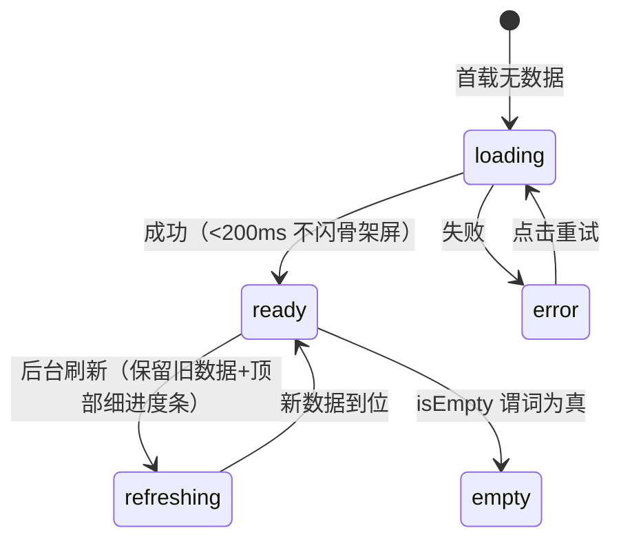
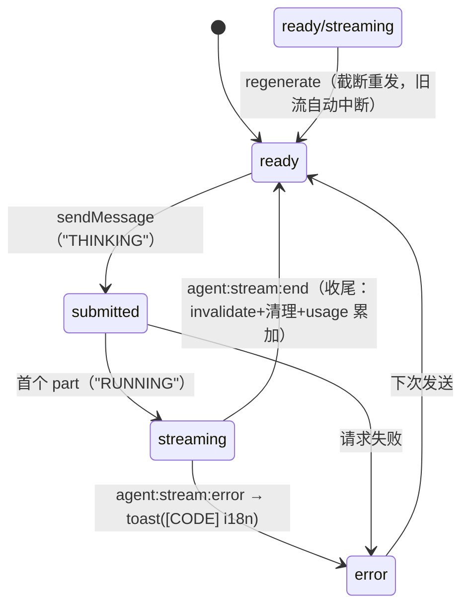
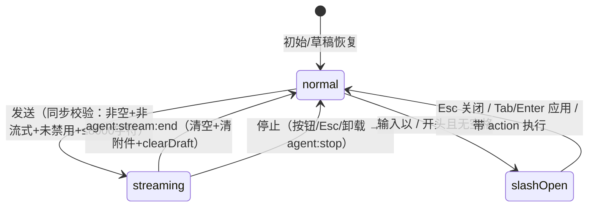
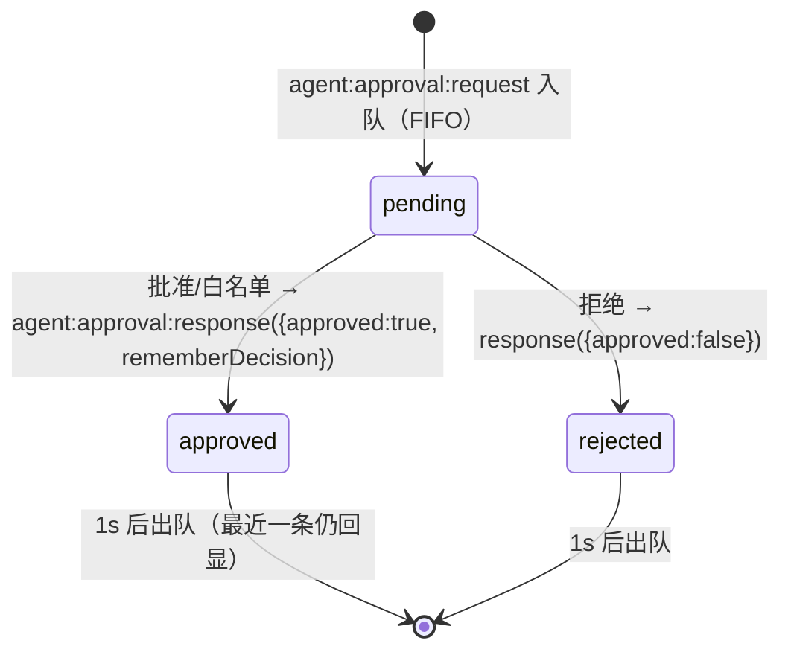
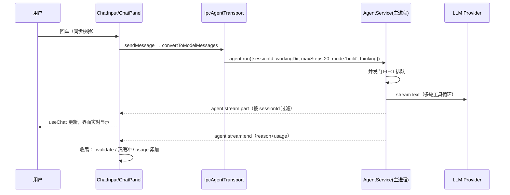

# 前端交互与数据链路速查手册（09）

> 面向开发人员：改前端之前先查这里。每个条目可溯源到实际代码，通道名与 `packages/shared/src/ipc/meta.ts`（25 域）一致。
> 整理时间：2026-08-10。诚实标注："占位 / 部分实现 / 不适用"对应代码真实状态。

## 0. 手册说明

读者是改这个前端代码的开发者，不是产品/设计。因此本手册按"查得到"组织：全局速查 → 布局速查 → 组件与交互速查 → 数据与存储速查 → 占位清单 → 文件索引。组件条目自带状态机与流程链路，不再分章重复。

与现有文档的分工：04 号讲 IPC 接口契约（通道和参数长什么样）；05 号讲功能设计意图；本手册讲渲染层实际实现（每个组件怎么工作、改哪里、数据怎么走）。与 05 冲突处以本手册（即代码）为准。

候选文件名：`09-ux-interaction-spec.md`（当前）/ `09-frontend-interaction-dataflow.md` / `09-frontend-system-manual.md`，最终由你确认。旧 `08-ux-guidelines.md` 未处理，去留待确认。

## 1. 全局速查

### 1.1 目录分层（src/renderer）

| 目录 | 内容 | 规则 |
|---|---|---|
| routes/ | 页面组件（home 欢迎页、chat 聊天页、root 布局） | 路由参数解析、数据准备、页面级守卫 |
| components/layout/ | 应用外壳、顶栏、侧栏、右面板 | AppShell 挂载全部全局浮层与事件订阅 |
| components/chat/ | 聊天域（面板/输入框/消息列表/搜索/限流） | — |
| components/agent/ | 审批卡、提问框、审批预览 | — |
| components/common/ | AsyncBoundary、命令面板、错误边界、空态等 | 跨域复用 |
| components/file-tree/ | 文件树面板/节点/查看器 | — |
| components/git/ dev/ terminal/ settings/ | 各自功能域 | settings/sections 下 20 个分区文件 |
| components/ui/ | shadcn 原子组件 13 个（button/dialog/sheet/tabs/switch…） | 无状态，props 解耦 |
| hooks/ | 22 个业务 hook（use-xxx，与 IPC/状态订阅解耦） | 不在组件内写 IPC |
| stores/ | persistent/ 5 个 + transient/ 11 个 | 见 1.2 |
| providers/ | I18nProvider / ThemeProvider / QueryProvider | 嵌套顺序：I18n→Theme→Query→Tooltip→Toaster |
| lib/ | ipc（unwrap）、error-actions、constants、query-client、agent/ipc-agent-transport、diff、motion | 纯工具；types/ 与 lib/chat/ 为空 |

### 1.2 状态分层（L1-L4）与判断标准

| 层 | 技术 | 放什么 | 判断标准 |
|---|---|---|---|
| L1 | useState/useRef | 组件内瞬态（折叠、编辑态、输入） | 组件独享 |
| L2 | Zustand | persistent/：settings、sessions（仅 activeSessionId）、sidebar-pref、draft；transient/：ui、welcome、file-tree、file-viewer、tool、approvals、agent-ask、rate-limit、reasoning-collapse、terminal、usage | IPC 推送（L4）→ 直写 transient；UI 交互态 |
| L3 | TanStack Query | IPC 请求-响应数据（会话列表/详情、git、文件内容、用量、api-key 等） | IPC invoke → L3 |
| L4 | IPC 事件订阅 | 主进程推送 → 桥接 hook → 写 L2 store | IPC on → L4 |

核心原则：服务端数据与客户端状态分离；列表类数据不落 localStorage（SQLite 是单一真源，避免双份一致性问题）。

### 1.3 IPC 通道速查表（25 域）

| 域 | 通道（meta.ts） | 前端消费方 | 主进程 | 存储/来源 |
|---|---|---|---|---|
| session | list / get / create / delete / rename / pin / listRecentDirs / exportAll / getUsageSummary / getRecentTurns | use-sessions、Sidebar、HomePage、Usage/TurnsSection | SessionService | SQLite sessions/messages/token_usage/turns |
| agent | run / stop / approvalResponse / respondAsk + 推送：stream:part/end/error、tool:call/result、approval:request、event:ask、turn:event | useAgentWithIpc（IpcAgentTransport）、各 bridge hook、审批卡、AskDialog | AgentService + ToolExecutor + PermissionService | LLM Provider + SQLite（消息落库） |
| chat | send / stop + 推送 stream:* | 无 UI 调用方（Agent 域替代，通道保留） | ChatService | LLM Provider |
| file | read / write / list / create / createDir / delete / rename / watch:start/stop + 推送 watch:event | useFileTree、useFileTreeOps、useFileContent、useFileWrite、FileViewer | FileService（chokidar） | 文件系统 |
| terminal | create / input / resize / kill + 推送 event:created/output/exit | TerminalPanel、useTerminalBridge | TerminalService（node-pty） | PTY 子进程 |
| git | status / diff / add / commit / push | GitPanel（仅 status/diff） | GitService（spawn git） | git CLI；add/commit/push 零调用（不适用） |
| settings | getApiKey / setApiKey / deleteApiKey / getTelemetryLevel / setTelemetryLevel / getApprovalMode / setApprovalMode / addRuntimeModel / removeRuntimeModel / listRuntimeModels | use-api-key、use-telemetry、use-approval-mode、ModelsSection | keychain / 偏好文件 / SQLite | DPAPI 加密、telemetry-pref.json、approval-pref.json、runtime_models 表 |
| whitelist | list / add / remove | ApprovalModeSection | PermissionService | whitelist-pref.json |
| models | list | ModelSelector | ModelRegistry + runtimeModelStore | 已配 Key 过滤 |
| mcp | list / start / stop | McpSection | MCPService | MCP 子进程 |
| skill | list / listLearned / learn / removeLearned | SkillsSection | learn-skill-agent | SQLite skills 表 |
| memory | list / clear | RulesMemorySection | MemoryService | SQLite memories 表 |
| goal | list / clear / create | InfoPane（list/clear） | GoalService（挂回合监听） | SQLite goals 表 |
| task | list | InfoPane | TaskService | SQLite tasks 表 |
| app | getStatus / getInfo / openExternal / openDataDir | useProtocolCheck、AboutSection、DataSection | app + 数据目录 | getStatus 含协议版本 |
| system | getStatus | MetricsPanel（use-system） | 主进程运行时 | 10s 轮询 |
| logs | read | LogsPanel | electron-log | main.log 尾部 |
| devtools | open | InspectorPanel | webContents.openDevTools | 三种停靠 |
| dialog | pickDirectory / pickFiles | HomePage、ChatInput | Electron dialog | 原生对话框 |
| update | check / install + 推送 event:status | useUpdate、UpdateNotice | UpdateService（electron-updater） | 打包版可用 |
| im | list / start / stop | ImChannelsSection | ImService + 渠道适配器 | 企微/钉钉/飞书等 |
| search | grep / glob | 无 UI 调用方（工具内部） | SearchService（ripgrep） | 不适用 |
| codebase | query / explore / node / callers / callees / impact | 无 UI 调用方（工具内部） | CodebaseService（codegraph） | 不适用 |
| audio | start / append / stop | 无 UI 调用方 | AudioService | 不适用 |
| tool | list | ApprovalModeSection 工具下拉 | ToolRegistry | — |

### 1.4 缓存与失效速查

全局默认（lib/query/query-client.ts）：staleTime 30s / gcTime 5min / refetchOnWindowFocus off / retry 1 / mutation retry 0。

覆盖项：git status stale 10s；system status stale 5s + refetchInterval 10s + enabled（面板可见才查）；logs stale 0（手动刷新）；api-key stale Infinity（显式变更才失效）；file 内容 stale 30s / gcTime 5min；session 详情 stale 30s。

失效规则：delete/rename/pin → invalidate `['sessions']`；create → 额外 invalidate 最近目录；file:write → invalidate `['file',path]`；apiKey → invalidate `['api-key',provider]`；mcp 启停 → invalidate mcp:list；回合结束 → invalidate sessions + 详情。

乐观更新：会话删除（本地移除）、重命名（本地改标题）——失败回滚 + onSettled 重拉。

### 1.5 错误约定

IPC 返回统一 `{ data } | { error: { code, message } }`；错误消息约定 `[CODE] 描述`。前端展示链：`unwrap`/分支判断 → 解析 `[CODE]` → i18n errors 命名空间 → toast/错误态；解析失败回退原始消息。错误恢复动作注册表（lib/error-actions.ts）：AI_API_KEY_MISSING / AI_API_KEY_INVALID → 打开设置页。所有 window.api 调用点有浏览器模式守卫（undefined 时返回空数据/静默跳过，预览不崩溃）。

## 2. 布局速查

### 2.1 全局栅格（AppShell + globals.css）

| 项 | 值 | 说明 |
|---|---|---|
| 栅格 | `.app` 两行（`--topbar-h` 52px + 1fr）；`.view-chat` 五列 `var(--aurora-sidebar-w) var(--resizer-w) 1fr var(--resizer-w) var(--aurora-right-panel-w)` | 主区 `.thread-bg` 显式 `grid-column: 3`（双折叠态崩溃教训：折叠元素 display:none 不占轨道，auto 放置会把 main 挤到第 1 列） |
| 列宽 | CSS 默认 `clamp(200px,17vw,280px)` / `clamp(260px,22vw,360px)`；JS 拖拽覆盖 CSS 变量 `--aurora-sidebar-w` / `--aurora-right-panel-w` | "CSS 管默认、JS 管覆盖"；拖拽钳位 layout-utils.ts：侧栏 [200,400]、右面板 [260,360] |
| 折叠 | `.sb-collapsed` / `.crp-collapsed` class → JS 把对应变量置 0px → 列塌缩；分隔线元素条件渲染消失 | 状态在 AppShell useState；按钮在 Topbar 与右面板竖条 `crp-collapse-btn` |
| 断点 | matchMedia：<1200px 折叠右面板（isCompact）、<900px 折叠侧栏（isNarrow） | 用户手动操作后（manualRef）断点不再覆盖 |
| z-index | `--z-dropdown:50 → context-menu:100 → modal-backdrop:1000 → drawer:1500 → modal:2000 → toast:10000 → overlay:15000（命令面板/设置）→ toast-stack:20000 → boundary:30000` | 新增浮层必须复用档位 |
| 窗口控件 | 设置页头部右侧 `.app-region-drag` 宽 140px 透明拖拽区 | 避让系统关闭/最小化 |

### 2.2 各界面布局要点

**欢迎页**（routes/home.tsx + `.view-chat.welcome-mode`）：welcome-mode class 触发 CSS 重排——右面板列隐藏、主区单列 flex 居中；结构：`.welcome-view` 品牌 + `.composer`（max-width 720px，透明背景）+ `.welcome-quick-actions` 4 个快捷 pill。项目下拉 `.folder-dropdown-menu` 绝对定位挂 `.cpb-folder-group`；无历史目录显示 `.fdm-empty`。非欢迎模式三块默认 display:none。

**聊天页**（routes/chat.tsx + ChatPanel.tsx）：flex 纵向四段——`.thread-status-bar`（固定高，项目名 flex-1 truncate）/ 横条区（限流横幅/中断条/审批卡，条件渲染）/ `.messages`（flex-1 min-h-0 + overflow-y-auto，min-h-0 是滚动关键）/ `footer.composer`（`.composer-box` 悬浮卡片，focus 上浮发光 transform+box-shadow）。字号由 `style={{fontSize}}` 容器级设置。`.scroll-to-bottom` absolute 定位右下角，`.has-new` 红点；`.msg-nav-rail` 右侧纵向点列（≥4 条消息渲染）。路由守卫：loading → 居中"加载中"；会话不存在 → 重定向 `/`；workingDir 空 → "会话加载异常"；进入时强制退出欢迎模式。

**设置全屏页**（SettingsDialog.tsx）：Sheet 全屏（w-full h-full max-w-none）；主体 `grid-template-columns: 160px 1fr`；左导航 tablist + 方向键循环，激活态 `border-l-2 border-l-[color:var(--accent)]` + text-foreground font-medium；右内容滚动，每 pane 独立 SectionErrorBoundary；打开时重置到"模型服务"分区。导航 5 组 15 项：账户与通用（账号占位/用量/通用/移动端占位+IM）/ 能力（模型服务/MCP/技能/插件占位/hooks占位/浏览器说明页/工作树）/ 智能与行为（命令占位/规则与记忆）/ 实验 / 关于。

**右面板**（DevPanel.tsx）：flex flex-col border-l；TabsList `w-full`（覆盖默认 w-fit）+ 每 TabsTrigger flex-1 均分 + truncate；6 tab（info/diff/files/browser/terminal/dev），浏览器与终端 React.lazy + Suspense（xterm ~200KB 懒加载）；dev tab 内再一行子视图（git/logs/metrics/inspector）。折叠由全局 crp-collapsed 管，面板内不放折叠按钮。

**文件树面板**（FileTreePanel.tsx，侧栏视图 sidebarView==='fileTree'）：flex flex-col——`.sft-head`（返回/标题/刷新）+ `.ft-toolbar`（新建文件/目录，tabIndex=-1）+ `.file-tree`（role="tree"，min-h-0 flex-1 滚动）；节点 `.ft-node` flex 行，缩进 `padding-left: depth*单位`；hover 显示"更多"菜单（`.ft-node` position:relative 承载）；内联新建/重命名 = 输入框替换名称行。空态：无激活会话 → "未选择项目"；rootPath 未就绪 → "加载中"。

**文件查看器**（FileViewerDialog.tsx）：shadcn Dialog（z-modal）；编辑模式核心技巧=双层叠加：绝对定位 shiki 高亮层垫底 + 相对定位 textarea 盖上层（文字透明、caret 不透明）；头部面包屑 flex-1 truncate + 行数 + 复制；脏数据关闭先确认。

**命令面板**（CommandPalette.tsx）：`.palette-overlay` fixed inset-0（z-overlay）+ 居中卡片；cmdk 渲染，CommandList 分组（操作/文件≤50/会话≤20），CommandEmpty 空结果，`.palette-foot` kbd 提示；点击遮罩自身关闭。

**快捷键帮助**（ShortcutHelpDialog.tsx）：Dialog + `grid grid-cols-2` 双列，11 条静态清单（含未绑定的 Ctrl+B/Ctrl+J，见第 5 节）。

**提问对话框**（ask-dialog.tsx）：Dialog（z-modal），问题文本 + 预置选项（单选/多选）+ 自由文本；浏览器模式打开即关。

**内联审批卡**（inline-approval-card.tsx）：圆角卡片，`border-l-4` 色条（pending amber / approved emerald / rejected red）；头部图标+类型名 flex-1 truncate+徽章；描述 pre-wrap + 结构化预览（mono 暗底）；pending 三按钮（拒绝/白名单/批准 ml-auto，危险工具批准红色）。

## 3. 组件与交互速查

格式：文件 / 职责 / 状态与事件（含转换与副作用）/ 关键链路 / 边界。核心状态机附图。

### 3.1 全局异步五态（AsyncBoundary + use-async-view）

loading：首载，>200ms 才显示骨架屏；refreshing：保留旧数据绝不闪屏；error：`[CODE]` 本地化 + 重试 + 可选恢复动作（"去配置"）；empty：EmptyState（侧栏空态无 CTA）；ready：正常渲染。

### 3.2 AppShell（components/layout/AppShell.tsx）

职责：外壳布局（栅格/拖拽/折叠/断点）+ 全局副作用挂载点。
状态与事件：sidebarWidth/rightPanelWidth（分隔线 mousedown→mousemove→mouseup，钳位见 2.1）；sidebarCollapsed/rightPanelCollapsed（按钮点击取反 + manualRef；断点自动折叠仅限未手动项）；draggingSide（拖拽中分隔线加 .dragging + body.resizing）；isWelcomeMode（welcome-store → class 切换）。
挂载期副作用：useApprovalBridge / useAgentAskBridge / useToolBridge / useAgentBridge（回合结束收尾：invalidate sessions+详情、clearBySession tool+approvals、usage 累加）/ useTerminalBridge / useProtocolCheck / useKeyboardShortcuts。浮层挂载：SettingsDialog、CommandPalette、FileViewerDialog、AskDialog、ShortcutHelpDialog、UpdateNotice。
边界：卸载清理拖拽监听；协议版本错配 toast 提示重启。

### 3.3 Topbar（Topbar.tsx）

职责：52px 玻璃顶栏。按钮：折叠侧栏（aria-expanded）/ 返回（仅聊天页，Alt+←）/ 命令面板胶囊（唯一入口）/ 右面板开关 / 设置 / 主题。主题按钮两态切换（light↔dark）；快捷键 Ctrl+Shift+T 是三态循环（light→dark→system）——已知不一致。品牌区显示 `v0.1.0 · main` 遥测带。

### 3.4 Sidebar 系（Sidebar / FolderLabel / ThreadItem）

职责：会话列表（按 workingDir basename 分组）+ 文件树视图切换 + 底部账户菜单。
状态与事件：activeTab（recent/archived，archived 恒空——占位）；searchKeyword（仅 UI 不过滤——占位）；sidebarView（threads/fileTree，命令面板与会话项文件夹按钮可切换）；列表五态（useAsyncView + useSessionsQuery，limit 50）。
FolderLabel：collapsed（点击箭头取反，persistent）；hover 显示组内新建（handleCreateInFolder 复用该文件夹 workingDir）。
ThreadItem：active（aria-current）；renaming（双击/菜单进入，Enter/blur 提交→session:rename 乐观更新，Esc 取消，空值/未变化退出）；isDeleting（禁用操作）；isPinned（菜单置顶→session:pin→invalidate）；拖拽（dnd-kit PointerSensor 4px 激活→同文件夹 arrayMove→orderOverrides persistent）。
会话操作菜单：置顶/重命名/删除；hover 文件夹树按钮（打开该会话文件树）。
边界：删除激活会话→clearActiveSession+navigate('/')；新建会话逻辑=clearActiveSession+enterWelcomeMode(复用最近 workingDir)+navigate('/')。

### 3.5 文件树（FileTreePanel / FileTreeNode / ops hooks）

职责：侧栏文件树视图 + 增删改 + 实时同步。
状态与事件：expanded（点击箭头，首次展开 file:list 拉子目录）；loading（子目录请求中）；pendingOps 含路径（操作中禁用防重复）；creatingEntry/renamingPath（内联输入，Enter→IPC，Esc 取消，blur 提交，空值忽略）；selected（高亮）。
数据链路：useFileTree——挂载 file:list + file:watch:start；file:watch:event 推送 → store 增量 upsert/remove/rename（操作成功后不手动刷新，依赖 watch，避免双份数据）；卸载 file:watch:stop；手动刷新=file:list 重拉根目录（watch 失效兜底）。
写操作（useFileTreeOps）：file:create / file:createDir / file:delete / file:rename，失败 toast（createFileFailed 等）。watch 失效 → toast"文件监听已失效"。

### 3.6 聊天面板（ChatPanel.tsx）

职责：对话容器（状态条/横条区/消息列表/输入舱/底条）。
对话状态机：

其他状态：interruptedDismissed（崩溃恢复提示条关闭，会话内不重复）；search（useConversationSearch，联动滚动+高亮）；usage（回合结束累加，状态条展示，悬停明细）；editorFontSize（设置字号→容器 fontSize，消息区真实消费）；statusText 映射 READY/RUNNING/THINKING/ERROR/IDLE。
错误处理双保险：解析 `[CODE]` → i18n；失败回退原始消息；onError 绝不抛错（防卡死 THINKING）。

### 3.7 输入框（ChatInput.tsx）

事件明细：输入→autoResize（1-8 行，240px 封顶）；chatId 变化→恢复新会话草稿（draft-store，附件仅恢复存在路径）；>2000 字符计数警告（aria-live）；拖拽手柄（向上拉高钳位 [40,460]，下限=min(内容自然高,160)，双击重置，键盘 ↑↓ 20px 步进）；附件（@→dialog:pickFiles 多选去重→chip→发送时 file:read 拼接 ≤4000 字符，失败仅标注文件名）；流式期间不禁用（可预输入）+ window 级 Esc 兜底；斜杠命令（/help /new /clear /compact /models，带 action 直接执行：/new 回欢迎页、/clear setMessages([])、其余 toast 引导——部分实现）。

### 3.8 消息列表与消息项（ChatMessageList / MessageItem）

列表：isAtBottom（距底 ≤80px）→ 流式自动跟随；翻上→scroll-to-bottom 出现，新消息 hasNew 红点；searchActiveIndex→scrollIntoView 居中+高亮；空→EmptyState；流式尾部 StreamingFooter（三 accent 点弹跳）。性能：MessageItem memo，仅变化消息重渲染；普通滚动渲染（已移除 Virtuoso，规避 React 19 空→非空更新 bug）。
消息项：user（右侧玻璃气泡，仅文本）/ assistant（C 头像+角色行"助手·模型名"+parts+hover 操作栏：复制/重新生成，流式中禁用）/ system（居中淡灰）。parts 分发：text→Markdown（GFM+shiki 双主题）；reasoning→ReasoningBlock（折叠态：默认跟随 experimental.reasoningCollapsed，显式开合按 messageId override 优先）；tool→ToolCallView（默认折叠；标题优先 tool-store 人类可读标题；徽章 pending/running/success/error 映射 AI SDK state；input/output/error 代码块 ≤200 字符）；edit_file/write_file→FileChangeCard（折叠，created/modified 徽章+行级 diff）；file→📎 卡；step-start→分隔线；未知→灰字。

### 3.9 审批（InlineApprovalCard + useApprovalBridge + approvals-store）

审批模式（ask/auto-approve/deny）：设置页 useApprovalMode（settings:get/setApprovalMode，失败回滚）→ approval-pref.json → 启动时同步 PermissionService；非 ask 模式主进程直接处理，前端收不到请求。危险工具（delete_file/run_command/install_package）批准按钮红色。工具链路：agent:tool:call（入参/权限级别）→ 执行 → agent:tool:result（配对 toolCallId 更新）；plan 模式写工具被直接拒绝。

### 3.10 AskDialog（ask-dialog.tsx）

open（agent-ask-store，agent:event:ask 推送）；确认→选项+文本经 agent:ask:respond 回传→关闭；取消→空回答→关闭；浏览器模式打开即关。

### 3.11 会话内搜索（use-conversation-search + ConversationSearchBar）

visible/query/totalMatches/currentMatch；输入即时匹配（消息级纯函数）；↑↓/Enter/Shift+Enter 循环；关闭清高亮。纯前端无 IPC。

### 3.12 限流横幅（rate-limit-banner.tsx）

回合失败且错误码 429 → rate-limit-store 记录触发时间 → 横幅显示；5 分钟自动消失（isRateLimitExpired）；手动 × 关闭。

### 3.13 模型选择器（ModelSelector.tsx）

models:list（L3，缓存复用）→ 提供商下拉仅显示已配 API Key 的（实事求是）；模型下拉 → updateAi(defaultModel)。浏览器模式空列表不崩溃。

### 3.14 命令面板（CommandPalette.tsx）

open（ui-store.paletteOpen 多入口：Ctrl+P/顶栏胶囊/Shift+/）；cmdk 键盘导航；fuse 模糊（threshold 0.4，keys title+section）；动作：新建会话/切主题/开设置/切侧栏视图/开文件（≤50）/切会话（≤20）；执行后关闭。Esc/遮罩关闭。

### 3.15 设置页 sections

模型服务：ProviderRow（expanded/showPlain/isConfigured/isSaving/isDeleting；保存→settings:setApiKey→invalidate；删除→deleteApiKey）；运行时模型（添加校验 id 非空→addRuntimeModel→重拉；删除→removeRuntimeModel）；模型参数（defaultModel 文本、temperature 0.3/0.7/1.0、thinking off/low/medium/high，直接写 settings-store，thinking 透传 agent:run）。
通用：语言（changeLanguage 立即生效+code-agent:lang）；字号 12/14/16（真实消费）；vim（仅存储无行为——部分实现）；快捷键（ShortcutPicker 录制 6 项，v3 迁移 Windows Meta→Ctrl）；系统提示词（编辑/保存，空串回退内置）；数据（session:exportAll 主进程弹保存框；app:openDataDir）；遥测（setTelemetryLevel，重启生效提示）。
MCP：mcp:list/start/stop，启停 invalidate，失败错误显示 server 行。技能：skill:list/listLearned/learn（异步生成）/removeLearned。规则记忆：memory:list（按激活会话）/memory:clear。用量：session:getUsageSummary（四卡+90 天热力图 5 级色档+模型占比+回合记录）。工作树：只读展示。关于：app:getInfo+openDataDir。占位分区：账号/移动端（含 IM 渠道真功能）/插件/hooks/命令。

### 3.16 文件查看器（FileViewerDialog.tsx）

open/filePath/editMode/isDirty/originalContent/editedContent（file-viewer-store，编辑内容卸载不丢）；打开→useFileContent（file:read，stale 30s/gcTime 5min，路径变化自动重查）；编辑→isDirty；Ctrl+S→file:write（成功 invalidate ['file',path]+markSaved；失败保留编辑内容）；关闭脏→确认。读取失败→error 态可重试。

### 3.17 右面板各页

DevPanel：activeTab/devSubTab（本地状态）；懒加载 Suspense。
GitPanel：git:status（stale 10s）+ 文件行点击→git:diff（enabled=选中，不缓存）→parseUnifiedDiff→双栏；刷新 refetch；非 git 仓库→ErrorHint；干净→CleanHint；纯只读。
TerminalPanel：无实例（创建按钮）/运行中/已退出（输出保留+"已结束"）；terminal:create→PTY→event:output 直写 xterm（不经 store）；terminal:input；resize（ResizeObserver 100ms 防抖）；kill；exit→markExited；每会话一实例，切会话自动切换。
LogsPanel：级别过滤+行数（100/200/500）+手动刷新（logs:read 不缓存）；行级着色。
MetricsPanel：system:getStatus，10s refetch，enabled=面板可见。
InspectorPanel：devtools:open（detach/right/bottom）+toast 反馈 3s 清除。
BrowserPane：地址+设备预设（responsive/desktop/tablet/mobile）+后退前进刷新。

### 3.18 错误边界三层

AppErrorBoundary（全屏+Sentry 自动上报+重新加载/发送报告）；RootErrorBoundary（路由错误+重新加载）；SectionErrorBoundary（侧栏/主区/右面板/设置 pane 局部降级+重试）。

### 3.19 UpdateNotice

update:event:status → toast（available/downloaded+重启安装→update:install/not-updated/error）；同阶段防抖；下载进度不弹；开发模式 check 返回明确错误。

### 3.20 核心端到端时序（发消息/审批/文件树）

审批与文件树时序见 3.9 / 3.5 的文字链路（审批：agent:approval:request → 内联卡 → agent:approval:response → PermissionService resolve → agent:tool:result；文件树：file:create → watch:event → store 增量）。

## 4. 数据与存储速查

### 4.1 SQLite（src/main/infra/storage/schema.ts，11 张表）

| 表 | 用途 | 写入方 |
|---|---|---|
| sessions | 会话（含 workingDir、标题、pinned、lastRunStatus） | SessionService（create/rename/pin/delete）；崩溃恢复 markAllInterrupted |
| messages | 会话消息历史 | AgentService 流式推送过程中落库（渲染层无 onFinish 回调） |
| token_usage | token 用量 | ChatService/AgentService 回合结束 |
| turns | 回合记录（终止原因+token） | Agent 回合层 |
| runtime_models | 用户自定义模型 | settings:addRuntimeModel；启动 loadAll → ModelRegistry |
| goals / tasks / memories / skills / cron_tasks | 目标/任务/记忆/技能/定时任务 | GoalService/TaskService/MemoryService/learn-skill-agent |

### 4.2 偏好文件与 keychain（.electron-user-data/）

keychain：API Key（safeStorage，Windows DPAPI）；telemetry-pref.json：遥测级别（重启生效）；approval-pref.json：审批模式（启动同步 PermissionService）；whitelist-pref.json：审批白名单。

### 4.3 渲染层 localStorage（createPersistentStore，`code-agent:` 前缀 + 版本迁移 + 失败降级内存）

settings（主题/AI/编辑器/快捷键/实验，v3）；sessions（仅 activeSessionId）；sidebar-pref（折叠文件夹/拖拽顺序）；draft（各会话草稿文本+附件路径）；lang（i18n 语言）。

### 4.4 回合结束清理与崩溃恢复

回合结束（agent:stream:end）→ useAgentBridge：invalidate sessions+详情；tool/approvals clearBySession；usage addUsage。崩溃恢复：启动 crash-marker → markAllInterrupted → 聊天页中断提示条 → 清标记。应用退出 dispose 顺序（反向依赖）：LSP → ChatService（等流结束 3s 超时）→ AgentService → MCP stopAll → PermissionService（reject 全部 pending）→ FileService watcher → SearchService → TerminalService（kill PTY）→ Git/Codebase/Session → closeDb。

## 5. 占位 / 不适用 / 已知不一致

**占位（界面在、功能没做完）**：侧栏搜索框（仅 UI 不过滤）；归档标签（恒空）；设置页账号/移动端（仅 IM 渠道真功能）/插件/hooks/命令分区（"🚧 规划中"）；斜杠命令 /models /compact /help（toast 引导）；vim 模式开关（只存无行为）；浏览器设置分区（说明页）。

**不适用（诚实不提供）**：退出登录/云端账户（无登录后端）；Git 写操作（git:add/commit/push 通道存在但零调用，面板只读）；search/codebase/audio 域无渲染层 UI（工具内部使用）；独立审批对话框（已移除，改内联卡）。

**已知不一致**：顶栏主题按钮两态（light↔dark）vs 快捷键三态循环（light→dark→system）；快捷键帮助表 Ctrl+B/Ctrl+J 未实际绑定；DEFAULT_GIT_REPO_PATH 硬编码 `f:\TraeProjects\1`（配置化后续增强）；chat:send 系列通道无 UI 调用方（Agent 域替代）。

## 6. 附录：文件索引

| 类别 | 文件 | 职责 | 数据源 |
|---|---|---|---|
| 入口路由 | main.tsx / App.tsx / router.tsx / routes/root.tsx / home.tsx / chat.tsx | 挂载/Provider 组装/路由（lazy）/根布局/欢迎页/聊天页守卫 | session:listRecentDirs、dialog:pickDirectory、session:get |
| 布局 | AppShell / Topbar / Sidebar / folder-label / thread-item / DevPanel（+layout-utils、sidebar-utils） | 栅格与折叠拖拽/顶栏/会话列表/文件夹标签/会话项/右面板 | 各桥接 hook、session:list |
| 聊天 | ChatPanel / ChatInput / ChatMessageList / message-item / message-actions / message-utils / streaming-footer / Markdown / file-change-card / conversation-search-bar / rate-limit-banner | 对话容器/输入舱/列表/消息行/操作栏/纯函数/流式尾部/Markdown+shiki/diff 卡/搜索条/限流横幅 | agent:*、file:read、draft-store、usage-store |
| 审批 | inline-approval-card / ask-dialog / approval-preview / approval-utils | 内联审批/提问框/结构化预览/类型映射 | agent:approval:*、agent:event:ask |
| 通用 | AppErrorBoundary / SectionErrorBoundary / AsyncBoundary / CommandPalette / EmptyState / ModelSelector / ShortcutHelpDialog / UnifiedDiffView / UpdateNotice | 三层错误边界/五态渲染/命令面板/空态/模型选择/快捷键帮助/diff 渲染/更新提示 | models:list、update:* |
| 文件 | FileTreePanel / FileTreeNode / FileTreeNavigator / inline-create-input / inline-rename-input / node-menu / FileViewerDialog / file-viewer-utils | 树面板/递归节点/只读导航/内联输入/菜单/查看器/纯函数 | file:list、file:watch:*、file:read/write |
| Git/Dev/终端 | GitPanel(+3 parts) / browser-pane / InspectorPanel / LogsPanel / MetricsPanel / TerminalPanel / loading-ui | 只读 Git/内嵌浏览器/DevTools/日志/指标/xterm 终端 | git:status/diff、logs:read、system:getStatus、devtools:open、terminal:* |
| 设置 | SettingsDialog + shortcut-picker + settings-controls + sections×20 | 设置全屏页 | settings:*、whitelist:*、mcp:*、skill:*、memory:*、im:*、session:exportAll/getUsageSummary、app:getInfo |
| hooks | 22 个（use-agent / use-sessions / use-git / use-file-tree / use-file-tree-ops / use-file-content / use-file-write / use-api-key / use-telemetry / use-update / use-system / use-protocol-check / use-layout-breakpoint / use-async-view / use-keyboard-shortcuts / use-conversation-search / use-agent-bridge / use-agent-ask-bridge / use-approval-bridge / use-approval-mode / use-tool-bridge / use-terminal-bridge） | 见 1.2 与各条目 | 对应 IPC 域 |
| stores | persistent×5（工厂/settings/sessions/sidebar-pref/draft）+ transient×11（ui/welcome/file-tree/file-viewer/tool/approvals/agent-ask/rate-limit/reasoning-collapse/terminal/usage） | 见 1.2 | L4 推送 + L3 派生 |
| providers/lib/i18n | I18nProvider / ThemeProvider / QueryProvider；ipc / error-actions / constants / format-time / utils / theme-init / agent/ipc-agent-transport / query-client / motion / diff；i18n（zh-CN+en，common+errors） | 主题/查询/文案/桥接 | — |

基础 UI 组件（components/ui 13 个）：button / dialog / dropdown-menu / input / label / scroll-area / sheet / skeleton / sonner / switch / tabs / textarea / tooltip。types/ 与 lib/chat/ 目录为空。
