# 前端开发实现指南（09）

> 给开发人员看的完整实现指南：用图表讲清楚 架构 → 设计体系 → 布局 → 组件 → 交互 → 数据流。
> 所有内容均对应实际代码；不存在的功能标注"占位 / 部分实现 / 不适用"。整理时间：2026-08-10。

## 0. 这是什么

一份"照着就能把前端做出来"的说明书。与 04 号（IPC 接口契约）、05 号（功能需求）的分工：本文讲**实现**。阅读方式：先看架构图，再逐层往下——设计体系 → 布局 → 原子组件 → 业务组件 → 交互流程 → 数据流。图表是主体，文字是注释。

## 0.1 前端独立开发模式（pnpm dev:web）

前端可以不依赖 Electron 主进程，在浏览器中单独开发、调试全部界面：

```bash
pnpm dev:web   # vite --config vite.web.config.ts --mode web → http://localhost:5173
```

工作原理：

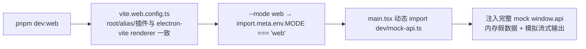

- **mock 覆盖**：会话 CRUD、聊天流式输出（按 AI SDK v7 UIMessageChunk 格式模拟 text-start/text-delta 推送，token 累加）、模型清单、文件树、Git 状态、用量统计、终端回显、设置各页；其余域返回空数据兜底。mock 数据全部内存态，标注 MOCK，重启即失。
- **隔离性**：仅 `--mode web` 时注入；`pnpm dev`（Electron）由 preload 注入真实 window.api；生产构建与 E2E（electron-vite dev）不加载 mock 代码（动态 import + 条件短路）。
- **相关文件**：vite.web.config.ts（独立 vite 配置）、src/renderer/dev/mock-api.ts（mock 层，参数类型从 IpcApi 推导）、src/renderer/main.tsx（注入入口）、package.json `dev:web` 脚本。
- **已知限制**：历史会话消息不自动回显（与真实 Electron 环境一致的既有缺口——session:get 的 messages 未注入 useChat，属产品功能问题，非 mock 问题）；协议版本校验由 mock 返回匹配的 IPC_PROTOCOL_VERSION 避免误报。

## 一、全局架构

### 1.1 系统分层总览

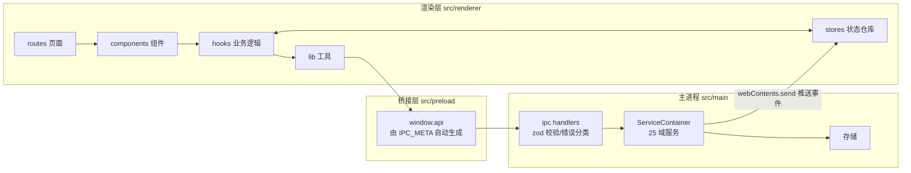

### 1.2 状态四层（L1-L4）

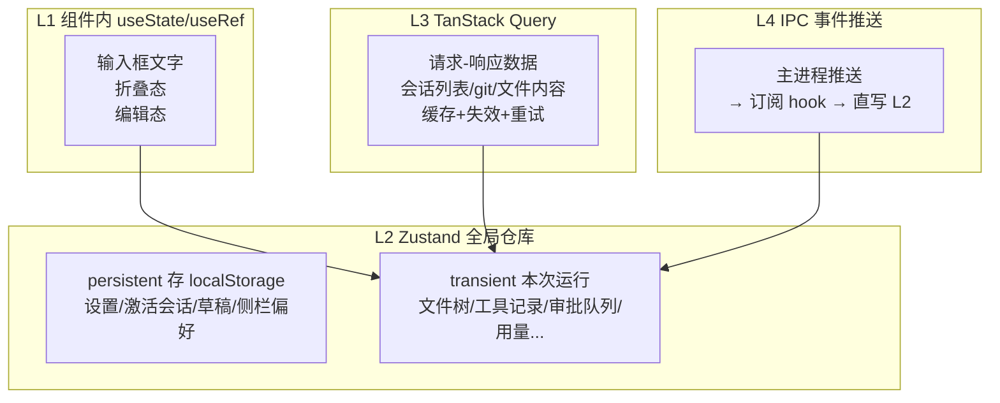

判断标准一句话：**IPC 问一次拿结果 → L3；IPC 持续推送 → L4 写 L2；界面交互态 → L2；组件独享 → L1。**

### 1.3 数据怎么跨进程

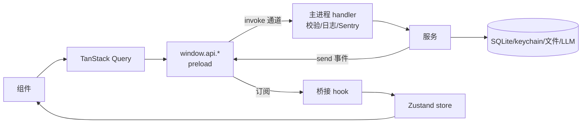

- 通道命名：`域:动作`（请求）、`域:stream:事件`（流式）、`域:event:名称`（状态事件）；全表见第七章。
- 错误约定：返回 `{data} | {error:{code,message}}`，消息带 `[CODE]` 前缀 → 前端查 i18n。

## 二、UI 设计体系（Aurora 2.0）

唯一真源：[globals.css](../../src/renderer/styles/globals.css)（4224 行）。原则：**所有颜色/尺寸走 CSS 变量（令牌），禁止硬编码**。

### 2.1 颜色总览（亮 / 暗两套）

| 用途 | 亮色 | 暗色 |
|---|---|---|
| 背景 L0 页面基底 | `--bg #f7f8fa` | `#080b10` |
| L1 侧栏/顶栏/卡片 | `--bg-elev #ffffff` | `#0e1319` |
| L2 悬浮/卡片头/悬停 | `--bg-elev-2 #eef0f4` | `#141a23` |
| L3 激活/强调容器 | `--bg-elev-3 #e0e4ec` | `#1a2130` |
| 主文字 | `--text #1a2130` | `#e8edf4` |
| 次要文字 | `--text-dim #5a6478` | `#8a95a6` |
| 辅助/占位文字 | `--text-faint #5d6779`（5.39:1 AA） | `#7a8699`（6.5:1） |
| 主 accent 青绿 | `--accent #00b89e` | `#00e5c7` |
| 辅 accent 蓝 | `--accent-2 #2b7fff` | `#4a9eff` |
| 边框 | `--border #e1e4eb` / strong `#cbd0db` | `#1c2330` / `#2d3848` |
| 成功 | `--success #00d9c0` | 同左 |
| 警告 | `--warning = --amber #e89038`（glow rgba(232,144,56,.15)） | 同左 |
| 错误 | `--error #c53030`（bg rgba(197,48,48,.08)） | 同左 |
| accent 上文字 | `--on-accent #001814`（7.6:1） | 同左 |
| 用户气泡 | `--msg-bubble-user #e8edf5` | 暗色另值 |

映射：`--primary=accent`、`--muted-foreground=text-dim`、`--muted=bg-elev-2`、`--ring=accent`、`--input=border`；图表五色 = accent/accent-2/amber/success/error。`@theme inline` 把这些变量暴露成 Tailwind 类（`bg-background`/`text-muted-foreground`…）。

### 2.2 字号 / 间距 / 圆角 / 阴影 / 缓动 / 图标

```
字号 6 级：10 / 11 / 12 / 13 / 14 / 16 px（--font-size-2xs…lg，UI 默认 13）
间距 7 级：4 → 48 px（--sp-1…7，4px 步进）
圆角：--radius 0.625rem（10px），lg +2px，xl +4px
阴影 5 档：--shadow-elev（抬升）/ --shadow-modal（模态，accent 描边）/ --shadow-dropdown（下拉）/ --shadow-card / --shadow-card-hover
发光 3 档：--glow-sm/md/lg（青）、--glow-2-sm/md（蓝）
缓动 3 个：--ease-soft 标准 / --ease-paper 纸张 / --ease-out 出场
图标 5 档：10/12/14/16/20 px（lucide-react，strokeWidth 1.5-2）
字体：--font-sans（UI）/ --font-serif（文学风标题）/ --font-mono（代码/状态/日志）
```

### 2.3 z-index 档位

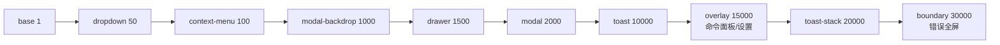

### 2.4 主题机制

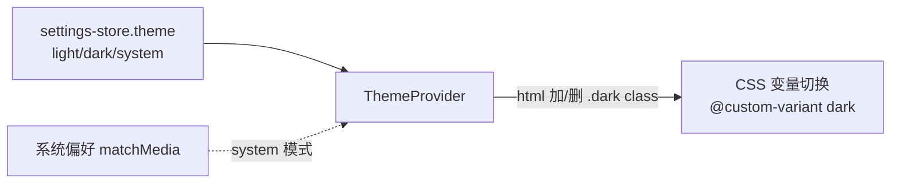

### 2.5 页面氛围与动效

- `body::before`：双 accent 渐变光晕 + 技术网格 + 扫描线；`body::after`：SVG 噪点（mix-blend-mode）。
- 主区 `.thread-bg paper-texture`：多层光晕 + 纸张噪点；顶栏 `backdrop-filter: blur(16px) saturate(1.4)` + 底部发光刻度线。
- 动画统一 tw-animate-css + 自定义关键帧（pulse-soft 状态点 / typingBounce 打字点 / msgEnter 消息入场 / shimmer 骨架 / refreshing-slide 刷新条 / reasoningReveal 推理块 / modalin 模态入场等，定义在 globals.css）。
- 对比度硬标准：正文 ≥16:1、次要 ≥5.39:1、accent 上文字 7.6:1（历史坑：硬编码 stone-* 曾低至 1.23:1，勿回退）。

## 三、页面布局（每个界面一张图）

### 3.1 整体框架 AppShell

```
┌──────────────────────── topbar 52px 玻璃顶栏 ────────────────────────┐
├──────────┬──┬────────────────────────────┬──┬──────────────────────┤
│ sidebar  │R │         main               │R │      right-panel     │
│ 200-400px│6 │   .thread-bg grid-column:3 │6 │      260-360px       │
│ (17vw)   │px│   欢迎页 / 聊天页           │px│  info|diff|files|    │
│          │  │   （欢迎模式：居中 flex）    │  │  browser|term|dev   │
└──────────┴──┴────────────────────────────┴──┴──────────────────────┘
```

- 栅格：`.app` 两行（52px + 1fr）；`.view-chat` 五列，列宽来自 CSS 变量。
- 宽度动态：默认 `clamp(200px,17vw,280px)` / `clamp(260px,22vw,360px)`；拖拽后 JS 写变量覆盖（钳位 200-400 / 260-360）。
- 折叠：`.sb-collapsed/.crp-collapsed` class → 变量置 0 → 列塌缩；断点 <1200px 折右面板、<900px 折侧栏（手动操作过不覆盖）。
- 关键坑：`.thread-bg` 必须 `grid-column: 3`——折叠元素 display:none 不占轨道，否则双折叠时 main 被挤到第 1 列宽度塌成 0。
- 浮层 z-index 用 2.3 的档位表；设置页右上 140px `.app-region-drag` 避让窗口控件。

### 3.2 欢迎页 `/`

```
┌──────────── 主区（welcome-mode：右面板隐藏，居中）────────────┐
│  ⟨/⟩ Code with TRAE                    ← .welcome-view 品牌   │
│  ┌──────── 输入舱 max-width 720px ────────┐                   │
│  │  [消息输入框]                          │                   │
│  │  [📁 项目名 ▾]  [模型选择器]           │ ← composer-project-bar │
│  └───────────────────────────────────────┘                   │
│  应用开发 | 项目理解 | 创意点子 | 工具知识   ← 4 个快捷 pill   │
└───────────────────────────────────────────────────────────────┘
```

要点：欢迎模式由 welcome-store 驱动 class；项目下拉 = 历史目录（≤10 条）+ 未选择项目 + 浏览其他目录（原生选择器）；发送时未选项目 → toast + 自动展开下拉；快捷 pill 点击只预填不发送。

### 3.3 聊天页 `/chat/:id`

```
┌ 状态条：项目名 · [🔍] · ● RUNNING · 12.3k tok ┐
├ 限流横幅 / 中断提示条 / 审批卡片（按需出现）    ├
├ 会话内搜索栏（可选）                           ├
├───────────────────────────────────────────────┤
│  消息列表（滚动区）                            │
│   ••  ← 右侧导航轨（≥4 条消息出现）            │
│                    [回到最新▼] ← 距底>80px 出现│
├───────────────────────────────────────────────┤
│ ┌ 输入舱：拖拽手柄 ────────────┐               │
│ │ 输入框（自动增高 1-8 行）    │               │
│ │ @  /   ⏎发送·⇧⏎换行  计数  发送│            │
│ └──────────────────────────────┘               │
│ 项目名(只读) · 模型选择器                       │
│ 状态 · 消息数 · Token                           │
└───────────────────────────────────────────────┘
```

要点：flex 纵向四段（状态条/横条区/消息区 flex-1 滚动/输入舱）；字号跟随设置（容器 fontSize）；路由守卫：加载中→"加载中"、会话不存在→回首页、目录空→错误态。

### 3.4 设置全屏页

```
┌ [← 返回]  ⚙ 设置 · 说明        （140px 拖拽避让区）┐
├──────────┬───────────────────────────────────────────┤
│ 账户与通用 │  内容区（滚动，每分区独立错误边界）      │
│  账号(占位)│                                          │
│  用量      │                                          │
│  通用      │                                          │
│  移动端(占位)│                                        │
│ 能力      │                                          │
│  模型服务  │← 打开时默认停在「模型服务」              │
│  ...      │                                          │
├──────────┴───────────────────────────────────────────┤
│ 导航：160px 固定列；激活项 = 青色 2px 竖条 + 加粗      │
└──────────────────────────────────────────────────────┘
```

### 3.5 右面板（6 个标签）

```
┌ 会话详情 | 文件变更 | 文件 | 浏览器 | 终端 | 开发者 ┐（均分，收缩截断）
├────────────────────────────────────────────────────┤
│ 会话详情：目标列表(可清除) / 待办 / 引用文件        │
│ 文件变更：本轮编辑记录 → 双栏 diff                  │
│ 文件：最近修改 → 点击开查看器                       │
│ 浏览器：地址栏 + 后退/前进/刷新 + 设备预设          │
│ 终端：xterm（懒加载）                               │
│ 开发者：Git | 日志 | 指标 | 检查器                  │
└────────────────────────────────────────────────────┘
```

### 3.6 文件树面板（侧栏视图）

```
┌ [← 返回] 文件树  [🔄] ┐
├ [新建文件] [新建目录] ┐
├ ▸ src                 │  目录：箭头展开/折叠
│   ├▸ components       │  （首次展开才加载子目录）
│   └ 📄 App.tsx         │  文件：点击开查看器
└── hover 节点 → [⋯ 菜单]┘
```

### 3.7 文件查看器

```
┌ 面包屑路径 · 行数 · [复制] [编辑/保存] [关闭] ┐
├──────────────────────────────────────────────┤
│  shiki 高亮层（绝对定位下层）                 │
│  textarea（上层：文字透明、光标不透明）        │ ← 编辑模式双层叠加
└──────────────────────────────────────────────┘
```

### 3.8 命令面板 / 3.9 快捷键帮助 / 3.10 提问框 / 3.11 审批卡

```
命令面板（z-overlay 全屏遮罩）        快捷键帮助（Dialog 双列网格 11 条）
┌ [🔍 输入] ┐                        ┌ [Ctrl+P] 命令面板     ┐
│ 操作/文件/会话 分组结果             │ [Ctrl+,] 设置         │
│ 无匹配 → "无匹配结果"              │ ...共 11 条           │
└ ↑↓ ⏎ esc ┘                        └───────────────────────┘

提问框（Dialog）：问题 + 选项(单选/多选) + 文本 + 确认/取消

审批卡（消息列表上方）：
┌🛡 写文件（等待审批）────────────────┐  ← 左色条：琥珀=待审
│ 描述文本                            │    绿=已批准 红=已拒绝
│ [命令预览/diff 预览]                │
│ [拒绝] [白名单]          [批准]     │  ← 危险工具批准=红色
└────────────────────────────────────┘
```

### 3.12 全局浮层挂载

Settings / CommandPalette / FileViewer / AskDialog / ShortcutHelp / UpdateNotice 全部挂在 AppShell 根部；Toast 在最内层 Provider。

## 四、原子组件库（components/ui 13 个）

### 4.1 组件家族

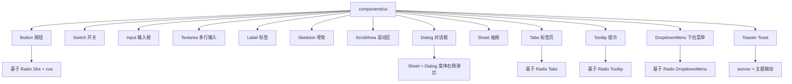

### 4.2 逐个说明（完整 props / 变体 / 状态 / 样式类）

**Button（button.tsx，cva 变体）**：variant 6 种——default（bg-primary text-primary-foreground shadow hover:bg-primary/90）/ destructive（bg-destructive text-destructive-foreground）/ outline（border border-input bg-background hover:bg-accent）/ secondary（bg-secondary hover:bg-secondary/80）/ ghost（hover:bg-accent）/ link（text-primary underline-offset-4 hover:underline）；size 4 档——default h-9 px-4 py-2 / sm h-8 px-3 text-xs / lg h-10 px-8 / icon h-9 w-9。基础类 inline-flex items-center justify-center gap-2 rounded-md text-sm font-medium transition-colors focus-visible:ring-1 ring-ring disabled:pointer-events-none disabled:opacity-50，子 svg size-4。props：variant/size/asChild（Radix Slot，可把 a 变按钮）；导出 buttonVariants 可单独复用（如给 a 套样式）。

**Switch（switch.tsx，自研零依赖）**：button + role="switch" + aria-checked；受控 props：checked / onCheckedChange 必填、aria-label、disabled、className；轨道 h-5 w-9 rounded-full（选中 bg-primary / 未选 bg-input，border-2 transparent），圆点 h-4 w-4 bg-background translate-x-0/4 滑动；focus-visible ring-2 ring-offset-2；disabled 半透明 + not-allowed。键盘原生 Space/Enter。

**Input（input.tsx，31 行）**：原生 input 包装，props 透传全部原生属性（type/placeholder/disabled 等）；样式：h-9 w-full min-w-0 rounded-md border border-input bg-transparent px-3 py-1 text-base shadow-sm outline-none transition-[color,box-shadow] placeholder:text-muted-foreground selection:bg-primary selection:text-primary-foreground focus-visible:border-ring focus-visible:ring-ring/50 focus-visible:ring-[3px] aria-invalid:ring-destructive/20 aria-invalid:border-destructive disabled:opacity-50 md:text-sm；file: 前缀支持文件输入按钮样式。

**Textarea（textarea.tsx，28 行）**：原生 textarea 包装；field-sizing-content 自适应高 + min-h-16；focus-visible:border-ring + ring-[3px] ring-ring/50；aria-invalid 红边；disabled 半透明。

**Label（label.tsx，29 行）**：Radix Label 包装（htmlFor 关联、点击聚焦）；flex items-center gap-2 text-sm leading-none font-medium select-none；peer-disabled / group-data-[disabled] 联动降级。

**Skeleton（skeleton.tsx，22 行）**：div 包装，bg-accent animate-pulse rounded-md；尺寸由 className 控制（如 h-4 w-32、size-12 rounded-full）。

**ScrollArea（scroll-area.tsx，66 行）**：Radix ScrollArea——Root（relative overflow-hidden）+ Viewport（size-full rounded-[inherit] focus-visible:ring）+ ScrollBar（vertical/horizontal 双方向，Thumb bg-border rounded-full）+ Corner。用于 Git 面板 diff 区等。

**Dialog（dialog.tsx，160 行）**：Radix Dialog 全套——Dialog（Root，open/onOpenChange 受控或 defaultOpen）/ DialogTrigger / DialogPortal（渲染到 body 末尾）/ DialogClose / DialogOverlay（fixed inset-0 z-50 bg-black/50，开合 fade 动画）/ DialogContent（fixed 居中 top-50% left-50%，z-50，max-w-[calc(100%-2rem)] sm:max-w-lg，rounded-lg border p-6 shadow-lg，zoom-in/out 动画，**右上角自动渲染 XIcon 关闭按钮 + sr-only "关闭"文案**）/ DialogHeader（flex flex-col gap-2）/ DialogFooter（sm:flex-row justify-end）/ DialogTitle（text-lg font-semibold）/ DialogDescription（text-muted-foreground text-sm）。用于查看器/快捷键帮助/提问框。

**Sheet（sheet.tsx，85 行）**：基于 Dialog 的抽屉——Sheet（Root）+ SheetOverlay（同 Dialog 遮罩）+ SheetContent（**fixed inset-0 z-50 h-full w-full shadow-lg，无开合动画**——当前唯一使用者 SettingsDialog 是全屏设置页，瞬时切换）+ SheetTitle/SheetDescription（可 sr-only 隐藏保留无障碍语义）。

**Tabs（tabs.tsx，88 行）**：Radix Tabs——Tabs（Root，value/defaultValue 受控，flex flex-col gap-2）/ TabsList（bg-muted text-muted-foreground inline-flex h-9 w-fit rounded-lg p-[3px]）/ TabsTrigger（flex-1，激活 data-[state=active]:bg-background + shadow-sm，dark 模式 bg-input/30，圆角卡片切换）/ TabsContent（flex-1 outline-none，仅激活渲染）。用于右面板标签、侧栏 tabs 语义。

**Tooltip（tooltip.tsx，57 行）**：Radix Tooltip——TooltipProvider（应用根部，控制全局延迟）/ Tooltip（Root）/ TooltipTrigger / TooltipContent（Portal 渲染，bg-primary text-primary-foreground z-50 rounded-md px-3 py-1.5 text-xs，fade+zoom 开合动画，四方向 slide-in）。

**DropdownMenu（dropdown-menu.tsx，276 行）**：Radix DropdownMenu 全套——Root / Trigger / Portal / Content（bg-popover z-50 min-w-[8rem] rounded-md border p-1 shadow-md，fade+zoom 动画，max-h 可用高度滚动）/ Group / Sub + SubTrigger（右侧 ChevronRight）/ SubContent / RadioGroup / **Item（inset 缩进 + variant destructive 红色，data-[disabled] 半透明）** / CheckboxItem（左侧 Check 指示器）/ RadioItem（圆点指示器）/ Label / Separator（bg-border h-px）/ Shortcut（ml-auto text-xs tracking-widest）。用于会话菜单/节点菜单/账户菜单。

**Toaster（sonner.tsx，36 行）**：sonner Toaster 包装——useTheme 联动 theme prop；CSS 变量 --normal-bg/--normal-text/--normal-border 映射到 --popover/--popover-foreground/--border，toast 配色跟随主题；全局渲染一次，任意处 toast()/success()/error()/info()。

## 五、业务组件（状态图为主）

### 5.1 全局异步五态（AsyncBoundary）——所有列表/面板通用

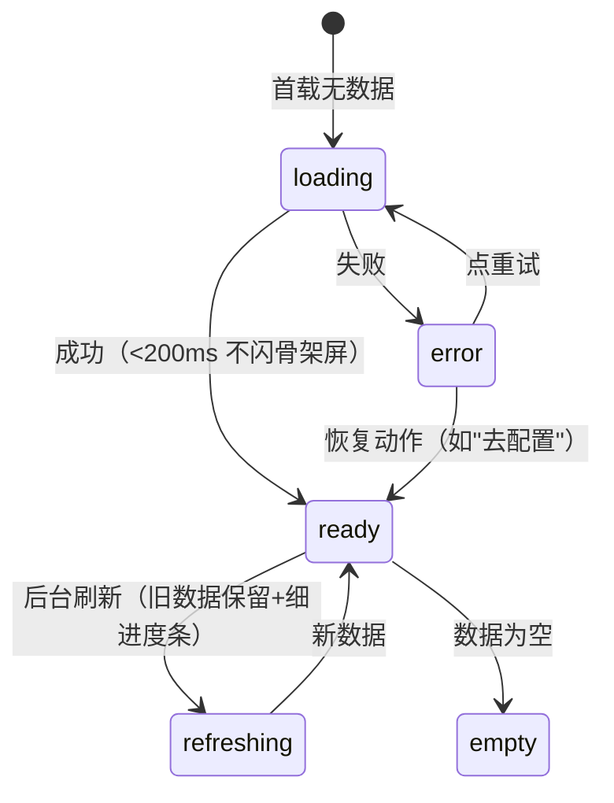

### 5.2 应用外壳 AppShell——布局状态

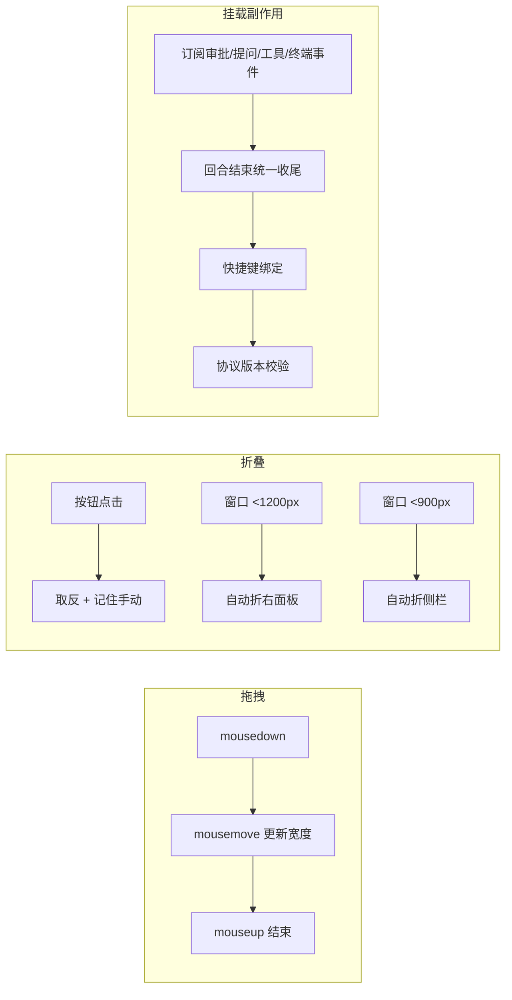

### 5.3 顶部栏 / 侧栏系

顶部栏：6 个按钮（折叠侧栏 / 返回·仅聊天页 / 命令面板胶囊 / 右面板开关 / 设置 / 主题）。主题按钮两态（light↔dark）；**快捷键切主题是三态循环（light→dark→system），现状不一致**。

侧栏会话列表：

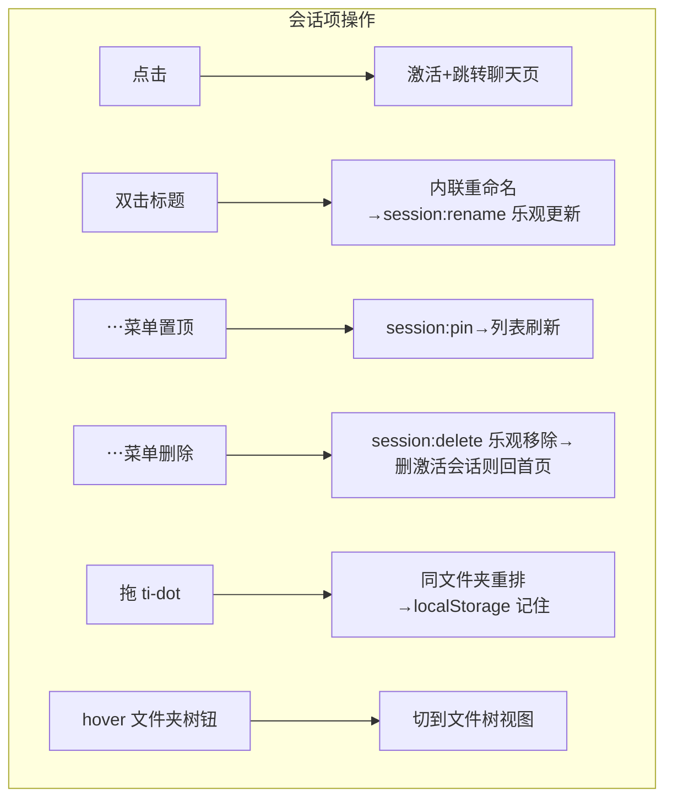

文件夹标签：点击折叠/展开（记住）；hover 显示 + 组内新建。列表状态：加载骨架 / 错误重试 / 空态（无 CTA）/ 就绪。搜索框仅 UI 不过滤（占位）；归档标签恒空（占位）。

### 5.4 聊天对话状态机（ChatPanel + 输入框）


输入框附加状态：

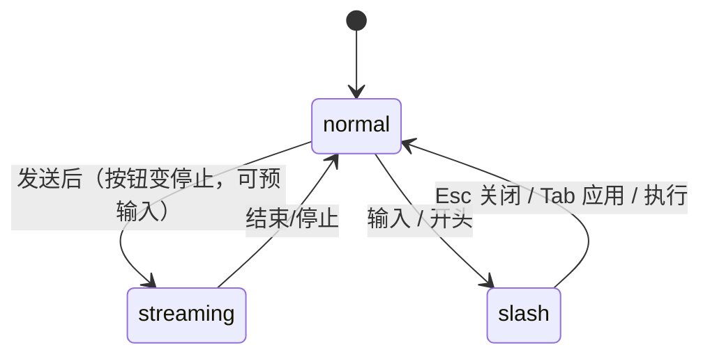

事件细节：自动增高 1-8 行；拖拽手柄向上拉高 [40,460]（双击重置、键盘↑↓ 20px）；>2000 字计数警告、>8000 拦截；附件 @ 多选 → chip → 发送时读文件拼入（≤4000 字）；草稿按会话保存/发送清空；流式中 Esc 窗口级兜底。

### 5.5 审批状态机

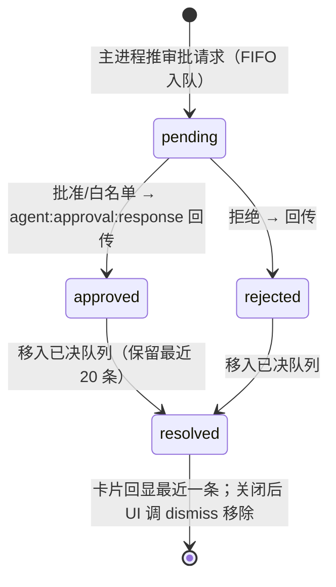

审批模式（询问/自动批准/拒绝）在设置页切换（失败回滚）；自动/拒绝模式下主进程直接处理，界面收不到请求。危险工具（删文件/跑命令/装包）批准按钮红色。

**审批类型映射（approval-utils.ts，10 种）**：run_command（Terminal 图标）/ write_file（FilePlus）/ edit_file（FileEdit）/ delete_file（FileX）/ apply_patch（FileDiff）/ install_package（Package）/ external_call（Globe）/ git_add（GitBranch）/ git_commit（GitCommitHorizontal）/ git_push（CloudUpload）；变体徽章色：命令 amber、文件蓝、删除红、装包紫、外部调用青、Git 类紫；**危险类型 isDangerousType = delete_file / run_command / install_package / git_push**（批准按钮红色）；**仅 run_command / write_file / edit_file 支持"记住决策"**（canRememberDecision），危险与 Git 类强制每次询问。

**工具名→类型归类（use-approval-bridge 的 classifyTool，顺序敏感）**：git_push/git_commit/git_add 精确匹配；含 install/npm/pip → install_package；含 patch/diff → apply_patch；含 delete/rm/remove → delete_file；含 edit/replace/str_replace → edit_file；含 write/create → write_file；含 command/bash/shell/exec → run_command；兜底 external_call。

### 5.6 文件树 / 文件查看器（实现细节）

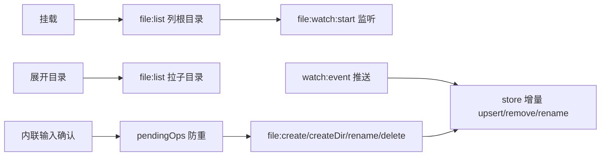

**文件树细节（FileTreeNode.tsx 329 行）**：节点缩进 `paddingLeft: depth*12+8`px；目录行键盘 Enter/Space 同点击；子列表 `fieldset.ft-children` 内依次渲染 内联新建输入（在顶部）/ 加载中（.ft-loading）/ 空目录（.ft-empty）/ 递归子节点；行按钮 tabIndex=-1（外层 tabIndex=0，role=treeitem，目录 aria-expanded、文件 aria-selected）；操作中节点加 .pending、激活加 .active。**watch 事件处理规则（use-file-tree）**：先过滤 `watcherId` 不匹配的事件（防多窗口残留）；create → 重载父目录；modify → 忽略；delete → 移除条目；rename → 移除旧路径 + 重载新父目录；watch 启动失败 toast"文件监听已失效"（4s）。**内联输入防双触发（inline-create/rename-input）**：handledRef 标记防止 keydown 与 blur 同时提交；重命名输入 onFocus 自动选中不含扩展名的部分（.gitignore 例外）；提交前去 trim、空值或未变化取消。**节点菜单（node-menu）**：onSelect 包装 `setTimeout(handler, 0)`（等菜单关闭动画后再聚焦输入框）；目录多"新建文件/新建目录"两项。

**查看器（FileViewerDialog.tsx 363 行）**：打开 → file:read（缓存 30s/5min）→ 编辑 → 脏标记 → Ctrl+S（**窗口级 keydown 监听，仅编辑态生效**）→ file:write → markSaved + 刷新缓存；关闭脏 → `window.confirm` 确认。数据到达且未编辑时 setLoadedContent（防后台刷新覆盖编辑内容）；高亮层与 textarea **滚动同步**（textarea onScroll → 同步 highlight 层 scrollTop/scrollLeft）；文件路径显示完整路径（font-mono）+ 行数 totalLines；编辑态隐藏左侧文件导航（防脏数据切换）；加载/错误/空各有专用 class。

### 5.7 终端 / Git / 日志 / 指标 / 检查器（实现细节）

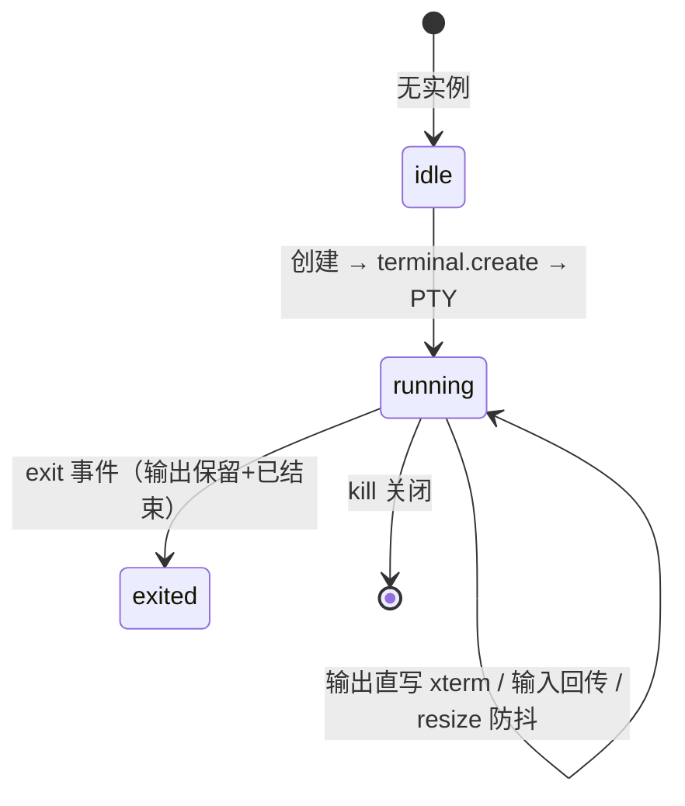

**终端（TerminalPanel.tsx 310 行）**：xterm 配置——fontFamily `Cascadia Code/JetBrains Mono/Consolas` 等宽栈、fontSize 13、lineHeight 1.3、cursorBar + 闪烁、theme 亮色米白（background #faf7f0、foreground #3d3d3d）；创建通道 terminal.create 传 `{cwd, cols:80, rows:24}`（zod transform 要求显式 undefined）；输出事件按 terminalId 过滤直接 `term.write`（不走 store）；store 缓冲仅卸载重挂兜底；exit 推送写 `已结束` 转义序列（x1b[2m）并丢弃后续输入；ResizeObserver 100ms 防抖 → fitAddon.fit → terminal.resize；DEFAULT_CWD 硬编码 `f:\TraeProjects\1`（已知不一致）。

**Git（5 文件）**：status 缓存 10s；diff 不缓存；文件列表状态映射（git-status-utils）——modified amber FileEdit / added emerald FilePlus / deleted red FileX / renamed blue FileEdit / untracked muted FileQuestion / conflicted 红加粗 AlertCircle；分支行 ahead 显示 emerald ↑N、behind 显示 amber ↓N；diff 统计用 diff-match-patch 语义统计（移动行不计增删），兜底主进程文本统计；展开区 ScrollArea 内 Skeleton/无 diff/UnifiedDiffView。

**日志（LogsPanel 252 行）**：行数选项 [100,200,500]（默认 200）；级别过滤 all/info/warn/error/debug（all 时传 undefined 避免 IPC 歧义）；行级着色按行内 [error]/[warn]/[debug] 标记。**指标（MetricsPanel 267 行）**：六卡 2 列网格——rss / heapUsed（含 heapTotal hint）/ external / cpu user（含 system hint）/ uptime（含 PID hint）/ 版本卡（col-span-2：app/electron/node + platform/arch + packaged/dev）；格式化 formatBytes（B/MB/GB）/ formatMs / formatUptime（h m s）；10s refetchInterval + enabled 面板可见。**检查器（InspectorPanel）**：detach/right/bottom 三模式 → devtools.open；状态 idle/loading/success/error，3s 自动回 idle；成功显示打开模式。**浏览器（browser-pane 301 行）**：设备尺寸 desktop {1366,768} / tablet {768,1024} / mobile {375,667} / responsive；历史栈前进后退；刷新用 `key={loadedUrl}` 强制 iframe 重挂载（置 null 100ms 后恢复）；URL 无协议自动补 https://；iframe sandbox allow-scripts/allow-same-origin/allow-forms/allow-popups。

### 5.8 错误边界三层

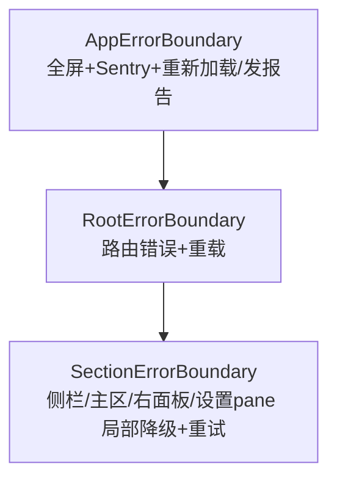

### 5.9 其余组件一句话

命令面板：cmdk + 模糊搜索，操作/文件(≤50)/会话(≤20) 三组，Esc/遮罩关闭。会话内搜索：纯前端匹配、↑↓ 循环、居中高亮。限流横幅：429 触发、5 分钟有效、可关闭。模型选择器：只显示已配 Key 的提供商。提问框：agent:event:ask 打开、确认回传/取消回空。更新提示：事件驱动 toast（可用/下载完成可重启安装/已最新/错误）。

### 5.10 聊天渲染与通用组件实现细节（补全）

**Markdown（Markdown.tsx 301 行）**：react-markdown + remark-gfm 解析；shiki 高亮走模块级单例 `getHighlighter()`（双主题 github-dark/github-light，预加载 18 种语言：ts/js/tsx/jsx/bash/shell/json/python/rust/go/java/html/css/markdown/sql/yaml/xml/diff）；`normalizeLang` 先查别名表（sh→bash、py→python、rs→rust、golang→go、md→markdown、yml→yaml、jsonc→json、zsh→bash、ts→ts、js→js），不在预加载列表则降级纯文本；CodeBlock：异步 codeToHtml（cancelled 防竞态），失败降级 `<pre><code>` 纯文本，复制按钮 2s 复位（copied 类 + Check 图标）；外链 a 加 target=_blank rel=noopener。

**消息操作（message-actions.tsx 123 行）**：复制/重新生成两按钮，`.msg-actions` hover 显示（默认 opacity 0）；复制空文本直接返回，成功 2s 复位；重新生成 disabled=流式中，禁用时 title 换"生成中"。

**流式尾部（streaming-footer.tsx）**：复用 assistant 结构（C 头像 + 角色行）+ `.typing-indicator`（role=status）内三个弹跳圆点。

**搜索条（conversation-search-bar.tsx 132 行）**：受控 props 7 个（visible/query/totalMatches/currentMatch/onSearch/onNavigate/onClose）；Enter 下一个（Shift+Enter 上一个）、Esc 关闭；计数 `当前/总数`（无匹配 0/0，aria-live）；上下按钮无匹配时禁用；聚焦用 ref（biome 禁 autoFocus）。

**限流横幅（rate-limit-banner.tsx 58 行）**：订阅 store（visible/triggeredAt/dismiss）；组件内 60s 定时器检查 `isRateLimitExpired`（store 的 AUTO_HIDE_MS = 5 分钟）后 dismiss；pill 形态 amber 文字 + AlertTriangle + 关闭按钮，右侧对齐渐变背景。

**文件变更卡（file-change-card.tsx 121 行）**：write_file → created（emerald 徽章）、edit_file → modified（sky 徽章）；统计 `+N / -N`；diff 行 max-h-72（288px）滚动，add 绿 / del 红 / context 灰，行首 +/- 符号列；数据来自 `lib/diff/line-diff` 的 computeLineDiff（非统一 diff 格式，是行级对比）。

**统一 diff 视图（UnifiedDiffView.tsx 88 行）**：parseUnifiedDiff 按 hunk 拆分，每 hunk 渲染一个 ReactDiffViewer（splitView 双栏、LINES 比较、隐藏行号关闭）；COMPACT_STYLES：content 10px 等宽、行高 1.6；空 diff 显示"无差异"。

**区块错误边界（SectionErrorBoundary.tsx 101 行）**：props children/name（Sentry tag）/resetKeys（任一变化自动清除错误）；fallback 零依赖（静态中文文案，避免 Provider 错误时二次失败）；错误消息截断显示 + title 悬浮全文；上报 Sentry 带 boundary + section tag。

**空态（EmptyState.tsx 85 行）**：props icon（默认 Inbox）/title/description/actionLabel/onAction；图标 48px 圆底（bg-muted）+ 衬线标题 + 可选 outline 按钮；纯展示无业务。

**更新提示（UpdateNotice.tsx 70 行）**：phase 防抖（同阶段不重复弹）；available → toast.info（自动下载中）；downloaded → toast + 重启安装按钮（60s duration）；not-available → success；error → error + message；checking/downloading 不弹（高频）。

## 六、交互流程（时序图）

### 6.1 新建会话

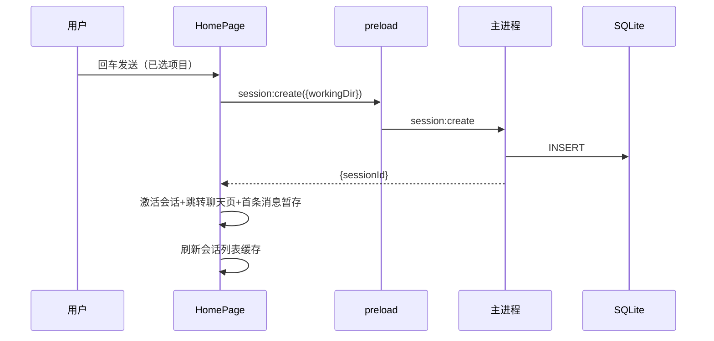

边界：未选项目 → toast+展开下拉；创建中禁用按钮防重复；失败留在欢迎页；URL 直访不存在会话 → 回首页。

### 6.2 发消息 → 流式 → 停止（核心链路）

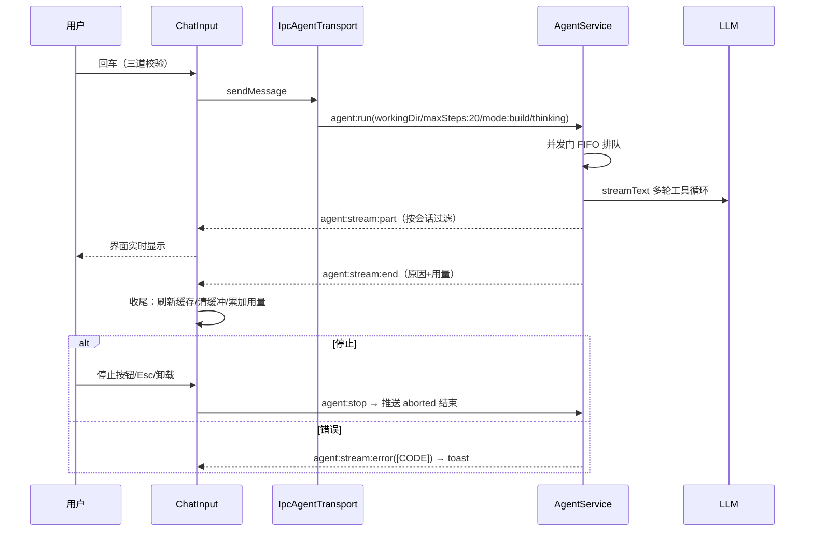

### 6.3 工具调用与审批

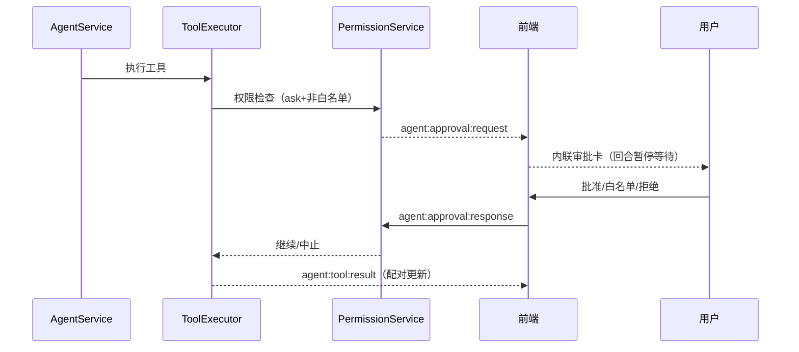

### 6.4 其余流程（简图）

会话管理：点击切换（session:get）/ 重命名（乐观更新）/ 置顶（刷新排序）/ 删除（乐观移除，删激活回首页）/ 拖拽排序（同文件夹重排记住）。

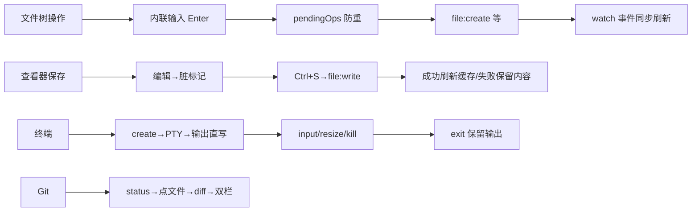

### 6.5 边界情况总表

| 场景 | 处理 |
|---|---|
| 数据为空 | 各场景空态（侧栏无 CTA） |
| 请求失败 | 五态 error：本地化+重试+恢复动作 |
| 加载中 | 首载 >200ms 才闪骨架；刷新保留旧数据 |
| 防重复提交 | 创建/保存/API Key/文件操作进行中禁用 |
| 长度限制 | 消息 8000 拦截、附件 4000 截断、工具 JSON 200 截断 |
| 脏数据 | 查看器关闭先确认 |
| Esc | 统一：中断生成/关建议/关浮层 |
| 浏览器模式 | window.api 缺失 → 空数据/静默跳过不崩溃 |
| 版本错配 | toast 提示重启 |
| 崩溃恢复 | 残留会话标记已中断 → 聊天页提示条 |
| 限流 | 429 → 横幅 5 分钟 |
| 列表防膨胀 | 命令面板 50/20、侧栏 50 分页 |

## 七、数据流

### 7.1 总链路

```mermaid
flowchart LR
  Comp[组件] --> Q[TanStack Query] --> Api[window.api]
  Api -->|invoke| H[handler 校验] --> S[服务] --> St[(存储/外部/LLM)]
  S -->|send 推送| Api -->|subscribe| Bridge[桥接 hook] --> Z[Zustand] --> Comp
```

存储四类：SQLite（会话/消息/用量/回合/运行时模型/目标/记忆/任务/技能 11 张表）、keychain（API Key，DPAPI 加密）、JSON 偏好文件（遥测/审批模式/白名单）、外部进程（PTY/git/ripgrep/codegraph/MCP/LLM）。

### 7.1.1 桥接层实现（preload，3 个文件）

preload/index.ts：`createIpcApi(IPC_META)` 生成全部 API → `contextBridge.exposeInMainWorld('api', api)`，**零手写**；IPC_META 走 `@code-agent/shared/ipc/meta` 子路径导入（纯字符串零 zod——sandbox:true 下 preload 必须 CJS，require zod 会静默失败导致 window.api 为 undefined）。

create-api.ts 生成器：遍历 IPC_META——`kind==='request'` 生成 `(input) => invoke(channel, input)`；`kind==='event'` 生成 `(callback) => subscribe(channel, callback)`（返回 unsubscribe）。**新增 IPC 方法只改 meta + definitions，本文件零改动**。

ipc-bridge.ts：`invoke` 用全局 Web Crypto 生成 traceId（sandbox 不能 import node:crypto）作为第三参传入 ipcRenderer.invoke，traceId 贯穿渲染层→主进程→日志→Sentry；`subscribe` 包装回调吞掉 IpcRendererEvent（Electron Security #17，不向渲染层暴露事件对象），**必须保留同一 handler 引用**（匿名函数无法 removeListener 导致泄漏），返回 removeListener 包装。

### 7.1.2 shared 推导层（packages/shared/src/ipc）

meta.ts（零依赖纯字符串）← definitions.ts（726 行，+zod schema）← 类型推导。derive.ts：运行时 `deriveChannels` 把 channel 转 SCREAMING_SNAKE_CASE 常量（app:getStatus → APP_GET_STATUS）；类型层 InferIpcApi（自动推导 window.api 形状，-readonly 保证测试可覆盖）、InferRequestMap/InferEventMap、**InferHandlers——handler 缺任一方法编译期报错**（通道↔handler 一致性）。api.ts：`declare global Window.api: IpcApi`。response.ts：`IpcResponse<T> = {data} | {error}` + StreamSubscriber 订阅器类型。

### 7.2 核心链路图（Agent 对话）

```mermaid
flowchart LR
  IN[输入框] -->|sendMessage| UC[useChat]
  UC -->|transport.sendMessages| TR[IpcAgentTransport 单例]
  TR -->|convertToModelMessages| RUN[agent:run]
  RUN --> GATE[并发门 FIFO] --> LLM[大模型流式生成]
  LLM -->|part| PUSH[agent:stream:part] --> UC --> UI[界面]
  LLM -->|end| END[agent:stream:end] --> FIN[收尾：刷新会话缓存+清工具/审批缓冲+用量累加]
  TOOL[工具执行] -->|tool:call/result| TSTORE[tool-store] --> CARDS[消息卡片+右面板]
  TOOL -->|approval:request| AP[审批队列] --> ICARD[内联审批卡] -->|response| TOOL
```

### 7.3 25 域通道速查表

| 域 | 通道 | 前端消费方 | 存储/来源 |
|---|---|---|---|
| session | list/get/create/delete/rename/pin/listRecentDirs/exportAll/getUsageSummary/getRecentTurns | 侧栏/首页/用量页 | SQLite |
| agent | run/stop/approvalResponse/respondAsk + 推送 stream:part/end/error、tool:call/result、approval:request、event:ask、turn:event | 对话/审批/提问 | LLM + SQLite |
| chat | send/stop + stream:* | 无 UI（Agent 替代） | LLM |
| file | read/write/list/create/createDir/delete/rename/watch:start/stop + watch:event | 文件树/查看器 | 文件系统 |
| terminal | create/input/resize/kill + event:created/output/exit | 终端面板 | PTY |
| git | status/diff/add/commit/push | Git 面板（仅前两个） | git CLI |
| settings | getApiKey/setApiKey/deleteApiKey/getTelemetryLevel/setTelemetryLevel/getApprovalMode/setApprovalMode/addRuntimeModel/removeRuntimeModel/listRuntimeModels | 设置页 | keychain/JSON/SQLite |
| whitelist | list/add/remove | 审批设置 | whitelist-pref.json |
| models | list | 模型选择器 | 模型注册表 |
| mcp | list/start/stop | MCP 设置 | MCP 子进程 |
| skill | list/listLearned/learn/removeLearned | 技能设置 | SQLite |
| memory | list/clear | 规则记忆设置 | SQLite |
| goal | list/clear/create | 右面板会话详情 | SQLite |
| task | list | 右面板会话详情 | SQLite |
| app | getStatus/getInfo/openExternal/openDataDir | 协议校验/关于/数据 | 主进程 |
| system | getStatus | 指标面板 | 主进程 |
| logs | read | 日志面板 | main.log |
| devtools | open | 检查器 | DevTools |
| dialog | pickDirectory/pickFiles | 欢迎页/输入框 | 原生对话框 |
| update | check/install + event:status | 更新提示 | electron-updater |
| im | list/start/stop | IM 渠道设置 | 渠道适配器 |
| search/codebase/audio | grep/glob、query/explore…、start/append/stop | 无 UI（工具内部） | 不适用 |
| tool | list | 白名单设置 | 工具注册表 |

### 7.4 缓存策略

全局（query-client.ts）：缓存 30s / 回收 5min / 失败重试 1 次 / 写操作不重试。覆盖：git 10s；系统指标 5s+10s 轮询；日志不缓存；API Key 永不过期；文件内容 30s。失效：会话增删改 → 刷新列表；写文件 → 刷文件缓存；API Key 变更 → 刷对应项；MCP 启停 → 刷列表；回合结束 → 刷会话列表+详情。乐观更新：删除/重命名先本地变、失败回滚、最后重拉。

### 7.5 回合收尾与崩溃恢复

回合结束 → 刷新会话缓存 + 清本会话工具/审批缓冲 + 用量累加。崩溃恢复：启动检测崩溃标记 → 残留会话标"已中断" → 界面提示条。退出清理顺序（反向依赖）：中断对话流 → 停 MCP/审批 → 关文件监听 → 杀搜索/终端进程 → 关数据库。

## 八、完整性与文件索引

入口路由 6（main/App/router/root/home/chat）；布局 6+2（AppShell/Topbar/Sidebar/folder-label/thread-item/DevPanel + layout-utils/sidebar-utils）；聊天 11；审批 4；通用 9；文件 8；Git 5；开发者 4；终端 1；设置 23；hooks 22；stores 16；providers 3；lib 若干；i18n 双语言；ui 原子 13（见第四章）。全部已实现（或如实标注）。types/ 与 lib/chat/ 为空目录。

### 8.1 基础设施细节（入口/样式/国际化）

**main.tsx**：`unhandledrejection` 全局捕获——AbortError 预期中断不报错，其余 console.error（唯一日志出口）；**applyInitialTheme() 必须在 createRoot 渲染之前调用**（FOUC 防闪烁）；StrictMode 包裹。

**index.css**：`@import tailwindcss + tw-animate-css + styles/globals.css`（@import 必须在其他 at-rule 之前）；`@custom-variant dark`；`.search-highlight` 搜索高亮动画（2.5s accent 淡出）。

**theme-init.ts（FOUC 防护）**：读 localStorage `code-agent:settings` 的 zustand persist 结构 `{state:{theme}}`，非法回退 dark；system 模式用 matchMedia 解析；`document.documentElement.classList.toggle('dark')`；**必须 module script 而非 index.html 内联脚本**（生产 CSP script-src 'self' 禁止 inline）。

**format-time.ts**：相对时间——<1min"刚刚"；<1h N 分钟前；<1d N 小时前；<7d N 天前；**≥7 天显示 YYYY-MM-DD 日期**；compact 参数（欢迎页用紧凑格式）。

**i18n**：initI18n 幂等（模块加载时同步 init，早于 I18nextProvider 渲染防白屏）；语言检测 localStorage → navigator，持久化 `code-agent:lang`；interpolation.escapeValue false（React 已转义）；useSuspense false（资源全量打包）；useErrorMessage 错误码文案查询，资源缺失回退 `ERROR_META[code]?.userMessage`（未知码不抛错，保护 onError）。

**loading-ui/terminal.tsx**：纯展示终端加载动画——内联 style 注入 keyframes，光标 `--duration` 令牌可覆盖，role=status + sr-only Loading。

### 8.2 设置控件与 sections 细节

**settings-controls.tsx（195 行）**：SectionTitle（uppercase 小字标题）/ SettingRow（卡片行：左 label+description、右控件）/ ToggleRow（SettingRow + Switch）/ SegControl（分段控件：fieldset 圆角边框，选中 bg-primary text-primary-foreground + aria-pressed）/ SettingField（纵向 label + 控件 + 下方描述）。

**shortcut-picker.tsx（104 行）**：忽略纯修饰键（Control/Alt/Shift/Meta/CapsLock/Tab）；格式 `Ctrl→Alt→Shift→Meta + 主键`（空格→Space、单字符大写、功能键原样）；录制时全局 keydown capture（preventDefault+stopPropagation），Esc 取消、Backspace/Delete 清空绑定；输出与 settings-store 格式一致（"Meta+P"）。

**数据（data-section）**：导出 → session:exportAll → 成功 toast 带路径；打开数据目录 → app:openDataDir。**遥测（telemetry-section）**：三卡片 off/error-only/full（对标 VS Code），保存后 invalidate + toast"重启生效"。**关于（about-section 124 行）**：app:getInfo 显示版本/运行时三行/环境/数据目录（浏览器模式兜底 dev 假数据）。**回合（turns-section）**：session:getRecentTurns limit 10，显示模型/序号/状态文案/tokens/时长（s）。**实验（experimental-section）**：仅 scanlines + reasoningCollapsed 两个真实开关（诚实原则，其他不展示）。**IM 渠道（im-channels-section 161 行）**：渠道列表 + 启停 + 未配置渠道的 token 密码输入（busy 防重）；implemented=false 的渠道启动按钮禁用。**MCP（mcp-section 240 行）**：状态徽章 running emerald / starting sky / error red / stopped muted / stopped_with_error amber；工具数展开按钮 title 显示工具名列表；添加表单 name/command/args（args 按空白切分）。**技能（skills-section 190 行）**：已学列表（可移除）+ 学习表单（Textarea + Sparkles 按钮，空/pending 禁用）+ 内置技能只读灰标。**规则记忆（rules-memory-section 137 行）**：AGENTS.md 说明块 + 记忆列表（按激活会话，max-h-64 滚动）+ 清空（clearing 转圈）。**提示词（prompt-section 117 行）**：编辑态 Textarea 6 行等宽 + 保存/取消/清除（清除仅草稿非空时显示，destructive）；查看态 pre 预览或"使用默认提示词"占位。

### 8.3 状态仓库关键逻辑（stores）

**approvals-store**：pending FIFO + resolved（**MAX_RESOLVED 20 条**）；approve/reject 移入 resolved（头插截断）；clearBySession 只清 pending 不清 resolved；**注释声称"1s 自动出队"但代码无定时器，出队靠 UI 调 dismiss**。**file-tree-store（280 行）**：扁平化 entries Map（父目录→子条目）；排序目录前文件后 + name.toLowerCase 升序；startCreate/startRename 互斥；rootPath 变化全量重置（默认展开根）。**terminal-store**：MAX_BUFFER_LINES 5000 环形截断；关闭激活终端后激活退到列表最后一个；markExited 保留 buffer。**tool-store**：按会话分组；appendToolResult 遍历所有会话找 toolCallId 配对；title 保留旧值。**usage-store**：per-session 累加，EMPTY_USAGE 常量导出。**welcome-store**：isWelcomeMode 默认 true（首次启动进欢迎页）；enterWelcomeMode 内部自动 clearActiveSession（保证"欢迎页+旧激活会话"不可构造）；exitWelcomeMode 清空待选目录。**rate-limit-store**：AUTO_HIDE_MS 5 分钟。**reasoning-collapse-store**：仅存用户显式覆盖（Map<messageId, boolean>），null 删除回退设置默认；会话切换不清理。**file-viewer-store**：openFile 切换文件重置编辑态；空字符串也是有效内容；markSaved 同步 original=edited。

### 8.4 hooks 关键逻辑（补全）

**use-git**：status stale 10s；diff stale 0（不缓存）；diff queryKey 含 ref/staged/filePath。**use-file-tree**：loadedDirsRef 在 ref 而非 store（避免 setEntries 后重置标记）；loadDir 失败静默可重试；watch 事件过滤 watcherId；卸载 reset。**use-file-tree-ops**：joinPath 自动去重分隔符；delete 带 recursive:true、rename overwrite:false。**use-approval-bridge**：respondApproval 用 useMemo 缓存函数引用（防子组件重渲染）；rememberDecision 默认 false。**use-approval-mode**：乐观更新 + 失败回滚（setApprovalMode）。**use-tool-bridge**：toolName==='terminal' 且 action==='create' 且有 terminalId 时写 terminal-store（字段逐一 typeof 守卫）。**use-agent-bridge**：stream:error 且 code==='AI_RATE_LIMITED' 时触发限流横幅。**use-conversation-search**：匹配用 extractText + toLowerCase includes；navigate 循环取模。**use-system**：浏览器模式返回全 0 假数据（dev 预览形态完整）。

## 九、占位 / 不适用 / 已知不一致

**占位**：侧栏搜索框（仅 UI）；归档标签（恒空）；设置页账号/移动端（仅 IM 真功能）/插件/hooks/命令分区（规划中）；斜杠命令 /models /compact /help（toast 引导）；vim 开关（只存无行为）；浏览器设置（说明页）。

**不适用**：退出登录/云端账户（无登录后端）；Git 写操作（通道存在零调用）；search/codebase/audio 域无 UI；独立审批对话框（已内联化）。

**已知不一致**：主题按钮两态 vs 快捷键三态；快捷键帮助表 Ctrl+B/Ctrl+J 未绑定；Git 路径与终端工作目录硬编码项目路径。
