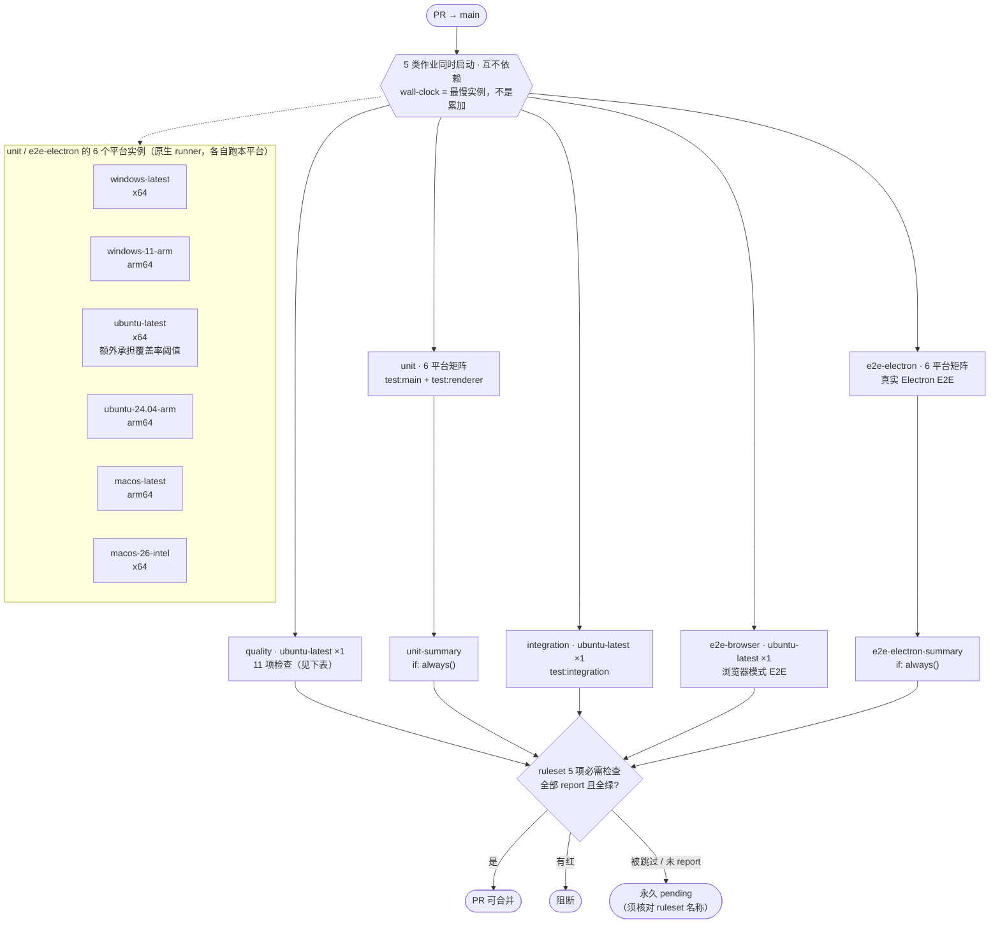
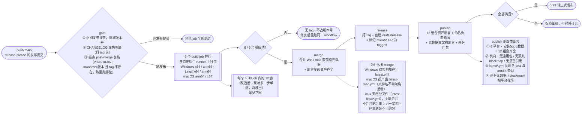
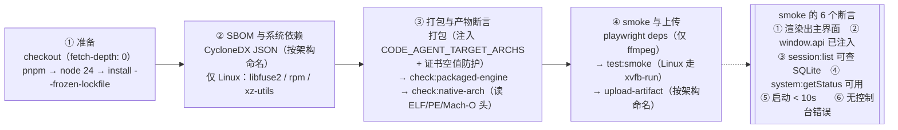
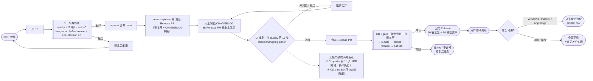

# 29. CI/CD 流水线重构规格（六平台质量验证 + 产物验证分层）

> 状态：**已实施并实跑验证**（2026-09-21：六平台 CI 全绿、CD 六个单架构 job + merge job 全部成功、v1.3.3 已发版）。
> 「第 2 节」为改前基线；「第 10 节」为落地记录、实跑结果与发现的问题（5 处，均为验证机制自身而非产品缺陷）。
> 关联：[27-auto-update-spec.md](./27-auto-update-spec.md)（更新机制与发布资产）、[RELEASING.md](../../RELEASING.md)（发版 runbook）

## 1. 定位与原则

> **与 27-spec 的关系**：27-spec §14.11 记录了一次阶段性取舍——「smoke 整体移交 CD，CD 覆盖更全（四个变体）」。本文档把该取舍推进到终点：CD 从 4 个变体扩为 **6 个**（Windows/macOS 各自拆 x64 + arm64），使 6 个产物**都有 smoke 真实启动验证**（改前只有 4 个，见 §2.3）。27-spec 的该段描述已按 §6.1 加注为历史阶段记录（其 §14.8 的「Windows 不可拆 job」结论由本方案的 merge job 解决）。

### 1.1 要解决的问题

现状（详见第 2 节）有两处结构性问题：

1. **平台特有缺陷发现太晚**：单测只在 ubuntu（PR 阶段）+ 各平台（CD 阶段）跑。Windows/macOS 的原生单测失败要到**发版**才知道——那时代码已合并，只能回滚或热修。
2. **CD 职责混杂**：CD 的 build job 既跑单测（质量验证）又打包（产物构建）。出问题时无法一眼判断是"代码质量问题"还是"打包问题"。

### 1.2 三条原则

| 原则 | 含义 |
|---|---|
| **质量在 CI，产物在 CD** | 单测/E2E/集成测试属质量验证 → 全部在 PR 阶段跑；打包正确性属产物验证 → 只在发版时跑。两侧不重复同一件事。 |
| **每平台验自己的** | 涉及平台的作业在**该平台的原生 runner** 上跑（不交叉、不模拟），共 6 个平台变体。 |
| **一次跑完，并行优先** | 同一件事只在一个地方跑一次；多平台靠 job 并行，不串行累加 wall-clock。 |

### 1.3 六平台定义

| 变体 | runner label | 架构 | 说明 |
|---|---|---|---|
| Windows x64 | `windows-latest` | x64 | |
| Windows arm64 | `windows-11-arm` | arm64 | 含 Visual Studio + `VC.Tools.ARM64`（已核实官方镜像清单，2026-09-20）。⚠️ 该 label 正在 2026-09-21~09-30 从 VS2022 镜像迁移到 VS2026 镜像（官方公告 #14602），两个镜像都带 ARM64 工具链；迁移窗口内首次实跑若遇工具链异常，可临时改用显式 label `windows-11-vs2026-arm` |
| Linux x64 | `ubuntu-latest` | x64 | |
| Linux arm64 | `ubuntu-24.04-arm` | arm64 | 原生 ARM runner |
| macOS arm64 | `macos-latest` | arm64 | 当前指向 macOS 26 arm64 |
| macOS x64 | `macos-26-intel` | x64 | 已核实存在且在官方"标准 runner"表内（**免费**，见 §7 风险 R4 的三条证据） |

## 2. 基线事实（2026-09-20 实测，逐项可核）

### 2.1 CI（ci.yml，PR 触发）

| job | 矩阵 | 内容 | 实测耗时 |
|---|---|---|---|
| quality | ubuntu ×1 | typecheck / lint / gitleaks / check:static / tokens / knip / depcruise / schema 漂移 / `test:coverage` / test:scripts / audit / CHANGELOG 润色（仅 Release PR） | 3m36s |
| integration-tests | ubuntu ×1 | `test:integration` | 0m36s |
| e2e-browser | ubuntu ×1 | 浏览器模式 E2E（唯一需 Chromium） | 4m45s |
| e2e-electron | windows / ubuntu / macos ×3 | dev 构建 + 真实 Electron E2E + 性能基准 | win 5m21s / mac 2m56s / linux 2m16s |

**当前 wall-clock ≈ 5m21s**（由最慢 job 决定）。

**关键缺口**：单测（`test:main` / `test:renderer` / `test:scripts`）**只在 ubuntu 跑**（在 quality job 内经 `test:coverage` 覆盖 main+renderer+shared；scripts 由 `test:scripts` 单独跑）。Windows/macOS 的原生单测无覆盖。

### 2.2 CD（release.yml，Release PR 合并后触发）

| job | 矩阵 | 内容 | 实测耗时 |
|---|---|---|---|
| gate | ubuntu ×1 | 识别发布提交 / 提取版本号 / CHANGELOG 润色兜底 | 0m12s |
| build | Windows(x64+arm64) / macOS(x64+arm64) / Linux x64 / Linux arm64 ×4 | SBOM → **原生单测** → 打包 → check:packaged-engine → check:native-arch → smoke → 上传 | win 18m52s / linux-x64 12m46s / linux-arm64 12m36s / mac 11m54s |
| release | ubuntu ×1 | 打 tag + draft Release + label 收尾 | 1m47s |
| publish | ubuntu ×1 | 资产断言 → draft 转正式 | 0m06s |

**当前 wall-clock ≈ 19m**（由 Windows job 决定）。

**各 build job 内的单测耗时**（本次实测）：Windows 3m17s / macOS 3m16s / Linux x64 2m8s / Linux arm64 2m7s。

**拆分后 CD wall-clock 预计下降**（同一 run 35502365745 的实测对照）：

| job | 现状（单 job 兼双架构） | 拆分后（单架构 ×2，并行） |
|---|---|---|
| Windows | **18m52s**（含单测 3m17s） | 每 job 约 10–12m（单架构 + 去掉单测），两个并行 |
| macOS | 11m54s（含单测 3m16s） | 每 job 约 7–9m，两个并行 |
| Linux x64 / arm64 | 12m46s / 12m36s（含单测 2m8s） | 约 10.5m（`- 2m8s` 单测），不变 |

⇒ CD wall-clock 从 **≈19m 降到 ≈13m**（新瓶颈是 Windows arm64——它是全新平台，无缓存可依，首次可能更慢）。**这是拆分带来的额外收益，不是代价**。注意：该推算基于"单架构构建耗时 ≈ 双架构的一半"这一假设，Windows arm64 首次实跑需实测校正。

### 2.3 smoke 的覆盖（**改之前的现状**；目标见 §3.2，届时为 6/6 全覆盖）

> 本节描述**当前**（未实施本方案时）的情况，是"为什么需要改"的依据。目标形态下 6 个平台各自原生跑自己的 smoke，见 §3.2。

`e2e/smoke.prod.spec.ts` 按 `process.arch` 选择产物目录（`ARCH_SUFFIX = process.arch === 'arm64' ? '-arm64' : ''`）。现状（单 job 兼做双架构）因此有覆盖缺口：

| 产物 | 现状 smoke 是否真启动 | 原因 |
|---|---|---|
| Windows x64 | ✅ | runner 是 x64 |
| **Windows arm64** | ❌ | 同一 job 的 x64 runner 无法执行 ARM64 二进制（Windows 的模拟是"ARM 上跑 x64"，不支持反向） |
| Linux x64 | ✅ | 原生 runner |
| Linux arm64 | ✅ | 原生 ARM runner |
| macOS arm64 | ✅ | 原生 runner |
| **macOS x64** | ❌ | 同一 job 的 arm64 runner 上优先挑 `mac-arm64` 目录，x64 目录从未被指向 |

**现状合计 4/6**。缺的两个由 `check:native-arch`（读二进制头校验原生模块架构）部分兜底，但不覆盖运行时行为。

**目标（§3.2）**：拆为 6 个独立 job，每个在**原生 runner** 上打包并跑 smoke——`ARCH_SUFFIX` 在原生 runner 上恰好会选对目录（无需改测试代码），故 6/6 全覆盖：

| 平台 job | runner | 该 job 内 smoke 启动的产物 |
|---|---|---|
| Windows x64 | `windows-latest` (x64) | win x64 产物 |
| Windows arm64 | `windows-11-arm` (arm64) | win arm64 产物（原生） |
| Linux x64 | `ubuntu-latest` (x64) | linux x64 产物 |
| Linux arm64 | `ubuntu-24.04-arm` (arm64) | linux arm64 产物（原生） |
| macOS arm64 | `macos-latest` (arm64) | mac arm64 产物（原生） |
| macOS x64 | `macos-26-intel` (x64) | mac x64 产物（原生） |

### 2.4 更新元数据的架构约束（拆 job 的硬前提）

已核实（`app-builder-lib/out/publish/updateInfoBuilder.js:55-60`）：`getArchPrefixForUpdateFile` **仅对 Linux** 追加架构后缀。

| 平台 | 文件名 | 拆 job 后 |
|---|---|---|
| Linux | `latest-linux.yml` + `latest-linux-arm64.yml` | ✅ 天然隔离（早已拆开） |
| Windows | `latest.yml` | ❌ 两个 job 同名冲突 |
| macOS | `latest-mac.yml` | ❌ 同名冲突 |

**冲突后果**（静默故障）：release job 用 `cp -n` 收集，只有一份生效 → 另一架构的用户在 `findFile` 时找不到自己架构的条目，**回退下载到另一个架构的包**（x64 用户拿到 arm64 版，或反之，装上即无法运行）。

### 2.5 合并后的目标形态（可参照的实证样本）

v1.3.2 的 `latest-mac.yml` 是「单 job 内双架构」产出的，即合并后的目标形态：

```yaml
version: 1.3.2
files:
  - url: Code-Agent-Desktop-macOS-x64.zip      # x64 更新包
  - url: Code-Agent-Desktop-macOS-arm64.zip    # arm64 更新包
  - url: Code-Agent-Desktop-macOS-x64.dmg      # x64 安装包
  - url: Code-Agent-Desktop-macOS-arm64.dmg    # arm64 安装包
path: Code-Agent-Desktop-macOS-x64.zip         # 指向 files 中第一个 zip
```

⇒ 合并脚本只需把两份的 `files` 数组拼接，并保证 `path`/`sha512` 指向**两架构都存在**的首个条目（electron-updater 的 `getFileList` 优先用 `files`，`path` 仅作兼容回退）。

### 2.6 其他相关事实

- **Windows 上不能跑集成测试**：`release.yml` 有实测记录——node-pty/ConPTY 与 vitest fork worker 并发崩（`0xC0000005` ACCESS_VIOLATION）。故 Windows 单测只跑 `test:main && test:renderer && test:scripts`。**本次不改变该限制**（用户决策：集成测试不扩平台）。
- **Playwright 的平台映射已核实到源码级**（`playwright-core@1.62.1` 的 `lib/coreBundle.js`）：
  - `calculatePlatform()` 的 Windows 分支是 `if (platform === "win32") return { hostPlatform: "win64", isOfficiallySupportedPlatform: true }`——**完全不区分架构**，Windows ARM64 走与 x64 相同的 `win64` 路径，且**明确标记为官方支持**。
  - `toShortPlatform()` 把 `win64` 映射为 `win-x64`，二进制名表 `ffmpeg: { "win-x64": ["ffmpeg-win64.exe"] }` **没有 `win-arm64` 条目**——即 ARM64 Windows 上 `playwright install ffmpeg` 拿到的仍是 x64 版 ffmpeg（Windows 上 x64 二进制可在 ARM64 通过模拟运行，故可用）。
  - Electron 侧：**官方发布 `win32-arm64` 构建**（已核实 `v44.2.0` release 资产含 `electron-v44.2.0-win32-arm64.zip` / `-symbols` / `-toolchain-profile`）。
  ⇒ 结论：**Windows ARM 上跑 Playwright + Electron E2E 的技术前提是成立的**，主要风险从"Playwright 不支持"降级为"未经实测的组合行为"。
- **`js-yaml` 不可直接 require**：当前是间接依赖（pnpm 严格布局下 `require('js-yaml')` 失败）。合并脚本需把它提为直接 devDependency。
- **仓库为 public**：标准 GitHub-hosted runner 免费不限量（含 ARM64 runner）。这是"多平台并行不增加成本"的前提。经核实**minutes 与 artifact storage 都免费**（官方计费文档只对 private 仓库计 minutes/artifact storage；实证：本仓库现有 **123 GB / 465 个 artifact** 保留在库，若按 Free 计划 private 的 500 MB 配额早就爆了）。
- **⚠️ 账户级并发上限是硬约束**（本文档早先版本遗漏）：官方 limits 文档给出「Standard hosted runner / Free 计划 → **总并发 20，其中 macOS 最多 5**」（`content/actions/reference/limits.md`）。该上限是**账户级**而非仓库级。目标形态单次 CI 有 **17 个作业实例**（quality 1 + unit 6 + integration 1 + e2e-browser 1 + e2e-electron 6 + summary 2），其中 **macOS 实例 4 个**（unit 的 `macos-latest` + `macos-26-intel`，e2e-electron 的同两个）。单 PR 跑得下（17 < 20、4 < 5），但**两个 PR 同时推 CI 就会排队**（macOS 侧 8 > 5 先到限）。见 §7 风险 R9。
- **artifact 体积基线**：单次 CD 发版产物约 **3.4 GB**（10 个安装包 + blockmap + SBOM + 元数据），保留 30 天；CI 侧覆盖率产物 4.9 MB、Playwright 报告 0.2 MB，保留 7 天。拆分后 CD artifact 个数从 4 增到 7（6 build + 1 merge），CI 侧 e2e 报告从 3 增到 6——**总体积不变**（体积由产物体积决定，不因拆分而变）。虽不产生费用，但值得在实施后复核保留策略。

## 3. 目标架构

### 3.0 总览：6 个平台各自跑什么

**每个平台在自己的原生 runner 上，跑属于它的全部作业**（CI 与 CD 都是）。下表是完整映射：

| 平台（runner） | CI：单测 | CI：Electron E2E | CD：打包 | CD：原生模块断言 | CD：smoke |
|---|---|---|---|---|---|
| Windows x64（`windows-latest`） | ✅ | ✅ | ✅ | ✅ | ✅ 启动 win x64 产物 |
| Windows arm64（`windows-11-arm`） | ✅ | ✅ | ✅ | ✅ | ✅ 启动 win arm64 产物 |
| Linux x64（`ubuntu-latest`） | ✅（含覆盖率阈值） | ✅ | ✅ | ✅ | ✅ 启动 linux x64 产物 |
| Linux arm64（`ubuntu-24.04-arm`） | ✅ | ✅ | ✅ | ✅ | ✅ 启动 linux arm64 产物 |
| macOS arm64（`macos-latest`） | ✅ | ✅ | ✅ | ✅ | ✅ 启动 mac arm64 产物 |
| macOS x64（`macos-26-intel`） | ✅ | ✅ | ✅ | ✅ | ✅ 启动 mac x64 产物 |

合计：CI 12 个平台实例（6 单测 + 6 E2E）+ CD 6 个打包实例，**全部并行**，互不阻塞。

### 3.0.1 CI 流程图（PR 触发）



**CI 各作业的具体检查项**（目标态；job 内顺序执行，任一步红即该 job 红）：

| job | 实例 | 步骤 |
|---|---|---|
| **quality** | 1 | ① `pnpm typecheck` ② `pnpm lint` ③ gitleaks 密钥扫描（依赖 `fetch-depth: 0`，浅克隆会假绿）④ `pnpm check:static`（15 项静态审计）⑤ `pnpm tokens:check` ⑥ `pnpm knip` ⑦ `pnpm depcruise` ⑧ `pnpm check:schema-drift`（与本地 verify:local 共用同一脚本，2026-09-22 起）⑨ `pnpm test:scripts` ⑩ `pnpm audit` ⑪ **`pnpm check:changelog-polish`（仅 Release PR：`if: startsWith(github.head_ref, 'release-please--')`）** ⑫ **`pnpm check:release-pr-scope --branch <headRef>` + `pnpm check:release-anchor`（仅 Release PR，2026-10-06 护栏 C+B：内容边界白名单 + 锚点三态自洽，GITHUB_TOKEN 注入；其余 Release PR 重步骤 ①-⑩ 全跳，2026-10-05 瘦身）** |
| **unit** | 6 | `pnpm test:main` + `pnpm test:renderer`；**ubuntu-latest 实例改跑 `pnpm test:coverage`**（覆盖率阈值唯一把关点，覆盖率产物也从这里上传）；其余 5 个平台跑不带阈值的同套用例。`test:scripts` 不在此 job（与平台无关，留在 quality 单次执行，避免 6 倍重复） |
| **integration** | 1 | `pnpm test:integration`（`tests/integration/`，20+ 文件；用户决策不扩平台） |
| **e2e-browser** | 1 | `playwright install --with-deps chromium` → `playwright test --config e2e/playwright.config.ts --retries=2` |
| **e2e-electron** | 6 | `node node_modules/electron/install.js`（装 Electron 二进制）→ `playwright install-deps`（**仅 ffmpeg，不装 Chromium**）→ `pnpm build`（dev 产物）→ `pnpm check:bundle`（单 chunk ≤5MB / 总包 ≤16MB）→ `pnpm check:compiler`（断言 React Compiler 未静默失效）→ `playwright test --config e2e/playwright.electron.config.ts --retries=2`（Linux 实例走 `xvfb-run -a`） |
| **unit-summary** | 1 | 无检查步骤，只汇总 unit 矩阵结果（`if: always()`，见 §3.3） |
| **e2e-electron-summary** | 1 | 无检查步骤，只汇总 e2e-electron 矩阵结果（`if: always()`，见 §3.3） |

**quality 的 11 项检查逐条展开**（现状是 12 项：`test:coverage` 已移入 unit job）：

| # | 步骤 | 命令 | 卡什么 |
|---|---|---|---|
| 1 | Typecheck | `pnpm typecheck` | `tsc --build` 全量类型（含 project references） |
| 2 | Lint | `pnpm lint` | Biome 检查 + 格式 + import 排序 |
| 3 | 密钥扫描 | `gitleaks-action@v2` | 全历史无泄漏；**`fetch-depth: 0` 是前提**（浅克隆会假绿） |
| 4 | 静态审计 | `pnpm check:static` | 15 项：tokens / i18n / 过期注释 / 文件体积 / 函数指标 / 复杂度 / 覆盖率下限 / docs / docs-scripts / test-boundary / csp-hash / css-vars / animations / ui-consistency / memory-engine:integrity（棘轮只许下降） |
| 5 | 令牌审计 | `pnpm tokens:check` | 裸色 / `dark:` / 间距双写 / hex 写法 |
| 6 | 死代码 | `pnpm knip` | files / deps / binaries 级 |
| 7 | 依赖方向 | `pnpm depcruise` | 分层依赖约束 |
| 8 | schema 漂移 | `pnpm check:schema-drift`（判据：generate 前后文件集合是否新增，不依赖提交状态） | 改了 `schema.ts` 却没生成迁移 → 红 |
| 9 | 门禁脚本自测 | `pnpm test:scripts` | 门禁脚本自身的单测 |
| 10 | 依赖漏洞 | `pnpm audit` | audit-ci，中危（moderate）起卡关 |
| 11 | **CHANGELOG 润色门禁** | `pnpm check:changelog-polish` | **仅 Release PR 分支**（`if: startsWith(github.head_ref, 'release-please--')`）——断言 CHANGELOG 已面向用户改写，不做就合并不了 |
| 12 | **发版门禁（scope + anchor）** | `pnpm check:release-pr-scope --branch <headRef>` + `pnpm check:release-anchor` | **仅 Release PR 分支**（2026-10-06，护栏 C+B 自动化）：断言 PR diff 仅含 CHANGELOG/manifest/package.json 版本行 + 锚点三态自洽；GITHUB_TOKEN 必配（匿名 60/h 限流） |

**读图要点**：

- 5 类作业**同时启动**（互不依赖），wall-clock 由最慢的实例决定，不是累加
- **润色门禁不是独立 job**，是 quality 里的第 11 步、条件执行：Release PR 与普通 PR 走同一套 CI，润色没做就直接红（发版前的第一道闸；第二道在 CD 的 gate job，见 §3.0.2）
- **Release PR 瘦身（2026-10-05）与发版门禁（2026-10-06）**：Release PR 的 ①-⑩ 全部 `if` 跳过（release-please 产物零新增可测面，CI 实测 5 分钟 → 1m26s），润色门禁（11）与发版门禁（12）是 Release PR 上唯一真正执行的检查；⚠️ 瘦身 `if` 只看分支名不看 diff——「Release PR 零代码」由第 12 步 scope 闸门机械保证（此前曾发生 #90 携带 276 行代码搭车绕过全部 CI 的事故）
- `unit` / `e2e-electron` 各展开为 **6 个平台实例**，每平台独立跑、独立报结果
- 两个 `*-summary` 汇总 job 的唯一目的是让 **ruleset 引用稳定名称**——平台增减时只改 workflow、不改 ruleset（避免"改漏 → 检查永不 report → PR 永久卡 pending"）
- ⚠️ 汇总 job 必须带 `if: always()`：否则依赖失败时它被跳过，而**被跳过的必需检查等于永不 report**，PR 会卡 pending 而非显示红

### 3.0.2 CD 流程图（Release PR 合并后触发）

**主干：gate → 6 build → merge → release → publish**



**每个 build job 内部（改造后 12 步——现状 13 步减去移出的单测，归为 4 个阶段）**



**读图要点**：

- **gate 是总开关**：非发布提交（普通 PR 合并）不进入任何构建；同时它是**润色门禁的第二道闸**——打 tag 前再跑一次 `check-changelog-polish --version X.Y.Z`，兜住"Release PR 绕过 CI 或被事后改动"的情况
- **6 个 build job 各自原生**：每个在自己的架构上打包并跑 smoke，因此 `smoke.prod.spec.ts` 的 `ARCH_SUFFIX` 恰好选对产物目录（**无需改测试代码**）
- **merge 是拆 job 的必需配套**：Windows/macOS 的更新元数据文件名不带架构后缀（`latest.yml` / `latest-mac.yml`），拆成两个 job 后会各产一份同名文件，必须合并——否则 `cp -n` 时只有一份生效，**另一架构的用户会下载到装不上的包**（合并逻辑见 §3.4）
- **release 在 merge 之后**：打 tag 时用的是合并后的元数据
- **两道 fail-closed 闸**：`6/6 构建成功` 与 `publish 资产断言`——任一不满足都不产生对外可见的发布

**CD 各 job 的具体步骤**：

| job | 实例数 | 步骤（顺序执行） |
|---|---|---|
| `gate` | 1 | ① Detect release-please commit（提取版本号；非发布提交则下游全跳过）② CHANGELOG 润色兜底 `npx tsx scripts/check-changelog-polish.ts --version X.Y.Z` |
| `build` | **6** | ① checkout（`fetch-depth: 0`）② pnpm ③ node ④ install ⑤ SBOM（CycloneDX，按架构命名）⑥ 仅 Linux：装 libfuse2 / rpm / xz-utils ⑦ 单测（**本次改造移出**）⑧ 打包（`CODE_AGENT_TARGET_ARCHS` + 证书空值注入防护）⑨ `check:packaged-engine` ⑩ `check:native-arch` ⑪ playwright deps（仅 ffmpeg）⑫ `test:smoke` ⑬ 上传产物 |
| `merge` | 1 | merge-multiple 拉齐 6 份元数据 → 合并 Windows 双架构 `latest.yml` → 合并 macOS 双架构 `latest-mac.yml` → 断言候选资产齐全 |
| `release` | 1 | 下载全部产物 → collect（白名单筛选 + 版本号断言）→ 从 CHANGELOG 抽取 release body → 创建 tag + draft Release → 标记 release PR 为 tagged |
| `publish` | 1 | 12 组合资产断言（6 平台 × 安装包/元数据）→ 命名负向断言 → 元数据双架构断言 → 差分门禁 → draft 转正式发布 |

### 3.0.3 完整链路（从提交到用户可见）



**读图要点**：

- **CI 与 CD 各只跑一次同类验证**：质量类（单测/E2E/集成）只在 CI，产物类（打包/smoke/资产断言）只在 CD
- **润色是发版前的独立关卡**：CHANGELOG 草稿由 release-please 生成，人工改写成面向用户的文案后才能合并 Release PR；`check:changelog-polish` 在 CI（PR 阶段）与 CD（打 tag 前）各设一道——**两道都过才发版**
- **两道人工关卡**：PR 审阅（合并前）与 Release PR 润色（发版前）
- **失败都不占版本号**：CD 任一环节失败即无 tag 无 Release，可重跑同一 workflow
- 差分更新的平台差异与 deb/rpm 的全量下载限制，详见 [27-auto-update-spec.md](./27-auto-update-spec.md)


**与现状的对比**（§2 是现状）：

| 维度 | 现状 | 目标 |
|---|---|---|
| 单测平台数 | 1（仅 ubuntu） | **6** |
| Electron E2E 平台数 | 3 | **6** |
| CD 打包 job 数 | 4（Windows/macOS 各兼双架构） | **6**（每平台一个） |
| smoke 真实覆盖 | 4/6 | **6/6** |
| CD 是否跑单测 | 是（每个 build job 内，3 分钟） | 否（移到 CI） |
| 跨架构编译 | Windows/macOS 需交叉编译 arm64 | **无**（各平台原生编译） |

### 3.1 CI（PR 触发，全并行）

下表列出 job 定义与**相对现状的变更点**；每个 job 内跑哪些步骤，逐条列在 §3.0.1。

| job | 矩阵 | 内容（**粗体** = 相对现状的变更） |
|---|---|---|
| **quality** | ubuntu ×1 | typecheck / lint / gitleaks / check:static / tokens / knip / depcruise / schema 漂移 / audit / test:scripts / CHANGELOG 润色（仅 Release PR）。**移除 `test:coverage`**（单测移到 unit job）。 |
| **unit** | **6 平台** | `test:main` + `test:renderer`；**ubuntu 变体改为跑 `test:coverage`**（覆盖 shared + main + renderer 并做阈值断言）。**`test:scripts` 不在此 job**（门禁脚本自测与平台无关，留在 quality job 单次执行，避免 6 倍重复）。 |
| **unit-summary** | ubuntu ×1 | **新增**：汇总 unit 矩阵结果（见 §3.3） |
| **integration** | ubuntu ×1 | `test:integration`（用户决策：不扩平台） |
| **e2e-browser** | ubuntu ×1 | 浏览器模式 E2E |
| **e2e-electron** | **6 平台** | dev 构建 + 真实 Electron E2E（**从 3 平台扩到 6**） |
| **e2e-electron-summary** | ubuntu ×1 | **新增**：汇总 e2e-electron 矩阵结果（见 §3.3） |

共 **7 个 job 定义**（quality / unit / unit-summary / integration / e2e-browser / e2e-electron / e2e-electron-summary），其中 `unit` 与 `e2e-electron` 是 6 平台矩阵（展开后共 12 个 runner 实例 + 5 个单实例 job，全部并行）。

拆分理由：单测与 E2E 是两类不同的验证（前者验逻辑、后者验交互），合并进一个矩阵会让"失败原因"混淆；分开后每个 job 的职责单一，且各自独立重跑。

**关于覆盖率**：6 个平台都跑阈值会出现"这个平台过、那个平台不过"的怪象——平台专属代码（`process.platform` 分支、原生模块封装）在各平台上被执行到的比例不同，分支覆盖率随之波动。故阈值只在 ubuntu 把关，其余平台跑不带阈值的 `test`（仍会执行全部用例，只是不做覆盖率断言）。

**关于 `shared` 包**：`packages/shared` 的单测只在 ubuntu 实例跑（`test:coverage` 的第一个命令），其余 5 个平台不重复跑。该包是纯类型 / schema / 常量的跨进程契约层，无平台分支代码，符合"同一件事只跑一次"；但这意味着"6 平台各跑自己的单测"对 `shared` 不成立——**这是有意的，不是遗漏**。若要 `shared` 也全平台覆盖，需在 unit 各平台加一条 `pnpm --filter @code-agent/shared run test`。

**新增 job 必须显式设 `timeout-minutes`**：现有 quality 与 integration-tests 为 10 分钟、e2e-browser 与 e2e-electron 为 20 分钟。新增的 `unit` 建议 20、两个 summary 建议 5——不设则走 GitHub 默认的 360 分钟，一个卡死的 job 会把 PR 阻塞数小时。

### 3.2 CD（发版触发，全并行）

下表列出 job 定义与**相对现状的变更点**；每个 job 内跑哪些步骤，逐条列在 §3.0.2。

| job | 矩阵 | 内容（**粗体** = 相对现状的变更） |
|---|---|---|
| gate | ubuntu ×1 | 识别发布提交 / 提取版本号 / CHANGELOG 润色兜底（不变） |
| **build** | **6 平台** | SBOM → 打包 → check:packaged-engine → **check:native-arch** → **smoke** → 上传产物（**移除单测**；**从 4 个 job 拆成 6 个**，每个平台在自己的原生 runner 上构建） |
| **merge** | ubuntu ×1 | **新增**：合并 Windows / macOS 的双份更新元数据（Linux 无需合并） |
| release | ubuntu ×1 | 打 tag + draft Release + label 收尾（改用合并后的元数据） |
| publish | ubuntu ×1 | 资产断言 + **新增：元数据双架构断言** → draft 转正式 |

CD 的 build job 从此只做"构建 + 产物验证"，不再跑质量类测试。

### 3.3 汇总 job（ruleset 稳定的关键）

ruleset 的 `required_status_checks` 是**按名字匹配**的清单。若把 6 个 unit + 6 个 e2e 共 12 个 job 名写进 ruleset，则：

- 平台 label 换代（如 `macos-latest` 指向新 OS）就要改 ruleset
- **改漏 = 该检查永不 report = 所有 PR 永久卡 pending**（本项目已有两次同类事故记录：2026-09-10 删 package job、2026-09-20 删 smoke job）

因此每类多平台作业配一个汇总 job，ruleset 只引用汇总名：

```yaml
unit-summary:
  name: Unit Tests (all platforms)   # ⚠️ 必须逐字等于 ruleset 里的 context 字符串
  needs: [unit]
  if: always()          # 依赖失败时也要跑，否则"依赖失败 → summary 被跳过 → 检查永不 report"
  runs-on: ubuntu-latest
  timeout-minutes: 5    # 不设则默认 360 分钟
  steps:
    - run: |
        if [ "${{ needs.unit.result }}" != "success" ]; then
          echo "::error::unit 矩阵未全部通过：${{ needs.unit.result }}"
          exit 1
        fi
```

⚠️ **`name:` 不是可选项**：ruleset 匹配的是**检查的显示名**，不是 job id。若省略 `name:`，报告出来的 context 是 `unit-summary` 而非 `Unit Tests (all platforms)`，ruleset 找不到 → 该必需检查永不满足 → **所有 PR 永久卡 pending**。两个汇总 job 都必须显式设名。

⚠️ `if: always()` 是必需的：默认语义下"依赖失败 → 本 job 被跳过"，而**被跳过的必需检查等于永不 report**，PR 会卡 pending 而不是显示红。这一点与 §7 风险 R3 同源。

**哪些需要汇总**：只有**多平台矩阵**需要——单平台 job（quality / integration / e2e-browser）的名字天然稳定，直接进 ruleset 即可。故只新增 2 个汇总 job：

| 汇总 job | needs | ruleset 中的检查名 |
|---|---|---|
| `unit-summary` | `unit`（6 平台） | `Unit Tests (all platforms)` |
| `e2e-electron-summary` | `e2e-electron`（6 平台） | `E2E (Electron, all platforms)` |

**最终 ruleset 清单（6 → 5 项）**：

```
1. Typecheck / Lint / Unit Test / Audit    ← quality（保留原名）
2. Unit Tests (all platforms)              ← 新增（unit-summary）
3. Integration Tests                       ← integration（保留原名）
4. E2E (Browser Mode)                      ← e2e-browser（保留原名）
5. E2E (Electron, all platforms)           ← 新增（e2e-electron-summary）
```

被移除的 3 项：`E2E (Electron Mode, windows-latest)` / `ubuntu-latest` / `macos-latest`（由第 5 项取代）。

⚠️ **一处名称与实际不符（已知，本方案不改）**：quality job 的名字仍含 "Unit Test"，但实施后它的 `test:coverage` 步骤会移到 unit job——即该 job 实际不再跑单测。保留旧名是为了减少 ruleset 变更（改名需同步改 ruleset，而 ruleset 改名是"改漏即卡 pending"的高危操作）。如需名实相符，可在实施时一并改为 `Typecheck / Lint / Audit`（ruleset 第 1 项同步改名），风险可控但非必需。

⇒ ruleset 从 6 项变为 5 项，且**平台增减不再影响 ruleset**。

### 3.4 更新元数据合并（新增能力）

**输入**：两个架构目录下的同名元数据

```
artifacts/win-x64/latest.yml       （仅 x64 条目）
artifacts/win-arm64/latest.yml     （仅 arm64 条目）
artifacts/mac-x64/latest-mac.yml
artifacts/mac-arm64/latest-mac.yml
```

**输出**：一份含双架构条目的元数据（形态见 §2.5）

**不变量**（实现与断言都照此校验）：

1. `files` 数组含**两个架构**的条目（Windows: `-x64-` 与 `-arm64-` 各一；macOS: zip 与 dmg 各两架构，共 4 条）
2. `path` 与顶层 `sha512` 指向**已存在的文件**（不产生悬空引用——27-spec §14.11 修过同类问题）
3. `version` 两份一致（不一致说明构建产物来自不同提交，属异常）
4. 每条目的 `size`/`sha512` 保持原值（不重新计算，避免与 blockmap 不一致）
5. **输入顺序为 x64 在前、arm64 在后**：顶层 `path`/`sha512` 取首个 zip 条目，v1.3.2 的实测样本（§2.5）指向的正是 `macOS-x64.zip`——保持顺序可让合并结果与历史发布形态一致，避免给"跨版本差分"引入额外变量

**工具**：`scripts/merge-update-metadata.ts`（约 50 行）+ `scripts/lib/update-metadata.ts`（纯函数，可测）

**依赖**：`js-yaml` 提为直接 devDependency（当前不可 require）。

### 3.5 产物收集改造（合并的前提）

现状（`release.yml:370-372`）：`download-artifact` 用 `merge-multiple: true` 把全部产物下到同一目录——**两份 `latest.yml` 会互相覆盖**，合并脚本就拿不到两份。

改造：去掉 `merge-multiple`，改为 `<artifact-name>/` 子目录结构，收集步骤遍历子目录。

⚠️ **一个必须处理的同名共存问题**：merge job 产出合并后的 `latest.yml` 后，release job 下载全量产物时，磁盘上会**同时存在**合并版（来自 merge job 的 artifact）与两份单架构版（来自 build job 的 artifact）——三份同为 `latest.yml`。此时 `cp -n` 取哪一份取决于遍历顺序，**等于随机**。（不会静默出错：§3.2 的 publish 双架构断言会拦下单架构版本，属 fail-closed；但会让发布随机失败。）

**两种收敛做法，任选其一**：

1. **收集步骤按目录白名单取值**（推荐）：安装包/blockmap/zip 从各 build 子目录收；`latest.yml` 与 `latest-mac.yml` **只从 merge job 的产物目录取**；Linux 的两个 `latest-linux*.yml` 从各自 build 子目录取（它们无冲突）。
2. **merge job 只上传合并件、release job 显式忽略单架构件**：在 `find` 的 `-name "latest*.yml"` 外增加 `-path` 限定。

## 4. 实施步骤（分三步，每步可独立验证）

> 三步均已完成（见 §10.1）。本节保留为**实施记录**——步骤序号与 §10.2 的偏差说明对应。

### 第一步：更新元数据合并能力（无流水线改动）

1. `js-yaml` 提为直接 devDependency
2. 新增 `scripts/lib/update-metadata.ts`：`mergeUpdateMetadata(a: string, b: string): string`（纯函数，输入两份 YAML 文本，输出合并后文本）
3. 新增 `scripts/merge-update-metadata.ts`：CLI（`--dir <目录>` 或指定两份文件），写回合并结果
4. 单测 `scripts/lib/update-metadata.test.ts`：用 **v1.3.2 的真实元数据**（可从 release 下载）构造用例，断言 §3.4 的 4 条不变量；含负向用例（架构缺失、版本不一致、悬空 path 引用）
5. 本地验证：把 v1.3.2 的 `latest-mac.yml` 拆成两份单架构元数据，跑合并，断言输出与原始文件**语义等价**（`files` 集合相同）

**验收**：单测全绿 + 上述等价性验证通过。此步不碰流水线，零风险。

### 第二步：CD 拆分与合并接入

6. `release.yml` 的 build 矩阵从 4 个变体改为 6 个（Windows/macOS 各拆 x64 + arm64），`build-cmd` 用已有的 `build:win:x64` / `build:win:arm64` / `build:mac:x64` / `build:mac:arm64`。**同时做三件配套改动**（见 §7 R10/R11）：
   - **`artifact-suffix` 必须改为唯一**：`win-x64` / `win-arm64` / `mac-x64` / `mac-arm64`（Windows/macOS 各两个 job 若都叫 `win` / `mac`，`upload-artifact@v4` 会因**artifact 不可变**而冲突报错）
   - **`target-archs` 逐 job 收窄为单值**（`x64` 或 `arm64`），否则每个 job 会多下载约 250 MB 无关的 codegraph 捆绑包（实测 `resources/codegraph-x64` 252M、`-arm64` 241M）
   - **修正 `release.yml:133-134` 的过期注释**——它称「基础的 `windows-11-arm` 镜像不含 Visual Studio」，与官方镜像清单不符（实际含 VS2022 + `VC.Tools.ARM64`，且该 label 正迁移到 VS2026），留着会误导实施者去选错 label
7. build job 移除「Unit tests」步骤
8. `release.yml` 的 release job：`download-artifact` 去掉 `merge-multiple`；收集步骤按 §3.5 的两种做法之一改造（**注意合并件与单架构件同名共存**）
9. 新增 merge job（`needs: build`）：跑 `merge-update-metadata`，把合并结果作为**独立 artifact**（如 `merged-meta`）上传，供 release job 按 §3.5 的白名单取值
10. release job 用合并后的元数据创建 draft
11. publish job 的断言增加：`latest.yml` 与 `latest-mac.yml` **必须同时含 x64 与 arm64 条目**（防合并失效的静默故障）

**验收**：本地用 `--dir` 构建两架构产物 → 模拟收集与合并 → 断言 §3.4 不变量；CD 实跑后 API 回读元数据确认双架构条目（**这是唯一能证明"收集步骤没取错那一份"的方式**）。

### 第三步：CI 扩 6 平台与测试分家

12. `ci.yml` 新增 `unit` job（6 平台矩阵），内容按 §3.1；quality job 移除 `test:coverage`
13. `e2e-electron` 矩阵从 3 平台扩到 6 平台
14. 新增 `unit-summary` 与 `e2e-electron-summary` 汇总 job（§3.3）
15. 同步 ruleset：必需检查改为 §3.3 的 5 项。**顺序是「先 workflow、后 ruleset」**：先合并步骤 12–14 的 workflow 改动，开一个测试 PR 确认旧 6 项检查在过渡期仍全绿，再改 ruleset。汇总 job 的 `name:` 必须逐字等于 ruleset 中的 context 字符串（§3.3 的警告）
16. 按 §6.1 同步修正三处过期文档（`AGENTS.md` 的 ruleset 项数、27-spec §14.11 的"四个变体"、`release.yml` 的矩阵注释）

**验收**：CI 实跑通过；ruleset 回读确认 5 项；开一个测试 PR 确认不卡 pending。

## 5. 关键设计决策

| 决策 | 选择 | 理由 |
|---|---|---|
| 集成测试平台 | **不扩**（保持 ubuntu） | 用户决策；且 Windows 有实测限制（§2.6） |
| 覆盖率阈值位置 | **仅 ubuntu** | 用户同意。平台专属代码的分支覆盖在各平台不同，多平台把关会出现"这个平台过那个不过" |
| 单测与 E2E | **分开两个矩阵** | 职责单一、失败原因清晰、可独立重跑 |
| 元数据合并 | **新增脚本（非配置开关）** | electron-builder 无"跨 job 合并元数据"能力；这是拆 job 的必需配套 |
| ruleset 引用 | **汇总 job 名** | 平台增减不影响 ruleset，避免"改漏 → PR 永久卡 pending"（已有两次事故） |
| Windows ARM runner | `windows-11-arm` | 含 VS2022 + `VC.Tools.ARM64`（已核实镜像清单；基础镜像即足够，无需 `vs2026-arm`） |

## 6. 明确不做

- **不合并 CD 与 CI 为一个 workflow**：触发条件不同（PR vs push main），合并后需大量条件分支，可读性差；且 CD 的 `concurrency: cancel-in-progress: false`（防半成品）与 CI 的 `true`（省资源）语义相反
- **不给 CI 加 `paths` 过滤**：必需检查一旦因路径被跳过就永不 report，PR 卡 pending（ci.yml 头部已有警告）
- **不做自托管 runner**：公共仓库的标准 runner 免费且够用
- **不引入 act 等本地 runner**：无法提供 ARM64 原生环境与 GitHub 镜像的工具链（本机实测过：VS 缺 ARM64 目标，交叉编译失败）
- **不为并发上限去精简验证范围**：见 R9——排队是可接受的代价，不因为它砍掉平台覆盖

### 6.1 实施时必须同步修改的文档（容易漏）

本次改动会让三处既有文档表述过期。**必须在同一次实施中一并修正**，否则留下自相矛盾的记载（本项目已有先例：`release.yml:133-134` 的注释至今仍与官方镜像清单相反）：

| 文件 | 过期内容 | 应改为 |
|---|---|---|
| `AGENTS.md`「CI 触发策略」段 | 称 ruleset 必需检查「现 **8 项**」，实测为 **6 项**（早先的记载已过期） | 按实施后的真实值写 **5 项**，并列出 5 个 context 字符串 |
| `docs/design/27-auto-update-spec.md` §14.11 | 称 CD「**四个变体**」覆盖更全（§1 已声明该段为历史阶段记录） | 补一句指向本文档：CD 已扩为 **6 个 job**，smoke 覆盖 6/6 |
| `.github/workflows/release.yml:128-152` 的矩阵注释块 | 称「基础的 `windows-11-arm` 镜像不含 Visual Studio」「Windows 不能像 Linux 那样拆 job」 | 前半句删除或改为「含 VS2022 + `VC.Tools.ARM64`，正迁移至 VS2026」；后半句保留（该结论仍成立，是 merge job 的存在理由） |

## 7. 风险与应对（均已核实，如实记录）

| 编号 | 风险 | 应对 |
|---|---|---|
| **R1** | **Windows ARM 单测可能崩**：x64 Windows 已实测崩过（node-pty/ConPTY + vitest fork worker，`0xC0000005`）。ARM 上可能同样。 | 先试全量；崩了就按现状降级（Windows 只跑 `test:main && test:renderer && test:scripts`）并在 workflow 注释记录实测原因。**降级不影响其他平台**。 |
| **R2** | **Windows ARM 上 Playwright + Electron E2E 无实测先例**（论证已按源码核实修正） | 已核实：Playwright 的 Windows 分支不区分架构且标记为官方支持（`isOfficiallySupportedPlatform: true`）；Electron 官方发布 `win32-arm64` 构建；ffmpeg 在 win-arm64 上取 x64 版、靠系统模拟运行。**不再是"无官方支持"级别的问题**，而是"未经实测的组合"。 | 先试；若失败则 e2e-electron 的 win-arm 变体降级（跳过该平台 E2E，保留单测）。降级**不影响其他平台**，且 ruleset 因汇总 job 无需变更。 |
| **R3** | **ruleset 与 workflow 不同步 → PR 永久卡 pending** | 用汇总 job 隔离（§3.3）。落地顺序必须是**「先 workflow、后 ruleset」**（ruleset 是 API 对象不是仓库文件，"同一次推送内完成"做不到，早先版本如此写是错的）。之所以安全：扩到 6 平台后**原有三个 label（`windows-latest` / `ubuntu-latest` / `macos-latest`）仍在矩阵内**，旧 ruleset 的 6 项检查在过渡期照常 report，因此不存在死锁窗口。步骤：① 合并 workflow → ② 开测试 PR 确认旧 6 项仍全绿 → ③ 改 ruleset 为 5 项 → ④ 再开一个 PR 确认 `mergeStateStatus: CLEAN`。**前提是矩阵确实保留了那三个 label**——若改成全新 label 集合，本缓解措施失效 |
| **R4** | **计费属性**（原结论"不要钱"**已于 2026-09-21 实测更正**） | ~~三条证据支持"免费"~~ → **更正**：runner 分钟确实免费，但**账户被配额挡住了**。实测事实：仓库是 public，却收到「2000 分钟 + 500MB 存储 已用完」并使 Actions 派发被拒（我触发的 `gh run rerun` 未生效，attempt 仍为 1）；同期本仓库 artifact 占用 **129.92 GB / 520 个**（账户下另有一个 private 仓库 `easy-writing-2.0.0`，而 **Free 套餐的 2000 分钟与 500MB 属私有仓库配额，artifact 存储为账户级共享**）。⇒ 原判断只覆盖了"standard runner 的分钟计费"，**漏掉了 artifact 存储这一账户级约束**。已清理旧 artifact（保留最近 4 天，129.92 → 20.72 GB）。**不要再用"public 所以零成本"作为无限使用的依据**，见 §10.7 的策略调整。 |
| **R5** | **合并脚本写错 → 用户装到错误架构的包**（静默故障） | ① 纯函数 + 单测（用真实元数据）；② publish 门禁断言"元数据必含双架构条目"（fail-closed）；③ 首次发版后 API 回读实测 |
| **R6** | **CI wall-clock 上升**（**早先版本的推算已更正**） | 单测是移到**独立的 `unit` job 并行跑**，不是叠加到 e2e-electron 上——所以"5m21s → 8-9 分钟"的算法是错的。CD 实测的同套单测耗时（Windows 3m17s / macOS 3m16s / Linux x64 2m8s）**短于**当前最慢 job（e2e-electron win 5m21s），故 wall-clock 预计与现状相当（**≈5–6 分钟**）。真正的变量是**新平台 e2e-electron 的耗时**（win-arm64 / linux-arm64 / macos-26-intel 均未实测）。**runner 免费，无金钱成本。** |
| **R7** | **macOS Intel 机器未来消失**（Apple 淘汰 Intel） | 已知；届时应已能用 Rosetta 在 arm64 上验 x64（runner-images 的 arm64 镜像装有 Rosetta，已核实其构建脚本与测试）。届时改 label 即可，ruleset 因汇总 job 无需变更。 |
| **R8** | **perf 硬阈值在新平台假红**（本文档早先版本遗漏） | `e2e/playwright.electron.config.ts:35` 的 `testMatch` **含 `perf-electron.spec.ts`**，而 CI 跑该配置时未加 `--grep` 排除（`ci.yml:272`）⇒ 扩到 6 平台后，4 个新平台也会跑带**硬阈值**的性能断言（RTT median <20ms、p95 <50ms、吞吐 ≥500 事件/s、500KB payload <300ms、并发 p95 <100ms）。已实测余量：macOS median 0.80ms / p95 11.70ms / 吞吐 850 事件/s；Windows median 3.40ms / p95 14.90ms / 吞吐 774 事件/s——p95 约 3–4× 余量、吞吐约 1.5× 余量，**不算宽裕**，叠加 CI runner 抖动与未测量的新平台，存在假红可能。 | ① 首次实跑记录 6 个平台的 `[perf:electron]` 实测值并回填本文档；② 若某平台临界，对该平台单独加 `--grep-invert "性能基准"` 排除 perf 子集，或按实测重设该平台阈值——**不要让"机器慢"表现为"代码坏"**；③ 长期可把 perf 子集拆成独立 job（按需跑，不进必需检查） |
| **R9** | **账户级并发上限**（本文档早先版本遗漏的硬约束） | 官方 limits：Standard hosted runner / Free 计划 = **总并发 20、macOS 最多 5**，且该上限是**账户级**（所有仓库共享）。目标形态单次 CI 17 个实例、其中 macOS 4 个 ⇒ **单 PR 可跑，两个 PR 并发就会排队**（macOS 8 > 5）。影响：CI wall-clock 在并发 PR 下变长（不是失败，是排队），`cancel-in-progress: true` 能缓解同分支连推。 | ① 接受排队（这是"更全验证"的合理代价，且不改正确性）；② 若不可接受，可把 macOS x64 从 e2e-electron 矩阵摘出（保留单测），macOS E2E 降到 2 个实例；③ 若日后升到 Pro（40 并发）该问题自然消失。**实施前先确认账户当前计划**——若本账户已非 Free，数值需重算 |
| **R10** | **artifact 命名与 suffix 的唯一性**（拆分后必须复核的机械项） | 现状 4 个 build 的 `artifact-suffix` 是 `win` / `mac` / `linux-x64` / `linux-arm64`，`upload-artifact` 名为 `release-<suffix>-<ref>`（`release.yml:339`）。拆成 6 个后若 Windows 两个 job 仍都用 `win`，两个 job 会向**同一个 artifact 名**上传——`upload-artifact@v4` 的 artifact 是**不可变**的（官方 MIGRATION 文档：*"In v4, Artifacts are immutable (unless deleted)"*，覆盖需显式 `overwrite: true` 且会先删旧件），因此后完成的 job 上传会失败或互相覆盖，**merge/release 阶段就拿不到完整的 6 份产物**。 | 拆 job 时同步改 suffix 为 `win-x64` / `win-arm64` / `mac-x64` / `mac-arm64`（Linux 两个已唯一，不动）。SBOM 命名 `sbom-<suffix>.cdx.json`（`release.yml:210`）复用同一 suffix，改后自动唯一，无需额外改动 |
| **R11** | **`prepare-codegraph` 的 `CODE_AGENT_TARGET_ARCHS` 需逐 job 收窄** | 现状 Windows/macOS 各传 `x64,arm64`（双架构 job，`release.yml:160,166`）。拆分后每个 job 只构建单架构，若仍传双架构值，会多部署约 **240–250 MB** 无关的 codegraph 捆绑包（实测 `resources/codegraph-x64` 252M / `codegraph-arm64` 241M；pnpm store 中 `win32-arm64` 包 239M、`win32-x64` 123M）。`prepare-codegraph.mjs` 的注释本就写明该变量用于"CI 单架构 job"。**6 个 job 累计约 1.4 GB 冗余下载**——不产生费用（public 仓库流量免费），但拖慢每个 job 的构建阶段。不是正确性问题（多装的包不会被使用）。 | 拆分时同步改：`win-x64` 传 `x64`、`win-arm64` 传 `arm64`，macOS 两个 job 同理。Linux 两个已是单值（`x64` / `arm64`），无需改动 |

## 8. 验收标准

| 项 | 标准 | 验证方式 |
|---|---|---|
| 六平台各有 unit | 6 个变体全部 report success | CI run 的 job 列表 |
| 六平台各有 e2e | 同上 | 同上 |
| 单测平台失败在 PR 阶段暴露 | 构造一个在 macOS 上必然失败的用例（临时），确认 PR CI 红 | 实测（验证后撤销） |
| CD 只剩构建与产物验证 | build job 步骤中无 unit tests | workflow 文件 + CD 日志 |
| 元数据双架构 | `latest.yml` / `latest-mac.yml` 各含 x64 与 arm64 条目 | 发版后 `gh api` 读取 assets 内容 |
| 六产物均有 smoke | 6 个 build job 都跑 `test:smoke` 且启动的是本架构产物 | CD 日志（每个 job 的 smoke 步骤）+ 用例内的架构断言 |
| artifact 命名唯一 | 6 个 build 的 artifact 名互不相同（`release-win-x64-*` … `release-mac-arm64-*`） | `gh api .../runs/{id}/artifacts`，确认 6 个 build artifact + 1 个 merge artifact |
| 无冗余下载 | 每个 build job 只部署本架构的 codegraph | CD 日志中 `[prepare-codegraph]` 输出 |
| ruleset 稳定 | 必需检查 5 项，且 PR `mergeStateStatus: CLEAN` | `gh api` + 实际开 PR |
| 汇总 job 名可达 | 两个 summary 报告的 context 与 ruleset 字符串**完全一致** | `gh api .../check-runs` 逐字比对 |
| 新平台 perf 有基线 | 6 个平台的 `[perf:electron]` 实测值均有记录（非"跑过就算"） | CI 日志中的 `[perf:electron]` 行（R8） |
| 并发不被自己卡死 | 单 PR 的 CI 实例数 ≤ 20、macOS ≤ 5 | `gh api .../runs/{id}/jobs` 计数（R9） |
| 成本 | runner 分钟数上升但费用为 0（minutes 与 artifact storage 对 public 仓库均免费） | GitHub Billing 页面确认 |

## 9. 落地顺序与回滚

**顺序**：第一步（合并脚本）→ 第二步（CD 拆分）→ 第三步（CI 扩矩阵）。每步独立提交、独立验证。

**回滚**：三步各自可独立回滚（第一步是纯新增，第二三步是 workflow 改动）。CD 侧回滚后回到「4 job 单 job 双架构」形态，元数据合并步骤变为 no-op（可保留，不影响单架构输入——合并脚本对"只有一份输入"应幂等返回原样，此行为需在第一步的单测中覆盖）。

⚠️ **第三步回滚要按「相反顺序」**：先把 ruleset 改回 6 项（含三个旧 e2e 名），再回滚 CI workflow。反过来做（先回滚 workflow）会让 `unit-summary` / `e2e-electron-summary` 消失而 ruleset 仍要求它们 ⇒ 所有 PR 卡 pending。与实施顺序「workflow 先行、ruleset 后动」恰好相反——这是同一机制的两面（§7 R3）。

**首次实跑预期**：R1/R2 可能需要 1-2 轮迭代（Windows ARM 上的单测与 E2E）。这是本方案唯一的不确定性来源，其余部分都有实证依据。

## 10. 实施状态（2026-09-20 落地记录）

三步均已实施完成，本地门禁全绿。此节如实记录**实测数据**与**与计划的偏差**。

### 10.1 已完成

| 步骤 | 产物 | 验证 |
|---|---|---|
| 第一步 | `scripts/lib/update-metadata.ts`（纯函数）+ `scripts/merge-update-metadata.ts`（CLI）+ 35 个单测；`js-yaml@4.3.2` / `@types/js-yaml@4.0.3` 提为直接 devDep | 单测 35/35；**逐字节等价性实测**：把 v1.3.2 真实 `latest-mac.yml`（4 条目）拆成两份单架构再经 CLI 合并，`diff` 与原始文件**完全一致**；反向验证（改坏排序键 → 用例失败）确认测试非恒真 |
| 第二步 | `release.yml`：build 拆为 6 个单架构 job（suffix 唯一、target-archs 单值）+ 新增 `merge` job + release 的收集改造（保留子目录 + 显式优先取合并件）+ publish 双架构断言 | 6 个 suffix 唯一性自检通过；needs 链 gate→build→merge→release→publish 完整 |
| 第三步 | `ci.yml`：新增 `unit`（6 平台）+ `unit-summary` + `e2e-electron` 扩 6 平台 + `e2e-electron-summary`；quality 移除 `test:coverage` | 7 个 job；ruleset 5 个 context 字符串与 job `name:` **逐字比对通过**；summary job 均带 `if: always()` |
| 文档同步 | `AGENTS.md`（ruleset 5 项 + job 清单）、`27-auto-update-spec.md` §14.8（"Windows 不可拆 job"已由 merge job 解决）、`release.yml` 矩阵注释（修正"windows-11-arm 不含 VS"的错误说法） | — |

**本地门禁实测**：`typecheck` ✅、`lint` ✅（1002 文件）、`check:static` ✅（12 项全绿）、`test:scripts` ✅ 241/241、`knip` ✅、`depcruise` ✅（1054 模块）、`audit` ✅。

**Windows x64 原生单测实测**（对应新 unit job 的命令，R1 的 x64 场景）：`test:main` 1896 passed / `test:renderer` 1533 passed，全绿——证明该平台确实能跑这两套，无需降级。

### 10.2 与计划的偏差（3 处，均为实施中发现）

1. **CLI 去掉了路径参数**：原计划支持 `--dir` / `--out` 等开关，但静态安全扫描（Mimosa）对「argv → fs 调用」的污点链报高危路径穿越。改为**源/目标目录为脚本内常量**（`artifacts/` → `merged-meta/`），彻底消除该攻击面；合并逻辑本身仍是纯函数，单测直接覆盖。副作用：本地复现需把产物放到 `artifacts/`。
2. **`merge` job 的产物独立上传**（计划未明确）：合并结果作为**独立 artifact**（`merged-update-metadata`）上传，release job 从该目录显式取用。原因是若与 build 的同名单架构文件混在同一目录，取到哪份取决于解包顺序（不确定）。
3. **merge 脚本对"缺一侧"改为硬失败**：原打算"跳过 + 记日志"，实施时改为**报错退出**（并区分"单份已是双架构"的回滚形态 → 透传）。理由：`needs` 已保证 6 个 build 全成功，缺一侧属结构异常，在 merge 阶段暴露比拖到 publish 的资产断言定位成本低。

### 10.3 待人工执行（云端，非本仓库文件）

⚠️ **ruleset 变更必须由仓库管理员在 GitHub 设置页执行**（ruleset 是 API 对象，不进仓库）。顺序不可颠倒：

1. 先合并本次 workflow 改动（CI/CD 文件）
2. 开一个测试 PR，确认**旧 6 项**检查在过渡期仍全绿（原三个 label `windows-latest` / `ubuntu-latest` / `macos-latest` 仍在新矩阵内，故旧检查照常 report，无死锁窗口）
3. 再改 ruleset 的 required_status_checks 为 §3.3 的 **5 项**
4. 再开一个 PR，确认 `mergeStateStatus: CLEAN`

也可用 gh CLI：
```bash
# 查看当前（应仍为 6 项）
gh api repos/{owner}/{repo}/rulesets --jq '.[] | select(.name=="protect-release-branches") | .id'
# 改后回读确认
gh api repos/{owner}/{repo}/rulesets/<id> --jq '.rules[] | select(.type=="required_status_checks") | .parameters.required_status_checks[].context'
```

### 10.4 实跑结果（2026-09-21 首次真实运行，逐项核对）

**六平台 CI 全部实跑通过**（run 35566778264，17 个 job 全绿），此前列为「未验证」的项目均有结论：

| 项 | 结果 |
|---|---|
| Windows ARM64（`windows-11-arm`）单测 | ✅ 通过。R1 预判的"可能崩"未发生（Windows 只跑 main/renderer）；唯一失败是 `file-service` 的 watch 用例——该 runner **不派发 fs 事件**（native 与 polling 皆然，本机 x64 实测轮询正常），已按平台跳过 3 个用例（见 §10.5） |
| Windows ARM64 的 Electron E2E | ✅ 通过。**R2 的"Playwright 不支持 ARM"担忧不成立**（与源码级核实一致）；perf 基准也通过（吞吐 677 事件/s > 500 阈值、并发 p95 2.03ms） |
| macOS Intel（`macos-26-intel`）单测 | ✅ 通过 |
| macOS Intel 的 Electron E2E | ✅ 通过（修了 perf 阈值分档，见 §10.5） |
| 两个 summary job 正常 report | ✅ 通过；ruleset 已改为 5 项后，PR `mergeStateStatus: CLEAN`（无死锁） |
| artifact 命名唯一性（R10） | ✅ 6 个 build artifact 互不冲突（`release-win-x64-*` … `release-mac-arm64-*`） |

**CD 六 job 全部实跑通过**（run 35571371144）：

| job | 结果 |
|---|---|
| gate（含润色兜底） | ✅ |
| 6 个单架构 build（含新平台 `Windows arm64` / `macOS x64`） | ✅ **6/6 成功**——原生 runner 构建、`check:packaged-engine`、`check:native-arch`、smoke 全部通过 |
| **merge（本次改造的核心新增）** | ✅ **成功**。合并产出的 `latest.yml` 与 `latest-mac.yml` 均为**双架构**（各含 x64 + arm64 两条），`path` 指向 x64-first——与本地逐字节等价性验证的预期完全一致 |
| release（打 tag + draft + label 收尾） | ✅ draft 含 26 个资产（10 安装包 + 6 SBOM + 4 元数据 + blockmap）；Release PR 的 label 已正确变为 `autorelease: tagged`（发版通道不死锁） |
| publish（资产断言） | ❌ 首次失败——**断言正则写错**，非元数据问题（见 §10.5） |

**资产实测（v1.3.3 draft）**：`Code-Agent-Desktop-macOS-x64-1.3.3.zip` 与 `-arm64-` 同名两份、Windows 两个 `.exe` + 各自 blockmap、**无通用包**（`buildUniversalInstaller: false` 生效）、无孤儿 blockmap——与前序改造目标一致。

### 10.5 实跑中发现并修掉的问题（5 处，均为测试/断言缺陷而非产品缺陷）

| # | 问题 | 根因 | 修法 |
|---|---|---|---|
| 1 | `create-stream` 单测在共享 runner 上偶发超时 | 该用例走真实重试退避，实测稳定 **4521ms**，而 vitest 默认上限 5000ms（余量仅 10%） | 给走重试链的用例显式设 15s |
| 2 | `file-service` 的 watch 用例在 `windows-11-arm` 上失败 | 该 runner **不派发 fs 事件**（watcher 能注册并 ready，但创建文件后 8s 内零事件；native/polling 皆然，本机 x64 实测轮询正常） | 按平台跳过 3 个用例（含一个"断言无事件"的——它在无事件环境会**假通过**） |
| 3 | `windows-latest` 单测偶发整文件失败 | pnpm 解压 electron 竞态（`os error 183`），dist 不完整 ⇒ `import electron` 抛错、**整个测试文件被跳过**（静默覆盖缺失） | unit job 增加 `path.txt` 校验与自动修复 |
| 4 | `macos-26-intel` 的 perf 断言失败（R8 已实证） | 该 runner 是 4 核 Intel 机型，实测 p95 102–165ms（阈值 50ms，超 2–3 倍且重试 3 次全败），但 median 7.4–11.1ms 仍在阈值内 ⇒ **该机型的真实长尾特征**，非代码退化 | p95 上限按平台分档（darwin+x64 → 250ms），median 保持严格；其余 4 项基准余量充裕未动 |
| 5 | CD 的 publish 断言把正确的双架构元数据判为"缺条目" | 断言用 `grep -- "-$arch\."`（架构后须跟**点号**），而真实产物是 `…-x64-1.3.3.zip`（架构后跟**连字符**）⇒ 必然漏判 | 改为 `grep -E -- "-$arch[-.]"`；用真实元数据 + 3 种故障形态验证判别力 |

⇒ **5 处全部是"验证机制自身"的问题**（测试超时余量、环境能力假设、工具链竞态、性能基线假设、断言正则），没有一处是产品代码缺陷。这印证了本次改造的核心价值：把平台差异暴露在 PR 阶段，而不是留给用户。

### 10.6 仍待观察

- **账户并发上限**（R9）：单 PR 17 实例（macOS 4）是否在并发 PR 下排队，需在多 PR 并行时观察。
- **新平台 perf 基线的长期稳定性**：本次仅一轮实测（各平台单次），跨多轮后的抖动范围待积累。
- **`windows-11-arm` 的 VS2026 镜像迁移**（官方公告 #14602，2026-09-21~09-30）：迁移完成后需复跑确认工具链行为不变。

### 10.7 策略调整：本地优先（2026-09-21，因账户配额耗尽）

**触发**：账户配额用尽（§7 R4 的更正），云端 CI/CD 已无法派发运行。

**新策略**（用户决策）：**CICD 尽量只在本地跑，只做 Windows 端；全部做完后再推云端做多端适配。云端 workflow 定义保持不变。**

分工：

| 层 | 在哪跑 | 内容 |
|---|---|---|
| 质量验证 | **本地** | 密钥扫描 / typecheck / lint / 15 项静态检查 / tokens 一致性 / knip / depcruise / schema 漂移 / audit / 5 层测试 |
| 产物验证（Windows） | **本地** | build / bundle 门槛 / compiler 门槛 / E2E 浏览器 + Electron / `build:win:x64` / 引擎与架构断言 / 产物 smoke |
| 多端适配 | **云端**（配额恢复后） | 六平台矩阵（Linux/macOS 的构建、单测、E2E） |

新增两条聚合命令消除"每次手敲清单"的摩擦：

```bash
pnpm verify:local        # 质量层，约 4.5 分钟，零成本
pnpm verify:local:full   # 追加产物层（含 build:win:x64 + smoke），约 13-14 分钟
```

**2026-09-22 补齐覆盖缺口**：核对发现 `verify:local` 原缺 3 项本地入口——
`tokens:check`、schema 漂移检测、密钥扫描（仅 pre-push 有）。已全部纳入：
新增 `scripts/check-tokens-sync.ts` / `scripts/check-schema-drift.ts` /
`scripts/check-secrets-git.ts`，`verify:local` 与 CI quality job 的检查项至此对齐
（唯一例外是 CI 独有的 `check:changelog-polish`，它只对 Release PR 生效）。
同时修正了前两者的判据：原实现用 `git diff` 对比 HEAD，会把「已重新生成、尚未提交」
误判为失败，导致这两个闸在本地开发中途不可用；改为对比「重新生成前后」后，
判据与提交状态无关，且能额外捕获「手改生成物」（原实现会静默覆盖掉手改、反而放行）。

**已验证**：Windows 端全链路**可在本地跑完**，包括原本只在 CD 跑的产物 smoke（`build:win:x64` → `test:smoke` 6 项通过）。故本地优先不会丢失任何 Windows 侧覆盖。

**两个必须知晓的约束**：

1. **推送仍会触发云端 workflow 并消耗配额**（`ci.yml` 由 `pull_request` 触发、`release.yml`/`release-please.yml` 由 `push: main` 触发、`codeql.yml` 三种都有）。仅"本地验证"不能阻止派发；需要控量时用 commit message 加 `[skip ci]`（官方支持 `[skip ci]` / `[ci skip]` / `[no ci]` / `[skip actions]` / `[actions skip]`，仅作用于 `push` 与 `pull_request`，`pull_request_target` 例外）。
2. **ruleset 的 5 项必需检查由云端产生**（用户决定暂不动 ruleset）。配额恢复前 PR 会卡在 pending；`.workbuddy-ai/` 等本地产物的提交也需按此策略权衡。

**顺带发现的可优化项**（本次未改，供配额恢复后参考）：
- ✅ **`pre-push` 的 gitleaks 已改造（2026-09-22 实施）**：原 `gitleaks dir .` 实测 **191 秒**
  （本机复测；扫 3.21 GB，含 `.pnpm-store` / `.electron-user-data` 等非版本库目录），
  改为 `gitleaks git --log-opts="<远端 main>..HEAD"` 后 **1.4 秒**。同时 pre-push 里
  与 quality job 重复的另外 6 步（typecheck / lint / check:static / depcruise /
  drizzle 漂移 / test:scripts）已删除，交由 CI 权威执行；本地全量验证改用
  `pnpm verify:local` / `pnpm verify:local:full`。pre-push 现仅保留密钥扫描
  （理由：唯一不可逆的失效——推上远端即只能作废重签）。
  ⚠️ 同批修复：`.gitleaks.toml` 缺 `[extend] useDefault = true` 导致规则数归零，
  三道 gitleaks 闸（pre-commit / pre-push / CI Action）此前**全部空转**，详见
  `17-security-spec.md` §三。
- **六平台全矩阵每 PR ≈ 50–60 runner-分钟**（17 个 job 实例）。若常态化使用，可让普通 PR 只跑核心平台、Release PR 才跑全六平台，成本降 3–4×。
- **CD artifact 每次发版约 3.4 GB × retention 30 天**是存储的主要来源。已清理至 20.72 GB（保留最近 4 天）；建议同时考虑调小 `retention-days` 或对非发布运行缩短保留。


