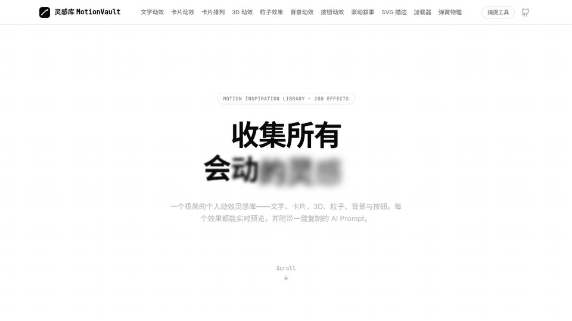
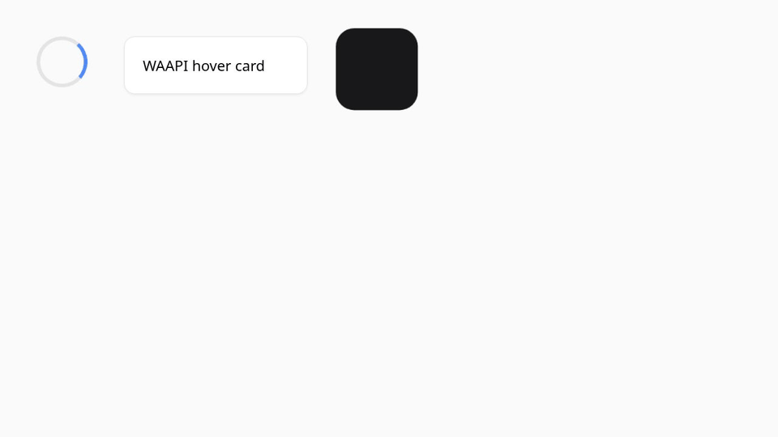

# MotionVault

A minimalist web animation inspiration library — 202 effects across 10 categories, each with a copy-ready AI prompt — plus **MotionLens**, a tool that turns any website's animation into a reusable prompt.

[](LICENSE)
[](https://github.com/xiyu519/MotionVault/actions/workflows/ci.yml)
[](#features)



## Why

Two recurring problems when building interfaces:

1. **Finding good animation references is hard.** Galleries show off visuals but not implementations, so every effect still starts from a blank file.
2. **Seeing a great animation in the wild doesn't mean you can reuse it.** Reverse-engineering duration, easing, and keyframes from DevTools is slow guesswork.

MotionVault addresses the first with a browsable library where every effect ships with a complete, copy-ready prompt for AI coding tools. MotionLens addresses the second: click any animated element on any page, and get structured parameters plus a reproduction prompt.

## Features

### The library

- **202 effects across 10 categories** — text, cards, 3D, particles, backgrounds, buttons, scroll, SVG, loaders, spring physics
- **Copy-ready AI prompts** for every effect, written for Cursor / Claude Code (React 19 + TypeScript stack constraints, exact durations, easings, and color values)
- **Live previews** for every effect, lazily mounted and paused off-screen
- **Interaction tags** (hover / click / move / scroll / auto) so you know how each effect triggers before opening it
- **White, minimal design** — the effects are the content
- **Real tech, no fakes**: CSS keyframes, WAAPI, Framer Motion, GSAP + ScrollTrigger, React Three Fiber, Canvas 2D, Lenis smooth scroll

### MotionLens (`capture/`)

- **Structural extraction** of CSS animations, transitions, and WAAPI via `getAnimations({subtree: true})` — exact keyframes, no approximation
- **Sampling fallback** for GSAP / rAF inline-style animations: 60 fps computed-style sampling with segmented least-squares easing fit
- **Trigger probing**: dispatches pointer/focus events and observes `running` animations to attribute hover/click/scroll triggers
- **Two shells, one engine**: a 50 KB zero-dependency bookmarklet and a Chrome MV3 extension with a local library and tab-record mode for canvas/WebGL
- **BYOK LLM analysis** (OpenAI / Anthropic / openai-compatible) converts a capture into an EffectDraft with bilingual reproduction prompts; **extraction works fully offline without a key** — copy the CaptureReport JSON and feed it to any AI tool yourself

## Demo

**Live site: <https://xiyu519.github.io/MotionVault/>**




The site also ships a built-in walkthrough of the MotionLens pipeline (pick → extract → analyze → collect) on the `/capture` route, with step-by-step guides for both the bookmarklet and the extension.

## Tech Stack

| Layer | Choice |
| --- | --- |
| Framework | React 19 + TypeScript + Vite 7 |
| Styling | Tailwind CSS 3, tailwind-merge, CVA |
| Animation | Framer Motion, GSAP + ScrollTrigger, WAAPI, CSS keyframes |
| 3D / Canvas | Three.js + React Three Fiber + drei, Canvas 2D |
| Routing | React Router 7 |
| MotionLens | TypeScript core, esbuild (bookmarklet), Chrome MV3 (extension), Playwright (benchmark) |

## Quick Start

Requires **Node.js ≥ 20** (22 recommended; `.nvmrc` pins 22).

```bash
git clone https://github.com/xiyu519/MotionVault.git
cd MotionVault
npm install
npm run dev        # http://localhost:3000
```

Build for production with `npm run build`; lint with `npm run lint`.

## MotionLens Quick Start

```bash
node capture/scripts/build-bookmarklet.mjs   # → capture/dist/bookmarklet-url.txt
node capture/scripts/build-extension.mjs     # → capture/dist/extension (load unpacked)
```

Bookmarklet: save the URL as a bookmark, click it on any page, click the animated element. No key required — click "skip" in the settings panel for offline extraction of durations, easings, and keyframes. Full documentation: [capture/README.md](capture/README.md).

## Repository Structure

```
├── src/
│   ├── components/effects/   # the 202 effects, one folder per category
│   ├── data/                 # categories + effect entries (prompt, tags, component)
│   ├── pages/                # home, 10 category pages, /capture walkthrough
│   └── components/ui/        # shared UI primitives
├── capture/                  # MotionLens
│   ├── src/core/             # extraction engine (pick, extract, sample, fit)
│   ├── src/analyze/          # BYOK LLM analyzer + prompt builder
│   ├── src/shell/            # bookmarklet + Chrome extension shells
│   ├── benchmark/            # harness that tests MotionLens against this library
│   └── test/                 # unit tests + Playwright e2e
├── public/                   # prebuilt bookmarklet + url for the /capture page
└── docs/assets/              # README demos and social preview
```

## Deployment

Fully static output — no server needed. Pushing to `main`/`master` triggers `.github/workflows/deploy.yml`, which builds and publishes `dist/` to **GitHub Pages** automatically (SPA routing fallback via `public/404.html` is built in). Vercel / Netlify also work zero-config.

## Benchmark

MotionLens is benchmarked against MotionVault itself — the library is the test suite, every miss has a known ground truth. Latest run (72 cards, 6 per category, headless Chromium):

- **Total coverage: 63.9%** (46/72 cards with ≥1 structured animation or fitted sample segment)
- 62 structured animations extracted: waapi = 53, transition = 7, css = 2
- Sampling fallback hit 23 cards (27 fitted segments, **average fit error 0.114**)
- layout / buttons / scroll / loaders at **100%**; canvas & WebGL categories at 0% by design (vision fallback territory)

Full numbers and per-category table: [capture/benchmark/results/report.md](capture/benchmark/results/report.md).

## Contributing

Contributions welcome — new effects, MotionLens fixes, docs. See [CONTRIBUTING.md](CONTRIBUTING.md) for the dev setup, the effect-entry format, and PR conventions.

## Legal & Ethics

MotionVault effects are original implementations. MotionLens extracts **facts about animations** (durations, easings, keyframe values) and uses an LLM to write **original** reproduction prompts — it does not copy a target site's source code or assets. Respect each site's robots policy and Terms of Service; the tool is meant for learning and inspiration, not bulk scraping.

## License

[MIT](LICENSE)

## Star History

[](https://star-history.com/#xiyu519/MotionVault&Date)

---

# MotionVault（中文）

一个极简白色风格的**网页动效灵感库**：10 个分类、202 个效果，每个效果附带可直接粘贴给 Cursor / Claude Code 的英文复现 prompt，浏览器内实时预览。仓库同时包含 **MotionLens 动效透镜**——指着任何网页上的动效，一键提取时长、缓动、关键帧等精确参数，并生成可复用的 AI prompt。

## 为什么做这个

写界面时经常遇到两个问题：

1. **找动效参考难。** 各类画廊只展示效果不给实现，每次都得从空白文件开始。
2. **看到好动效也用不上。** 在 DevTools 里逆向时长、缓动、关键帧，是慢速的猜谜。

MotionVault 解决第一个：一个可浏览的灵感库，每个效果都附带为 AI 编程工具写好的完整 prompt。MotionLens 解决第二个：在任何页面上点击动效元素，拿到结构化参数和复现 prompt。

## 功能特性

### 灵感库

- **202 个效果，10 个分类** — 文字、卡片、3D、粒子、背景、按钮、滚动叙事、SVG 描边、加载器、弹簧物理
- **每个效果附带可直接复制的 AI prompt**，面向 Cursor / Claude Code 编写（React 19 + TypeScript 技术栈约束，精确的时长、缓动、颜色值）
- **全部效果实时预览**，懒挂载、离屏自动暂停，滚动流畅
- **交互标签**（悬停 / 点击 / 移动 / 滚动 / 自动），打开前就知道效果怎么触发
- **极简白色设计**——效果本身就是内容
- **真实技术实现，不是录的假动画**：CSS keyframes、WAAPI、Framer Motion、GSAP + ScrollTrigger、React Three Fiber、Canvas 2D、Lenis 平滑滚动

### MotionLens 动效透镜（`capture/`）

- **结构化提取**：通过 `getAnimations({subtree: true})` 精确读取 CSS 动画、transition、WAAPI 的关键帧与时间参数，零近似
- **采样兜底**：对 `getAnimations` 不可见的 GSAP / rAF 内联样式动画，以 60fps 采样计算样式 3 秒，分段最小二乘拟合出缓动曲线
- **触发探测**：自动派发指针/焦点事件并观察动画运行状态，识别 hover / click / scroll / load 触发方式
- **一套引擎，两个外壳**：50 KB 零依赖书签（bookmarklet）+ Chrome MV3 扩展（带本地灵感库与 canvas/WebGL 录屏模式）
- **BYOK 大模型分析**（OpenAI / Anthropic / OpenAI 兼容接口，Key 只存在你自己的浏览器里）：把提取结果转换成带中英双语复现 prompt 的 EffectDraft；**不配 Key 也能完整使用**——点击"跳过，仅提取数据"即可离线提取，复制 CaptureReport JSON 自己粘给任何 AI 工具

## 演示

站点自带 MotionLens 管线的内置演示（点选 → 提取 → 分析 → 入库），在 `/capture` 路由，含书签与扩展的逐步使用指南。

## 技术栈

| 层 | 选型 |
| --- | --- |
| 框架 | React 19 + TypeScript + Vite 7 |
| 样式 | Tailwind CSS 3, tailwind-merge, CVA |
| 动画 | Framer Motion, GSAP + ScrollTrigger, WAAPI, CSS keyframes |
| 3D / Canvas | Three.js + React Three Fiber + drei, Canvas 2D |
| 路由 | React Router 7 |
| MotionLens | TypeScript 核心, esbuild（书签）, Chrome MV3（扩展）, Playwright（基准测试） |

## 快速开始

需要 **Node.js ≥ 20**（推荐 22，`.nvmrc` 已固定）。

```bash
git clone https://github.com/xiyu519/MotionVault.git
cd MotionVault
npm install
npm run dev        # http://localhost:3000
```

生产构建 `npm run build`；代码检查 `npm run lint`。

## MotionLens 快速开始

```bash
node capture/scripts/build-bookmarklet.mjs   # → capture/dist/bookmarklet-url.txt
node capture/scripts/build-extension.mjs     # → capture/dist/extension（开发者模式加载）
```

书签用法：把 URL 存为书签 → 在任意网页点击它 → 十字光标下点击动效元素。**无需 Key**：设置面板点"跳过，仅提取数据"即可离线提取时长、缓动、关键帧。完整文档见 [capture/README.md](capture/README.md)。

## 仓库结构

```
├── src/
│   ├── components/effects/   # 202 个动效组件，按分类分目录
│   ├── data/                 # 分类元信息 + 效果条目（标题、描述、prompt、组件）
│   ├── pages/                # 首页、10 个分类页、/capture 工具页
│   └── components/ui/        # 共享 UI 组件
├── capture/                  # MotionLens
│   ├── src/core/             # 提取引擎（点选、提取、采样、拟合）
│   ├── src/analyze/          # BYOK LLM 分析器 + prompt 构建
│   ├── src/shell/            # 书签 + Chrome 扩展外壳
│   ├── benchmark/            # 以本库为测试集的基准测试
│   └── test/                 # 单元测试 + Playwright e2e
├── public/                   # 预构建书签 + URL（供 /capture 页使用）
└── docs/assets/              # README 演示图与社交预览图
```

## 部署

纯静态产物，**不需要自己的服务器**。push 到 `main`/`master` 会自动触发 `.github/workflows/deploy.yml`，构建并把 `dist/` 发布到 **GitHub Pages**（SPA 路由 404 回退已通过 `public/404.html` 内置）。Vercel / Netlify 也可以零配置使用。

## 基准测试

MotionLens 以 MotionVault 自身为基准——**库即测试集**，每次漏检都有已知答案。最近一次运行（每个分类抽 6 张卡共 72 张，headless Chromium）：

- **总覆盖率 63.9%**（46/72 张卡提取到 ≥1 条结构化动画或拟合采样片段）
- 结构化提取 62 条：waapi = 53、transition = 7、css = 2
- 采样兜底命中 23 张卡（27 个拟合片段，**平均拟合残差 0.114**）
- layout / buttons / scroll / loaders 达 **100%**；canvas 与 WebGL 分类按设计为 0%（视觉兜底的领域）

完整数据与分类明细表：[capture/benchmark/results/report.md](capture/benchmark/results/report.md)。

## 参与贡献

欢迎贡献——新效果、MotionLens 修复、文档。开发环境搭建、效果条目格式与 PR 规范见 [CONTRIBUTING.md](CONTRIBUTING.md)。

## 法律与伦理

MotionVault 的效果均为原创实现。MotionLens 只提取**动效的参数事实**（时长、缓动、关键帧数值），并用 LLM 撰写**原创**复现 prompt——不复制目标站点的源码或素材。请尊重目标网站的 robots 协议与服务条款；本工具仅用于学习与灵感，不用于批量抓取。

## 许可证

[MIT](LICENSE)

## Star History

[](https://star-history.com/#xiyu519/MotionVault&Date)
